# Deep Dive: OT, CRDT & Differential Sync

---

## 0.1 Why These Three Matter

Real-time collaborative editing systems almost always end up choosing between three core algorithm families:

- **Operational Transformation (OT):** Central server orders operations and mathematically adjusts them so concurrent edits dont overwrite each other.
- **CRDTs (Conflict-Free Replicated Data Types):** The data structure itself is designed so that any order of operations converges to the same result, even offline or peer-to-peer.
- **Differential Synchronization (Diff Sync):** Client and server repeatedly diff and patch their documents, converging over time with simple diff/patch logic.

The rest of this deep dive teaches you **how each actually works**, in plain language, so you can reason about them confidently in interviews.

---

## 0.2 OT in Easy Language

### Intuition

Think of OT as a **smart merge engine for position-based edits** under a central referee:

- Every keystroke becomes an operation like `insert(text, position)` or `delete(range)`.
- A **central server** decides the global order of operations.
- When concurrent operations would conflict (because positions shifted), OT uses **transform rules** to adjust the later operations so they still land where the user intended.

### Core Example

Start document: `the quick fox`

- User A: inserts `"brown "` before `fox` at position 10.
- User B: inserts `" jumps"` at the end at position 13 (in their local view).

If we applied Bs operation blindly after A, position 13 would point into the middle of `"brown"`. OT says:

1. Apply As operation first: `the quick brown fox`.
2. See Bs operation: insert at position 13.
3. Notice A added 6 characters before that position.
4. Transform Bs position by +6  so it becomes 19.
5. Apply B at 19: `the quick brown fox jumps`.

Everyones intent is preserved, and both users see a sensible document.

### OT Data Flow

**On the client:**

1. User edits locally; client builds operations like `insert`, `delete` with positions.
2. Operations are applied immediately to the local document (optimistic updates).
3. Operations are sent to the server and kept in a **pending buffer** until acknowledged.

**On the server:**

1. Receives operations from all clients.
2. Maintains a **canonical sequence** of operations.
3. For each incoming operation `op` that might conflict with existing ones, applies a **transform function**:
   - Insert vs Insert
   - Insert vs Delete
   - Delete vs Delete
4. Applies transformed `op` to the server document.
5. Broadcasts transformed operations to all clients.

**Back on the client:**

- If no pending ops: just apply incoming operations.
- If there are pending ops:
  1. Transform each pending local op against the incoming remote op.
  2. Apply the remote op.
  3. Reapply transformed pending ops.

This transform/rewind/replay pattern keeps all clients converged.

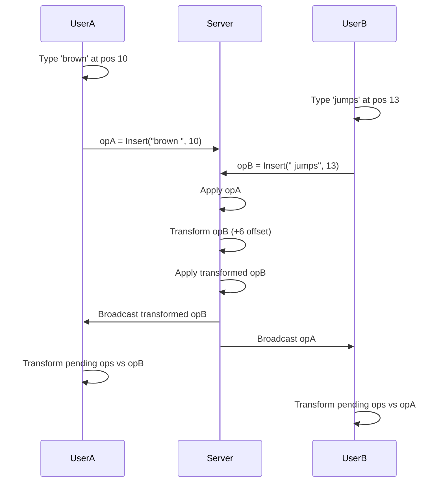

### OT Pros & Cons (Interview Angles)

- **Pros:**
  - Very **bandwidth-efficient**: operations are small (insert/delete + position).
  - Proven at massive scale (Google Docs-style editors).
  - Great fit when you already have a **central server** and always-online clients.

- **Cons:**
  - Transformation rules grow **O(n b2)** with number of operation types (text, formatting, tables, lists, etc.).
  - Hard to implement correctly; bugs can cause silent divergence.
  - Peer-to-peer OT exists in research but is very complex in practice.

**One-sentence mental model:**
> OT = central server + position-based operations + transformation rules that shift positions so concurrent edits dont stomp each other.

---

## 0.3 CRDTs in Easy Language

### Intuition

CRDTs solve collaboration by **changing the data structure itself** so that:

- Each replica (client) can apply operations independently.
- When replicas sync, a simple merge converges to the same state everywhere.
- No central ordering server is required.

The magic: the CRDTs merge function is designed to be **commutative, associative, and idempotent**. That means:

- Order of merges doesnt matter.
- Grouping of merges doesnt matter.
- Merging the same operation twice doesnt change the result.

### Easy Counter Example

Imagine a distributed counter:

- Node A: +1, +2
- Node B: +3
- Node C: -1

Merge = sum all nodes.

No matter the order or timing, you end up with the same final count. Thats the idea behind simple CRDTs.

### Text CRDTs (Character IDs)

For text, CRDTs usually:

- Give **each character** a unique ID that encodes its relative order.
- Store text as a set of (ID, character) pairs.
- Render the document by **sorting by ID** and ignoring tombstoned (deleted) entries.

Example:

Start: `H` (ID 1), `i` (ID 2)

- User A inserts `!` between `H` and `i`  gets ID 1.5.
- User B inserts `?` between `H` and `i`  gets ID 1.7.

After syncing both operations and sorting by ID:

- `H (1)`  `! (1.5)`  `? (1.7)`  `i (2)`

Both users see `H!?i`, even if operations arrived in different orders.

### CRDT Data Flow

1. Each client has a full **replica** of the document.
2. User edits:
   - Insert: assign a new ID between neighbors, store `(ID, char)`.
   - Delete: mark that ID as **tombstoned** (logically deleted).
3. Clients periodically sync:
   - Exchange new `(ID, char)` pairs and tombstones.
   - Merge by taking the union of IDs and tombstones.
   - Render by sorting all non-tombstoned IDs.

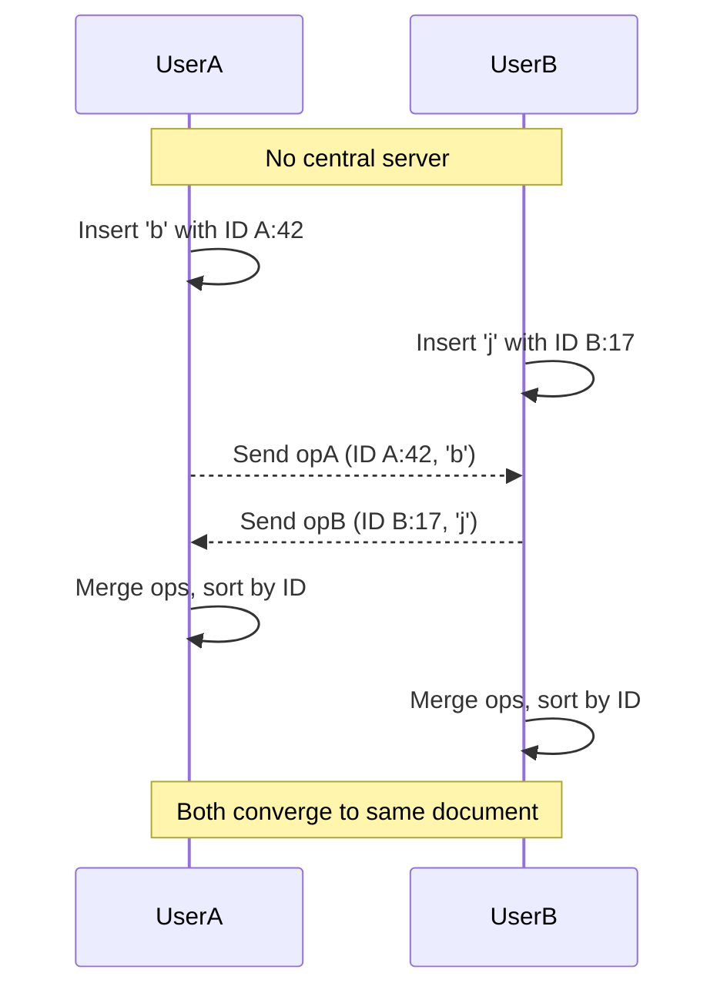

### CRDT Pros & Cons (Interview Angles)

- **Pros:**
  - Works **offline** and in **peer-to-peer** networks (no central server needed).
  - Convergence is guaranteed by math; you dont handcraft transform pairs.
  - Great for local-first apps, multi-device notes, peer-to-peer collab tools.

- **Cons:**
  - **Memory overhead:** per-character metadata + tombstones; big docs get heavy.
  - Convergence does **not** guarantee user intent correctness.
  - Implementing from scratch is hard; typically you use libraries like **Yjs** or **Automerge**.

**One-sentence mental model:**
> CRDT = every replica has the full document, every change carries a unique ID, and merging + sorting by ID guarantees everyone ends up with the same text without a central server.

---

## 0.4 Diff Sync in Easy Language

### Intuition

Diff Sync avoids fancy data structures and just uses **diff + patch** repeatedly:

- Client and server each keep **two copies**: current doc and shadow doc.
- Periodically, each side computes a **diff** between its current and shadow.
- That diff becomes a **patch** sent to the other side.
- Apply patch, update shadow, repeat.

Think of it as running `git diff` and `git apply` in a tight loop.

### Diff Sync Data Flow

On the **client**:

1. `doc_client` = current document.
2. `shadow_client` = last version known to be shared with server.
3. When edits happen:
   - User modifies `doc_client`.
   - Periodically, compute `patch_client = diff(doc_client, shadow_client)`.
   - Send `patch_client` to server.
   - Set `shadow_client = doc_client`.

On the **server**:

1. `doc_server` = canonical document.
2. For each client, `shadow_server[client]` = last version sent to that client.
3. When a patch arrives:
   - Apply `patch_client` to `doc_server`.
   - Compute `patch_server = diff(doc_server, shadow_server[client])`.
   - Send `patch_server` back to client.
   - Update `shadow_server[client] = doc_server`.

On the **client**, upon receiving `patch_server`:

- Apply patch to `doc_client`, update `shadow_client` accordingly.

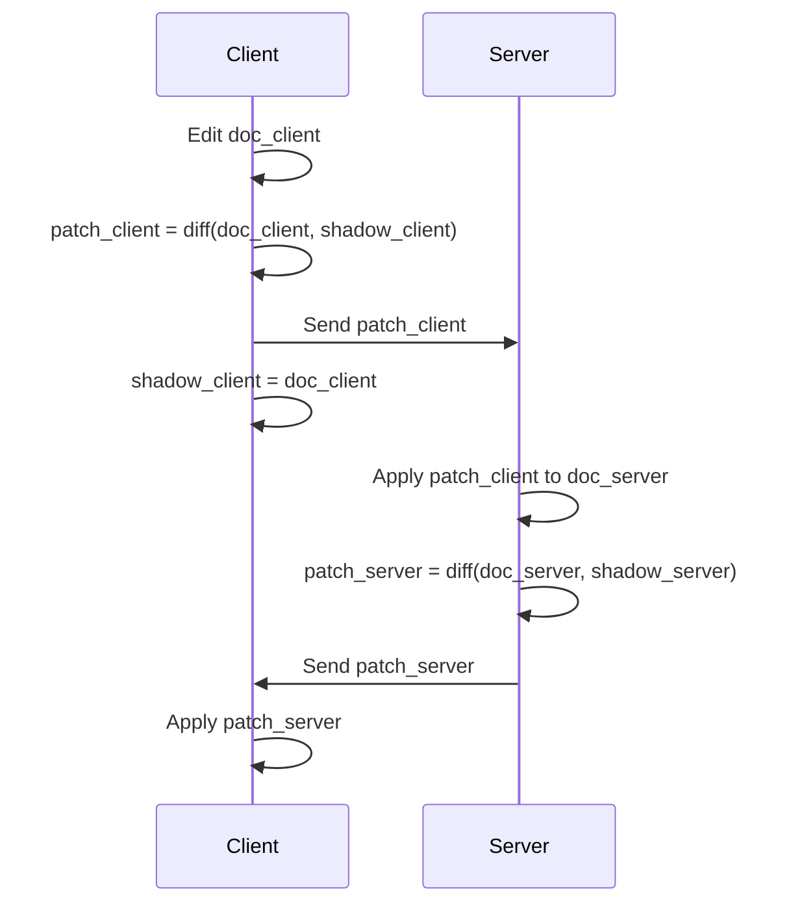

### Diff Sync Pros & Cons (Interview Angles)

- **Pros:**
  - Very **simple** to implement (just diff + patch).
  - Works for **arbitrary data formats** (JSON trees, custom objects).
  - Good when you just need "good enough" collaborative merging.

- **Cons:**
  - Less bandwidth-efficient than OT; patches can be bigger.
  - Convergence can be **lossy** in edge cases (intent may be blurred if diffs dont capture intermediate edits perfectly).
  - Harder to do precise per-character features (like cursor tracking) purely via diff.

**One-sentence mental model:**
> Diff Sync = keep a shadow copy, frequently diff current vs shadow, send patches in both directions until both sides match.

---

# System Design Quick-Read: Collaborative Editing

---

## 1. The 1-Minute Pitch
* **What it is:** A system that allows multiple users to simultaneously edit the same document (text, whiteboard, code) with automatic conflict resolution and real-time synchronization.
* **Mental Model:** Think of it as Git's merge system, but instead of manual conflict resolution happening once per hour, conflicts are automatically resolved hundreds of times per second without user input.
* **System Placement:** Sits between clients and a central server (or peer-to-peer), managing concurrent edits, maintaining consistency, and broadcasting changes to all active users.
* **When to think of it:**
  * High concurrency: Multiple users editing simultaneously in real-time
  * Low latency requirement: Changes must appear instantly (sub-second)
  * Conflict-heavy workload: Same region edited by multiple users at once
  * Offline-first: Need to support editing without internet connectivity

---

## 2. Core Fundamentals Cheat Sheet & Real-World Numbers

### Quick Reference Table

| Metric | OT | CRDT | Diff Sync |
|--------|----|----|-----------|
| **Bandwidth per edit** | ~10-50 bytes (pos + op type + text) | ~100-300 bytes (siteID + counter + char + metadata) | ~1-10 KB (full diff of changed region) |
| **Memory per 100KB doc** | ~100 KB (doc + op log) | ~500 KB+ (tombstones add 3-5x overhead) | ~100 KB (doc + 2 shadows) |
| **Latency to see own edit** | <10ms (optimistic + ack in 50-100ms) | <10ms (optimistic, converge in 100-500ms) | <50ms (local apply) + 100-200ms (converge) |
| **Convergence time (worst case)** | ~1s (assuming 5-10 pending ops transform cleanly) | ~500ms-5s (depends on sync rate and batch size) | ~1-2s (depends on diff interval, typically 100-500ms) |
| **Scalability limit** | 50-100 concurrent editors (transforms grow O(n²)) | 500+ concurrent (full replicas work peer-to-peer) | 50-100 concurrent (server patch overhead) |
| **Offline support** | Poor (requires server ordering) | Excellent (full replica offline, syncs on reconnect) | Poor (shadow assumes online) |

### Core Concepts

* **Data Model:** Character-based (text), operation-based (OT), or ID-based (CRDT) depending on algorithm
* **Consistency:** Eventual consistency for all approaches; Strong consistency not achievable without sacrificing latency
* **Durability:** Server-side persistence with periodic snapshots; client-side optimistic updates stored in localStorage
* **Scaling Model:**
  - OT: Star topology (central server required)
  - CRDT: Any topology (peer-to-peer, masterless, offline-first)
  - Diff Sync: Star or direct peer connections
* **Failure Model:**
  - Network partition: CRDTs handle best (guaranteed convergence); OT/Diff Sync must resync
  - Temporary disconnect: All handle with local buffering and replay
  - Divergence: OT/CRDT guarantee mathematical convergence; Diff Sync is lossy but practical

---

## 3. Architecture & Mechanics

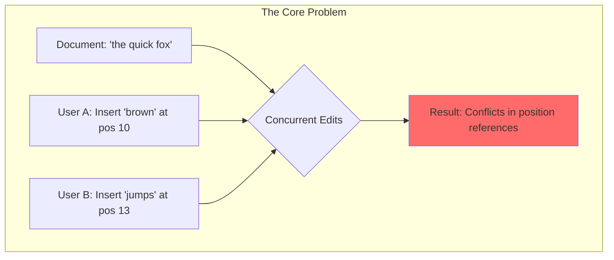

### 3.1 The Write Path

**Operational Transformation (OT):**
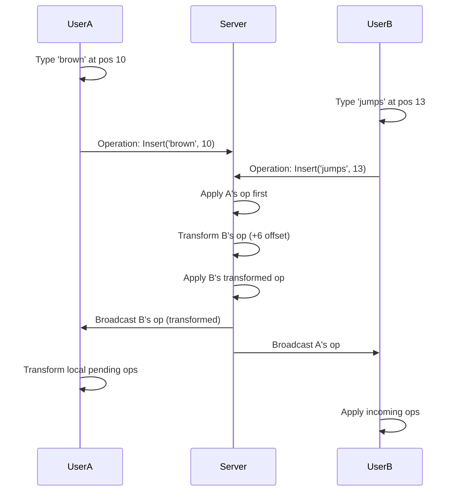

**CRDT (Conflict-Free Replicated Data Type):**
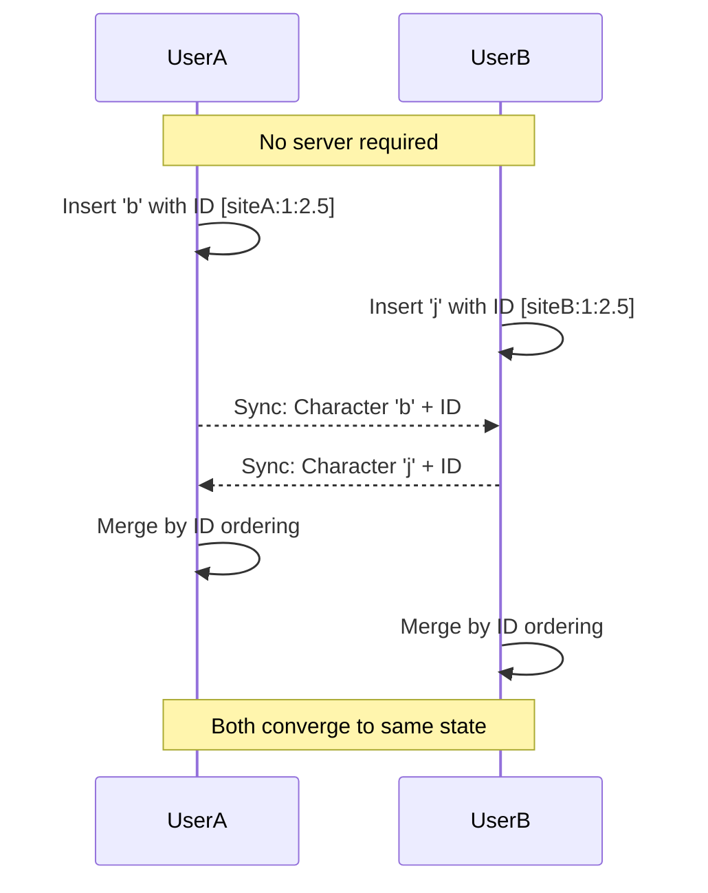

**Differential Sync:**
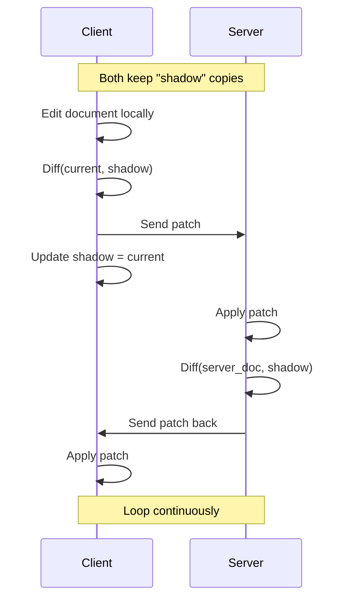

### 3.2 The Read Path
* **OT:** Client reads from local optimistic state; server broadcasts canonical operations.
* **CRDT:** Client reads from local replica; merges happen on write, reads are instant.
* **Diff Sync:** Client reads local document; patches arrive periodically and modify view.
* **Cursor Sharing:** Separate real-time broadcast channel (WebSocket/WebRTC) with position updates transformed using same algorithm.

### 3.3 Scaling & High Availability

**OT Topology:**
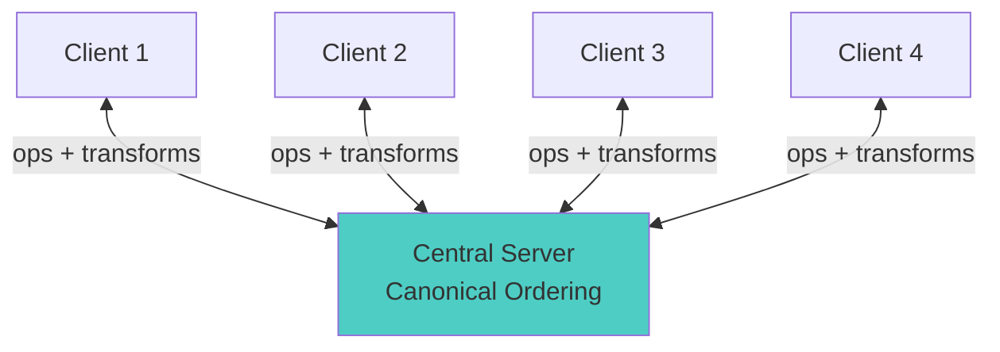

**CRDT Topology:**
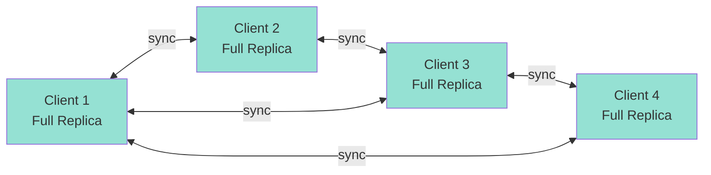

**Replication:**
* OT: Server can replicate for HA but must maintain single logical ordering.
* CRDT: Every node is equal; no leader election needed.
* Diff Sync: Server replication straightforward; just sync shadow states.

### 3.4 Operational Knobs & Tuning (Interview Knowledge)

**OT Configuration:**
* **Transformation function complexity:** O(n²) with operation types. Google Docs uses ~6-8 ops (insert, delete, format bold/italic/link, etc.). Adding custom ops (tables, embeds) = exponential cost. **Decision:** Limit ops to core set or use hierarchical transforms to avoid explosion.
* **Operation acknowledgment timeout:** Default 3-5s. Too short = retransmit overhead; too long = perceived lag. **Best practice:** Retransmit after 2s, give up after 10s (user perceives as failure and shows warning).
* **Batch size:** Send ops immediately (low latency, high bandwidth) or wait 50ms (high latency, low bandwidth). **SDE-2 choice:** 50-100ms batching; most users don't perceive it, but it reduces server load by 50%.

**CRDT Configuration:**
* **Garbage collection strategy:** Tombstones accumulate; at 5M tombstones, memory grows to 2-3GB. **Practical limit:** Rebuild from snapshot when tombstones > 10% of data. Requires coordination—all peers must be synced before GC epoch.
* **ID generation:** Fractional indexing (e.g., 1.5, 1.75) causes precision issues at high edit frequency. **Better:** (siteID, Lamport counter) tuples. **Trade-off:** +20 bytes per operation vs simpler arithmetic.
* **Compaction:** Merge adjacent identical-prefix IDs to save memory. **Cost:** O(n) full scan; run offline weekly or on-demand.

**Diff Sync Configuration:**
* **Sync interval:** 100ms (responsive) vs 1s (efficient). **Decision driver:** Is concurrency high? Use 100ms. Mostly single-user? Use 500ms. Real-time draw tool? 50ms.
* **Three-way vs two-way merge:** Three-way uses base document to detect conflicts better. Two-way is simpler. **Diff Sync typically uses two-way** because shadows already act as implicit "base" documents.
* **Diff algorithm:** Myers algorithm O(n+m) is default; Patience diff for large files with unchanged blocks. **Practical:** Never noticeable for docs <1MB. Don't over-optimize here.

**Interview signal:** "We'd monitor (operations/sec) at p50, p99. If p99 ops/sec exceeds threshold (say, 1000), we shift batch interval from 50ms → 100ms to reduce server CPU. We track this per document and alert if approaching limits."

---

## 4. Interview Use Cases

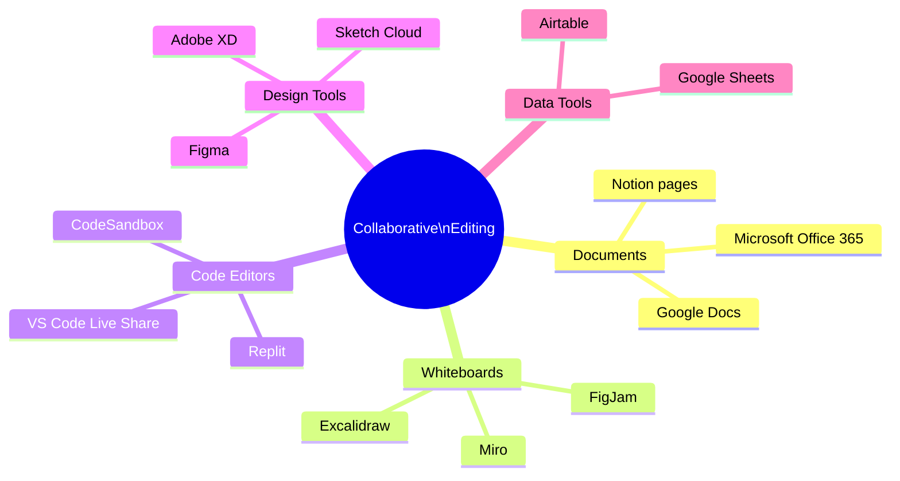

* **Common Patterns:**
  * Real-time document editors (Google Docs, Notion).
  * Collaborative whiteboards (Miro, FigJam).
  * Live code editors (VS Code Live Share, Replit).
  * Design tools with multiplayer (Figma).

* **When to CHOOSE it:**
  * Multiple users need simultaneous write access to same resource.
  * Latency requirement < 500ms for updates to appear.
  * Conflict rate is moderate to high (same section edited concurrently).
  * Need "multiplayer" as a core feature, not an afterthought.

* **When to AVOID it:**
  * Updates are infrequent or users rarely overlap (simple locking is enough).
  * Strict transactional semantics required (bank accounts, inventory).
  * Single-user editing with occasional sync (Dropbox-style model).
  * Resource contention can be eliminated through UX (assign sections to users).

---

## 5. Trade-offs, Pitfalls, & Alternatives

### Common Gotchas (The "Senior" Signals)

**Data Correctness:**
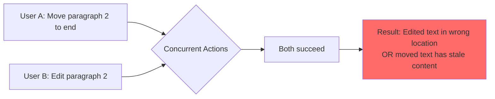

* **Lost intent (Convergence ≠ Correctness):** 
  - Example: Doc is `["Item A", "Item B", "Item C"]`.
    - User A: Deletes "Item B" → `["Item A", "Item C"]`
    - User B: Simultaneously edits "Item B" to "Item B (UPDATED)" → `["Item A", "Item B (UPDATED)", "Item C"]`
  - **CRDT result:** Tombstone for B + edited B clash; depending on ID ordering, you get either:
    - `["Item A", "Item B (UPDATED)", "Item C"]` (B's edit applied despite deletion intent), or
    - `["Item A", "Item C"]` (B's edit lost).
  - **User intent violated** in both cases. System converged but picked the "wrong" state.
  - **Why it matters:** Rich collaborative apps (spreadsheets, design tools) must handle this with **per-field versioning** or **operational semantics** (conflict-free merge functions at app level, not just data-structure level). E.g., Figma handles "delete element while someone edits it" by applying the edit to tombstoned data, then discarding on render.

* **Causality violations:** Order of operations matters; naive handling can lose edits.
  - Example: User A adds comment to paragraph, User B deletes paragraph. If comment deletion arrives before paragraph deletion, comment may reappear.
  - **Solution:** Use vector clocks or version vectors to enforce causal ordering, or use app-level semantics (comment deletion implies paragraph context is gone).

* **Undo/Redo complexity:** Need operation history; naive undo conflicts with others edits.
  - Example: User A types "hello", User B types " world" concurrently. User A hits undo. Should undo remove only "hello" or both edits?
  - **Standard behavior:** Undo removes only User A's edits; B's " world" remains (but position may shift after transform).
  - **Implementation:** Maintain operation history + causality info; transform undo operations like normal edits.

**Operational:**
* **Memory bloat (CRDT):** Deleted characters become tombstones; heavily edited docs grow 3-5x.
* **Transform explosion (OT):** O(n²) transformation functions scale poorly beyond ~20 operation types.
* **Race conditions:** Clients must transform pending ops against incoming ops to avoid divergence.
* **Cursor desync:** Cursor positions must be transformed along with content; easy to miss if not careful.
* **Performance degradation:** Large docs stress diff algorithms (Diff Sync) or metadata (CRDT).

### Failure Scenarios (Interviewer's Favorite Questions)

| Scenario | OT | CRDT | Diff Sync |
|----------|----|----|-----------|
| **Network partition (5s)** | Clients diverge; pending ops buffered locally; must resync from server on reconnect by replaying buffered ops | Clients buffer ops, converge when sync resumes (guaranteed by CRDT math; order-independent merge) | Clients buffer patches, replay on reconnect until shadows match |
| **Server crash (OT only)** | Lost pending ops unless replicated; clients must reconnect and resync from snapshot | N/A (no server) | Server replayed from operation log or full snapshots; clients resync shadows |
| **Concurrent deletes** | Transform handles it: if User A deletes char 5 and B deletes char 5, second delete becomes no-op after transform | Each client marks locally with tombstone; synced tombstones merge safely (idempotent) | Diff may show both deletes; patch reconciles by comparing current vs shadow |
| **Duplicate operation received** | Idempotent keys prevent replay; server drops duplicates via opID dedup | CRDT merge is idempotent by design; safe to apply twice without side effects | Diff recomputes; duplicate patch has no effect (commutative diffs) |
| **Out-of-order operations** | Server enforces order via opID; clients transform to handle; convergence guaranteed | Merge-based; order irrelevant (convergence guaranteed by CRDT design) | Shadow sync corrects ordering automatically; fully commutative |

**Recovery pattern you should know:**
- **OT:** Client tracks `lastAckedOpID`. On reconnect, client replays unacked ops from buffer. Server transforms against newer ops. If `lastAckedOpID` not in server log (server crashed), full resync from snapshot.
- **CRDT:** No ack needed; full state is authoritative. Sync by exchanging state vectors (version vectors). Merge until both peers have same state (idempotent, so retries are safe).
- **Diff Sync:** Replay full diffs until `doc_client == doc_server` (convergent by design). Track sync version numbers to detect replays.

### Simplified SDE-2 Decision Matrix

Use this simple checklist in interviews:

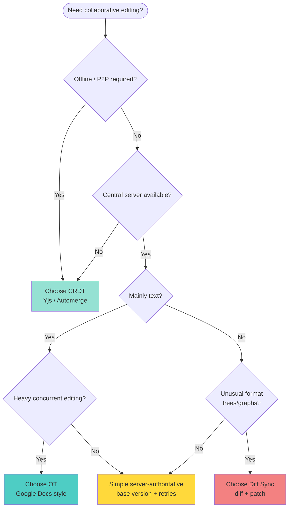

**Interview one-liners:**

- **OT:** "We have a central server and heavy concurrent text edits, so OT gives us bandwidth-efficient, proven behavior at Google Docs scale."
- **CRDT:** "We need offline-first and peer-to-peer syncing, so CRDT-based text structures let every device be a full replica that converges automatically."
- **Diff Sync:** "We have a custom document format and approximate merging is fine, so Diff Sync lets us build collaboration with just diff + patch."

---

## 6. Complete Interview Script (Ready to Use)

### Proposing OT:
> "For real-time collaboration with heavy concurrent text editing, I'd propose Operational Transformation because:
> 1. We have a central authoritative server (necessary for OT).
> 2. Operations are bandwidth-efficient (~10 bytes each) vs full document diffs (~1-10 KB).
> 3. Google Docs has proven OT scales to thousands of concurrent editors without divergence.
> 4. Our users need <100ms latency to see their edits, which optimistic updates + transformation handles perfectly.
> 
> The downside is implementation complexity—transformation rules grow O(n²) with operation types, and silent divergence is possible if we bug the transform logic. We mitigate this with comprehensive testing and operational monitoring (divergence detection via checksums)."

### Handling "Why not CRDT?"
> "CRDTs would let us go peer-to-peer and offline-first, but we'd pay 3-5x memory overhead for tombstones on every character. For a browser-based always-online doc editor, that's unjustified. We'd only reconsider CRDT if:
> - We needed offline-first (mobile/flight mode editing).
> - We had no reliable central server (mesh network scenario).
> - Document size was guaranteed small (<100KB) and edits infrequent.
> 
> Otherwise OT is the right call because it's bandwidth-efficient and proven at scale."

### Scaling discussion:
> "We shard documents across servers by document ID using consistent hashing. Each document has one authoritative server handling operation ordering—this is critical for OT to work correctly. We replicate the operation log to 2 read-replicas for HA. If primary fails:
> 1. Clients' pending ops are buffered locally.
> 2. We promote a replica to primary.
> 3. On next heartbeat, clients reconnect and replay pending ops.
> 4. Clients don't notice beyond a brief pause.
> 
> For very large-scale deployments (100k+ concurrent editors), we'd consider message broker (Kafka) for operation log instead of replicating DB writes."

### Failure handling:
> "If a client disconnects mid-edit:
> 1. Client buffers pending operations in localStorage.
> 2. On reconnect, client sends [lastAckedOpID, pending_ops] to server.
> 3. Server verifies lastAckedOpID is in its operation log (if not, full resync from snapshot).
> 4. Server applies pending ops with fresh transforms against all newer server ops.
> 5. Client rebases local state by transforming its pending ops against server's ops.
> 6. If network partition caused divergence between two clients, they auto-correct on reconnect because server has the canonical order.
> 
> For truly massive partitions, we detect via operation age—if a client's pending ops aren't acked after 10s, we warn the user that they may be in a partition."

### Cursor sharing:
> "We broadcast cursor positions separately on a WebSocket channel (not part of the operation log). Cursor positions are transformed using the same OT rules as text:
> - If User A's text insertion pushes User B's cursor, we shift the cursor position transparently.
> - If User A deletes over User B's cursor position, we collapse the cursor to the deletion boundary.
> 
> This feels 'alive' to users—cursors move smoothly and disappear when users disconnect. We throttle cursor broadcasts to 10Hz to reduce bandwidth."

### Addressing data correctness concerns:
> "We're aware that convergence doesn't guarantee correctness. For example, if User A deletes a paragraph while User B edits it, we might end up with stale edited text after deletion. We handle this through:
> 1. App-level semantics: Delete operation includes all children/references, so orphaned edits are discarded on render.
> 2. Checksums: Every 10s, clients and server verify document hash. Mismatch triggers full resync.
> 3. Testing: Fuzzy testing of concurrent operations across 50+ scenarios (delete + edit, format + delete, etc.).
> 
> This is why collaborative editing is hard—the algorithm converges, but the user-facing semantics must be designed carefully at the app level."

---

## 7. One-Minute Recap

* **Use when:** You need multiple users editing the same resource simultaneously with real-time updates and automatic conflict resolution.

* **Do NOT use when:** Your system requires strict transactional semantics, updates are infrequent, or simple locking/turn-taking is acceptable.

* **Key strength:** Enables seamless real-time multiplayer experiences with automatic merging—users see changes instantly without manual conflict resolution.

* **Key weakness:** Convergence does not guarantee correctness; the final document may mathematically include all edits but still misrepresent user intent due to concurrent operation ordering. App-level semantics must handle this.

---
