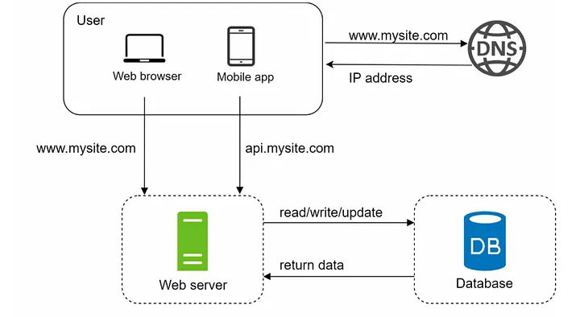
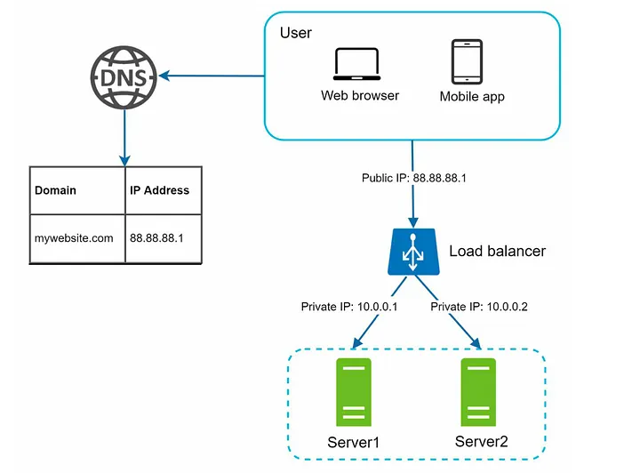
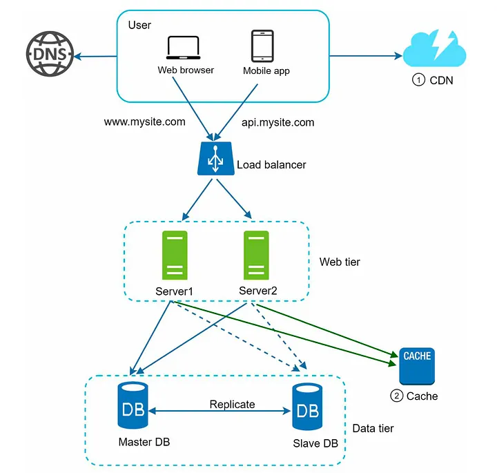
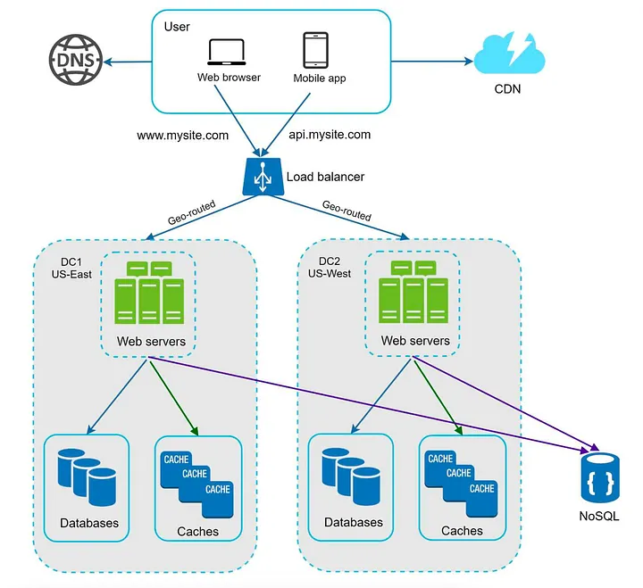
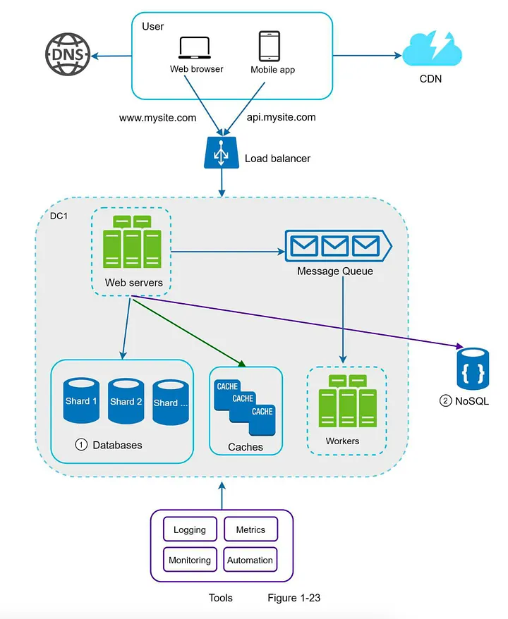

# Interview Tips

A comprehensive guide to mastering system design interviews with structured approaches, practical tips, and key concepts for building scalable systems.

---

## Table of Contents

1. [Six-Step Problem Solving Approach](#six-step-problem-solving-approach)
2. [Back of the Envelope Calculation](#back-of-the-envelope-calculation)
3. [API Design](#api-design)
4. [Choosing the Right Database](#choosing-the-right-database)
5. [Covering Non-Functional Requirements](#covering-non-functional-requirements)
6. [Scaling from 0 to 1 Million Users](#scaling-from-0-to-1-million-users)
7. [Diagram Making Tips](#diagram-making-tips)
8. [Miscellaneous Key Points](#miscellaneous-key-points)
9. [Quick Reference Tables](#quick-reference-tables)

---

## Six-Step Problem Solving Approach

This structured approach ensures comprehensive coverage of system design problems. Follow these steps sequentially for optimal time management.

| Step | Focus Area | Time Allocation | Key Activities |
|------|-----------|----------------|----------------|
| 1 | Requirements | 5-10 min | Clarify functional and non-functional requirements, identify core features |
| 2 | Core Entities | 3-5 min | Identify main entities and their relationships |
| 3 | API Design | ~5 min | Define key endpoints, methods, and data structures (keep brief) |
| 4 | Data Flow(Optional for Data Intensive Designs) | 5-10 min | Map request/response flows, identify data movement patterns |
| 5 | High-Level Design | 15-20 min | Draw system architecture, components, and their interactions |
| 6 | Deep Dives | 15-20 min | Dive into critical components, address bottlenecks and optimizations |
| 7 | Address Key Issues | 5 min | Handle failures, security, monitoring, and edge cases |

**Important Notes:**
- Focus on the most critical 3 features initially
- Keep other features on hold until main design is solid
- Don't spend more than 5 minutes on API Design unless specifically asked
- API Design is often the default approach - save time for deep dives


### Critical Interview Tips

**Initial Approach:**
- Treat the interview as a collaborative discussion with a coworker
- Ask clarifying questions early; some interviewers prioritize this heavily
- Focus on 3 core features initially; keep others on hold
- Create an overview picture before diving deep into specific components
- Keep time management in mind throughout

**Key Questions to Ask:**

*Users & Usage:*
- Who are the users?
- How will they use it?
- What are the specific use cases?
- What are the inputs and outputs?

*Scale & Performance:*
- How much data do we expect to handle?
- How many requests per second do we expect?
- What is the read-to-write ratio?
- What are the latency requirements?

*System Priorities:*
- What non-functional requirements are most critical?
- Can we tolerate some downtime or eventual consistency?
- Are there specific compliance or security requirements?

**Functional Requirements:**
- Define core functionalities (same as in LLD)
- These are monstly of the type "User should be able to ...." 
- Identify critical vs. nice-to-have features
- Determine user interactions and workflows

**Non-Functional Requirements:**
- Discuss CAP theorem implications
- Think through which aspect (Consistency, Availability, Partition Tolerance) is most crucial
- Speak your reasoning out loud
- Consider generic priorities: scalability, availability, and performance

**Skipping Capacity Estimation:**
- You can tell the interviewer you want to skip back-of-the-envelope estimation for now
- Return to it later if time permits or if needed for design decisions

---

## Back of the Envelope Calculation

### Key Metrics and Conversions

| Unit | Value | Conversion |
|------|-------|-----------|
| 1 KB | 1,000 bytes | - |
| 1 MB | 1,000 KB | 1,000,000 bytes |
| 1 GB | 1,000 MB | 1,000,000,000 bytes |
| 1 TB | 1,000 GB | 1,000,000,000,000 bytes |
| 1 Million | 1,000,000 | 10^6 |
| 1 Billion | 1,000,000,000 | 10^9 |

### Performance Benchmarks

| Operation | Approximate Time |
|-----------|------------------|
| L1 Cache Reference | 0.5 ns |
| L2 Cache Reference | 7 ns |
| Main Memory Reference | 100 ns |
| Read 1 MB sequentially from memory | 250 μs |
| Disk Seek | 10 ms |
| Read 1 MB sequentially from disk | 30 ms |
| Network Round Trip (same datacenter) | 0.5 ms |
| Realtime Latency Threshold | 200 ms |

### Database Performance

**SQL vs NoSQL Write Performance:**
- Calculate reads/writes per second requirements
- SQL databases: ~1,000-10,000 writes/sec per node (ACID overhead)
- NoSQL databases: ~10,000-100,000 writes/sec per node (eventual consistency)
- Use these benchmarks to justify database choice

**When to Calculate:**
- Storage requirements for different data types
- Read/write ratios to determine caching strategy
- Database sharding needs based on throughput limits
- Memory requirements for caching layers

### Estimation Strategy

1. Start with Daily Active Users (DAU)
2. Calculate requests per second (DAU × actions per user / 86400)
3. Consider peak traffic (multiply by 2-3x)
4. Estimate data size per entity
5. Calculate total storage (entities × size × growth rate)
6. Determine cache size (20/80 rule: cache 20% for 80% hits)

---

## API Design

### Time Allocation and Communication Protocol Selection

**Default Strategy:**
- Spend no more than 5 minutes on API Design unless specifically asked
- Focus on defining key endpoints quickly
- Save detailed discussion for deep dive if requested

**Communication Protocols:**
| Communication Type | Protocol | Rationale |
|-------------------|----------|-----------|
| Inter-microservice | RPC (gRPC) | High efficiency, binary protocol, optimized for internal communication |
| Client-facing APIs | HTTP/REST | Clients are diverse and well-versed with HTTP; universal compatibility |

**Why HTTP/REST for clients despite RPC efficiency?**
- Clients include web browsers, mobile apps, third-party integrations
- HTTP/REST is universally understood and supported
- Better debugging and tooling ecosystem
- Industry standard for external-facing APIs
- RPC reserved for internal microservice communication where efficiency is critical

### REST API Structure

**Core Principles:**
- Use nouns only, not verbs
- Use plural nouns for resource naming
- Follow RESTful conventions consistently

**Endpoint Naming Convention:**
- Use nouns, not verbs: `/users` not `/getUsers`
- Use plural nouns: `/products` not `/product`
- Use hierarchical structure: `/users/{userId}/orders`

**HTTP Methods:**
| Method | Purpose | Example |
|--------|---------|---------|
| GET | Retrieve resource(s) | `GET /users/{userId}` |
| POST | Create new resource | `POST /users` |
| PUT | Update entire resource | `PUT /users/{userId}` |
| PATCH | Partial update | `PATCH /users/{userId}` |
| DELETE | Remove resource | `DELETE /users/{userId}` |

**Path Parameters vs Query Parameters:**
- `:id` in path = required parameter: `/users/:userId`
- `?` in query = optional parameter: `/users?role=admin&status=active`

### API Design Best Practices

**Security:**
- Never include `userId` in API request body
- Extract user identity from JWT token on backend
- Use authentication headers for sensitive operations

**Request/Response Structure:**

```
// APIs corresponding to the first user requirement 

POST/Ride/fareEstimate
Input: { pickupLocation, dropLocation }
Output: Status Code: 2XX, { partial<Ride> }


// APIs corresponding to second User Requirement 

PATCH/Ride/requestRide 
    Input: { rideId } 
    OutPut: 2XX(Async Operation), partial<Ride> 

POST/Location/Update 
    Input: { lat, long }
    OutPut: 2XX


// APIs corresponding to 3rd User Requirement 

GET/Urls/{:shortUrl}
    OutPut: 3XX, {longUrl}

PATCH/Ride/Driver/UpdateStatus
    Input: {rideId, status: 'Pickedup' | 'DroppedOff'}
```

**Status Codes:**
| Code | Meaning | Use Case |
|------|---------|----------|
| 200 | OK | Successful GET, PUT, PATCH |
| 201 | Created | Successful POST |
| 204 | No Content | Successful DELETE |
| 400 | Bad Request | Invalid input |
| 401 | Unauthorized | Missing/invalid auth |
| 403 | Forbidden | Insufficient permissions |
| 404 | Not Found | Resource doesn't exist |
| 409 | Conflict | Duplicate resource |
| 429 | Too Many Requests | Rate limit exceeded |
| 500 | Internal Server Error | Server failure |
| 503 | Service Unavailable | Temporary downtime |

**Extended Protocols:**
| Protocol | Use Case | Characteristics |
|----------|----------|----------------|
| HTTPS/REST | Client-facing APIs | Request-response, stateless, universal support |
| gRPC (RPC) | Inter-microservices | High performance, binary protocol, efficient |
| WebSockets | Real-time bidirectional | Chat, live updates, gaming |
| SSE (Server-Sent Events) | Unidirectional streaming | Live feeds, notifications |
| AMQP/MQTT | Asynchronous messaging | Message queues, IoT |

**SSE (Server-Sent Events) Details:**
- Unidirectional communication (server to client)
- Uses HTTP protocol
- Built-in browser support for auto-reconnection
- Appears as a long-running HTTP connection
- Uses HTTP header to indicate chunked response
- Ideal for live feeds, notifications, and updates

### API Gateway Considerations
- **Data Size Limit:** API Gateway typically has ~10 MB limit
- For large files, use presigned URLs or direct upload to blob storage
- Implement rate limiting at gateway level
- Use for request routing to microservices

---

## Choosing the Right Database

### SQL vs NoSQL Decision Matrix

| Factor | Choose SQL | Choose NoSQL |
|--------|-----------|--------------|
| Data Structure | Structured, well-defined schema | Flexible, evolving schema |
| Relationships | Complex joins, foreign keys | Denormalized, embedded documents |
| Consistency | ACID required, strong consistency | Eventual consistency acceptable |
| Scalability | Vertical scaling primary | Horizontal scaling (sharding) |
| Query Patterns | Complex queries, ad-hoc analysis | Simple queries, key-value lookups |
| Write Load | < 10K writes/sec per node | > 10K writes/sec per node |
| Read/Write Ratio | Read-heavy with complex joins | Write-heavy or balanced |
| Transactions | Multi-row ACID transactions | Single document atomicity |

### When to Justify NoSQL

**Must be able to defend the choice:**
- Calculate read/write ratio from requirements
- Show write throughput exceeds SQL capabilities
- Demonstrate need for eventual consistency
- Prove horizontal scaling requirement
- Show schema flexibility benefits

**Example Justification:**
"Given 100K writes/sec requirement and need for geographic distribution, NoSQL with eventual consistency is appropriate. Calculated: SQL max ~10K writes/sec vs NoSQL ~50K writes/sec per node."

### Database Schema Design

**Normalization vs Denormalization:**

| Approach | When to Use | Trade-offs |
|----------|------------|-----------|
| Normalized | ACID requirements, update-heavy | More joins, complex queries |
| Denormalized | Read-heavy, performance critical | Data duplication, update complexity |

**Access Pattern Optimization:**
- Design schema around query patterns
- Create indexes on frequently queried fields
- Use composite indexes for multi-field queries
- Consider covering indexes for read-heavy workloads

**Partitioning & Sharding:**
- Partition by date for time-series data
- Shard by user ID for user-centric applications
- Use consistent hashing to handle resharding
- Consider celebrity problem for hot shards

### Specialized Database Use Cases

| Database Type | Use Case | Example |
|--------------|----------|---------|
| Relational (SQL) | Structured data, ACID | User accounts, orders, transactions |
| Document (NoSQL) | Flexible schema, nested data | Product catalogs, CMS |
| Key-Value Store | Simple lookups, caching | Session data, user preferences |
| Column-Family | Write-heavy, time-series | IoT data, analytics |
| Graph Database | Relationship-heavy | Social networks, recommendation engines |
| Search Engine | Full-text search, filtering | Product search, log analysis |

### Geospatial Indexes

**For Location-Based Features:**
- Use quadtrees for efficient lat/long lookups
- Enables proximity searches (find nearby)
- Supports geofencing and radius queries
- Common in ride-sharing, delivery, and mapping applications
- Learn more about R-trees and geohashing techniques

### Data Consistency Patterns

**Strong Consistency:**
- Use write-through cache (Redis)
- Example: Tinder match scenario (key: `user1_user2`, check `user2_user1` exists)
- Prevents race conditions in critical operations

**Eventual Consistency:**
- Acceptable for non-critical reads
- Use read replicas for scaling reads
- Implement conflict resolution strategies

**Sync Mechanisms:**
- CDC (Change Data Capture) with Kafka
- Sync from SQL (writes) to Elasticsearch (reads)
- Cache layer on top for frequently accessed data

### Advanced SQL Concepts

**Learn for Interview:**
- Window functions for ranking (e.g., leaderboard queries)
- CTEs (Common Table Expressions) for complex queries
- Partitioning strategies
- Index optimization techniques

---

## Covering Non-Functional Requirements

The most important nonfunctional requirements for System Design can be remembered with the acronym: **SPARCS**[1].

| NFR Component | Definition | Key Considerations |
|---------------|------------|-------------------|
| **S**calability | System's ability to handle growing workload by adding resources | Horizontal vs vertical scaling, load distribution, resource allocation |
| **P**erformance | System's responsiveness and throughput under various conditions | Latency, throughput, response time, resource utilization |
| **A**vailability | System's uptime and accessibility to users | Redundancy, failover mechanisms, disaster recovery |
| **R**eliability | System's ability to function correctly over time | Fault tolerance, error handling, data integrity |
| **C**onsistency | Agreement of data across distributed system components | Strong vs eventual consistency, conflict resolution |
| **S**ecurity | Protection against unauthorized access and threats | Authentication, authorization, encryption, compliance |

### SPARCS Implementation Strategies

| NFR | Possible Solutions | Tools/Technologies | Trade-offs |
|-----|-------------------|-------------------|------------|
| **Scalability** | Horizontal scaling, sharding, load balancing, microservices | Kubernetes, AWS Auto Scaling, database partitioning | Increased complexity, higher operational costs[10] |
| **Performance** | Caching, CDN, async processing, database optimization | Redis, Memcached, CloudFront, Kafka | Memory overhead, cache invalidation complexity |
| **Availability** | Multi-region deployment, replication, redundancy | Multi-AZ deployment, database replicas, failover systems | Higher infrastructure costs, data synchronization overhead[16] |
| **Reliability** | Circuit breakers, retry mechanisms, health checks | Hystrix, monitoring tools, automated testing | Additional latency from retry logic, increased code complexity[10] |
| **Consistency** | Distributed transactions, consensus protocols, conflict resolution | Paxos, Raft, eventual consistency models | Performance impact, reduced availability (CAP theorem)[17] |
| **Security** | Encryption, authentication, rate limiting, input validation | JWT, OAuth, TLS/SSL, WAF | Performance overhead, user experience friction[10] |

### Performance Optimization

| Requirement | Solution Strategy | Implementation |
|-------------|------------------|----------------|
| Low Latency | Caching, CDN, geographic distribution | Redis, Memcached, CloudFront |
| High Throughput | Asynchronous processing, message queues | RabbitMQ, Kafka, SQS |
| Fast Reads | Read replicas, caching, denormalization | Database replication, Redis |
| Fast Writes | Write-through cache, batch processing | Async writes, buffering |

**Asynchronous Processing:**
- Use when response doesn't need to be immediate
- Implement message queues for decoupling
- Scale producers and consumers independently
- Examples: email sending, image processing, report generation

**Caching Strategies:**

| Strategy | Description | Use Case |
|----------|-------------|----------|
| Cache-Aside | Application manages cache | General purpose |
| Write-Through | Write to cache and DB simultaneously | Strong consistency needed |
| Write-Behind | Write to cache, async to DB | High write throughput |
| Read-Through | Cache loads data on miss | Lazy loading |

### Scalability Patterns

**Horizontal Scaling:**
- Add more instances behind load balancer
- Stateless application servers
- Database sharding and replication

**Vertical Scaling:**
- Increase CPU, RAM, storage
- Limited by hardware constraints
- Higher risk of single point of failure

**Load Balancing Algorithms:**

| Algorithm | Description | Best For |
|-----------|-------------|----------|
| Round Robin | Sequential distribution | Equal capacity servers |
| Least Connections | Route to server with fewest connections | Long-lived connections |
| Weighted Round Robin | Based on server capacity | Heterogeneous servers |
| IP Hash | Consistent routing per client | Session affinity |

### Availability & Reliability

**Redundancy:**
- Multiple instances of each component
- Database replication (master-slave)
- Multi-region deployment for disaster recovery

**Failure Handling:**

| Pattern | Purpose | Implementation |
|---------|---------|----------------|
| Circuit Breaker | Prevent cascading failures | Stop calling failed service temporarily |
| Retry with Backoff | Handle transient failures | Exponential backoff with jitter |
| Bulkhead | Isolate failure domains | Separate thread pools/resources |
| Timeout | Prevent resource exhaustion | Set operation deadlines |

**Single Point of Failure (SPOF) Elimination:**
- Identify components whose failure breaks system
- Add redundancy (multiple load balancers, DB replicas)
- Implement failover mechanisms
- Geographic distribution

### Consistency Trade-offs (CAP Theorem)

| System Type | Prioritizes | Use Case |
|-------------|------------|----------|
| CP (Consistent & Partition-Tolerant) | Consistency over Availability | Financial transactions, inventory |
| AP (Available & Partition-Tolerant) | Availability over Consistency | Social media feeds, recommendations |
| CA (Consistent & Available) | Not partition-tolerant | Single-node systems (impractical for distributed) |

**Discuss Explicitly:**
- State which aspects of CAP your system prioritizes
- Justify based on business requirements
- Explain trade-offs of your choice

### Data Processing

**Stream vs Batch Processing:**

| Type | Characteristics | Use Case |
|------|----------------|----------|
| Stream Processing | Real-time, continuous | Live analytics, fraud detection |
| Batch Processing | Scheduled, large volumes | Daily reports, ETL jobs |

**Reference:** [Stream and Batch Processing Comparison](https://www.youtube.com/watch?v=bUHFg8CZFws)

**Async Replication:**
- Leads to eventual consistency
- Some replicas may fall behind
- Eventually all replicas catch up
- Acceptable for non-critical reads

### Monitoring & Observability

**Key Metrics:**
- Latency (p50, p95, p99)
- Throughput (requests/sec)
- Error rate
- Resource utilization (CPU, memory, disk)

**Logging:**
- Centralized logging system
- Structured logs for analysis
- Log levels (DEBUG, INFO, WARN, ERROR)

**Alerting:**
- Set up alerts for critical metrics
- Define SLOs (Service Level Objectives)
- Implement on-call rotation

### Security Considerations

**Authentication & Authorization:**
- JWT tokens for stateless auth
- OAuth for third-party integration
- Role-based access control (RBAC)

**Rate Limiting:**
- Prevent abuse and DDoS
- Implement at API Gateway
- Token bucket or sliding window algorithms

**Data Protection:**
- Encryption at rest and in transit (TLS)
- PII data handling compliance
- Input validation and sanitization

---

## Scaling from 0 to 1 Million Users

### Evolution Stages

| Stage | Users | Architecture | Key Changes |
|-------|-------|-------------|-------------|
| Stage 1 | Single User | Single server (web + DB) | Basic setup |
| Stage 2 | Hundreds | Separate web and data tier | Vertical scaling |
| Stage 3 | Thousands | Load balancer + multiple web servers | Horizontal scaling (web) |
| Stage 4 | Tens of Thousands | Database replication (master-slave) | Horizontal scaling (DB reads) |
| Stage 5 | Hundreds of Thousands | Caching + CDN | Performance optimization |
| Stage 6 | Millions | Stateless architecture, data centers | Geographic distribution |
| Stage 7 | Millions+ | Message queues, database sharding | Full decoupling |

### Stage 1-2: Single Server to Web/Data Tier Separation

<p align="center">
  
</p>
<p align="center"><em>Figure 1: Single Server to Web/Data Tier Separation</em></p>

**Initial Setup:**
- Single server handles everything
- Web application and database on same machine

**First Optimization:**
- Separate web server and database server
- Allows independent scaling
- Web server handles processing
- Database persists data

**Vertical Scaling:**
- Add more CPU, RAM to servers
- Easier but not cost-effective
- Limited by hardware
- Risk of SPOF

### Stage 3: Horizontal Scaling with Load Balancer

<p align="center">
  
</p>
<p align="center"><em>Figure 2: Horizontal Scaling with Load Balancer</em></p>

**Load Balancer Introduction:**
- Distributes traffic across multiple web servers
- Public IP on load balancer, private IPs for servers
- Eliminates SPOF (if one server fails, others handle load)
- Easy to add more servers as traffic grows

**Benefits:**
- No downtime during server failures
- Graceful scaling with traffic growth
- Better resource utilization

### Stage 4: Database Replication

<p align="center">
  
</p>
<p align="center"><em>Figure 3: Database Replication (Master-Slave)</em></p>

**Master-Slave Architecture:**
- Master: handles writes only
- Slaves: handle reads only (multiple slaves possible)
- Most apps have higher read ratio (10:1 or more)

**Advantages:**
- Better performance (parallel read operations)
- Reliability (data replicated across locations)
- High availability for reads

**Failure Scenarios:**
- Slave fails: redirect reads to other slaves or master temporarily
- Master fails: promote slave to master, run data recovery scripts

### Stage 5: Caching and CDN

<p align="center">
  
</p>
<p align="center"><em>Figure 4: Caching and CDN Integration</em></p>

**Caching:**
- Temporary storage for expensive/frequent queries
- Check cache first (cache hit = fast response)
- Query DB on cache miss, then populate cache
- Significantly reduces DB load

**CDN (Content Delivery Network):**
- Geographically dispersed servers
- Caches static content (images, videos, CSS, JS)
- Serves content from nearest location
- Supports dynamic content caching (HTML based on request path, headers)

**Cache Invalidation:**
- Time-based expiration (TTL)
- Write-through for critical data
- Cache-aside for flexible control

### Stage 6: Stateless Architecture and Data Centers

<p align="center">
  
</p>
<p align="center"><em>Figure 5: Stateless Architecture with Multi-Data Center</em></p>

**Stateless Architecture:**
- Move session data out of web servers
- Store in shared data store (Redis, DB)
- Any server can handle any request
- Easy to add/remove servers based on load

**Multi-Data Center:**
- Support multiple geographic locations
- GeoDNS routing based on user location
- Failover to healthy data center on outage
- Better user experience (lower latency)

**GeoDNS:**
- Identifies user IP location
- Routes to nearest data center
- Handles regional failures gracefully

### Stage 7: Message Queues and Database Sharding

<p align="center">
  
</p>
<p align="center"><em>Figure 6: Message Queues and Database Sharding</em></p>

**Message Queues:**
- Asynchronous communication
- Decouples producers and consumers
- Buffer for handling load spikes
- Scale producers/consumers independently

**Use Case Example:**
- Photo processing service
- Producer: upload service
- Queue: holds processing jobs
- Consumer: image workers (crop, resize, filter)

**Database Sharding:**
- Horizontal partitioning of data
- Each shard has same schema, different data
- Use hash function to determine shard (e.g., `user_id % 4`)

**Sharding Challenges:**

| Challenge | Description | Solution |
|-----------|-------------|----------|
| Resharding | Shard exhaustion, uneven distribution | Consistent hashing |
| Celebrity Problem | Hot shards with popular entities | Dedicated shards for celebrities |
| Cross-Shard Queries | Joins across shards | Denormalization, application-level joins |

### Automation and Monitoring

**As System Grows:**
- Implement comprehensive logging
- Collect metrics (business and technical)
- Automate build, test, deploy processes
- Early problem detection through monitoring
- Improve developer productivity

---

## Diagram Making Tips

### High-Level Design Diagram Best Practices

**Structure:**
- Keep it simple and clean
- Use boxes for components, arrows for data flow
- Show directional flow (request/response)
- Label each component clearly

**Components to Include:**

| Layer | Components | Examples |
|-------|-----------|----------|
| Client Layer | User interfaces | Web browser, mobile app, desktop app |
| Entry Layer | Traffic management | Load balancer, API gateway |
| Application Layer | Business logic | Web servers, app servers, microservices |
| Data Layer | Storage | SQL, NoSQL, cache, blob storage |
| Supporting Services | Infrastructure | Message queues, CDN, search engine |

**Visual Clarity:**
- Use different colors for different layers
- Different line styles for sync vs async calls
- Consistent symbols throughout
- Avoid clutter and unnecessary detail

**Annotation Tips:**
- Add brief notes for key decisions
- Indicate protocols (HTTP, gRPC, WebSocket)
- Show data flow direction clearly
- Mark critical paths

### Step-by-Step Drawing Approach

1. **Start with Client:** How users access system
2. **Add Entry Point:** Load balancer or API gateway
3. **Show Application Tier:** Services and their responsibilities
4. **Include Data Storage:** Databases, caches, blob storage
5. **Add Supporting Components:** Queues, CDN, search
6. **Draw Data Flow:** Request flow and response path
7. **Review Trade-offs:** Ensure design addresses requirements

### Common Patterns to Know

**Microservices Architecture:**
- API Gateway routes to services
- Each entity/domain has a service
- Load balancers for service instances
- Independent scaling per service

**Data Flow Patterns:**
- Sync request-response (REST APIs)
- Async processing (message queues)
- Event-driven (pub-sub)
- Streaming (real-time data)

**Caching Layers:**
- Client-side caching
- CDN for static assets
- Application cache (Redis)
- Database query cache

### Component Deep Dive Structure

**When Asked to Deep Dive:**
- Pick one component from high-level design
- Show internal structure and data flow
- Explain scaling strategy for that component
- Address failure scenarios
- Discuss monitoring and alerting

**Example Components for Deep Dive:**
- Authentication service
- Notification system
- Search functionality
- File upload/processing pipeline
- Real-time messaging

---

## Miscellaneous Key Points

### Large File Handling

**Architecture Pattern:**

| Component | Responsibility |
|-----------|---------------|
| Ingestion Service | Validate size, format, metadata |
| Message Queue | Buffer for async processing |
| Workers | Process chunks, create variants |
| Blob Storage | Store processed files |

**Best Practices:**
- Upload in chunks for reliability
- Use presigned URLs for secure uploads
- API Gateway limit: ~10 MB (use direct blob upload for larger)
- Support resume on failure
- Validate before processing

**File Types:**
- Huge files split into: raw data + metadata
- Videos: transcode to multiple resolutions
- Images: create thumbnails and optimized versions

**Transfer Protocols:**
- Multipart upload for large files
- Streaming for video content
- Chunked transfer encoding

### Content Delivery

**Static vs Dynamic Content:**

| Content Type | Delivery Method | Storage |
|-------------|----------------|---------|
| Static | CDN | Blob storage (S3, Azure Blob) |
| Dynamic | Application servers | Database + cache |
| Mixed | Hybrid (CDN + app servers) | Both |

**Video Streaming:**
- Use transcoder for multiple resolutions
- Adaptive bitrate streaming
- CDN for edge caching
- Chunked delivery (HLS, DASH)

### Pagination Strategies

**Types:**

| Type | Method | Use Case |
|------|--------|----------|
| Offset-Based | `?page=2&size=20` | Small datasets, random access |
| Cursor-Based | `?cursor=xyz&size=20` | Large datasets, consistent results |
| Keyset-Based | `?after_id=100&size=20` | Performance-critical |

**Cursor ID Pagination:**
- More efficient for large datasets
- Prevents skipped/duplicate items
- Stable across data changes
- Essential for real-time feeds

### Real-Time Communication

**SSE (Server-Sent Events):**
- Unidirectional (server to client)
- Built on HTTP
- Auto-reconnection support
- Long-running connection
- Use for: notifications, live feeds, updates

**WebSockets:**
- Bidirectional communication
- Persistent connection
- Use for: chat, gaming, collaboration

**Push Notifications:**
- Firebase Cloud Messaging (FCM)
- Apple Push Notification Service (APNS)
- Web Push API for browsers

### Background Jobs

**Cron Jobs:**
- Scheduled task execution
- Think of it as a scheduler
- Use for: reports, cleanup, aggregations
- Implement using: cron, scheduled lambdas, queue delayed messages

**Worker Patterns:**
- Pull model: workers poll queue
- Push model: queue notifies workers
- Scale workers based on queue depth

### Feed Generation Strategies

**Pre-Computed Feeds (Write-Heavy):**
- Compute during write time
- Store in cache or database
- Fast reads, slow writes
- Use for: user timelines, notifications

**On-Demand Generation (Read-Heavy):**
- Compute during read time
- Use search engine (Elasticsearch)
- Flexible but may be slower
- Use for: discovery feeds, search results

**Hybrid Approach:**
- Pre-compute for active users
- On-demand for inactive users
- Balance write and read costs

### NoSQL Consistency Patterns

**Eventual Consistency Challenge:**
- Example: Tinder swipe scenario needs strong consistency
- Solution: Write-through cache (Redis)
- Key pattern: `user1_user2` (check if `user2_user1` exists)
- Ensures immediate consistency for critical operations

### Data Synchronization

**CDC (Change Data Capture):**
- Captures database changes
- Publishes to Kafka/message queue
- Syncs to read replicas, search engines, caches
- Enables real-time data pipelines

**Pattern: Write to SQL, Read from Elasticsearch**
- SQL for writes (ACID guarantees)
- Elasticsearch for reads (fast queries)
- Sync via CDC + Kafka
- Add cache layer for hot data

### Dead Letter Queue

**Purpose:**
- Stores messages that failed processing
- Prevents message loss
- Allows manual intervention
- Enables retry with different parameters

**Use Cases:**
- Failed payment processing
- Invalid message format
- Service temporarily unavailable

### Standard Problem Patterns

**Group Similar Problems:**
- Video platforms: YouTube, Netflix, Spotify (similar approach)
- Social networks: Twitter, Instagram, Facebook
- E-commerce: Amazon, eBay, Shopify
- Ride-sharing: Uber, Lyft, DoorDash

**Reusable Patterns:**
- User authentication and authorization
- Content upload and delivery
- Feed generation and ranking
- Search and discovery
- Notification systems

### Learning Techniques

**Restaurant Analogy:**
- Scalability: Started with 2 workers, added more as customers increased
- Load Balancing: Multiple cashiers distributing orders
- Caching: Keep popular items ready
- Queue: Order queue before cooking
- Replication: Multiple chefs making same dishes

**Build Mental Models:**
- Relate technical concepts to real-world scenarios
- Easier to remember and explain
- Helps with intuitive design decisions

### Interview Communication

**Collaborative Approach:**
- Discuss as if with a coworker
- Think out loud
- Ask for feedback during design
- Be open to suggestions

**Clarifying Questions:**
- Some interviewers emphasize this heavily
- Always ask before jumping to solution
- Shows systematic thinking
- Prevents wasted time on wrong assumptions

**Time Management:**
- Don't go too deep too early
- Create overview first
- Reserve time for deep dives
- Focus on most important components

### Advanced Topics to Study

**Geospatial:**
- Quadtrees for lat/long lookups
- Geohashing techniques
- R-trees for spatial indexing
- Applications: maps, delivery, location services

**Stream Processing:**
- Real-time data processing
- Kafka Streams, Apache Flink
- Windowing and aggregations
- Stateful vs stateless processing

**SQL Window Functions:**
- Ranking queries (leaderboard)
- Moving averages
- Percentile calculations
- Cumulative sums

**Consistent Hashing:**
- Solves resharding problem
- Minimal key movement on node changes
- Virtual nodes for better distribution
- Essential for distributed caches

---

## Quick Reference Tables

### System Design Trade-offs

| Aspect | Option A | Option B | Consider |
|--------|----------|----------|----------|
| Consistency | Strong | Eventual | Use case criticality |
| Scaling | Vertical | Horizontal | Cost, complexity, limits |
| Processing | Synchronous | Asynchronous | Latency requirements |
| Database | SQL | NoSQL | Data structure, scale |
| Communication | HTTP/REST | WebSocket | Real-time needs |
| Caching | Cache-Aside | Write-Through | Consistency vs performance |

### When to Use What

| Need | Solution | Example |
|------|----------|---------|
| Fast reads | Cache + read replicas | User profiles, product catalogs |
| Fast writes | Write-through cache, async | Analytics, logging |
| Strong consistency | SQL + transactions | Payments, inventory |
| High write throughput | NoSQL + sharding | IoT data, social media posts |
| Real-time updates | WebSockets, SSE | Chat, live feeds |
| Large files | Blob storage + CDN | Videos, images |
| Search | Elasticsearch | Product search, logs |
| Background tasks | Message queue | Email, image processing |
| Geographic distribution | Multi-region + CDN | Global applications |

### Common Interview Mistakes to Avoid

| Mistake | Why It's Bad | Better Approach |
|---------|-------------|----------------|
| Including userId in API body | Security concern | Extract from JWT token |
| Diving deep too early | Time management | Overview first, then deep dive |
| Not asking questions | Wrong assumptions | Clarify requirements upfront |
| Over-engineering | Unnecessary complexity | Start simple, scale as needed |
| Ignoring trade-offs | Looks naive | Discuss pros/cons of choices |
| Silent thinking | Hard to evaluate | Think out loud |
| No diagrams | Hard to visualize | Draw as you explain |
| Skipping NFRs | Incomplete design | Address explicitly |

### Priority Focus Areas

**Must Cover:**
1. Functional requirements (core 3 features)
2. High-level architecture diagram
3. Database choice with justification
4. API design (key endpoints)
5. Scalability approach
6. Major trade-offs

**If Time Permits:**
- Detailed capacity estimation
- Deep dive on 1-2 components
- Monitoring and alerting
- Security considerations
- Edge cases and failure scenarios

**Can Skip:**
- Implementation details
- Exact code
- Every possible edge case
- Technologies you're unfamiliar with

---

## Remember

- The goal is to demonstrate problem-solving ability, not create a perfect solution
- Show your thought process and reasoning
- Be open to feedback and adjust your design
- Communicate clearly and think out loud
- Ask clarifying questions throughout
- Focus on addressing the core requirements first
- Justify your technology choices with trade-offs
- Keep the business context in mind
- Treat it as a collaborative problem-solving session

**No design is perfect. What matters is your ability to reason about trade-offs, make informed decisions, and communicate effectively.**
