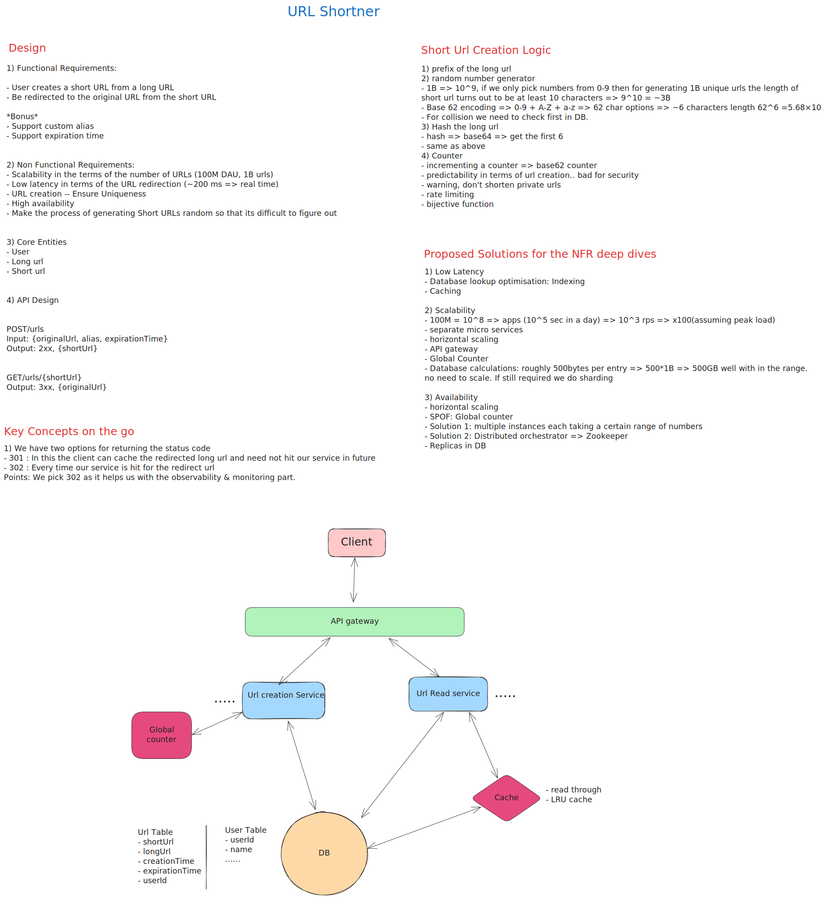

# High Level Design: URL Shortener (Bit.ly)

## 1. Requirements

### 1.1 Functional Requirements

| Priority | Requirement | Description |
|----------|-------------|-------------|
| **Core** | Generate Short URL | Users should be able to submit a long URL and receive a shortened version |
| **Core** | Redirect to Original URL | Users should be able to access the original URL by using the shortened URL |
| **Optional** | Custom Alias Support | Users should be able to specify a custom alias for their shortened URL |
| **Optional** | Expiration Time | Users should be able to specify an expiration date for their shortened URL |

**Below the Line (Out of Scope):**
- User authentication and account management
- Analytics on link clicks (click counts, geographic data)
- Spam detection and malicious URL filtering

### 1.2 Non-Functional Requirements

| Requirement | Specification | Justification |
|-------------|---------------|---------------|
| **Latency** | < 200ms for redirects | Humans perceive < 200ms as real-time; critical for user experience |
| **Scale** | 100M DAU, 1B URLs | System must handle massive read-heavy traffic |
| **Availability** | 99.99% uptime | High availability prioritized over consistency (AP in CAP) |
| **Consistency** | Eventual consistency acceptable | Strong read-after-write consistency not required; temporary redirect delays tolerable |
| **Uniqueness** | Guaranteed unique short codes | No collisions allowed; one short URL must map to exactly one long URL |
| **Durability** | No data loss | URL mappings must be persisted reliably |

**CAP Theorem Trade-off:** This system chooses **Availability** and **Partition Tolerance** over strong Consistency. Eventual consistency is acceptable because:
- Users need time to share URLs after creation
- Temporary unavailability of a newly created short URL is tolerable
- Analytics are not a core requirement
- Unlike ticket booking systems, no critical conflicts arise from stale reads

---

## 2. Capacity Estimation & Constraints

### 2.1 Traffic Estimations

| Metric | Calculation | Result |
|--------|-------------|--------|
| **Daily Active Users** | Given | 100,000,000 |
| **Redirects per user/day** | Assumed | 5 |
| **Total redirects/day** | 100M × 5 | 500,000,000 |
| **Read QPS (Average)** | 500M ÷ 86,400 | ~5,787 QPS |
| **Read QPS (Peak)** | Average × 2 | ~11,574 QPS |
| **Write QPS (Average)** | Reads × 1% | ~58 QPS |
| **Write QPS (Peak)** | Average × 2 | ~116 QPS |
| **Read:Write Ratio** | | 100:1 (Read-heavy) |

**Calculation Logic:**
```
Read QPS = (100M users × 5 clicks) ÷ 86,400 seconds ≈ 5,787 QPS
Peak assumes 2x average traffic during business hours
Write traffic is 1% of read traffic (URL creation is infrequent)
```

### 2.2 Storage Estimations

| Metric | Calculation | Result |
|--------|-------------|--------|
| **Bytes per URL record** | short_url (10B) + long_url (200B) + metadata (290B) | 500 bytes |
| **Current storage** | 1B URLs × 500 bytes | ~466 GB |
| **New URLs per year** | 58 writes/s × 31,536,000 s | ~1.8B URLs |
| **Storage per year** | 1.8B × 500 bytes | ~850 GB |
| **Storage (10 years)** | 850 GB × 10 | ~8.3 TB |

**Insight:** Storage scales linearly with URL creation rate. Even with 10 years of data, storage remains manageable on modern hardware.

### 2.3 Bandwidth Estimations

| Type | Calculation | Result |
|------|-------------|--------|
| **Read bandwidth (avg)** | 5,787 QPS × 200 bytes × 8 | 8.83 Mbps |
| **Read bandwidth (peak)** | 11,574 QPS × 200 bytes × 8 | 17.66 Mbps |
| **Write bandwidth (avg)** | 58 QPS × 300 bytes × 8 | 0.13 Mbps |
| **Write bandwidth (peak)** | 116 QPS × 300 bytes × 8 | 0.26 Mbps |
| **Total (peak)** | | ~18 Mbps |

**Note:** Bandwidth is minimal because redirects are lightweight HTTP 302 responses.

### 2.4 Cache Requirements (80/20 Rule)

| Metric | Calculation | Result |
|--------|-------------|--------|
| **Cache hit ratio** | Target | 80% |
| **Hot URLs (20%)** | 1B × 0.20 | 200M URLs |
| **Cache memory** | 200M × 500 bytes | ~93 GB |

---

## 3. Core Entities

### 3.1 Entity Overview

| Entity | Description |
|--------|-------------|
| **User** | Represents the entity creating shortened URLs |
| **URL** | Mapping between short codes and original URLs |

### 3.2 Database Schema

#### URLs Table

| Field Name | Type | Constraint | Description |
|------------|------|------------|-------------|
| `short_url` | VARCHAR(10) | PRIMARY KEY, UNIQUE, NOT NULL | Base62 encoded short code (e.g., "abc123") |
| `long_url` | TEXT | NOT NULL, INDEX | Original URL to redirect to |
| `user_id` | BIGINT | FOREIGN KEY → users.user_id | Creator of the short URL |
| `custom_alias` | VARCHAR(20) | UNIQUE, NULLABLE | User-specified alias (optional) |
| `creation_time` | TIMESTAMP | NOT NULL, DEFAULT NOW() | URL creation timestamp |
| `expiration_time` | TIMESTAMP | NULLABLE | Optional expiration date |

**Indexes:**
- Primary key index on `short_url` (B-tree) for O(log n) lookups
- Hash index on `short_url` for O(1) exact match queries (PostgreSQL)
- Index on `long_url` to check for existing URLs

#### Users Table

| Field Name | Type | Constraint | Description |
|------------|------|------------|-------------|
| `user_id` | BIGINT | PRIMARY KEY, AUTO_INCREMENT | Unique user identifier |
| `email` | VARCHAR(255) | UNIQUE, NOT NULL | User email |
| `password_hash` | VARCHAR(255) | NOT NULL | Hashed password |
| `created_at` | TIMESTAMP | DEFAULT NOW() | Account creation time |
| *(Additional metadata)* | | | Name, profile, etc. |

### 3.3 Entity Relationships

- **1:N** relationship between User and URL (one user creates many URLs)
- **Primary Key Choice:** `short_url` as PRIMARY KEY ensures uniqueness and automatic indexing
- **UUID vs. Counter:** Counter-based approach (base62 encoded) preferred for shorter codes and guaranteed uniqueness

---

## 4. API Design

### 4.1 API Endpoints

| Method | Endpoint | Request Body | Response | Description |
|--------|----------|--------------|----------|-------------|
| **POST** | `/urls` | `{ "long_url": string, "custom_alias"?: string, "expiration_date"?: timestamp }` | `{ "short_url": string }` | Create a shortened URL |
| **GET** | `/{short_code}` | None | HTTP 302 Redirect | Redirect to original URL |

### 4.2 Detailed API Specifications

#### Create Short URL

**Request:**
```http
POST /urls
Content-Type: application/json

{
  "long_url": "https://www.example.com/some/very/long/url",
  "custom_alias": "my-link",        // Optional
  "expiration_date": "2025-12-31"  // Optional
}
```

**Response (Success):**
```http
HTTP/1.1 201 Created
Content-Type: application/json

{
  "short_url": "http://bit.ly/abc123"
}
```

**Response (Conflict - Alias Exists):**
```http
HTTP/1.1 409 Conflict
{
  "error": "Custom alias already exists"
}
```

#### Redirect to Original URL

**Request:**
```http
GET /abc123
```

**Response (Success):**
```http
HTTP/1.1 302 Found
Location: https://www.example.com/some/very/long/url
```

**Response (Expired):**
```http
HTTP/1.1 410 Gone
{
  "error": "This short URL has expired"
}
```

**Response (Not Found):**
```http
HTTP/1.1 404 Not Found
{
  "error": "Short URL not found"
}
```

### 4.3 HTTP Status Code Choices

**302 (Temporary Redirect) vs. 301 (Permanent Redirect):**

| Aspect | 302 (Chosen) | 301 |
|--------|--------------|-----|
| Caching | Not cached by browsers | Cached by browsers |
| Analytics | Enables tracking of all clicks | Bypasses server after first request |
| Flexibility | Allows URL updates/deletions | Difficult to change cached redirects |
| Performance | Every request hits server | Faster after first request |
| Control | Full control over redirects | Loss of control after caching |

**Decision:** Use **302** to maintain analytics visibility and flexibility, even though analytics are out of scope for this design.

---

## 5. Data Flow

### 5.1 Write Path: URL Creation

**Request Lifecycle:**

1. **Client → API Gateway**: User submits long URL via POST `/urls`
2. **API Gateway → Write Service**: Route request to URL creation service
3. **Write Service**: Validate long URL format and sanitize input
4. **Write Service → Database**: Check if long URL already exists
   - If exists: Return existing short URL
   - If custom alias provided: Validate uniqueness
5. **Write Service**: Generate short code using counter-based approach
   - Request batch of counters from Redis (e.g., 1000 IDs)
   - Base62 encode counter value
6. **Write Service → Database**: Insert new record (short_url, long_url, user_id, timestamps)
7. **Write Service → Client**: Return short URL in response
8. **Asynchronous**: Optionally pre-warm cache with new mapping

**Synchronous vs. Asynchronous:**
- URL validation and generation: **Synchronous** (user waits for response)
- Cache pre-warming: **Asynchronous** (optional background task)

### 5.2 Read Path: URL Redirection

**Request Lifecycle:**

1. **Client → API Gateway**: User clicks short URL (GET `/{short_code}`)
2. **API Gateway → Read Service**: Route request to redirect service
3. **Read Service → Cache (Redis)**: Check if short_code exists in cache
   - **Cache Hit (80% of requests)**: Retrieve long_url from Redis
   - **Cache Miss (20% of requests)**: Proceed to step 4
4. **Read Service → Database**: Query URLs table by short_url (primary key lookup)
5. **Read Service**: Validate expiration_time
   - If expired: Return HTTP 410 Gone
   - If not found: Return HTTP 404 Not Found
6. **Read Service → Cache**: Update cache with (short_code → long_url) mapping
7. **Read Service → Client**: Return HTTP 302 redirect with `Location: {long_url}`
8. **Client Browser**: Automatically navigate to original URL

**Performance Optimizations:**
- **Cache-aside pattern**: Read service manages cache population
- **LRU eviction**: Redis automatically evicts least recently used entries
- **Primary key index**: Database lookup is O(log n) or O(1) with hash index

---

## 6. High-Level Design

### 6.1 Architecture Diagram



### 6.2 Component Breakdown

#### Client Layer
- **Web/Mobile Applications**: User-facing interfaces for creating and accessing short URLs
- **Browsers**: Handle HTTP 302 redirects automatically

#### Load Balancer
- **Algorithm**: Round-robin or least connections
- **Function**: Distributes incoming requests across multiple service instances
- **Health Checks**: Routes traffic only to healthy instances

#### API Gateway
- **Routing**: Directs `/urls` (POST) to Write Service, `/{short_code}` (GET) to Read Service
- **Rate Limiting**: Prevents abuse (e.g., 100 requests/minute per IP)
- **Authentication**: Validates API keys or JWT tokens (if required)

#### Service Layer

**Write Service (URL Creation):**
- Validates and sanitizes long URLs
- Checks for existing URLs to avoid duplicates
- Generates unique short codes using Redis counter
- Stores mappings in database
- Horizontally scalable (stateless)

**Read Service (URL Redirection):**
- Looks up short codes in cache (Redis) first
- Falls back to database on cache miss
- Validates expiration times
- Returns HTTP 302 redirects
- Horizontally scalable (stateless)

#### Storage Layer

**Primary Database (PostgreSQL/MySQL):**
- **Choice Rationale**: Relational database for structured data with ACID guarantees
- **Schema**: URLs table with indexed short_url column
- **Replication**: Master-slave replication for read scaling and failover
- **Sharding**: Shard by short_url hash for horizontal scaling (if needed)

**Why SQL over NoSQL?**
- Structured data with clear schema
- ACID transactions for write consistency
- Strong indexing support for fast lookups
- URL shortener doesn't require flexible schema

**Cache (Redis):**
- **In-memory key-value store**
- **Data Structure**: `short_code → long_url` mappings
- **Eviction Policy**: LRU (Least Recently Used)
- **Hit Rate Target**: 80% (hot URLs cached)
- **Persistence**: Periodic snapshots to disk for durability

**Global Counter (Redis):**
- **Single-threaded atomic increments** ensure no duplicates
- **Batching**: Services request batches (e.g., 1000 IDs) to reduce network calls
- **High Availability**: Redis replication and persistence

---

## 7. Deep Dives

### 7.1 Ensuring Unique Short Codes

**Problem:** Generate compact, unique, unpredictable short codes efficiently.

#### Approach 1: Random Number Generator + Collision Check

**Algorithm:**
```
1. Generate random number between 0 and 56 billion (62^6)
2. Base62 encode the number → 6-character code
3. Query database to check if code exists
4. If collision, regenerate; else save
```

**Challenges:**
- **Birthday Paradox**: 880,000 collisions expected for 1 billion URLs in 56 billion keyspace
- **Extra Database Read**: Must check before insert (acceptable overhead)

#### Approach 2: Hash Function + Truncation

**Algorithm:**
```
1. Hash long URL using MD5/MurmurHash/SHA-256
2. Base62 encode hash
3. Truncate to 6 characters
4. Check for collision in database
```

**Challenges:**
- Same collision probability as random generation
- Deterministic (same URL → same hash), but truncation negates this benefit

#### Approach 3: Counter-Based Generation (Recommended)

**Algorithm:**
```
1. Maintain global counter in Redis (starting at 1)
2. Atomically increment counter for each new URL
3. Base62 encode counter value → short code
4. Store mapping in database
```

**Advantages:**
- **Zero collisions** (guaranteed uniqueness)
- **Shortest codes**: Utilizes keyspace efficiently
- **Fast**: No collision checks needed

**Challenges:**
- **Predictability**: Sequential codes allow scraping (e.g., increment counter to discover all URLs)
- **Single Point of Failure**: Counter must be centralized

**Mitigation - Predictability:**
- Use **bijective function** (one-to-one mapping) to obfuscate counter (e.g., "squids" library)
- Implement **rate limiting** to prevent scraping
- Warn users against shortening private URLs

**Mitigation - SPOF:**
- Use Redis with replication and persistence
- Services request **batches of counters** (e.g., next 1000) to reduce network calls
- Lost IDs from server crashes are acceptable given large keyspace

**Base62 Encoding Keyspace:**

| Code Length | Combinations | Sufficient for 1B URLs? |
|-------------|--------------|-------------------------|
| 5 chars | 916M | ✗ No |
| 6 chars | 56.8B | ✓ Yes (5.6% utilization) |
| 7 chars | 3.5T | ✓ Yes (0.028% utilization) |

**Recommendation:** Use **7 characters** for 99.97% headroom and future scalability.

---

### 7.2 Achieving Low Latency Redirects (< 200ms)

**Problem:** Minimize redirect latency to meet < 200ms requirement.

#### Optimization 1: Database Indexing

**Approach:**
- **Primary Key Index**: Make `short_url` the PRIMARY KEY → automatic B-tree index
- **Lookup Complexity**: O(log n) for 1 billion rows ≈ 30 disk seeks
- **Hash Index** (PostgreSQL): O(1) average case for exact matches

**Impact:** Reduces database query time from seconds to milliseconds.

#### Optimization 2: In-Memory Caching

**Approach:**
- **Cache Layer**: Redis stores hot URLs (20% of data serves 80% of traffic)
- **Pattern**: Cache-aside (read-through cache)
- **Latency Comparison**:
  - Memory access: ~0.1 ms
  - SSD access: ~0.1 ms
  - HDD access: ~10 ms
  - Cache hit: **< 1 ms end-to-end**

**Cache Miss Flow:**
```
1. Check Redis (miss) → 0.1 ms
2. Query Database (indexed) → 5-10 ms
3. Update Redis → 0.1 ms
4. Return to client → 5-10 ms total
```

**Cache Hit Flow:**
```
1. Check Redis (hit) → 0.1 ms
2. Return to client → < 1 ms total
```

**Impact:** 80% of requests served in < 1 ms (well below 200 ms target).

#### Optimization 3: CDN/Edge Caching (Optional)

**Approach:**
- Cache redirects at CDN edge locations globally
- Reduces latency for geographically distributed users

**Trade-off:** Loses analytics visibility (out of scope, so acceptable).

---

### 7.3 Scaling to 1B URLs and 100M DAU

**Problem:** Handle massive scale across storage, compute, and availability.

#### Scaling Strategy 1: Horizontal Scaling of Services

**Write Service:**
- Stateless microservices behind load balancer
- Each instance requests counter batches from Redis independently
- Scale to ~2-3 instances for 116 QPS peak writes

**Read Service:**
- Stateless microservices behind load balancer
- Shared Redis cache across all instances
- Scale to ~2-3 instances for 11,574 QPS peak reads

**Load Balancer:** Distributes traffic using round-robin or least connections.

#### Scaling Strategy 2: Database Replication

**Master-Slave Replication:**
- **Master**: Handles all writes (116 QPS)
- **Slaves** (2-3 replicas): Handle reads (1,157 QPS after cache)
- **Failover**: Automatic promotion of slave to master

**Consistency:**
- Replication lag: ~100ms (eventual consistency acceptable)
- Read-after-write: May read stale data temporarily (tolerable)

#### Scaling Strategy 3: Database Sharding (Future)

**When to Shard:** When single database exceeds capacity (> 10 TB or > 10,000 QPS)

**Sharding Strategy:**
- **Shard Key**: Hash of `short_url` (e.g., `short_url[0:2]` → 3,844 shards)
- **Routing**: API gateway or service layer routes to correct shard
- **Trade-offs**: Increased complexity; cross-shard queries difficult

**Current System:** No sharding needed (storage < 10 TB, IOPS < 2,000).

#### Scaling Strategy 4: Redis Counter Management

**Problem:** Multiple write services need unique counters without duplicates.

**Solution:**
```python
# Pseudo-code for write service requesting counter batch
def get_counter_batch(batch_size=1000):
    start = redis.incrby("url_counter", batch_size)
    return range(start - batch_size + 1, start + 1)

# Service uses local batch
local_counters = get_counter_batch()
for long_url in new_urls:
    counter = local_counters.pop()
    short_code = base62_encode(counter)
    db.insert(short_code, long_url)
```

**Benefits:**
- Reduces network calls to Redis by 1000x
- Atomic `INCRBY` ensures no duplicates across services
- Lost counters (server crash) are acceptable with 3.5T keyspace

---

### 7.4 Failure Modes and Mitigation

| Component | Failure Scenario | Impact | Mitigation |
|-----------|------------------|--------|------------|
| **Redis Cache** | Instance crashes | Cache misses → higher DB load, slower redirects | Redis replication (slave promotion), periodic snapshots |
| **Database Master** | Master crashes | Writes fail, reads continue via slaves | Automatic failover to promoted slave, alert on-call engineer |
| **Database Slave** | Slave crashes | Reduced read capacity | Load balancer routes to healthy slaves, provision new slave |
| **Write Service** | Instance crashes | In-flight requests fail, batched counters lost | Stateless service restarts, clients retry, lost counters acceptable |
| **Read Service** | Instance crashes | In-flight redirects fail | Load balancer routes to healthy instances, clients retry |
| **Redis Counter** | Instance crashes | URL creation halts | Redis persistence restores counter, replication provides backup |
| **Load Balancer** | LB crashes | All traffic fails | Use cloud-managed LB with HA (e.g., AWS ALB), multiple AZs |

**Monitoring Alerts:**
- Database replication lag > 1 second
- Cache hit rate < 70%
- Error rate > 1%
- P99 latency > 200ms

---

### 7.5 Security Considerations

#### Rate Limiting
- **User Level**: 100 URL creations per day per user
- **IP Level**: 1000 redirects per hour per IP
- **Purpose**: Prevent abuse, DDoS, and scraping

#### Authentication
- **API Keys**: Optional for URL creation (below-the-line requirement)
- **OAuth/JWT**: For authenticated users with accounts

#### Input Validation
- **URL Sanitization**: Block malicious URLs (XSS, SSRF)
- **Custom Alias**: Allow alphanumeric + hyphens only, max 20 chars
- **Expiration**: Validate date format and max expiration (e.g., 5 years)

#### HTTPS
- **Enforce TLS**: All traffic encrypted in transit
- **HSTS Headers**: Prevent protocol downgrade attacks

---

### 7.6 Observability and Telemetry

#### Metrics (Prometheus/Grafana)
- **QPS**: Read/write requests per second
- **Latency**: P50, P95, P99 redirect times
- **Error Rate**: 4xx/5xx responses per minute
- **Cache Hit Rate**: Percentage of cache hits
- **Database IOPS**: Read/write operations per second

#### Logging (ELK/Splunk)
- **Access Logs**: Timestamp, short_code, IP, user agent
- **Error Logs**: Exception stack traces, failed validations
- **Audit Logs**: URL creation, updates, deletions

#### Distributed Tracing (Jaeger/Zipkin)
- Trace requests across API Gateway → Service → Cache → Database
- Identify bottlenecks and slow queries

#### Alerts
- P99 latency > 200ms for > 5 minutes
- Error rate > 1% for > 2 minutes
- Cache hit rate < 70% for > 10 minutes
- Database replication lag > 5 seconds

---

## 8. References

- **Architecture Diagram**: [UrlShortner.excalidraw.jpg](UrlShortner.excalidraw.jpg)
- **Video Walkthrough**: [Beginner System Design: Design Bitly w/ Ex-Meta Staff Engineer](https://www.youtube.com/watch?v=iUU4O1sWtJA)
- **Detailed Problem Breakdown**: [Hello Interview - Design Bit.ly](https://www.hellointerview.com/learn/system-design/problem-breakdowns/bitly)
- **CAP Theorem**: Consistency, Availability, Partition Tolerance trade-offs
- **Birthday Paradox**: Collision probability in random generation
- **Base62 Encoding**: URL-safe character set (0-9, a-z, A-Z)
- **HTTP Status Codes**: 301 (Permanent), 302 (Temporary), 410 (Gone)

---

**Document Version**: 1.0  
**Last Updated**: November 23, 2025  
**Author**: Principal Software Architect  
**Review Status**: Ready for Implementation