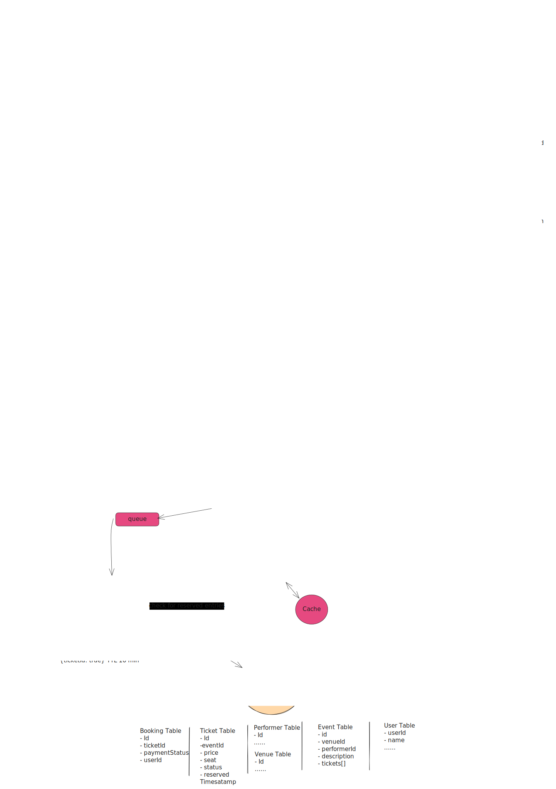

# Ticketmaster/BookMyShow System Design High-Level Design

## 1. Requirements

### Functional Requirements
| Functional Requirement                                                                          |
|-----------------------------------------------------------------------------------------------|
| Users should be able to **search for events** (by name, type, location, date).                |
| Users should be able to **view event details** (venue, performer, seat availability, pricing).|
| Users should be able to **book tickets**—including seat selection, reservation, and payment.  |

### Non-Functional Requirements
| Non-Functional Requirement                                                     |
|-------------------------------------------------------------------------------|
| **Consistency**: No double booking—strong consistency for the booking service.|
| **Availability**: High availability for search and view APIs.                 |
| **Low Latency**: Sub-500ms search results and near real-time seat updates.    |
| **Scalability**: Handle surges (10M DAU, 1M+ concurrent users during peak).   |
| **Read/Write Ratio**: Highly read-heavy (~100:1).                             |
| **Durability**: Protect against data loss (backups, persistent storage).      |

#### CAP Theorem Targeting:
- **Booking**: Consistency > Availability (CP)
- **Search/View**: Availability > Consistency (AP/EAP)

---

### Capacity Estimation & Constraints

#### User Activity Calculation
- 10M DAU × 5 searches/user/day = 50M searches/day
- 10M DAU × 2 event views/user/day = 20M views/day
- Peak event: 1M concurrent users, up to 10,000+ booking attempts/sec

#### Storage Calculation
- 100,000 venues × 10 events/month × 12 months = 12M events/year
- Avg. 5,000 tickets/event → 12M × 5,000 = 60B tickets/year
- Ticket record size ≈ 500 bytes
- Hot storage (upcoming events) ≈ 1-2 TB; total annual ≈ 30 TB

#### Bandwidth (Peak)
- 5,000 seats/event × 50 bytes = 250KB/seat map
- 1M concurrent seat maps → 250GB bandwidth at surge

#### Sample Capacity Table (per source data and estimation)

| Resource        | QPS (Normal) | QPS (Peak) | Storage/Year | Bandwidth/Peak | Calculation Sample                                      |
|-----------------|-------------|------------|--------------|----------------|--------------------------------------------------------|
| Search          | 580         | 100,000+   | —            | —              | (10M DAU × 5/day)/86400                                |
| Event View      | 230         | 1M+        | —            | —              | (10M DAU × 2/day)/86400                                |
| Booking        | 10           | 10,000+    | —            | —              | Estimated per deep-dive and spikes                     |
| Ticket Storage  | —           | —          | 30TB         | —              | 60B tickets × 500B                                     |
| Seat Map Data   | —           | —          | —            | 250GB/event     | 5,000 seats × 50B × 1M users                           |
| Lock/Cache Mem  | —           | —          | 10MB         | —              | 100,000 concurrent × 100B per reservation (Redis lock) |

---

## 2. Core Entities

### Database Schema

| Entity      | Field Name       | Type        | Description/Constraint                       |
|-------------|------------------|-------------|----------------------------------------------|
| **Event**   | event_id         | UUID        | PK. Unique event identifier                  |
|             | name             | String      | Event name                                   |
|             | description      | Text        | Event description                            |
|             | venue_id         | UUID        | FK to Venue                                 |
|             | performer_id     | UUID        | FK to Performer                             |
|             | date             | DateTime    | Event start time                             |
|             | tickets[]        | UUID[]      | List of ticket IDs                           |
| **Venue**   | venue_id         | UUID        | PK                                           |
|             | location         | Geo (Point) | Geographic coordinates/address               |
|             | seat_map         | JSON/Text   | Defined seating arrangement                  |
|             | capacity         | Integer     | Seat count                                   |
| **Performer**| performer_id    | UUID        | PK                                           |
|             | name             | String      |                                              |
|             | biography        | Text        |                                              |
| **Ticket**  | ticket_id        | UUID        | PK. Unique per seat per event                |
|             | event_id         | UUID        | FK                                           |
|             | seat_info        | String/JSON | Detailed location (section, row, seat)       |
|             | price            | Decimal     | Ticket price                                 |
|             | status           | Enum        | available | reserved | booked             |
|             | user_id          | UUID        | FK to User—null until booked                 |
|             | reserved_ts      | DateTime    | Reservation timestamp (for expiry/locking)   |
| **Booking** | booking_id       | UUID        | PK. Unique booking identifier                |
|             | user_id          | UUID        | FK to User                                  |
|             | ticket_ids       | UUID[]      | List of tickets reserved/booked              |
|             | status           | Enum        | in-progress | confirmed | failed           |
|             | total_price      | Decimal     | Aggregate price                              |
|             | created_at       | DateTime    |                                              |
| **User**    | user_id          | UUID        | PK                                           |
|             | name             | String      |                                              |
|             | email            | String      |                                              |

#### Relationships
- **Event — Venue**: N:1 (event at one venue)
- **Event — Performer**: N:1
- **Event — Ticket**: 1:N
- **User — Booking**: 1:N
- **Booking — Ticket**: 1:N (multi-seat bookings)

- **Primary Keys**: UUIDs for global uniqueness across partitions/services
- **Indexes**: event name (search), seat_info, performer_id, venue_id, status, user_id

---

## 3. API Design

| Method | Endpoint                          | Request Params/Body      | Response                    | Description                                                                               |
|--------|-----------------------------------|--------------------------|-----------------------------|-------------------------------------------------------------------------------------------|
| GET    | /events/{eventId}                 | Path: eventId            | Event, Venue, Performer, Ticket[] | Get full event and seat map for display                                                   |
| GET    | /search                          | Query: term, location, type, date, page | PartialEvent[]              | Search events (basic info for search results)                                             |
| POST   | /booking/reserve                  | Header: JWT Body: ticketId | BookingId or error        | Reserve selected ticket—lock for user, 10 min expiry                                      |
| POST   | /booking/confirm                  | Header: JWT Body: ticketId, paymentDetails | Booking confirmation/error | Confirm booking on selected ticket(s)—finalizes purchase and updates ticket status        |
| GET    | /user/bookings                    | Header: JWT              | Booking[]                   | (Bonus) Get user's past/future bookings                                                   |

---

## 4. Data Flow

### 4.1 Read Path: Event Search/View
- Client sends GET `/search` or `/events/:eventId`
- Routed via **API Gateway** (auth, rate limiting)
- **Search Service**: Reads from Elasticsearch (fast, flexible search); fallback to DB if cache miss.
- **Event CRUD Service**: Queries primary DB (event/ticket tables) for up-to-date event detail, seat map.
- **Cache Layer**: Redis/Memcached caches static event, performer, venue, and frequently accessed seat maps.
- **Response**: Event/seat map data returned to client

### 4.2 Write Path: Ticket Booking
- Client selects seat → starts booking:
- `POST /booking/reserve` (ticketId):
    - **Booking Service** checks/sets Redis distributed lock (TTL: 10 min).
    - Updates Booking table (in-progress), but does *not* mark ticket as sold yet.
    - Returns BookingId, seat held for user pending payment.
- Client proceeds to pay:
- `POST /booking/confirm` (ticketId, paymentDetails):
    - Third-party payment (Stripe, webhook callback).
    - On payment success, Booking Service sets ticket `status = booked`, links `user_id`, marks booking confirmed.
- If reserve TTL expires before payment, Redis lock expires; seat returns to pool.

---

## 5. High-Level Design

### 5.1 Architecture Diagram

### 5.2 Component Breakdown

| Component             | Role/Responsibility                                                                             |
|-----------------------|-------------------------------------------------------------------------------------------------|
| **Client**            | User-facing app/web portal                                                                      |
| **API Gateway**       | Entry point; handles routing, authentication (JWT), rate limiting, logging                      |
| **Event CRUD Service**| Core business logic for viewing events, seat maps; talks to main SQL DB                         |
| **Search Service**    | Handles search queries (full-text, filter, geo) via Elasticsearch/Opensearch                    |
| **Booking Service**   | Handles all booking logic; interacts with Redis (lock), SQL DB (writes), payment (Stripe), queue|
| **Redis Distributed Lock** | Provides real-time seat locking with TTL for reservation expiry                         |
| **Payment Gateway**   | External (Stripe); processes payments, callbacks update booking states                          |
| **Queue/Async Tasks** | Handles side effects (emails, notifications, analytics)                                         |
| **Cache**             | Redis/Memcached; caches partial events, seat maps, static data                                  |
| **DB (SQL)**          | Stores all entities — Events, Tickets, Bookings, Venues, Performers, Users                      |
| **ElasticSearch**     | Fast, full-text/global/geo search for events                                                    |

- **Load Balancing**: Algorithm (e.g., Round Robin, Least Connections) on API Gateway and service layers
- **Microservices**: Decompose for horizontal scaling of search, booking, CRUD, etc.
- **DB Choice**: Postgres (ACID/SQL, transactional for seat reservations), NoSQL (optionally for user/event analytics)
- **Sharding**: Events partitioned by geography (city/region) for latency and isolation

---

## 6. Deep Dives

### Reservation & Booking Algorithm
- Two-phase commit: **Reserve → Confirm**; Redis lock provides distributed mutex with TTL.
- Transactions: Reserve is a soft-lock (writes lock in Redis, does *not* update ticket row yet). On payment, DB transaction finalizes seat as sold.
- **Cron vs. Distributed Lock**: Cron job solves expired reservations slowly; Redis key TTL gives near-instant expiry.
- **If Redis down**: System fallback—only possible race in 10min window; DB transaction ensures only one final booking (others error on double-spend).
- **Write/Cache Synchronization**: CDC (Change Data Capture) ensures DB/ElasticSearch eventual sync.

### Search Optimization
- **Elasticsearch** for partial/fuzzy search (names, artists, location).
- Application-level dual-write or CDC for real-time sync between DB and ES.
- **Cache-aside strategy**: Popular search results cached in Redis/Memcached or nearest region CDN.
- **Indexing**: B-tree/composite for SQL, inverted index for ES, GEO for geo queries.

### Scaling Optimizations
- **Horizontal Scaling**: Microservices scale independently, stateless (except where Redis/DB involved).
- **Virtual Queue**: Redis sorted-set/priority queue for surge handling (popular events).
- **SSE/Long Polling**: Real-time seat map update push to clients.
- **Geographical sharding**: Partition by region for latency/performance.

### Failure Modes & Security
| Failure Mode             | Handling Strategy                                                            |
|--------------------------|------------------------------------------------------------------------------|
| DB Master Down           | Switchover to secondary, transactions retry, or degrade to read-only mode    |
| Cache Miss/Stampede      | Lock per-key, lazy populate caches, short TTL, use fallback; queue cold loads|
| Redis Down               | Locks lost; only affects users in 10min reserve window; DB still authoritative|
| Payment Errors           | Webhook retries, circuit breakers                                            |
| Rate Limit/Security      | API Gateway: JWT Auth, rate limiting, input validation, WAF/anti-bot         |

#### Security
- JWT for endpoint auth; all booking APIs require user context in verified JWT/session.
- Rate limiting per user/IP at Gateway/service level.
- Data Sanitization: Input validation, SQL injection prevention.
- PCI-DSS handled via third-party payment provider.

#### Telemetry/Monitoring
- Metrics: QPS per endpoint, latency (avg/95th/99th), error rates, event drops
- Distributed tracing for customer sessions across microservices
- Logging: Central, structured, queryable (for audits, debugging)

---

## 7. References

**Visual**:

**Video**:
[Design Ticketmaster w/ a Ex-Meta Staff Engineer](https://www.youtube.com/watch?v=fhdPyoO6aXI&list=PL5q3E8eRUieWtYLmRU3z94-vGRcwKr9tM&index=1)

**Deep Dive**:
[Design a Ticket Booking Site Like Ticketmaster - HelloInterview](https://www.hellointerview.com/learn/system-design/problem-breakdowns/ticketmaster)