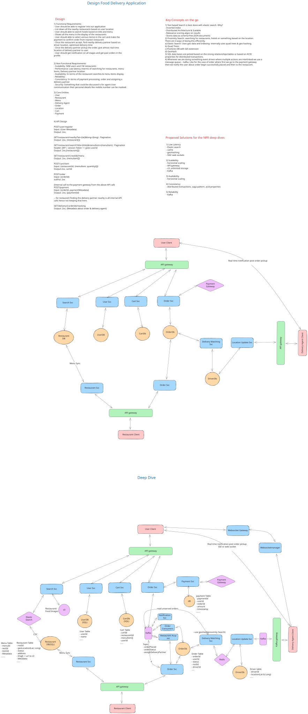

# Food Delivery Application - System Design

**Design a scalable, real-time food delivery platform like Zomato, Swiggy, or Uber Eats**

---

## 1. High Level Design

The system enables users to order food from nearby restaurants and have it delivered by partners, supporting millions of concurrent users, real-time tracking, and high availability.

---

## 2. Requirements

### Functional Requirements

| Priority | Requirement |
|----------|-------------|
| P0 | User registration, authentication, and profile management |
| P0 | Restaurant discovery and search by location or menu |
| P0 | Restaurant and menu display |
| P0 | Cart management with single-restaurant enforcement |
| P0 | Order placement and integrated payment |
| P0 | Restaurant order acceptance/decline |
| P0 | Delivery partner allocation and status updates |
| P1 | Real-time order tracking for all actors |
| P1 | Frequent delivery partner location updates |
| P1 | Status notifications |
| P2 | Restaurant self-management tools |

### Non-Functional Requirements (SPARCS)

| Area       | Target                         |
|------------|-------------------------------|
| Scalability| 50M total users, 1M restaurants|
| Performance| <200ms search, <1s ordering   |
| Availability| 99.99% browse, 99.95% ordering|
| Reliability| Fault-tolerant, zero data loss|
| Consistency| Strong for payments, eventual for browse|
| Security   | JWT/OAuth2, rate limiting, encryption|

---

## 3. Capacity & Constraints

| Metric  | Estimate/Notes       |
|---------|----------------------|
| Daily Orders | 5M/day           |
| Restaurant Searches | 50M/day   |
| Real-Time Location Updates | 864M/day |
| Storage (10 years, all data types) | ~1.2PB |
| Peak Application Bandwidth | ~1.3 GB/s (mostly static assets) |

---

## 4. Core Entities & Schema

### Primary Entities

- **User** (customer)
- **Restaurant**
- **Menu/Food Item**
- **Cart**
- **Order**
- **Payment**
- **Delivery Partner**

### Relationships

- 1 User: many Orders, Carts, Payments
- 1 Restaurant: many Menu Items, Orders
- 1 Order: 1 User, 1 Restaurant, 1 Payment, 1 Delivery Partner

### Example Schema (abridged)

| Entity      | Key Fields                               | Description               |
|-------------|------------------------------------------|---------------------------|
| User        | `user_id` (UUID), `email`, `address`     | Customers placing orders  |
| Restaurant  | `restaurant_id`, `name`, `geohash`       | Food establishments       |
| Menu Item   | `item_id`, `restaurant_id`, `price`      | Items on menu             |
| Cart        | `cart_id`, `user_id`, `items` (JSON)     | Shopping cart             |
| Order       | `order_id`, `user_id`, `restaurant_id`   | Transaction record        |
| Payment     | `payment_id`, `order_id`, `status`       | Payment record            |
| Driver      | `driver_id`, `status`, `current_location`| Delivery partner          |

---

## 5. API Design

### Core Endpoints

| Method | Endpoint | Description |
|--------|----------|-------------|
| POST   | `/user/register` | Register new user          |
| POST   | `/user/login`    | User authentication        |
| GET    | `/restaurants/nearby` | List restaurants by location |
| GET    | `/restaurants/search` | Search by keyword         |
| GET    | `/restaurant/{id}/menu` | Menu of a restaurant  |
| POST   | `/cart`          | Add item to cart           |
| GET    | `/cart`          | View cart                  |
| POST   | `/order`         | Place order                |
| GET    | `/order/{id}`    | View order status          |
| GET    | `/order/{id}/tracking` | Real-time tracking     |
| POST   | `/payment/initiate` | Start payment (internal) |
| POST   | `/restaurant/orders/{id}/accept` | Accept/decline order |
| POST   | `/driver/location` | Update driver location    |

*Authentication via JWT required for user, restaurant, driver protected endpoints.*

---

## 6. Data Flow

### Order Write Path
- User adds to cart → Places order → Proceeds to payment
- Payment Service verifies and confirms
- Order event triggers restaurant notification
- Restaurant accepts, Delivery partner allocated, status notifies all parties
- Real-time tracking via WebSockets throughout the delivery

### Restaurant Search (Read Path)
- Client requests search by location or keyword
- API Gateway validates/JWT and routes request
- Search Service queries Elasticsearch and caches results for repeated queries
- Paginated, enriched response returned to client

---

## 7. Architecture Diagram

---

## 8. Component Breakdown

| Component              | Role                                          |
|------------------------|-----------------------------------------------|
| Clients (Web/Mobile)   | User access, real-time tracking via WebSocket |
| Load Balancer          | Distributes traffic, health-checks            |
| API Gateway            | Auth, rate limit, route, metrics              |
| WebSocket Gateway      | Persistent order/delivery tracking            |
| User/Order Services    | Business logic, data consistency              |
| Search Service         | Fast geo/keyword restaurant search            |
| Cart/Restaurant Services| Item mgmt., order queue mgmt.                 |
| Payment Service        | Payment integrations, PCI compliance           |
| Driver Services        | Allocation, updates, status management        |
| Redis/Elasticsearch    | Caching, search indices                       |
| PostgreSQL/MySQL       | Primary data stores                           |
| Kafka                  | Event coordination                            |
| CDN                    | Asset/image delivery, offload                 |
| Monitoring/Logging     | Metrics (Prometheus), centralized logs (ELK)  |

---

## 9. Key Technical Highlights

- **Microservices architecture**: Each service independently scalable
- **Horizontal DB sharding**: By user ID for volume scaling
- **Multi-layer caching**: Redis, CDN, client/service caches
- **Event-driven**: Kafka for reliable, decoupled workflows
- **Search optimized**: Elasticsearch for geo and full-text queries
- **WebSocket scaling**: For real-time updates to thousands of users
- **Resilience/Failover**: Read replicas, auto-failover, circuit breaker pattern
- **Security**: JWT/OAuth2, rate limiting, input validation, TLS, encrypted at rest
- **Monitoring**: Metrics, alerts, logging, distributed tracing

---

## 10. References

- Architecture Diagram: [Attached SVG File](http://readme.md)
- Video: [System Design Deep Dive](https://www.youtube.com/watch?v=rZyAgZuuZiA)
- Deep Dive: [Website Link](https://interviewwithbunny.vercel.app/systemdesign/06)

---

**Document Version:** 1.0  
**Last Updated:** November 30, 2025  
**Author:** Principal Software Architect  
**Review Status:** Ready for Production  

---