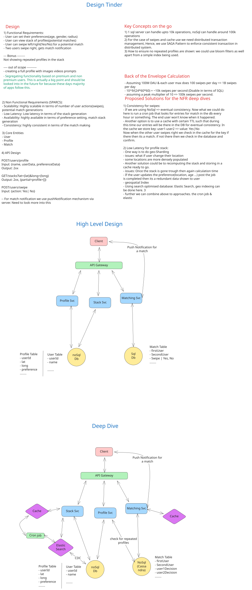

# Design Tinder: High-Level Design Document

## Executive Summary

Tinder is a location-based dating application that matches users through mutual swipes. This document presents a comprehensive high-level design (HLD) for a system capable of handling 20 million daily active users (DAU) with approximately 100 swipes per user per day. The design prioritizes strong consistency for match creation, low-latency feed generation (~300ms), and prevention of showing previously swiped profiles. The architecture employs a microservices approach with Redis for atomic swipe operations, geospatial indexing for efficient feed queries, and a hybrid caching strategy to manage state across distributed services.

---

## 1. Requirements

### 1.1 Functional Requirements

| Requirement | Description |
|---|---|
| User Profile Creation | Users can create profiles with preferences (age range, interests, max distance) |
| View Match Stack | Users can view a curated stack of potential matches within location and preference filters |
| Swipe Functionality | Users can swipe right (like) or left (pass) on profiles one-by-one |
| Match Notification | Users receive immediate notification upon mutual swipes (match created) |
| Duplicate Prevention | System must not show previously swiped profiles in feed |

### 1.2 Non-Functional Requirements (SPARCS Framework)

| Pillar | Target | Rationale |
|---|---|---|
| **Scalability** | 20M DAU; ~100 swipes/user/day = 2B swipes/day (~23K QPS avg) | System must handle millions of concurrent users |
| **Performance (Latency)** | Feed load < 300ms; Swipe response < 100ms | Mobile users expect fast interactions |
| **Performance (Throughput)** | 23K read QPS (feed); 23K write QPS (swipes) | Sustainable across peak hours |
| **Availability** | 99.9% uptime (SLA) | Critical user-facing service |
| **Reliability** | Graceful degradation on cache misses | Fallback to database queries acceptable |
| **Consistency** | Strong for swipes; Eventual for feeds | Match creation requires atomicity; feed staleness acceptable |
| **Security** | JWT auth; Rate limiting (100 swipes/hour/user); Data encryption | Prevent abuse; protect user data |

---

## 2. Capacity Estimation & Constraints

### 2.1 Back-of-the-Envelope Calculation

| Metric | Calculation | Value |
|---|---|---|
| **Daily Active Users (DAU)** | Given | 20M |
| **Concurrent Users (Peak)** | DAU × 10% | 2M |
| **Swipes per User per Day** | Given | 100 |
| **Total Daily Swipes** | 20M × 100 | 2B |
| **Average QPS (Swipes)** | 2B ÷ 86,400 sec | ~23K |
| **Peak QPS (Swipes)** | Avg × 5x peak multiplier | ~115K |
| **Feed Requests per Day** | 20M × 5 (avg 5 feeds/session) | 100M |
| **Feed QPS (Average)** | 100M ÷ 86,400 sec | ~1.2K |
| **Peak Feed QPS** | 1.2K × 5x | ~6K |

### 2.2 Storage Estimation (5-Year Horizon)

| Entity | Records | Avg Size | Total Storage |
|---|---|---|---|
| **Users Table** | 100M (5yr growth) | 2 KB | 200 GB |
| **Swipes Table** | 100M users × 100 swipes × 365 × 5 | 200 B | 36.5 TB |
| **Match Table** | 100M × ~20% match rate | 100 B | 2 TB |
| **Profile Blob (Images)** | Not in scope | - | - |
| **Redis Cache** | Hot swipes (24hr window) | 1 KB/pair | 50 GB |
| **Total (Excluding images)** | - | - | **~39 TB** |

### 2.3 Bandwidth Estimation

| Direction | Calculation | Bandwidth |
|---|---|---|
| **Inbound (Swipes/Feed)** | (23K + 1.2K) QPS × 1 KB avg | ~24 Mbps |
| **Outbound (Responses)** | 24K QPS × 5 KB avg response | ~960 Mbps |
| **Total Peak** | × 5x multiplier | ~5 Gbps |

---

## 3. Core Entities & Data Model

### 3.1 Entity Relationships

```
User (1) ──[swiped by]──> (N) Swipe
User (1) ──[created]──> (N) Match
Match ──[involves]──> (2) User
```

### 3.2 Database Schema

| Entity/Table | Field Name | Type | Constraints & Description |
|---|---|---|---|
| **users** | user_id | UUID (PK) | Primary key; partitioning key |
| | email | VARCHAR(255) | Unique; authentication |
| | age | INT | For age-range filtering |
| | gender | ENUM(M, F, NB) | For preference filtering |
| | interested_in | ENUM(M, F, BOTH) | Preference filter |
| | location_lat | FLOAT | Geospatial index required |
| | location_long | FLOAT | Geospatial index required |
| | max_distance | INT | Distance filter in km |
| | interests | TEXT[] | Profile interests |
| | created_at | TIMESTAMP | Account creation time |
| | updated_at | TIMESTAMP | Profile last updated |
| **swipes** | user_pair | TEXT (PK) | Partition key: smaller_id:larger_id |
| | from_user | UUID (CK) | Clustering key; who swiped |
| | to_user | UUID (CK) | Clustering key; who was swiped on |
| | direction | ENUM(left, right) | "left" = pass, "right" = like |
| | created_at | TIMESTAMP | Swipe timestamp |
| **matches** | match_id | UUID (PK) | Unique match identifier |
| | user1_id | UUID (CK) | First user (smaller ID) |
| | user2_id | UUID (CK) | Second user (larger ID) |
| | created_at | TIMESTAMP | Match creation time |
| | status | ENUM(active, blocked) | Match state |

### 3.3 Primary Key Strategy

- **Users**: UUID (distributed ID generation; avoids centralized bottleneck)
- **Swipes**: Compound key with `user_pair` partition ensures all swipes between two users hash to same partition (critical for atomic check-and-insert on match detection)
- **Matches**: UUID for global uniqueness; timestamp for time-series queries

### 3.4 Indexing Strategy

| Table | Index | Type | Purpose |
|---|---|---|---|
| users | (location_lat, location_long) | Geospatial | Efficient range queries for feed generation |
| users | (age, interested_in) | Composite | Filter by demographics |
| swipes | (created_at) | B-tree | Time-series queries; archival |
| matches | (user1_id, created_at) | Composite | User match history |

---

## 4. API Design

### 4.1 Core Endpoints

| Method | Endpoint | Request Params | Response | Description |
|---|---|---|---|---|
| **POST** | `/api/v1/profile` | `{age_min, age_max, distance, interested_in, interests}` | `{user_id, status}` | Create/update user profile with preferences |
| **GET** | `/api/v1/feed?lat={}&long={}&distance={}` | Query params: lat, long, distance | `{profiles: User[]}` | Fetch curated stack of match candidates; returns ~100 profiles |
| **POST** | `/api/v1/swipe/{userId}` | `{decision: "yes" \| "no"}` | `{matched: boolean, match_id?: string}` | Record swipe; return match status if mutual |
| **GET** | `/api/v1/matches` | - | `{matches: Match[]}` | Retrieve user's active matches |

### 4.2 Request/Response Examples

**POST /api/v1/profile**

```json
{
  "age_min": 20,
  "age_max": 30,
  "distance": 10,
  "interested_in": "female",
  "interests": ["travel", "hiking", "coffee"]
}
```

**Response (201 Created):**

```json
{
  "user_id": "550e8400-e29b-41d4-a716-446655440000",
  "email": "user@example.com",
  "status": "profile_created",
  "created_at": "2025-12-07T08:43:00Z"
}
```

---

**GET /api/v1/feed?lat=37.7749&long=-122.4194&distance=10**

```json
{
  "profiles": [
    {
      "user_id": "660e8400-e29b-41d4-a716-446655440001",
      "age": 25,
      "gender": "F",
      "location_lat": 37.7849,
      "location_long": -122.4094,
      "interests": ["travel", "art", "coffee"],
      "distance_km": 8.2
    },
    {
      "user_id": "770e8400-e29b-41d4-a716-446655440002",
      "age": 27,
      "gender": "F",
      "location_lat": 37.7649,
      "location_long": -122.4294,
      "interests": ["hiking", "yoga"],
      "distance_km": 5.1
    }
  ],
  "request_id": "req-12345678",
  "timestamp": "2025-12-07T08:44:30Z"
}
```

---

**POST /api/v1/swipe/660e8400-e29b-41d4-a716-446655440001**

```json
{
  "decision": "yes"
}
```

**Response (No Match):**

```json
{
  "matched": false,
  "status": "swipe_recorded",
  "timestamp": "2025-12-07T08:45:15Z"
}
```

**Response (Match Found):**

```json
{
  "matched": true,
  "match_id": "match-550e8400-e29b-41d4-a716",
  "notification_sent": true,
  "matched_user": {
    "user_id": "660e8400-e29b-41d4-a716-446655440001",
    "name": "Sarah",
    "age": 25
  },
  "timestamp": "2025-12-07T08:45:15Z"
}
```

---

**GET /api/v1/matches**

```json
{
  "matches": [
    {
      "match_id": "match-550e8400-e29b-41d4-a716",
      "matched_user_id": "660e8400-e29b-41d4-a716-446655440001",
      "matched_user_name": "Sarah",
      "created_at": "2025-12-07T08:45:15Z",
      "status": "active"
    },
    {
      "match_id": "match-550e8400-e29b-41d4-a717",
      "matched_user_id": "770e8400-e29b-41d4-a716-446655440002",
      "matched_user_name": "Emma",
      "created_at": "2025-12-06T15:30:22Z",
      "status": "active"
    }
  ],
  "total_matches": 2,
  "pagination": {
    "limit": 20,
    "offset": 0,
    "has_more": false
  }
}
```

---

## 5. Data Flow & Request Lifecycle

### 5.1 Write Path (Swipe)

```
Client Request: POST /api/v1/swipe/{target_user_id}
  │
  ├─> Load Balancer (Nginx, Round-Robin)
  │   └─> Route to Swipe Service instance
  │
  ├─> Swipe Service
  │   ├─> Validate JWT token
  │   ├─> Check rate limit: rate:{user_id}:swipes (Redis)
  │   ├─> Construct user_pair: min(from_user, to_user):max(from_user, to_user)
  │   └─> Execute Redis Lua script (atomic)
  │
  ├─> Redis Cache (Lua Script - Atomic Execution)
  │   ├─> HSET swipes:{user_pair} {from_user}_swipe {direction}
  │   ├─> HGET swipes:{user_pair} {to_user}_swipe
  │   ├─> If both = "right" → MATCHED
  │   └─> Return result (< 50ms)
  │
  ├─> Async Persistence (Non-blocking)
  │   ├─> Write to Cassandra swipes table
  │   └─> Emit event to Kafka: swipes.created
  │
  ├─> Async Notifications (Kafka Consumer)
  │   ├─> Listen on match.created topic
  │   ├─> Call Firebase FCM API
  │   └─> Log delivery status
  │
  └─> Response to Client (< 100ms SLA)
      └─> {matched, match_id?, timestamp}
```

**Redis Lua Script for Atomic Swipe Detection:**

```lua
local key = "swipes:" .. ARGV[1]           -- swipes:{user_pair}
local from_user_field = ARGV[2] .. "_swipe"
local to_user_field = ARGV[3] .. "_swipe"
local direction = ARGV[4]

-- Atomic: set current user's swipe
redis.call('HSET', key, from_user_field, direction)

-- Get other user's swipe
local other_swipe = redis.call('HGET', key, to_user_field)

-- Check for mutual right swipes (match)
if direction == 'right' and other_swipe == 'right' then
    return 1  -- Match detected
else
    return 0  -- No match
end
```

### 5.2 Read Path (Feed Generation)

```
Client Request: GET /api/v1/feed?lat=37.77&long=-122.42&distance=10
  │
  ├─> Load Balancer (Nginx)
  │   └─> Route to Feed Service
  │
  ├─> Feed Service
  │   ├─> Construct cache key: feed:{user_id}:37.77:-122.42
  │   │
  │   ├─> [CACHE HIT] (80% cases)
  │   │   └─> Return cached profiles + TTL metadata
  │   │
  │   └─> [CACHE MISS] (20% cases)
  │       ├─> Query PostgreSQL + PostGIS
  │       │   └─> Geohash-based index lookup
  │       │
  │       ├─> Bloom Filter Check (Redis)
  │       │   └─> Load swipe_filter:{user_id}
  │       │   └─> Filter out previously swiped profiles
  │       │
  │       ├─> Cache Store with randomized TTL
  │       │   └─> SETEX feed:{user_id}:lat:long 3600±300 [profiles]
  │       │
  │       └─> Response to Client (< 300ms SLA)
```

**PostGIS Geospatial Query with Geohash Index:**

```sql
-- Create geohash composite index for efficient range queries
CREATE INDEX idx_geohash_compound 
ON users(geohash, age, interested_in, updated_at DESC);

-- Query only adjacent geohash cells (max 9 cells instead of entire table)
SELECT user_id, age, gender, location_lat, location_long, interests,
       ST_Distance(location, POINT(?, ?)) as distance_meters
FROM users
WHERE geohash IN (adjacent_cells)
  AND age BETWEEN ? AND ?
  AND interested_in = ?
  AND ST_DistanceSphere(location, POINT(?, ?)) <= ?
ORDER BY updated_at DESC
LIMIT 500;
```

### 5.3 Match Notification Flow

```
Match Detected (Redis Lua Script)
  │
  ├─> Event Published to Kafka: match.created
  │   └─> Payload: {match_id, user1_id, user2_id, timestamp}
  │
  ├─> Notification Service (Kafka Consumer)
  │   ├─> Retrieve match details from database
  │   ├─> Fetch device tokens (iOS: APNS, Android: FCM)
  │   │
  │   ├─> Parallel Async Calls to Firebase FCM
  │   │   ├─> User1: APNS push notification
  │   │   └─> User2: FCM push notification
  │   │
  │   └─> Log Delivery Status
  │       └─> Emit event to Kafka: notifications.delivered
  │
  └─> Users Receive Notification (~2 seconds SLA)
```

**Firebase FCM Message Payload:**

```json
{
  "tokens": ["device_token_1", "device_token_2"],
  "notification": {
    "title": "New Match!",
    "body": "You have a new match! Start chatting now."
  },
  "data": {
    "match_id": "match-550e8400-e29b-41d4-a716",
    "matched_user_id": "660e8400-e29b-41d4-a716-446655440001",
    "action": "open_match"
  },
  "android": {
    "priority": "high",
    "ttl": 3600
  },
  "apns": {
    "headers": {
      "apns-priority": "10"
    },
    "payload": {
      "aps": {
        "sound": "default",
        "badge": 1,
        "alert": {
          "title": "New Match!",
          "body": "You have a new match! Start chatting now."
        }
      }
    }
  }
}
```

---

## 6. High-Level Architecture

### 6.1 Architecture Diagram



### 6.2 Component Breakdown

| Component | Technology | Role | Rationale |
|---|---|---|---|
| **Client** | Mobile (iOS/Android) | User interaction; local swipe history caching | Low latency via local cache |
| **Load Balancer** | Nginx/HAProxy | Request routing; health checks | Round-robin distribution; detect failed instances |
| **API Gateway** | Kong/AWS API Gateway | Authentication; rate limiting; request routing | Centralized auth layer; enforce rate limits |
| **Profile Service** | Node.js/Go microservice | Profile creation/updates | Lightweight; stateless; scale independently |
| **Stack Service** | Python/Go microservice | Feed/stack generation | Geo-queries; stateless; heavy DB reads |
| **Matching Service** | Java/Go microservice | Swipe processing; match detection | Handles atomic operations; Redis integration |
| **User Database** | PostgreSQL + PostGIS | Users table; geospatial indexing | SQL ACID; PostGIS for geo-queries |
| **Swipe Database** | Cassandra or DynamoDB | Swipes & matches tables | NoSQL for write throughput; user_pair partitioning |
| **Redis Cache** | Redis Cluster | Atomic swipe operations; feed caching; rate limits | Sub-millisecond latency; Lua scripting |
| **Message Queue** | Kafka | Notifications; event streaming | Durability; async processing; replay capability |
| **Notification Service** | Firebase Cloud Messaging (FCM) | Push notifications | Multi-platform (iOS/Android); built-in reliability |

---

## 7. Deep Dives: Advanced Topics

### 7.1 Swipe Consistency & Atomicity

**Challenge**: Atomically detect mutual swipes without race conditions when both users swipe simultaneously.

**Problem with Traditional SQL**:

```sql
-- Race condition: check and insert not atomic
BEGIN TRANSACTION;
  SELECT * FROM swipes WHERE from_user = B AND to_user = A AND direction = 'right';
  IF EXISTS THEN
    INSERT INTO matches (user1, user2, created_at) VALUES (...);
  END IF;
COMMIT;
```

**Solution: Redis Lua Script (Atomic Execution)**

- Single round-trip; < 50ms latency
- Atomic operation guaranteed by Redis single-threaded model
- Consistent hashing on user_pair key for Redis Cluster distribution
- No consensus protocol overhead (unlike Cassandra LWT)

### 7.2 Feed Generation & Caching Strategy

**Challenge**: Generate low-latency feeds (< 300ms) for millions of users with complex geospatial + preference filters.

**Approach: Cache-Aside with Geohashing**

1. **Geohashing Index**: Pre-compute geohashes for all users
   - Divide globe into grid cells (50km × 50km)
   - Composite index: `(geohash, age, interested_in, updated_at DESC)`
   - Query only 9 adjacent cells instead of entire table

2. **Randomized TTL** (Prevent Thundering Herd):
   ```
   ttl = 3600 seconds ± 300 seconds random variance
   ```
   - Stagger cache expirations across users
   - Prevent simultaneous DB storms

3. **Cache Bypass**:
   - On location change (> 1km): invalidate feed entries
   - On preference edit: invalidate all user's feed entries
   - On new swipe: update Bloom filter asynchronously

### 7.3 Preventing Duplicate Profiles in Feed

**Challenge**: Prevent showing already-swiped profiles without adding latency.

**Two-Tier Deduplication**:

| Tier | Method | Trade-off |
|---|---|---|
| **Tier 1 (Client)** | Bloom filter (~100KB for 1M swipes) | Fast (O(1)), but stale; false positives acceptable |
| **Tier 2 (Server)** | Redis set `swipe_filter:{user_id}` | Accurate but +10ms latency |

**Refresh Strategy**:
- Client: Download updated Bloom filter every 1000 swipes or hourly
- Server: Recompute Bloom filter from swipes table; serve via `/api/v1/swipe-filter` endpoint
- Both: Asymmetric client-server consistency model

### 7.4 Failure Modes & Resilience

| Failure | Impact | Mitigation |
|---|---|---|
| **Redis Cache Down** | Feed queries fall back to DB; swipe atomicity lost | Redis Sentinel HA; Kafka write buffer |
| **Database Master Fails** | Swipes cannot persist; feeds fail | Auto failover; write-ahead log in Kafka |
| **Geospatial Index Corrupted** | Feed queries return empty results | Rebuild in background; use read replicas |
| **Thundering Herd (Cache Stampade)** | All users query DB at cache expiry | Randomized TTLs; probabilistic early refresh |
| **User Location Outlier** | No matches in search radius | Return "no matches"; suggest expanded distance |
| **Kafka Consumer Lag** | Notifications delayed > 5 seconds | Monitor consumer lag; auto-scale consumers |

### 7.5 Security Considerations

| Concern | Implementation |
|---|---|
| **Authentication** | JWT tokens with RS256 signing; refresh tokens rotated hourly |
| **Rate Limiting** | Redis counter: `rate:{user_id}:swipes`; 100 swipes/hour; leaky bucket algorithm |
| **Input Validation** | Reject invalid lat/long (±180°, ±90°); age 18-99; distance ≤ 100km |
| **PII Protection** | Encrypt location data with AES-256-GCM; mask emails in logs |
| **SQL Injection** | Parameterized queries only; no string concatenation |
| **Spam Prevention** | Verify email; soft-block rapid swipes (>10/min); Captcha on suspicious activity |
| **Data Encryption** | TLS 1.3 in transit; AES-256-GCM at rest; Redis SSL/TLS |

### 7.6 Monitoring & Observability

| Metric | Tool | Alert Threshold |
|---|---|---|
| **Feed Latency (p99)** | Prometheus + Grafana | > 500ms |
| **Swipe Success Rate** | Custom metrics | < 99% |
| **Cache Hit Ratio** | Redis INFO stats | < 80% for feeds |
| **DB Query Latency (p95)** | Slow query logs | > 200ms |
| **Match Notification Delivery** | APM (Datadog/Jaeger) | Delivery > 5s |
| **Service Error Rate** | Distributed tracing | > 1% 5xx errors |
| **Kafka Consumer Lag** | Confluent Control Center | > 10s behind |

---

## 8. Trade-offs & Design Decisions

| Decision | Alternative | Trade-off |
|---|---|---|
| **Redis Lua for swipe atomicity** | Cassandra LWT | Redis: 50ms faster; requires cluster HA. Cassandra: safer; 100-200ms latency |
| **Cache-aside feeds** | Write-through pre-compute | Cache-aside: better for new users; cold start risk. Pre-compute: consistent; high computation cost |
| **Geohashing + PostGIS** | NoSQL lat/long scan | PostGIS: complex; fast. NoSQL: simple; slow range queries |
| **Client-side Bloom filter** | Server-side deduplication | Client: O(1) fast; stale. Server: fresh; +10ms latency |
| **Microservices** | Monolith | Microservices: scale independently; operational complexity. Monolith: simpler ops; tight coupling |
| **Kafka for notifications** | Direct FCM calls | Kafka: durable; replay. Direct: simple; loses events on crash |

---

## 9. References

- **Architecture Diagram**: Tinder.excalidraw.jpg (High-level and Deep-dive views)
- **Video Walkthrough**: https://www.youtube.com/watch?v=18Fg5Akhkqw
- **Deep-Dive Article**: https://www.hellointerview.com/learn/system-design/problem-breakdowns/tinder
- **Technologies**:
   - Cassandra/DynamoDB for swipe storage
   - PostgreSQL + PostGIS for geospatial queries
   - Redis Cluster for caching & atomic operations
   - Kafka for event streaming
   - Firebase Cloud Messaging (FCM) for notifications

---

## 10. Conclusion

This HLD provides a scalable, performant design for a Tinder-like dating application capable of handling 20M DAU with sub-300ms feed latency and strong consistency for matches. The architecture leverages **Redis Lua scripts for atomic swipe detection**, **geospatial indexing with geohashing for efficient feed queries**, and **client-side Bloom filters for O(1) deduplication**. Microservices enable independent scaling of feed and matching workloads, while caching and event-driven asynchrony ensure responsiveness. The design prioritizes user experience (fast swipes/matches) while maintaining system reliability through redundancy and graceful degradation.
