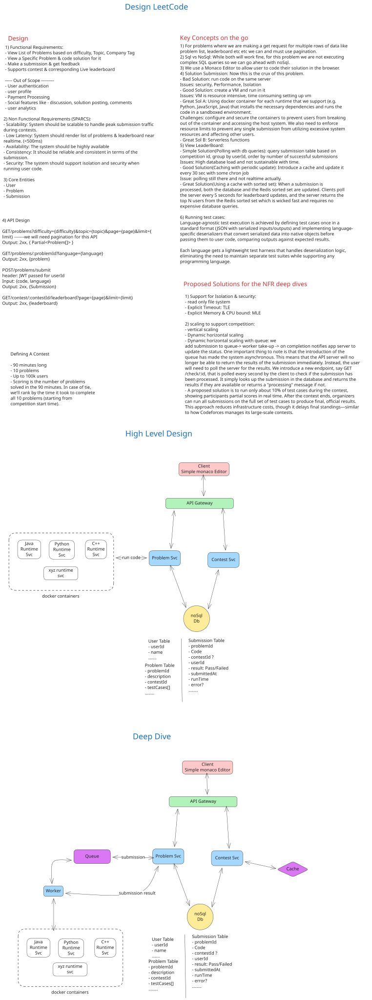

# Design LeetCode (Online Judge) - System Design

## 1. High-Level Design

### 1.1 Functional Requirements

The system must support the following core features:

- Users should be able to view a **list of coding problems** with filtering (difficulty, category) and pagination
- Users should be able to **view a specific problem** with complete details, including problem statement, code stubs, and test cases
- Users should be able to **code and submit solutions** in multiple programming languages and receive instant feedback
- Users should be able to **view a live leaderboard** for competitions showing real-time rankings

### 1.2 Non-Functional Requirements (SPARCS Framework)

| Requirement | Target | Justification |
|---|---|---|
| **Scalability** | Support 100K concurrent users during competitions | Competitions draw peak traffic; must handle 10x baseline QPS |
| **Performance (Latency)** | <5s submission result turnaround | Users expect near-instant feedback on code execution |
| **Performance (Throughput)** | 1,500 QPS during competition surge | Peak competition load drives system design |
| **Availability** | 99.9% uptime | Non-critical platform; brief downtime acceptable |
| **Reliability** | Code isolation & security | Untrusted user code execution requires sandboxing |
| **Consistency** | Eventual consistency acceptable | Leaderboard can lag 2-5 seconds; prioritize availability |
| **Security** | Isolated code execution, rate limiting | Prevent malicious code from compromising host system |

---

## 2. Capacity Estimation & Constraints

### 2.1 Assumptions

| Parameter | Value | Rationale |
|---|---|---|
| Daily Active Users (DAU) | 100,000 | Peak during competitions |
| Total Problems in Catalog | 3,000 | Current LeetCode scale |
| Peak Users Per Competition | 100,000 | Max concurrent during event |
| Competition Duration | 90 minutes | Standard format |
| Problems Per Competition | 10 | Typical competition structure |
| Avg. Submissions Per User | 4 | Includes failed attempts |
| Problem Views Per User | 3 | Browse before solving |
| Leaderboard Checks Per User | 8 | Frequent refresh during competition |

### 2.2 QPS and Throughput Calculation

**Regular Operations (Peak 16-hour window):**
```
Total Daily Reads  = 100K users × (4 views) = 400K reads/day
Total Daily Writes = 100K users × (4 submissions) = 400K writes/day

Peak Hour Read QPS  = 400K / (16 hours × 3,600 sec) ≈ 20.83 req/sec
Peak Hour Write QPS = 400K / (16 hours × 3,600 sec) ≈ 6.94 req/sec
Total Regular QPS   ≈ 27.78 req/sec
```

**Competition Surge (90-minute window, 100K users):**
```
Submission Rate = 100K users × 0.5 (participation rate) = 50K submissions in 90 min
Submission QPS  = 50,000 / (90 × 60) ≈ 833.33 req/sec

Leaderboard Checks = 100K users × 0.3 (refresh rate) = 30K checks in 90 min
Leaderboard Read QPS ≈ 500 req/sec

Total Competition QPS ≈ 1,500 req/sec
```

**Key Insight:** Competition surge drives 50x spike from baseline; system must pre-scale for this event.

### 2.3 Storage Estimation (10 Years)

| Entity | Size Per Record | Annual Records | Total 10-Year Storage |
|---|---|---|---|
| Problems | 100 KB | 3,000 (static) | 0.29 GB |
| Submissions | 50 KB | 146M (100K DAU × 4 subm. × 365 days × growth) | **69.6 TB** |
| Users | 5 KB | 400K total (4x growth) | 1.91 GB |
| Competition Metadata | 1 KB | 50/year × 10 = 500 | 0.0005 GB |
| **Total Storage** | | | **~70 TB** |

**Storage Optimization:**
- Archive submissions older than 2 years to cold storage (reduces hot storage to ~5 TB)
- Compress problem test cases (50% reduction possible)
- Use columnar storage for analytics (submission data)

### 2.4 Bandwidth Estimation

**Average Response Payloads:**
```
Problem List (paginated)    : 50 KB
Problem Detail              : 100 KB
Submission Response         : 5 KB
Leaderboard (100 entries)   : 200 KB
```

**Daily Bandwidth:**
```
Daily Average = (100K × 4 × 50KB) + (100K × 3 × 100KB) + (100K × 4 × 5KB) + (100K × 8 × 200KB)
              = 20GB + 30GB + 2GB + 160GB ≈ 188 GB/day average
Peak Hour     = 188 GB × (24/16) ≈ 282 GB/hour
Peak Bandwidth≈ 640 Mbps (over 1-hour peak)
```

**Competition Surge Bandwidth:**
```
Leaderboard Traffic = 500 QPS × 200 KB = 100 MB/sec ≈ 800 Mbps
This drives peak CDN and cache requirements.
```

---

## 3. Core Entities & Data Model

### 3.1 Entity Relationships

```
User (1) ──── (N) Submission
Problem (1) ──── (N) Submission
Competition (1) ──── (N) Submission
Competition (1) ──── (M) Problem
```

### 3.2 Database Schema

| Entity | Field | Type | Description |
|---|---|---|---|
| **Problem** | id | UUID | Primary key; immutable identifier |
| | title | VARCHAR(255) | Problem title (indexed for search) |
| | description | TEXT | Full problem statement |
| | difficulty | ENUM | EASY, MEDIUM, HARD |
| | category | VARCHAR(50) | Topic tag (e.g., "Arrays", "Trees") |
| | codeStubs | JSON | Language-specific code templates {java, python, cpp, ...} |
| | testCases | JSONB | Array of {input, output, type} (indexed for test runner) |
| | createdAt | TIMESTAMP | Problem creation time |
| | updatedAt | TIMESTAMP | Last modified timestamp |
| **User** | id | UUID | Primary key |
| | email | VARCHAR(255) | Unique email (indexed) |
| | username | VARCHAR(100) | Unique username (indexed) |
| | solvedProblems | INT | Denormalized count for display |
| | createdAt | TIMESTAMP | Account creation date |
| **Submission** | id | UUID | Primary key |
| | userId | UUID | Foreign key to User (indexed for leaderboard) |
| | problemId | UUID | Foreign key to Problem |
| | competitionId | UUID (nullable) | Foreign key to Competition (indexed) |
| | code | TEXT | User-submitted code |
| | language | VARCHAR(20) | java, python, javascript, cpp, etc. |
| | passed | BOOLEAN | Whether all test cases passed |
| | executionTime | INT | Milliseconds to complete |
| | memoryUsed | INT | Peak memory in MB |
| | testResults | JSONB | Array of {caseId, passed, expected, actual, error} |
| | submittedAt | TIMESTAMP | Submission timestamp (indexed for leaderboard ranking) |
| | status | ENUM | PENDING, COMPLETED, TIMEOUT, ERROR |
| **Competition** | id | UUID | Primary key |
| | name | VARCHAR(255) | Competition title |
| | startTime | TIMESTAMP | 90-minute event start (indexed) |
| | endTime | TIMESTAMP | Calculated as startTime + 90 min |
| | problemIds | UUID[] | Array of 10 problem IDs (denormalized for fast fetch) |
| | createdAt | TIMESTAMP | Admin creation time |
| **Leaderboard** (View/Cache) | competitionId | UUID | Foreign key |
| | userId | UUID | Foreign key |
| | problemsSolved | INT | Count of passed submissions |
| | lastSubmitTime | TIMESTAMP | Time of last successful submission (for tiebreaker) |

### 3.3 Key Indexing Strategy

**Database Indexes (SQL):**
```sql
-- Problem queries
CREATE INDEX idx_problem_difficulty ON problems(difficulty);
CREATE INDEX idx_problem_category ON problems(category);

-- Submission queries for leaderboard
CREATE INDEX idx_submission_competition_passed 
  ON submissions(competition_id, passed, submitted_at DESC);
  
-- User activity tracking
CREATE INDEX idx_submission_user_created 
  ON submissions(user_id, submitted_at DESC);
  
-- Competition timeline
CREATE INDEX idx_competition_starttime 
  ON competitions(start_time DESC);
```

**Primary Key Choice Rationale:**
- **UUID** over auto-increment: Distributed system friendly, prevents enumeration attacks, supports data migration
- **Composite for leaderboard**: (competition_id, user_id) for fast ranking lookups

---

## 4. API Design

### 4.1 RESTful Endpoints

| Method | Endpoint | Query Params | Request Body | Response | Status Codes |
|---|---|---|---|---|---|
| **GET** | `/api/v1/problems` | `page`, `limit`, `difficulty`, `category` | — | `{problems: [{id, title, difficulty, category, acceptance_rate}], totalCount}` | 200, 400 |
| **GET** | `/api/v1/problems/{id}` | — | — | `{id, title, description, difficulty, category, codeStubs: {}, testCases: []}` | 200, 404 |
| **POST** | `/api/v1/problems/{id}/submit` | — | `{code: string, language: string, competitionId?: uuid}` | `{submissionId: uuid, status: PENDING}` | 202, 400, 401 |
| **GET** | `/api/v1/submissions/{id}` | — | — | `{id, status, passed, testResults, executionTime, memoryUsed}` | 200, 404 |
| **GET** | `/api/v1/competitions/{id}/leaderboard` | `page`, `limit` | — | `{entries: [{rank, userId, username, problemsSolved, submitTime}], totalCount}` | 200, 404 |
| **GET** | `/api/v1/competitions/{id}` | — | — | `{id, name, startTime, endTime, problemIds, status}` | 200, 404 |

### 4.2 Request/Response Examples

**GET /api/v1/problems?difficulty=MEDIUM&category=Arrays&page=1&limit=20**
```json
{
  "problems": [
    {
      "id": "550e8400-e29b-41d4-a716-446655440000",
      "title": "Two Sum",
      "difficulty": "EASY",
      "category": "Arrays",
      "acceptance_rate": 0.47
    }
  ],
  "totalCount": 450,
  "page": 1,
  "pageSize": 20
}
```

**POST /api/v1/problems/550e8400-e29b-41d4-a716-446655440000/submit**
```json
Request Body:
{
  "code": "class Solution:\n    def twoSum(self, nums, target):\n        ...",
  "language": "python3",
  "competitionId": null
}

Response (202 Accepted - Async Processing):
{
  "submissionId": "660e8400-e29b-41d4-a716-446655440111",
  "status": "PENDING",
  "estimatedWaitTime": 2
}
```

**GET /api/v1/submissions/660e8400-e29b-41d4-a716-446655440111**
```json
{
  "id": "660e8400-e29b-41d4-a716-446655440111",
  "status": "COMPLETED",
  "passed": true,
  "executionTime": 45,
  "memoryUsed": 14.2,
  "testResults": [
    {
      "caseId": 1,
      "passed": true,
      "input": "[2,7,11,15]",
      "output": "[0,1]"
    }
  ]
}
```

**GET /api/v1/competitions/comp-2024-01/leaderboard?page=1&limit=100**
```json
{
  "entries": [
    {
      "rank": 1,
      "userId": "user-001",
      "username": "alice_dev",
      "problemsSolved": 10,
      "lastSubmitTime": "2024-01-15T14:32:45Z"
    },
    {
      "rank": 2,
      "userId": "user-002",
      "username": "bob_coder",
      "problemsSolved": 10,
      "lastSubmitTime": "2024-01-15T14:35:20Z"
    }
  ],
  "competitionId": "comp-2024-01",
  "totalCount": 100000,
  "page": 1
}
```

---

## 5. Data Flow

### 5.1 Write Path (Submit Solution)

```
1. Client submits code
   ↓
2. API Gateway receives POST /problems/{id}/submit
   - Validate: user authenticated, problem exists, competition active (if applicable)
   - Rate limit: max 10 submissions/min per user
   ↓
3. API Server writes to Submission table (status=PENDING)
   - Return submissionId immediately (202 Accepted) — async response
   ↓
4. Enqueue job to Message Queue (RabbitMQ/Kafka)
   - Message: {submissionId, userId, problemId, code, language, testCases}
   - Priority: HIGH for competitions, NORMAL otherwise
   ↓
5. Worker Pool dequeues and routes to Code Execution Container
   - Docker container for language runtime (Python 3.11, Java 17, Node 18, etc.)
   ↓
6. Container executes user code in sandbox
   - CPU limit: 1 core, Memory limit: 256 MB
   - Timeout: 5 seconds
   - Read-only filesystem; temp output directory only
   - Network disabled (seccomp rules)
   ↓
7. Return test results to Worker
   - Passed: count of successful cases
   - Execution time, memory used
   - Error messages (if any)
   ↓
8. Worker updates Submission record (status=COMPLETED)
   - Write to PostgreSQL: passed=true/false, executionTime, testResults
   ↓
9. If competition: publish to Redis Sorted Set (leaderboard cache)
   - Key: "leaderboard:{competitionId}"
   - Member: userId, score = problemsSolved + (tiebreaker = 1000000 - secondsElapsed)
   ↓
10. Client polls GET /submissions/{submissionId} to fetch results
    - Polling interval: 500ms (configurable)
    - Eventually returns complete results with test case breakdown
```

**Synchronous vs. Asynchronous:**
- **Synchronous (Client)**: User receives submissionId immediately; no blocking on code execution
- **Asynchronous (Backend)**: Queue-based worker pool processes code in isolation; scales independently
- **Result Delivery**: Client polling (simple) or WebSocket (real-time optional enhancement)

### 5.2 Read Path (View Leaderboard)

```
1. Client requests GET /competitions/{id}/leaderboard?page=1
   ↓
2. API Gateway routes to API Server
   ↓
3. Check Redis Leaderboard Cache (sorted set)
   - Cache key: "leaderboard:{competitionId}"
   - TTL: 5 seconds (near real-time)
   - ZREVRANGE leaderboard:comp-001 0 99 WITHSCORES
   ↓
4. If cache miss (or stale):
   - Query Submission table:
     SELECT user_id, COUNT(*) as problems_solved, MIN(submitted_at) as first_solve_time
     FROM submissions
     WHERE competition_id = :comp_id AND passed = true
     GROUP BY user_id
     ORDER BY problems_solved DESC, first_solve_time ASC
     LIMIT 100 OFFSET (page-1)*100
   ↓
5. Return leaderboard with rankings
   ↓
6. For high-frequency checks: Client WebSocket subscription optional
   - Publish updates via Redis Pub/Sub as submissions complete
   - Real-time rank updates (not required for MVP)
```

### 5.3 Request Lifecycle Diagram

```
┌─────────────┐
│   Client    │
│  (Browser)  │
└──────┬──────┘
       │
       │ 1) POST /submit (code, language)
       ↓
┌─────────────────────┐
│   Load Balancer     │
│  (Round Robin)      │
└──────┬──────────────┘
       │
       │ 2) Route to healthy API Server
       ↓
┌─────────────────────┐
│   API Server        │
│  (Validate & Auth)  │
└──────┬──────────────┘
       │
       ├─ 3a) Write to DB (Submission: PENDING)
       │      ↓ PostgreSQL
       │
       ├─ 3b) Enqueue job (Message Queue)
       │      ↓ RabbitMQ/SQS
       │
       └─→ 4) Return 202 Accepted (submissionId)
              ↓ HTTP Response to Client
              
[Async Processing in Background]
       ↓
┌──────────────────────┐
│   Worker Pool        │
│  (Dequeue & Route)   │
└──────┬───────────────┘
       │
       │ 5) Pass job to Container Pool
       ↓
┌──────────────────────┐
│  Docker Containers   │
│  (Isolated Sandbox)  │
│  - Python Runtime    │
│  - Java Runtime      │
│  - Node Runtime      │
└──────┬───────────────┘
       │
       │ 6) Execute user code, run test cases
       ↓
       │ 7) Return results (passed/failed, time, errors)
       │
┌──────▼───────────────┐
│   Worker Process     │
│  (Update Results)    │
└──────┬───────────────┘
       │
       ├─ 8a) Update DB (Submission: COMPLETED)
       │      ↓ PostgreSQL
       │
       ├─ 8b) Update Cache (Redis Sorted Set)
       │      ↓ Leaderboard {competitionId}
       │
       └─ 8c) Publish Update (optional)
              ↓ Redis Pub/Sub (for WebSocket clients)
              
[Client Retrieval]
       ↓
┌──────────────────────┐
│   API Server         │
│  GET /submissions/id │
└──────┬───────────────┘
       │
       ├─ 9) Fetch from DB or Cache
       │
       └─→ 10) Return 200 OK (complete results)
              ↓ HTTP Response to Client
```

---

## 6. High-Level Architecture

### 6.1 System Diagram


```
  Legend:
  - Load Balancer: Distributes traffic using Round Robin or Least Connection
  - API Servers: Stateless, scale horizontally; handle HTTP requests
  - Redis Cache: In-memory store for leaderboards, sessions, rate limiting
  - Databases: Persistent storage (Problems, Submissions, User data)
  - Message Queue: Decouples submission processing from client request
  - Workers: Consumer pool; pulls jobs from queue, invokes containers
  - Docker Containers: Isolated runtime environments per language
```

### 6.2 Component Breakdown

| Component | Technology | Role | Justification |
|---|---|---|---|
| **Load Balancer** | HAProxy / AWS ALB | Distribute traffic across API servers | Enables horizontal scaling; health checks |
| **API Gateway** | Node.js / Go / Python FastAPI | HTTP request handling, auth, rate limiting | Lightweight, stateless; easy to scale |
| **Cache Layer** | Redis Cluster | Session storage, leaderboard rankings, rate limit counters | Fast O(1) lookups; sorted sets for leaderboard |
| **Problem DB** | PostgreSQL / DynamoDB | Store problem statements, test cases | Indexed queries on difficulty, category |
| **Submission DB** | PostgreSQL | Store submissions, test results | Optimized for write-heavy competition surge |
| **Message Queue** | RabbitMQ / Apache Kafka / AWS SQS | Decouple client requests from code execution | Handles spike buffering; worker pool scaling |
| **Worker Pool** | Python / Node.js Consumer | Dequeue jobs, invoke containers | Horizontally scalable; isolated from API tier |
| **Container Runtime** | Docker (Python, Java, Node, C++, Go) | Execute user code in sandboxed environment | Per-language isolation; resource limits |
| **Monitoring** | Prometheus + Grafana | Track QPS, latency, error rates | Real-time alerts for competition surge |

---

## 7. Deep Dives

### 7.1 Code Execution Security & Isolation

**Challenge:** User-submitted code is untrusted and could be malicious (delete files, steal credentials, launch DDoS, mine crypto, fork bombs).

**Solution: Layered Isolation Strategy**

#### 1. **Container Virtualization (Primary Defense)**
```dockerfile
# Dockerfile example: Python 3.11 sandbox
FROM python:3.11-slim

# Minimal dependencies only
RUN pip install --no-cache-dir numpy scipy

# Create unprivileged user
RUN useradd -m sandbox_user
USER sandbox_user

# Health check
HEALTHCHECK --interval=10s --timeout=3s CMD python -c "print('alive')"

ENTRYPOINT ["python", "-u"]
```

**Why Docker over VMs:**
- **VMs:** 1-2s startup, 2+ GB RAM per instance, expensive
- **Containers:** 100-200ms startup, 50 MB RAM per instance, 20x more density
- **Trade-off:** Slightly less isolated (share kernel) but acceptable with seccomp + cgroups

#### 2. **Resource Limits (cgroups)**
```bash
# Container CPU/Memory limits
docker run \
  --cpus=1.0 \
  --memory=256m \
  --memory-swap=256m \
  --read-only \
  --tmpfs /tmp:size=50m \
  python:3.11 script.py
```

| Limit | Value | Reason |
|---|---|---|
| CPU Cores | 1.0 | Prevent CPU DoS |
| Memory | 256 MB | Prevent OOM; catch memory leaks |
| Swap | 0 | No disk thrashing |
| File I/O | Read-only (except /tmp) | Prevent filesystem attacks |
| Network | Disabled (iptables REJECT) | Prevent exfiltration |

#### 3. **Timeout (Hard Limit)**
```python
# Execution wrapper
import signal
import subprocess

def execute_user_code(code: str, timeout: int = 5):
    try:
        result = subprocess.run(
            ["python", "-c", code],
            timeout=timeout,  # 5 second hard limit
            capture_output=True,
            cwd="/tmp/sandbox"
        )
    except subprocess.TimeoutExpired:
        return {"error": "Time Limit Exceeded", "runtime": 5000}
```

#### 4. **System Call Filtering (seccomp)**
```bash
# Block dangerous system calls
docker run \
  --security-opt seccomp=custom-seccomp.json \
  python:3.11 script.py

# custom-seccomp.json blocks: mmap, mprotect, fork, socket, open (except whitelisted)
```

#### 5. **Read-Only Filesystem**
```python
# Only /tmp is writable
# User code can write temp files but cannot modify system
# Automatic cleanup on container exit
```

**Complete Execution Flow:**
```
1. Validate code (syntax, size limit 10KB)
2. Create container instance from pre-built image
3. Copy user code + test cases into container
4. Enforce resource limits (CPU, memory, timeout, network)
5. Execute test cases in sequence
6. Capture output and return results
7. Kill container (cleanup)
8. Return to API server via message queue
```

---

### 7.2 Leaderboard Optimization (Real-Time Ranking)

**Challenge:** Query 100,000 submissions to rank users is O(n log n); at 500 QPS during competition, this causes latency spikes and DB overload.

**Solution: Redis Sorted Set with Push-Based Updates**

#### Problem with Query-Based Approach
```sql
-- Slow: 100K submissions; O(n log n) = ~1.6M operations
SELECT user_id, COUNT(*) as problems_solved, MIN(submitted_at) as first_solve
FROM submissions
WHERE competition_id = 'comp-2024-01' AND passed = true
GROUP BY user_id
ORDER BY problems_solved DESC, first_solve_time ASC
LIMIT 100;
-- Execution time: ~500ms during surge (UNACCEPTABLE)
```

#### Redis Sorted Set Strategy
```python
# When submission PASSES, update leaderboard incrementally
def update_leaderboard(competition_id, user_id, submission_timestamp):
    redis = get_redis_connection()
    
    # Sorted Set Key
    leaderboard_key = f"leaderboard:{competition_id}"
    
    # Score = (problems_solved × 1000000) + (tiebreaker)
    # Tiebreaker = (90*60 - seconds_elapsed) to rank early finishers higher
    problems_solved = redis.hget(f"user_progress:{competition_id}:{user_id}", "solved")
    problems_solved = int(problems_solved or 0) + 1
    
    # Time-based tiebreaker (higher = earlier)
    tiebreaker = 5400 - (submission_timestamp - competition_start_time).total_seconds()
    score = problems_solved * 1000000 + tiebreaker
    
    # O(log N) update
    redis.zadd(leaderboard_key, {user_id: score})
    
    # Update user progress hash
    redis.hset(f"user_progress:{competition_id}:{user_id}", "solved", problems_solved)
    
    # Set expiration (90 min + 10 min buffer)
    redis.expire(leaderboard_key, 6000)
    
    return score

# Fetch leaderboard: O(log N + K) where K is page size (100)
def get_leaderboard(competition_id, page=1, limit=100):
    redis = get_redis_connection()
    leaderboard_key = f"leaderboard:{competition_id}"
    
    # Descending rank (highest score first)
    offset = (page - 1) * limit
    entries = redis.zrevrange(
        leaderboard_key, 
        offset, 
        offset + limit - 1, 
        withscores=True
    )  # O(log N + K) ≈ 0.5ms
    
    # Format response
    leaderboard = []
    for rank, (user_id, score) in enumerate(entries, start=offset+1):
        leaderboard.append({
            "rank": rank,
            "userId": user_id,
            "problemsSolved": score // 1000000,
            "lastSubmitTime": competition_start_time + (5400 - (score % 1000000))
        })
    
    return leaderboard
```

**Performance Comparison:**

| Operation | Query-Based | Redis Sorted Set |
|---|---|---|
| Update after submission | O(n log n) = 1.6M ops | O(log n) = 16 ops |
| Fetch leaderboard page 1 | 500ms | 0.5ms |
| Fetch leaderboard page 1000 | 500ms | 0.5ms |
| Peak surge (500 QPS) | Timeouts | Consistent <1ms |

**Cache Invalidation & TTL:**
```
- TTL: 5 seconds (trade-off: slight staleness for performance)
- Events trigger immediate updates:
  * Submission passes → update Redis immediately
  * Competition ends → delete sorted set
  * User profile updated → invalidate cache
```

---

### 7.3 Scaling to 100K Concurrent Users (Competition Surge)

**Challenge:** 27.78 QPS baseline → 1,500 QPS competition spike = 50x surge; must buffer & scale dynamically.

#### Scaling Strategy: Queue-Based Decoupling

```
Without Queue (Blocking):
Client → API → Code Executor → Return
Problem: If executor overloaded, API blocks; connections pile up; cascading failure

With Queue (Async):
Client → API (quick return) → Queue → Worker Pool → Code Executor
Benefit: API unblocked; workers scale independently
```

**Architecture Scaling Layers:**

```
Layer 1: Load Balancing (API Tier)
┌────────────────────────────────────────┐
│ DNS (Route53) → Application Load       │
│ Balancer (ALB) → Least Connection      │
│                                        │
│ Target Groups:                         │
│ - API Server 1 (Healthy)              │
│ - API Server 2 (Healthy)              │
│ - API Server 3 (Healthy)              │
│ [Auto-scale to 50 servers during comp]│
└────────────────────────────────────────┘

Layer 2: Request Buffering (Message Queue)
┌────────────────────────────────────────┐
│ RabbitMQ Cluster (3 nodes)             │
│ Queue: submission.jobs                 │
│ Queue: leaderboard.updates             │
│ Capacity: 10M messages (auto-scale disk)│
│                                        │
│ Partitioned by language:               │
│ - python.jobs (weight: 40%)            │
│ - java.jobs (weight: 35%)              │
│ - javascript.jobs (weight: 15%)        │
│ - cpp.jobs (weight: 10%)               │
└────────────────────────────────────────┘

Layer 3: Worker Pool (Code Execution)
┌────────────────────────────────────────┐
│ Worker Nodes (auto-scaled)             │
│ Each node: 4 CPU cores                 │
│ Memory: 8 GB                           │
│ Containers per node: 16 concurrent     │
│                                        │
│ Target: 1,500 QPS / 8 sec = ~200      │
│         containers running concurrently│
│                                        │
│ Required workers: 200 / 16 = 13 nodes  │
│ With 2x headroom: 26 worker nodes      │
│ (Kubernetes auto-scales 5 → 50 nodes)  │
└────────────────────────────────────────┘

Layer 4: Cache Layer (Redis)
┌────────────────────────────────────────┐
│ Redis Cluster (6 nodes, 3 primary)     │
│ Replication: 2x (master + replica)     │
│ Capacity: 100 GB heap                  │
│                                        │
│ Sharded by competitionId:              │
│ - leaderboard:{compId} → Sorted Set    │
│ - user_progress:{compId} → Hash        │
│ - rate_limit:{userId} → Counter        │
│                                        │
│ Pub/Sub channels: 100K subscriptions   │
│ (for real-time leaderboard pushes)     │
└────────────────────────────────────────┘
```

**Auto-Scaling Triggers:**

```yaml
# Kubernetes HPA (Horizontal Pod Autoscaler)
apiVersion: autoscaling/v2
kind: HorizontalPodAutoscaler
metadata:
  name: api-server-hpa
spec:
  scaleTargetRef:
    apiVersion: apps/v1
    kind: Deployment
    name: api-server
  minReplicas: 5
  maxReplicas: 50
  metrics:
  - type: Resource
    resource:
      name: cpu
      target:
        type: Utilization
        averageUtilization: 70  # Scale up at 70% CPU
  - type: Resource
    resource:
      name: memory
      target:
        type: Utilization
        averageUtilization: 80  # Scale up at 80% memory
  behavior:
    scaleUp:
      stabilizationWindowSeconds: 0  # Immediate scale-up
      policies:
      - type: Percent
        value: 50  # Add 50% more pods
        periodSeconds: 15
    scaleDown:
      stabilizationWindowSeconds: 300  # Wait 5 min before scale-down
      policies:
      - type: Percent
        value: 10
        periodSeconds: 60

---
# Worker Auto-Scaling
apiVersion: autoscaling/v2
kind: HorizontalPodAutoscaler
metadata:
  name: worker-hpa
spec:
  scaleTargetRef:
    apiVersion: apps/v1
    kind: Deployment
    name: code-executor-worker
  minReplicas: 5
  maxReplicas: 100  # Much more aggressive
  metrics:
  - type: Resource
    resource:
      name: cpu
      target:
        type: Utilization
        averageUtilization: 60  # Higher threshold since code execution is CPU-bound
  custom:
  - type: Pods
    pods:
      metric:
        name: rabbitmq_queue_length
      target:
        type: AverageValue
        averageValue: "30"  # If queue > 30 items per worker, scale up
```

**Queue Management Strategy:**

```python
# Submit endpoint with queue depth awareness
@app.post("/problems/{problem_id}/submit")
async def submit_solution(problem_id: str, payload: SubmissionRequest):
    # 1. Check queue depth
    queue_length = rabbitmq.get_queue_length("submission.jobs")
    
    if queue_length > 10000:  # Threshold
        # 2a. Reject with 503 and advisory wait time
        retry_after = min(queue_length // 1000, 60)  # Cap at 60 sec
        return {
            "error": "System overloaded",
            "retry_after_seconds": retry_after,
            "queue_position": queue_length
        }, 503
    
    # 2b. Enqueue normally
    submission = Submission(
        problem_id=problem_id,
        user_id=request.user_id,
        code=payload.code,
        language=payload.language,
        status="PENDING",
        submitted_at=datetime.utcnow()
    )
    db.session.add(submission)
    db.session.commit()
    
    # Priority queue: competitions get HIGH priority
    priority = "HIGH" if payload.competition_id else "NORMAL"
    rabbitmq.publish(
        queue="submission.jobs",
        message={
            "submission_id": str(submission.id),
            "problem_id": problem_id,
            "code": payload.code,
            "language": payload.language,
            "test_cases": fetch_test_cases(problem_id)
        },
        priority=priority
    )
    
    return {
        "submission_id": str(submission.id),
        "status": "PENDING",
        "estimated_wait_ms": (queue_length / 500) * 1000  # Assume 500 QPS capacity
    }, 202
```

---

### 7.4 Running Test Cases (Execution Engine)

**Challenge:** Different problem types require different input/output parsing (arrays, trees, linked lists, strings, custom objects).

**Solution: Generic Test Runner**

```python
# Test Case Executor
class TestCaseRunner:
    def __init__(self, language: str, code: str, timeout: int = 5):
        self.language = language
        self.code = code
        self.timeout = timeout
        self.container = None
        
    def run_test_cases(self, test_cases: List[Dict]) -> List[Dict]:
        """
        test_cases = [
            {
                "id": 1,
                "type": "array",  # Type of input/output parsing
                "input": "[1,2,3,4,5]",
                "output": "[2,3,4,5,1]"
            },
            ...
        ]
        """
        results = []
        
        for idx, test_case in enumerate(test_cases):
            try:
                result = self._execute_single_test(test_case)
                results.append({
                    "case_id": idx + 1,
                    "passed": result["passed"],
                    "expected": test_case["output"],
                    "actual": result["actual"],
                    "error": result.get("error"),
                    "execution_time_ms": result["time_ms"],
                    "memory_mb": result["memory_mb"]
                })
            except Exception as e:
                results.append({
                    "case_id": idx + 1,
                    "passed": False,
                    "error": str(e),
                    "expected": test_case["output"],
                    "actual": None
                })
        
        return results
    
    def _execute_single_test(self, test_case: Dict) -> Dict:
        """Execute one test case and compare output"""
        
        # 1. Parse input based on type
        input_data = self._parse_input(test_case["input"], test_case.get("type", "array"))
        
        # 2. Prepare test code (language-specific wrapper)
        wrapper_code = self._build_wrapper(self.code, input_data)
        
        # 3. Run in Docker container
        start_time = time.time()
        try:
            result = subprocess.run(
                ["docker", "run", "--rm", 
                 f"--cpus=1", "--memory=256m",
                 f"leetcode-{self.language}:latest",
                 wrapper_code],
                timeout=self.timeout,
                capture_output=True,
                text=True
            )
            elapsed = time.time() - start_time
            
            # 4. Parse output
            user_output = result.stdout.strip()
            expected_output = test_case["output"].strip()
            
            # 5. Compare (handle type conversions)
            passed = self._compare_outputs(
                user_output, expected_output, 
                test_case.get("type", "array")
            )
            
            return {
                "passed": passed,
                "actual": user_output,
                "time_ms": int(elapsed * 1000),
                "memory_mb": 50  # Placeholder; real impl tracks cgroup memory
            }
            
        except subprocess.TimeoutExpired:
            return {
                "passed": False,
                "error": "Time Limit Exceeded",
                "time_ms": int(self.timeout * 1000),
                "actual": None
            }
    
    def _parse_input(self, input_str: str, input_type: str):
        """Convert string representation to actual data structure"""
        if input_type == "array":
            # "[1,2,3,4,5]" → [1, 2, 3, 4, 5]
            return json.loads(input_str)
        elif input_type == "tree":
            # "[3,9,20,null,null,15,7]" → TreeNode object
            return self._deserialize_tree(input_str)
        elif input_type == "linked_list":
            return self._deserialize_linked_list(input_str)
        else:
            return input_str
    
    def _build_wrapper(self, user_code: str, input_data) -> str:
        """Wrap user code with test harness (language-specific)"""
        if self.language == "python3":
            return f"""
import json
import sys
sys.path.insert(0, '/submission')

{user_code}

# Call user's solution
solution = Solution()
input_data = {json.dumps(input_data)}
result = solution.solve({input_data})

# Output result (JSON for consistency)
print(json.dumps(result, default=str))
"""
        elif self.language == "javascript":
            return f"""
// {user_code}
const Solution = class {{ ... }};
const solution = new Solution();
const input = {json.dumps(input_data)};
const result = solution.solve(...input);
console.log(JSON.stringify(result));
"""
        # Add more languages...
    
    def _compare_outputs(self, actual: str, expected: str, output_type: str) -> bool:
        """Compare outputs (handles different serializations)"""
        try:
            actual_parsed = json.loads(actual)
            expected_parsed = json.loads(expected)
            
            # Deep equality check (handles NaN, null, etc.)
            return actual_parsed == expected_parsed
        except json.JSONDecodeError:
            # Fall back to string comparison
            return actual.strip() == expected.strip()
```

**Handling Complex Data Types:**

```python
# Example: Tree Node Deserialization (LeetCode format)
# Input: "[3,9,20,null,null,15,7]" (level-order with nulls)
# Output: TreeNode with proper structure

def deserialize_tree(level_order_str: str) -> TreeNode:
    """Convert level-order array to TreeNode structure"""
    values = json.loads(level_order_str)
    if not values or values[0] is None:
        return None
    
    root = TreeNode(values[0])
    queue = [root]
    i = 1
    
    while queue and i < len(values):
        node = queue.pop(0)
        
        # Left child
        if i < len(values) and values[i] is not None:
            node.left = TreeNode(values[i])
            queue.append(node.left)
        i += 1
        
        # Right child
        if i < len(values) and values[i] is not None:
            node.right = TreeNode(values[i])
            queue.append(node.right)
        i += 1
    
    return root
```

---

### 7.5 Failure Modes & Resilience

#### 7.5.1 Database Failover (Master Down)
```
Scenario: Primary PostgreSQL crashes

1. Immediate: Client request fails
   - Retry logic in API (exponential backoff)
   - Return 503 "Service Unavailable"

2. Detection (5-10 seconds):
   - Health check fails (TCP timeout)
   - HAProxy/RDS detects master down
   - Automated failover initiated

3. Failover (30-60 seconds):
   - Standby replica promoted to master
   - DNS updated (CNAME)
   - Replication lag: ~5 seconds of data loss
   - Submissions in flight: stored in queue, retried after failover

4. Recovery:
   - Old master brought back as standby
   - Replication resynchronized
   - Normal operation resumed
```

**Mitigation:**
```yaml
# RDS Multi-AZ setup (AWS)
- Master (us-east-1a) + Standby (us-east-1b)
- Automatic failover: < 60 seconds
- RPO (Recovery Point Objective): ~5 seconds
- RTO (Recovery Time Objective): ~60 seconds

# Connection pooling (PgBouncer)
- Max connections: 1000 (prevent exhaustion during failover)
- Statement timeout: 30 seconds (catch hung queries)
- Retry policy: 3 attempts, exponential backoff
```

#### 7.5.2 Cache Stampede (Redis Down)
```
Scenario: Redis cluster loses majority during competition

Problem: All clients miss cache, query DB simultaneously for leaderboard
         → Thundering herd → DB overload

Solution: Circuit breaker + graceful degradation

if redis.is_healthy():
    # Use cache (fast path)
    leaderboard = redis.zrevrange(key, 0, 99)
else:
    # Cache miss; but don't query hot data directly
    # Instead, serve stale leaderboard from previous snapshot
    
    if stale_cache_exists:
        leaderboard = load_stale_snapshot()
        add_warning_header("Leaderboard may be outdated")
    else:
        # Last resort: lightweight query (fetch top 1000 only, paginate)
        leaderboard = db.query("""
            SELECT user_id, problems_solved, last_submit_time
            FROM leaderboard_snapshot
            LIMIT 100
        """, timeout=1.0)  # Hard timeout
```

#### 7.5.3 Worker Pool Overwhelm (Backpressure)
```
Scenario: Submissions queue grows > 50K; workers saturated

Symptoms:
- Queue length increases
- Client polling takes > 10 seconds for result
- Timeouts stack up

Recovery:
1. Kubernetes detects high CPU/memory
2. Auto-scale workers: 5 → 50 nodes (5 min)
3. New workers catch up with queue
4. Queue drains

Circuit breaker (prevent infinite retry):
- If queue length > threshold: reject new submissions (503)
- Client backs off; retries after 30 seconds
- Prevents cascading failure in upstream (mobile app crashes)
```

#### 7.5.4 Code Execution Bomb (Malicious Input)
```
Scenario: User submits code with fork bomb or memory explosion

Protections (in order):
1. Seccomp: block fork() syscalls
2. cgroups: kill process at 256 MB memory
3. Timeout: kill after 5 seconds
4. Read-only FS: no disk thrashing

Result: Container exits cleanly, no host system impact
API logs: "Memory limit exceeded; container killed"
```

---

### 7.6 Monitoring, Logging & Alerting

**Key Metrics:**

```
[API Server Tier]
- QPS by endpoint (/problems, /submit, /leaderboard)
- Latency p50, p99, p999 (target: <200ms avg)
- Error rate (4xx, 5xx)
- Auth failures, rate limit hits

[Code Execution Tier]
- Worker CPU/memory utilization
- Queue length (trigger alert if > 1000)
- Execution timeout rate (target: < 0.1%)
- Container startup time (target: < 500ms)

[Cache Tier]
- Redis hit ratio (target: > 95% for leaderboard)
- Eviction rate (should be near 0 during normal ops)
- Replication lag (target: < 100ms)

[Database Tier]
- Write latency (target: < 50ms)
- Replication lag (target: < 1 second)
- Slow query count (> 1 second)
- Connection pool utilization (alert at > 80%)

[Competition Surge]
- DAU during competition
- Peak QPS reached
- Time to scale workers
- Success rate (% submissions completed)
```

**Logging Strategy:**

```python
# Structured logging (JSON)
import logging
import json

logger = logging.getLogger("leetcode")

# When submission completes
logger.info(json.dumps({
    "event": "submission_completed",
    "submission_id": "550e8400-e29b-41d4-a716-446655440000",
    "user_id": "user-123",
    "problem_id": "prob-456",
    "language": "python3",
    "passed": True,
    "execution_time_ms": 45,
    "memory_mb": 14.2,
    "queue_wait_ms": 250,
    "total_latency_ms": 295,
    "timestamp": "2024-01-15T14:32:45.123Z"
}))

# Aggregated metrics (pushed to monitoring)
# prometheus_client.Histogram("submission_latency_ms").observe(295)
```

**Alert Rules:**

```yaml
# Prometheus Alert Rules
groups:
- name: leetcode_slo
  rules:
  - alert: HighErrorRate
    expr: rate(http_requests_total{status=~"5.."}[5m]) > 0.01
    for: 1m
    annotations:
      summary: "Error rate > 1% for 1 minute"
      
  - alert: HighQueueLength
    expr: rabbitmq_queue_length > 5000
    for: 1m
    annotations:
      summary: "Submission queue backed up; scale workers"
      
  - alert: CacheMissStorm
    expr: redis_cache_hits_total / (redis_cache_hits_total + redis_cache_misses_total) < 0.90
    for: 5m
    annotations:
      summary: "Cache hit ratio dropped below 90%"
      
  - alert: WorkerMemoryHigh
    expr: container_memory_usage_bytes / container_spec_memory_limit_bytes > 0.85
    for: 2m
    annotations:
      summary: "Worker memory > 85%; may OOM soon"
```

---

## 8. References

### Links & Resources

**Video Walkthrough:**
- [System Design Interview: Design LeetCode by Ex-Meta Staff Engineer](https://www.youtube.com/watch?v=1xHADtekTNg)

**Detailed Written Guide:**
- [Hello Interview - Design LeetCode Deep Dive](https://www.hellointerview.com/learn/system-design/problem-breakdowns/leetcode)

**Excalidraw Diagram:**
- [Interactive Architecture Diagram](https://link.excalidraw.com/l/56zGeHiLyKZ/1KA80YMM8pa)

---

## 9. Summary

**Design Philosophy:**
This system prioritizes **availability and responsiveness** over strong consistency. The use of **asynchronous job processing** decouples code execution from user requests, enabling horizontal scaling for sudden competition surges. **Redis Sorted Sets** provide O(log N) leaderboard updates while **Docker containers** ensure **security and isolation** for untrusted user code.

**Key Trade-Offs:**

| Trade-Off | Choice | Reason |
|---|---|---|
| Strong Consistency vs. Eventual Consistency | Eventual | Leaderboard can lag 2-5s; better UX |
| Monolith vs. Microservices | Monolith → Async Queue | Keep API lightweight; scale workers separately |
| SQL vs. NoSQL | SQL (PostgreSQL) | Relational data; indexing on difficulty/category |
| Container vs. VM vs. Serverless | Container (Docker) | Balance of security, cost, startup time |
| Synchronous vs. Asynchronous Submission | Async (202 Accepted) | Prevents blocking on slow code execution |
| Query Leaderboard vs. Cache | Cache (Redis) | 1000x faster; handles 500 QPS peak |

**Scalability Roadmap:**

1. **Current (100K DAU):** 5 API servers, 5 workers, single PostgreSQL
2. **Growth (500K DAU):** 15 API servers, 30 workers, PostgreSQL + read replicas
3. **Scale (1M+ DAU):** Microservices (Problem Service, Submission Service, Leaderboard Service), sharded PostgreSQL, Elasticsearch for problem search

---

**Generated Date:** December 2024  
**System Design Framework:** Hello Interview Methodology  
**Audience:** IC4 (Mid-Level) to IC5 (Senior) Software Engineers