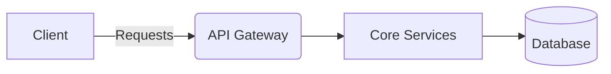
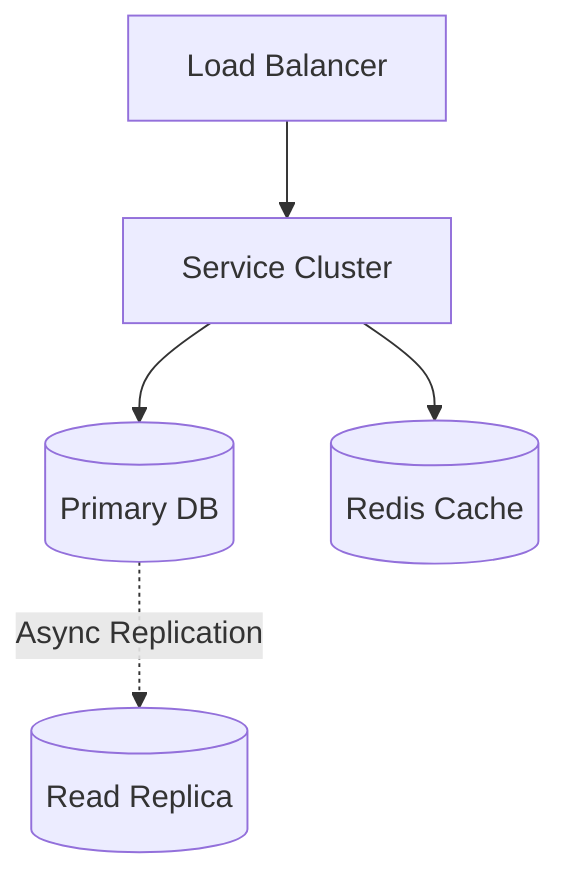

# URL Shortener System Design

> **System Overview Diagram**

| Step | Focus Area | Time Allocation | Key Activities |
|------|-----------|----------------|----------------|
| 1 | Requirements | 5-10 min | Clarify functional and non-functional requirements, identify core features |
| 2 | Core Entities | 3-5 min | Identify main entities and their relationships |
| 3 | API Design | ~5 min | Define key endpoints, methods, and data structures (keep brief) |
| 4 | Data Flow | 5-10 min | Map request/response flows, identify data movement patterns |
| 5 | High-Level Design | 15-20 min | Draw system architecture, components, and their interactions |
| 6 | Deep Dives | 15-20 min | Dive into critical components, address bottlenecks and optimizations |
| 7 | Address Key Issues | 5 min | Handle failures, security, monitoring, and edge cases |

---

## Table of Contents
- [1. Requirements](#1-requirements-5-10-min)
- [2. Core Entities](#2-core-entities-3-5-min)
- [3. API Design](#3-api-design-5-min)
- [4. Data Flow](#4-data-flow-5-10-min)
- [5. High-Level Design](#5-high-level-design-15-20-min)
- [6. Deep Dives](#6-deep-dives-15-20-min)
- [7. Address Key Issues](#7-address-key-issues-5-min)
- [References & Original Diagrams](#references--original-diagrams)

---
## 1. 📋 Requirements (5-10 min)

### Functional Requirements
- [ ] Users should be able to input a long URL and get a short URL back.
- [ ] Users should be redirected to the original long URL when they click the short URL.
- [ ] Users should optionally be able to specify a custom short alias.
- [ ] Links should optionally have an expiration date.

### Back-of-the-Envelope (BOE) Calculations
**Step 1: Assumptions**
- Users: 100M MAU
- Activity: 1 URL generated/user/day, 10 URLs clicked/user/day
- Read/write ratio: 10:1 (read-heavy)
- Payload: Average request size ~500 bytes

**Step 2: Load (QPS)**
- Write QPS: (100M * 1) / 100,000 ≈ 1,000 QPS
- Peak write QPS: 1,000 * 2 = 2,000 QPS
- Read QPS: 1,000 * 10 = 10,000 QPS

**Step 3: Storage (5-year plan)**
- Daily Storage: 1,000 QPS * 100,000s * 500 B ≈ 50 GB/day
- 5-year storage: 50 GB * 365 * 5 ≈ 91 TB

**Step 4: Bandwidth**
- Ingress: 1,000 QPS * 500 B ≈ 500 KB/s
- Egress: 10,000 QPS * 500 B ≈ 5 MB/s

**Step 5: Cache**
- Daily reads: 10,000 QPS * 100,000s * 500 B ≈ 500 GB/day
- Cache capacity (80/20 rule): 500 GB * 0.20 ≈ 100 GB of RAM

### Non-Functional Requirements
- [ ] **High Availability**: The redirection service must be highly available (no broken links).
- [ ] **Low Latency**: Redirection should happen with minimal latency.
- [ ] **Scalability**: System needs to handle a massive number of read requests compared to write requests (e.g., 100:1 read-to-write ratio).
- [ ] **Unpredictability**: Short URLs should not be easily guessable.

---

## 2. 🗄️ Core Entities (3-5 min)

- **URLMapping**: `shortUrlId` (PK), `longUrl`, `userId` (optional), `createdAt`, `expiresAt`
- **User** (optional): `userId`, `email`

---

## 3. 🌐 API Design (~5 min)

### `POST /api/v1/data/shorten`
- **Purpose**: Create a short URL from a long URL.
- **Request Body**: `{ "longUrl": "https://www.example.com/very/long/path", "customAlias": "myalias" }`
- **Response**: `201 Created` with `{ "shortUrl": "http://tiny.url/myalias" }`

### `GET /{shortUrlId}`
- **Purpose**: Redirect to the original URL.
- **Response**: `301 Moved Permanently` (cacheable) or `302 Found` (if analytics tracking is needed) with `Location` header pointing to `longUrl`.

---

## 4. 🔄 Data Flow (5-10 min)

1. **Write Flow**: Client requests short URL -> Gateway -> Shortener Service generates unique ID -> Stores mapping in DB -> Returns short URL.
2. **Read Flow**: Client clicks short URL -> Gateway -> Redirect Service checks Cache -> If miss, queries DB -> Updates analytics async -> Returns 301/302 Redirect.

---

## 5. 🏗️ High-Level Design (15-20 min)

### High-Level Architecture

- **API Gateway**: Rate limiting, routing.
- **Shortener Service**: Coordinates generating the unique short alias and saving it.
- **Redirect Service**: Extremely lightweight service that checks Cache/DB and returns the `Location` header.
- **Database (NoSQL/SQL)**: Key-value store (e.g., DynamoDB, Cassandra) is ideal since relationships are minimal and reads are heavy.
- **Cache (Redis/Memcached)**: Caches the `shortUrlId` to `longUrl` mapping to guarantee low latency.
- **Key Generation Service (KGS)**: Pre-generates unique IDs to avoid collisions and DB bottlenecks.

---

## 6. 🔬 Deep Dives (15-20 min)

### Unique Short ID Generation
- **Challenge**: Generating a unique 7-character string (Base62 encoding of an integer gives ~3.5 trillion URLs) concurrently across distributed servers without collisions.
- **Solution**:
  - *Option 1 (Hash)*: Hash the long URL + timestamp using MD5, take the first 7 chars. *Problem*: Collisions are possible.
  - *Option 2 (Central Counter)*: Use a DB auto-increment ID. *Problem*: Single point of failure/bottleneck.
  - *Option 3 (KGS - Key Generation Service)*: A standalone service that pre-generates unique random strings and loads them into a fast concurrent queue or gives a batch of IDs to app servers. This ensures 0 collisions and extremely fast writes.

### 301 vs 302 Redirect
- **301 (Permanent)**: Browser caches the redirect. Reduces load on our servers, but we lose click analytics.
- **302 (Temporary)**: Browser doesn't cache. We get every click, allowing us to build detailed analytics at the cost of higher server load.

---

## 7. 🚧 Address Key Issues (5 min)

### Fault Tolerance & Resiliency
- Multi-AZ deployment. The KGS needs replicas. If KGS goes down, servers can rely on their local cached batch of keys for a short time.

### Security
- Rate limit the `/shorten` endpoint heavily to prevent abuse/spam.

### Monitoring & Observability
- Track Cache Hit Ratio. If it falls, latency increases, meaning we need to scale the cache.

## References & Original Diagrams
- [UrlShortner.excalidraw](./UrlShortner.excalidraw)
