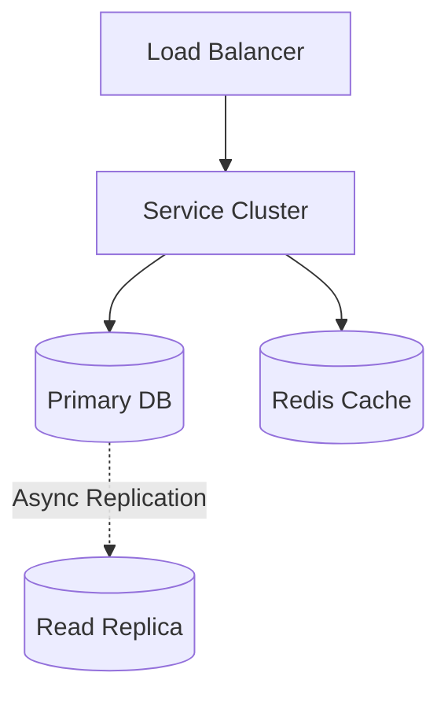
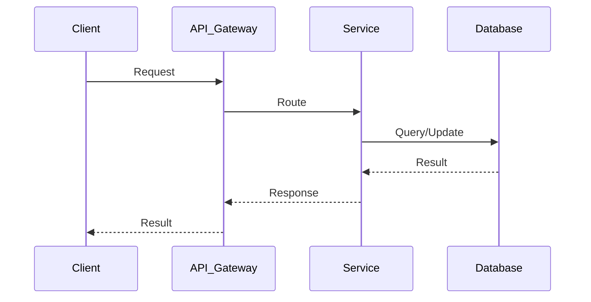

# PasteBin System Design

| Step | Focus Area | Time Allocation | Key Activities |
|------|-----------|----------------|----------------|
| 1 | Requirements | 5-10 min | Clarify functional and non-functional requirements, identify core features |
| 2 | Core Entities | 3-5 min | Identify main entities and their relationships |
| 3 | API Design | ~5 min | Define key endpoints, methods, and data structures (keep brief) |
| 4 | Data Flow | 5-10 min | Map request/response flows, identify data movement patterns |
| 5 | High-Level Design | 15-20 min | Draw system architecture, components, and their interactions |
| 6 | Deep Dives | 15-20 min | Dive into critical components, address bottlenecks and optimizations |
| 7 | Address Key Issues | 5 min | Handle failures, security, monitoring, and edge cases |

---

## Table of Contents

---
## 1. Requirements (5-10 min)

### Functional Requirements
- [ ] Users should be able to upload or paste text and get a unique URL to share it.
- [ ] Pastes can optionally expire after a specific time.
- [ ] Pastes can optionally be private/unlisted or password-protected.
- [ ] Users can retrieve the pasted text using the unique URL.

### Back-of-the-Envelope (BOE) Calculations
**Step 1: Assumptions**
- Users: 50M MAU
- Activity: 2 pastes/user/day
- Read/write ratio: 5:1 (read-heavy)
- Payload: Average paste size ~10 KB

**Step 2: Load (QPS)**
- Write QPS: (50M * 2) / 100,000 ≈ 1,000 QPS
- Peak write QPS: 1,000 * 2 = 2,000 QPS
- Read QPS: 1,000 * 5 = 5,000 QPS

**Step 3: Storage (5-year plan)**
- Daily Storage: 1,000 QPS * 100,000s * 10 KB ≈ 1 TB/day
- 5-year storage: 1 TB * 365 * 5 ≈ 1.8 PB

**Step 4: Bandwidth**
- Ingress: 1,000 QPS * 10 KB ≈ 10 MB/s
- Egress: 5,000 QPS * 10 KB ≈ 50 MB/s

**Step 5: Cache**
- Daily reads: 5,000 QPS * 100,000s * 10 KB ≈ 5 TB/day
- Cache capacity (80/20 rule): 5 TB * 0.20 ≈ 1 TB of RAM

### Non-Functional Requirements
- [ ] **Scalability**: High read-to-write ratio (e.g., 5:1). Must handle large volumes of text.
- [ ] **High Availability**: Service must be reliably available for reading pastes.
- [ ] **Performance**: Fast retrieval with low latency.
- [ ] **Durability**: Pastes must not be lost until they expire.

---

## 2. Core Entities (3-5 min)

- **Paste**: `pasteId` (PK), `contentUrl` (if stored in S3), `userId`, `expirationDate`, `isPrivate`, `passwordHash`
- **User** (optional): `userId`, `email`

---

## 3. API Design (~5 min)

### `POST /api/v1/pastes`
- **Purpose**: Create a new paste.
- **Request Body**: `{ "text": "def hello(): print('world')", "expiration": "1d", "visibility": "public" }`
- **Response**: `201 Created` with `{ "url": "https://pastebin.com/xyz123" }`

### `GET /api/v1/pastes/:id`
- **Purpose**: Retrieve a paste.
- **Response**: `200 OK` with `{ "text": "def hello(): print('world')" }`

---

## 4. Data Flow (5-10 min)

1. **Write Flow**: Client sends text -> Gateway -> Write Service gets a unique ID -> Uploads text to Object Storage (S3) -> Saves metadata in DB -> Returns URL.
2. **Read Flow**: Client requests ID -> Gateway -> Read Service checks Metadata DB -> Fetches text from Cache or Object Storage -> Returns text.
3. **Cleanup Flow**: Background job checks expired pastes and deletes them from DB and Storage.

---

## 5. High-Level Design (15-20 min)

### High-Level Architecture

- **API Gateway**: Routing, Rate Limiting, Auth.
- **Key Generation Service (KGS)**: Pre-generates unique 6-8 character strings (similar to URL Shortener) to use as paste IDs.
- **Write/Read Services**: Microservices handling the logic.
- **Metadata Database**: Relational DB (MySQL) or NoSQL (Cassandra) storing mapping of `pasteId` to Object Storage URL and expiration.
- **Object Storage (S3)**: Stores the actual text content. Storing large text in a DB is an anti-pattern.
- **Cache**: Redis for frequent reads of popular pastes. CDN for static caching.

---

## 6. Deep Dives (15-20 min)

### Deep Dive / Data Flow

### Storage Strategy
- **Challenge**: Pastes can be up to 10MB. Storing millions of 10MB strings in a relational database or Cassandra will cause massive bloat and performance degradation.
- **Solution**: Use Amazon S3 (Object Storage) to store the raw text file. Store the S3 URI (`s3://bucket/pasteId.txt`) in the Metadata DB.
- **Trade-off**: Requires two network hops on a read cache-miss (DB -> S3 -> Client), but keeps the DB extremely lean and fast.

### Expiration and Cleanup (Garbage Collection)
- **Challenge**: DB and S3 will grow infinitely if expired pastes aren't cleaned up.
- **Solution**:
  - Lazy deletion: If a user accesses an expired paste, delete it then and return 404.
  - Active deletion: A daily/hourly Cron job scans the DB for expired items, pushes their IDs to a message queue, and worker nodes delete them from S3 and the DB to reclaim space.

---

## 7. Address Key Issues (5 min)

### Fault Tolerance & Resiliency
- S3 natively provides 99.999999999% durability.
- Replicate Metadata DB (Leader-Follower) so read requests (which are heavy) can scale out.

### Security
- Rate limit creation to prevent malicious users from filling up storage.
- If passwords are used, never store plaintext; store a bcrypt hash in the Metadata DB.

### Monitoring & Observability
- Monitor storage costs, cache hit rates, and API latency.

## References & Original Diagrams

