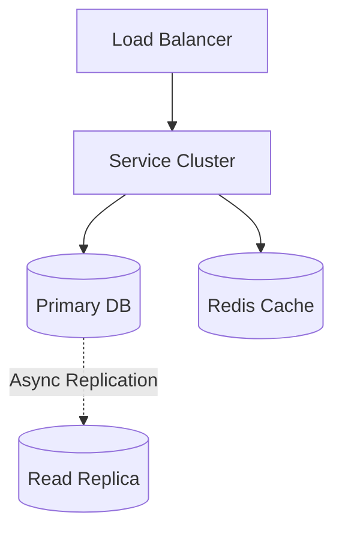
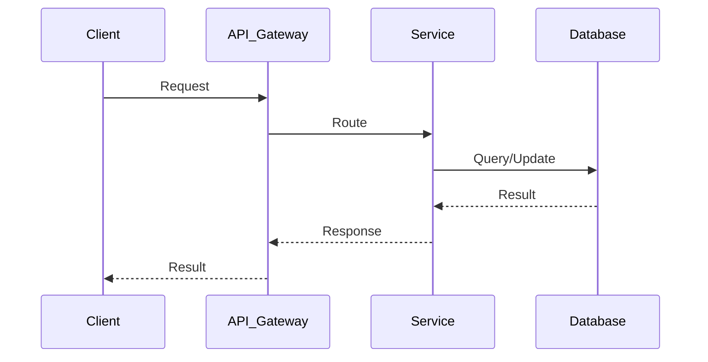

# Slack System Design

| Step | Focus Area | Time Allocation | Key Activities |
|------|-----------|----------------|----------------|
| 1 | Requirements | 5-10 min | Clarify functional and non-functional requirements, identify core features |
| 2 | Core Entities | 3-5 min | Identify main entities and their relationships |
| 3 | API Design | ~5 min | Define key endpoints, methods, and data structures (keep brief) |
| 4 | Data Flow | 5-10 min | Map request/response flows, identify data movement patterns |
| 5 | High-Level Design | 15-20 min | Draw system architecture, components, and their interactions |
| 6 | Deep Dives | 15-20 min | Dive into critical components, address bottlenecks and optimizations |
| 7 | Address Key Issues | 5 min | Handle failures, security, monitoring, and edge cases |

---

## Table of Contents

---
## 1. Requirements (5-10 min)

### Functional Requirements
- [ ] Users can send 1-on-1 direct messages.
- [ ] Users can send messages in group channels.
- [ ] Real-time message delivery and typing indicators.
- [ ] Users can see the online/offline status of others.
- [ ] Users can search past messages.

### Back-of-the-Envelope (BOE) Calculations
**Step 1: Assumptions**
- Users: 20M DAU
- Activity: 50 messages/user/day
- Payload: Average message size ~200 bytes

**Step 2: Load (QPS)**
- Write QPS: (20M * 50) / 100,000 ≈ 10,000 QPS
- Read QPS (Polling/WebSocket pushes): Much higher, dependent on active channels, approx 100,000 QPS

**Step 3: Storage (5-year plan)**
- Daily Storage: 10,000 QPS * 100,000s * 200 B ≈ 200 GB/day
- 5-year storage: 200 GB * 365 * 5 ≈ 365 TB

**Step 4: Bandwidth**
- Ingress: 10,000 QPS * 200 B ≈ 2 MB/s
- Egress: 100,000 QPS * 200 B ≈ 20 MB/s

**Step 5: Cache**
- Cache active channels and recent messages for fast initial load.

### Non-Functional Requirements
- [ ] **High Availability**: Cannot lose messages; service must be up.
- [ ] **Low Latency**: Messages must appear instantly (real-time).
- [ ] **Scalability**: Handle millions of concurrent WebSocket connections and high write throughput.

---

## 2. Core Entities (3-5 min)

- **User**: `userId`, `name`, `status`
- **Channel**: `channelId`, `name`, `type` (Direct vs Group)
- **Message**: `messageId`, `channelId`, `senderId`, `content`, `timestamp`
- **ChannelMember**: `channelId`, `userId`, `lastReadMessageId`

---

## 3. API Design (~5 min)

### `POST /api/v1/messages` (Often handled over WebSocket instead)
- **Purpose**: Send a message to a channel.
- **Request Body**: `{ "channelId": "123", "content": "Hello team!" }`
- **Response**: `201 Created`

### `GET /api/v1/channels/:id/messages`
- **Purpose**: Fetch historical messages when a user opens the app.
- **Response**: `200 OK` with list of messages.

---

## 4. Data Flow (5-10 min)

1. **Send Flow**: User types a message. Client sends payload via WebSocket.
2. Connection Handler receives it, forwards to `Chat Service`.
3. `Chat Service` assigns an ID, stores message in DB, and publishes it to a Pub/Sub queue (Kafka/Redis PubSub).
4. **Receive Flow**: Presence/Session Service knows which servers the channel members are connected to.
5. The message is routed to the specific Connection Handlers holding the WebSockets for active users.
6. Connection Handlers push the message to the clients.

---

## 5. High-Level Design (15-20 min)

### High-Level Architecture

- **Connection Managers**: Fleet of servers holding stateful WebSocket connections with clients.
- **Session Service**: Keeps track of which user is connected to which Connection Manager.
- **Chat Service**: Business logic for formatting, validation, and storing messages.
- **Presence Service**: Tracks online/offline status using heartbeats.
- **Pub/Sub System**: Redis Pub/Sub or Kafka to route messages internally between servers.
- **Databases**:
  - Key-Value Store (Cassandra/HBase) for storing massive volumes of chat messages efficiently.
  - Relational DB (MySQL) for Channels, Workspaces, and Users.
- **Search Service**: ElasticSearch cluster tailing the chat database to enable fast text searches.

---

## 6. Deep Dives (15-20 min)

### Deep Dive / Data Flow

### Real-Time Delivery & Connection Management
- **Challenge**: Managing millions of concurrent TCP connections and routing messages to the right one.
- **Solution**:
  - Clients maintain a persistent WebSocket connection to a `Connection Manager` server.
  - When User A sends a message to Channel X, the Chat Service queries the `Session Service` (backed by Redis) to find the IPs of the servers where members of Channel X are connected.
  - The Chat Service publishes the message to a Redis Pub/Sub channel or Kafka topic.
  - The relevant Connection Managers subscribe, receive the message, and push it down the WebSocket to the users.

### Message Storage & ID Generation
- **Challenge**: High write volume for messages. Relational DBs will bottleneck.
- **Solution**: Use Cassandra or HBase. Partition data by `channelId`. Sort by `timestamp` (or a Snowflake ID).
- **ID Generation**: Use Twitter Snowflake to generate globally unique, time-sortable 64-bit IDs so we can strictly order messages without relying on DB auto-increments.

---

## 7. Address Key Issues (5 min)

### Fault Tolerance & Resiliency
- If a Connection Manager dies, clients instantly detect the dropped WebSocket and reconnect to a new server via the Load Balancer. The client pulls missed messages via REST API.

### Presence Tracking (Online/Offline)
- Clients send heartbeats (ping) every 5 seconds. If a heartbeat is missed for 30s, the Presence Service marks the user offline and broadcasts the status change to their friends/channels.

## References & Original Diagrams

