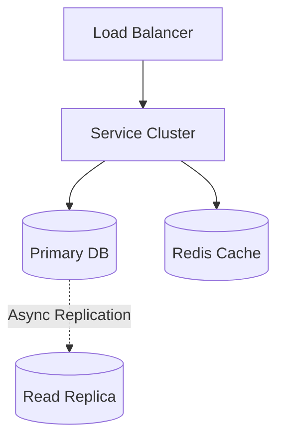
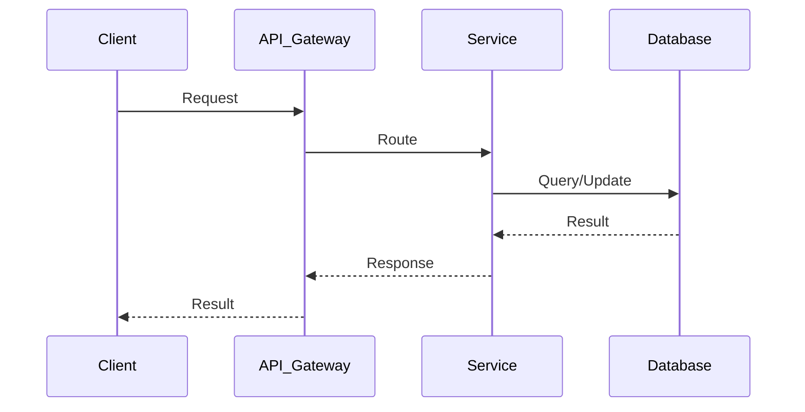

# Google Docs System Design

| Step | Focus Area | Time Allocation | Key Activities |
|------|-----------|----------------|----------------|
| 1 | Requirements | 5-10 min | Clarify functional and non-functional requirements, identify core features |
| 2 | Core Entities | 3-5 min | Identify main entities and their relationships |
| 3 | API Design | ~5 min | Define key endpoints, methods, and data structures (keep brief) |
| 4 | Data Flow | 5-10 min | Map request/response flows, identify data movement patterns |
| 5 | High-Level Design | 15-20 min | Draw system architecture, components, and their interactions |
| 6 | Deep Dives | 15-20 min | Dive into critical components, address bottlenecks and optimizations |
| 7 | Address Key Issues | 5 min | Handle failures, security, monitoring, and edge cases |

---

## Table of Contents

---
## 1. Requirements (5-10 min)

### Functional Requirements
- [ ] Multiple users can collaboratively edit a document simultaneously.
- [ ] Users should see each other's edits and cursors in real-time.
- [ ] Document should support formatting (bold, italic).
- [ ] Edits must be resolved seamlessly without manual merge conflicts.

### Back-of-the-Envelope (BOE) Calculations
**Step 1: Assumptions**
- Users: 50M DAU
- Activity: 2 docs edited/user/day, session length 30 mins, 1 character/sec
- Payload: Keystroke operation ~100 bytes

**Step 2: Load (QPS)**
- Active concurrent users: ~5M
- Write QPS (operations): 5M users * 1 char/sec = 5,000,000 QPS (requires heavy batching on client)

**Step 3: Storage (5-year plan)**
- Daily Storage (Operations log): Highly variable depending on squashing. Assume 1 TB/day after squashing.

**Step 4: Bandwidth**
- Ingress/Egress is heavily dependent on the number of collaborators per document broadcasting edits.

**Step 5: Cache**
- Active documents are held entirely in memory on the Collaboration Servers.

### Non-Functional Requirements
- [ ] **Low Latency**: Keystrokes must be reflected to other users within ~50ms.
- [ ] **Consistency**: All users must eventually see the exact same document state, despite network lag.
- [ ] **Durability**: Zero data loss for edits.

---

## 2. Core Entities (3-5 min)

- **Document**: `docId`, `title`, `ownerId`, `currentVersion`
- **User**: `userId`, `name`
- **Operation / Edit**: `opId`, `docId`, `userId`, `position`, `character`, `action` (insert/delete), `version`

---

## 3. API Design (~5 min)

*(Communication is primarily via WebSockets for real-time collaboration)*

### `WebSocket /docs/:id/stream`
- **Client -> Server**: Sends edit operations (e.g., `{"type": "insert", "pos": 5, "char": "a", "version": 10}`).
- **Server -> Client**: Broadcasts transformed edit operations and cursor movements to all connected clients.

---

## 4. Data Flow (5-10 min)

1. Users A and B open a document. Both establish WebSocket connections to the Collaboration Server.
2. User A types 'H'. Client sends operation to Server.
3. Server applies Operational Transformation (OT) or CRDT logic, commits the edit, increments the document version.
4. Server broadcasts the transformed operation to User B.
5. User B's client applies the operation to their local state.
6. Periodically, the full document state is saved to persistent storage.

---

## 5. High-Level Design (15-20 min)

### High-Level Architecture

- **API Gateway / Load Balancer**: Routes WebSocket connections. Needs sticky sessions (hash by `docId`) so all users editing the same doc hit the same server.
- **Collaboration Server**: The heart of the system. Holds the document in memory and resolves conflicts using OT/CRDT.
- **Session / PubSub**: Manages user presence and cursor locations.
- **Document DB**: Relational (PostgreSQL) or NoSQL (MongoDB) to store document metadata and the snapshot of the content.
- **Operations Log (Time-Series / Append-Only)**: Stores every single keystroke/operation for a document to allow playback and version history.
- **Snapshot Service**: Background worker that occasionally squashes the operations log into a full text string and saves it to the Document DB.

---

## 6. Deep Dives (15-20 min)

### Deep Dive / Data Flow

### Concurrency and Conflict Resolution (OT vs CRDT)
- **Challenge**: User A inserts "a" at position 5. Concurrently, User B deletes the character at position 3. If applied blindly, the indexes will drift, and their screens will show different text.
- **Solution 1: Operational Transformation (OT)** (Google Docs approach):
  - Requires a central authoritative server.
  - The server acts as the sequencer. When it receives A's edit, it adjusts B's edit index based on A's action before applying and broadcasting it.
  - *Pros*: Battle-tested, good for rich text. *Cons*: High CPU on server, complex to implement.
- **Solution 2: Conflict-free Replicated Data Types (CRDT)**:
  - Decentralized approach. Each character is assigned a unique fractional index (e.g., between 0 and 1).
  - *Pros*: No central server needed for resolution, mathematically guarantees consistency. *Cons*: Metadata overhead per character is high.

### Sticky Sessions & Caching
- **Challenge**: If User A and User B connect to different Collaboration Servers, those servers have to constantly sync state, causing latency.
- **Solution**: Route all users editing `Doc X` to the exact same physical `Collaboration Server`. The server holds the active document in memory.

---

## 7. Address Key Issues (5 min)

### Fault Tolerance & Resiliency
- If the `Collaboration Server` holding `Doc X` crashes, clients reconnect. The Load Balancer assigns a new server. The new server replays the Operations Log from the DB to reconstruct the document state in memory.

### Offline Editing
- Clients store operations in local storage (IndexedDB) if disconnected. When back online, the client syncs the operations to the server, which applies OT to merge them into the current state.

## References & Original Diagrams

