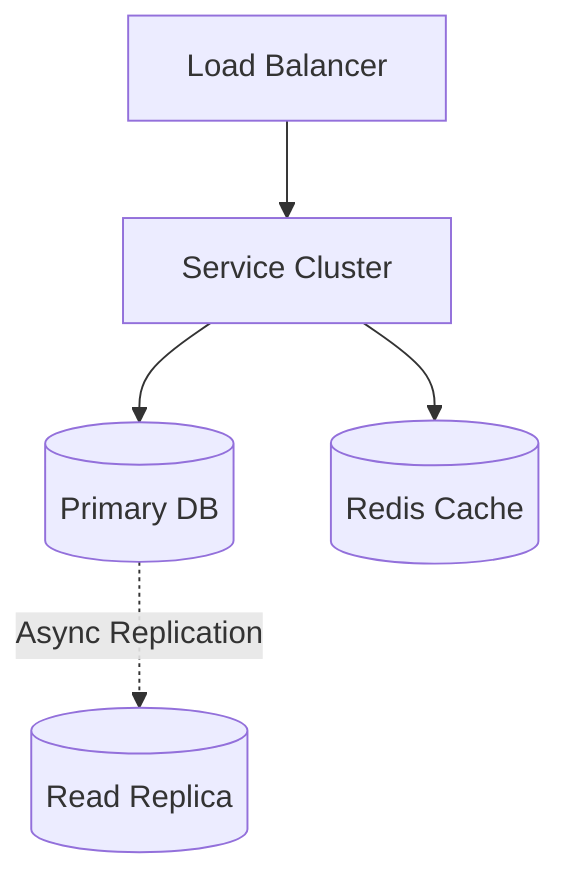
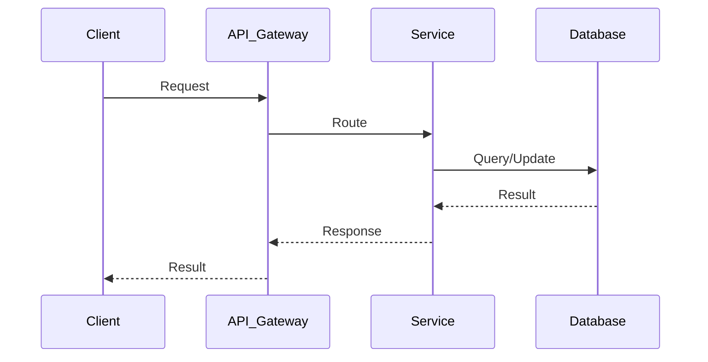

# WhatsApp System Design

## Table of Contents
- [1. Requirements (5-10 min)](#1-requirements-5-10-min)
- [2. Core Entities (3-5 min)](#2-core-entities-3-5-min)
- [3. API Design (~5 min)](#3-api-design-5-min)
- [4. Data Flow (5-10 min)](#4-data-flow-5-10-min)
- [5. High-Level Design (15-20 min)](#5-high-level-design-15-20-min)
- [6. Deep Dives (15-20 min)](#6-deep-dives-15-20-min)
- [7. Address Key Issues (5 min)](#7-address-key-issues-5-min)

---
## 1. Requirements (5-10 min)

### Functional Requirements
- [ ] 1-on-1 chat and group chats.
- [ ] Sent, Delivered, and Read receipts (ticks).
- [ ] Online status and last seen.
- [ ] Push notifications for offline users.
- [ ] Image/Video sharing.


### Back-of-the-Envelope (BOE) Calculations
**Step 1: Assumptions**
- Users: 2B DAU
- Activity: 50 messages/user/day
- Payload: Text message ~200 bytes

**Step 2: Load (QPS)**
- Write QPS: (2B * 50) / 100,000 ≈ 1,000,000 QPS
- Egress QPS: 1,000,000 QPS (1-to-1 chats)

**Step 3: Storage (5-year plan)**
- Messages are only stored temporarily until delivered.
- Transient DB storage is relatively small (e.g., holding 5% of undelivered daily messages). 50B msgs * 5% * 200B = ~500 GB.
- Media (S3) will be massive (petabytes) depending on retention.

**Step 4: Bandwidth**
- Ingress/Egress: ~200 MB/s for text, exponentially higher for media.

### Non-Functional Requirements
- [ ] **High Availability**: Near 100% uptime.
- [ ] **Low Latency**: Real-time delivery.
- [ ] **Security**: End-to-End Encryption (E2EE) is mandatory.
- [ ] **Scale**: 2 Billion+ users, billions of messages daily.

---

## 2. Core Entities (3-5 min)

- **User**: `phoneNumber`, `publicKey`, `profilePic`
- **Message**: `messageId`, `sender`, `receiver`, `encryptedPayload`, `status`
- **Group**: `groupId`, `admins`, `members`

---

## 3. API Design (~5 min)

*(Primarily WebSockets/TCP. REST used only for media/profile uploads)*

### `WebSocket Payload (SendMessage)`
```json
{
  "action": "sendMessage",
  "to": "+1234567890",
  "messageId": "msg-123",
  "encryptedData": "<base64>"
}
```

### `WebSocket Payload (Receipt)`
```json
{
  "action": "receipt",
  "messageId": "msg-123",
  "status": "delivered"
}
```

---

## 4. Data Flow (5-10 min)

1. Alice sends a message to Bob. The message is encrypted on Alice's device using Bob's public key.
2. The encrypted payload is sent via WebSocket to the Chat Server.
3. Server checks if Bob is online (via Session DB).
4. If online, Server pushes the encrypted payload directly to Bob's active WebSocket. Bob's device decrypts it and sends a "Delivered" receipt back.
5. If offline, Server stores the message in a temporary queue/database (Store-and-Forward) and triggers a Push Notification to Bob.

---

## 5. High-Level Design (15-20 min)

### High-Level Architecture



- **Connection Gateway**: Millions of long-lived TCP/WebSocket connections. (Erlang is famously used here for managing millions of concurrent connections per server).
- **Session/User State Service**: Redis cluster tracking which IP/Gateway a user is connected to.
- **Message Routing Service**: Routes messages from sender's gateway to receiver's gateway.
- **Transient Message Store**: Cassandra or similar DB. WhatsApp does not store messages permanently. Once a message is delivered to the receiver, it is deleted from the server.
- **Media Storage (S3)**: For images/videos. Media is uploaded to S3, and a link/encryption-key is sent in the chat payload.
- **Notification Service**: Integrates with APNs (Apple) and FCM (Firebase) to wake up offline devices.

---

## 6. Deep Dives (15-20 min)

### Deep Dive / Data Flow



### End-to-End Encryption (E2EE) & Media
- **Challenge**: The server cannot read the messages. How do we share large media files securely?
- **Solution**:
  - Alice generates a random symmetric key. Encrypts the image with it.
  - Uploads the encrypted image to S3. Gets a URL.
  - Alice encrypts the (S3 URL + Symmetric Key) using Bob's Public Key.
  - Sends this small payload as a normal WhatsApp message. Bob downloads the image from S3 and decrypts it locally.

### Delivery Receipts (Tick System)
- **1 Tick (Sent)**: Server acknowledges receipt of the message from Alice.
- **2 Ticks (Delivered)**: Bob's device receives the message and sends an ack payload back to the Server, which routes it to Alice.
- **Blue Ticks (Read)**: Bob opens the chat UI. Bob's device sends a `read` ack back to Alice.

---

## 7. Address Key Issues (5 min)

### Fault Tolerance & Resiliency
- Connection Gateways are stateless (mostly). If a gateway dies, devices automatically reconnect to another via DNS/LB.
- Transient DB must be highly available (Cassandra with high replication) so undelivered messages are not lost during node failures.

### Scaling Connections
- Using Erlang/Elixir or optimized C++/Go servers to handle C10M (10 million connections per box) by minimizing memory overhead per TCP socket.

## References & Original Diagrams

