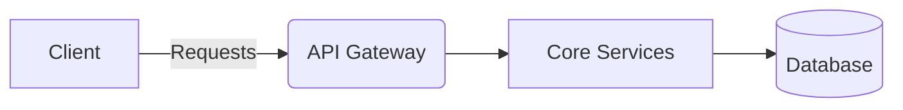
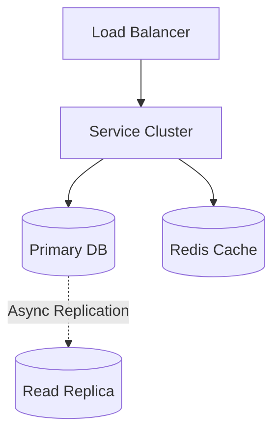

# Facebook Live Comments System Design

> **System Overview Diagram**

| Step | Focus Area | Time Allocation | Key Activities |
|------|-----------|----------------|----------------|
| 1 | Requirements | 5-10 min | Clarify functional and non-functional requirements, identify core features |
| 2 | Core Entities | 3-5 min | Identify main entities and their relationships |
| 3 | API Design | ~5 min | Define key endpoints, methods, and data structures (keep brief) |
| 4 | Data Flow | 5-10 min | Map request/response flows, identify data movement patterns |
| 5 | High-Level Design | 15-20 min | Draw system architecture, components, and their interactions |
| 6 | Deep Dives | 15-20 min | Dive into critical components, address bottlenecks and optimizations |
| 7 | Address Key Issues | 5 min | Handle failures, security, monitoring, and edge cases |

---

## Table of Contents
- [1. Requirements](#1-requirements-5-10-min)
- [2. Core Entities](#2-core-entities-3-5-min)
- [3. API Design](#3-api-design-5-min)
- [4. Data Flow](#4-data-flow-5-10-min)
- [5. High-Level Design](#5-high-level-design-15-20-min)
- [6. Deep Dives](#6-deep-dives-15-20-min)
- [7. Address Key Issues](#7-address-key-issues-5-min)
- [References & Original Diagrams](#references--original-diagrams)

---
## 1. 📋 Requirements (5-10 min)

### Functional Requirements
- [ ] Users can broadcast live video.
- [ ] Users can watch live video and post comments in real-time.
- [ ] Comments must appear on the streamer's and other viewers' screens in real-time.

### Back-of-the-Envelope (BOE) Calculations
**Step 1: Assumptions**
- Users: 50M concurrent viewers on platform, peak of 5M on a single stream
- Activity: 10,000 comments/second on popular stream

**Step 2: Load (QPS)**
- Write QPS: 10,000 QPS
- Read QPS (Fan-out): 10,000 comments * 5M viewers = 50 Billion Ops/Sec (IMPOSSIBLE to do naively).

**Step 3: Storage (5-year plan)**
- Low priority. Comments are ephemeral during stream, persistent later.

**Step 4: Bandwidth**
- Egress: Throttled to max 5 comments/sec per user. 5M users * 5 msgs * 100B = 2.5 GB/s.

### Non-Functional Requirements
- [ ] **High Scalability**: Must handle massive concurrent viewers for celebrity streams (e.g., millions of viewers).
- [ ] **Low Latency**: Real-time delivery of comments.
- [ ] **Availability**: High availability is critical.

---

## 2. 🗄️ Core Entities (3-5 min)

- **LiveStream**: `streamId`, `broadcasterId`, `status`, `startTime`
- **Comment**: `commentId`, `streamId`, `userId`, `content`, `timestamp`

---

## 3. 🌐 API Design (~5 min)

### `POST /api/v1/streams/:id/comments` (Can also be WebSocket)
- **Purpose**: Post a comment to a live stream.
- **Request**: `{ "content": "Hello!" }`

### `WebSocket /ws/streams/:id`
- **Purpose**: Receive real-time comments.

---

## 4. 🔄 Data Flow (5-10 min)

1. User sends a comment to the API Gateway.
2. Comment Service stores it in a fast in-memory DB and publishes it to a Pub/Sub system (Kafka/Redis).
3. The Pub/Sub system fans out the comment to all Connection Servers holding active WebSockets for that stream.
4. Connection Servers push the comment to viewers.

---

## 5. 🏗️ High-Level Design (15-20 min)

### High-Level Architecture

- **Connection Managers**: Maintain WebSocket connections with viewers.
- **Pub/Sub (Redis/Kafka)**: Handles the high-throughput fan-out of messages.
- **Comment Service**: Validates and stores comments.
- **Cache (Redis)**: Holds recent comments for users who just joined the stream.
- **Database (Cassandra)**: Persistent storage for comments.

---

## 6. 🔬 Deep Dives (15-20 min)

### Managing Massive Fan-Out (The Thundering Herd)
- **Challenge**: A celebrity has 1M viewers. If 10k users comment per second, pushing 10k comments to 1M viewers = 10 Billion operations/sec. This will crash the system.
- **Solution**: **Throttling and Sampling**.
  - We do not need to show every single comment to every user. Human eyes cannot read 10k comments per second.
  - The Comment Service aggregates/batches comments. It only broadcasts a subset (e.g., 5-10 comments per second) to viewers.
  - We can route different subsets of comments to different groups of users to give the illusion of high velocity without overloading the network.

---

## 7. 🚧 Address Key Issues (5 min)

### Fault Tolerance & Resiliency
- Connection Manager drops: Client automatically reconnects.
- Auto-scaling Connection Managers based on stream popularity.

## References & Original Diagrams
- [FbLiveComments.excalidraw](./FbLiveComments.excalidraw)
