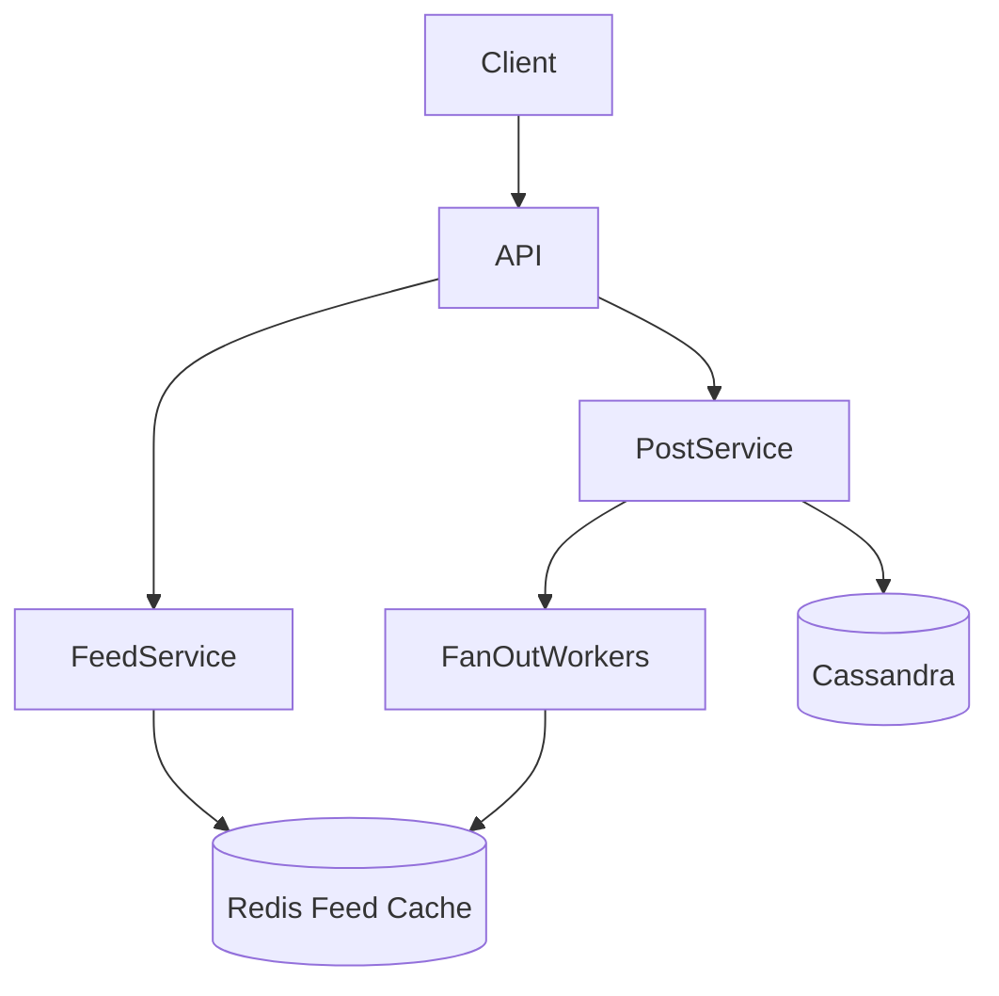
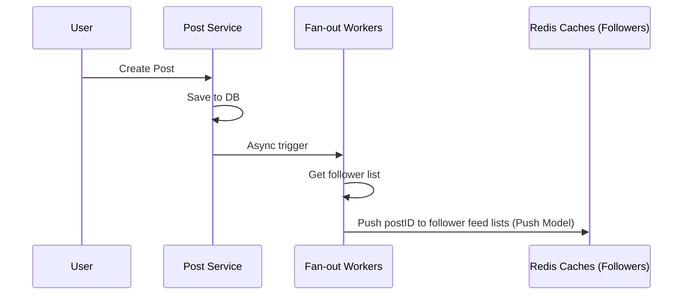
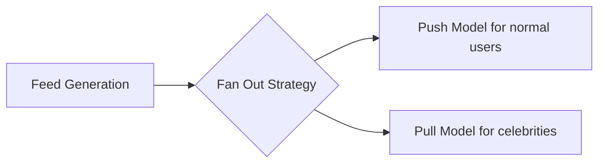

# Facebook News Feed System Design

| Step | Focus Area | Time Allocation | Key Activities |
|------|-----------|----------------|----------------|
| 1 | Requirements | 5-10 min | Clarify functional and non-functional requirements, identify core features |
| 2 | Core Entities | 3-5 min | Identify main entities and their relationships |
| 3 | API Design | ~5 min | Define key endpoints, methods, and data structures (keep brief) |
| 4 | Data Flow | 5-10 min | Map request/response flows, identify data movement patterns |
| 5 | High-Level Design | 15-20 min | Draw system architecture, components, and their interactions |
| 6 | Deep Dives | 15-20 min | Dive into critical components, address bottlenecks and optimizations |
| 7 | Address Key Issues | 5 min | Handle failures, security, monitoring, and edge cases |

---

## Table of Contents
- [1. Requirements](#1-requirements-5-10-min)
- [2. Core Entities](#2-core-entities-3-5-min)
- [3. API Design](#3-api-design-5-min)
- [4. Data Flow](#4-data-flow-5-10-min)
- [5. High-Level Design](#5-high-level-design-15-20-min)
- [6. Deep Dives](#6-deep-dives-15-20-min)
- [7. Address Key Issues](#7-address-key-issues-5-min)
- [References & Original Diagrams](#references--original-diagrams)

---
## 1. Requirements (5-10 min)

### Functional Requirements
- [ ] Users should be able to create posts.
- [ ] Users should be able to follow other users.
- [ ] Users should be able to view a feed of posts from people they follow in chronological order.
- [ ] Users should be able to page through their feed.
- [ ] *Out of scope:* Liking, commenting, private/restricted posts.

### Back-of-the-Envelope (BOE) Calculations
**Step 1: Assumptions**
- Users: 1B DAU
- Activity: 2 posts/user/day, 20 feeds viewed/user/day
- Payload: Avg post 1KB

**Step 2: Load (QPS)**
- Write QPS: (1B * 2) / 100,000 = 20,000 QPS
- Read QPS: (1B * 20) / 100,000 = 200,000 QPS

**Step 3: Storage (5-year plan)**
- Daily Storage: 20,000 QPS * 100,000s * 1KB = 2 TB/day. 5-yr = 3.6 PB.

### Non-Functional Requirements
- [ ] **Scalability**: High scalability to support millions of users and heavy read traffic.
- [ ] **Availability**: High availability is critical (Eventual consistency is acceptable for posts showing up in feeds).
- [ ] **Performance**: Generating and rendering the news feed should be extremely fast (latency < 100ms).

---

## 2. Core Entities (3-5 min)

- **User**: `userId`, `name`, `profilePic`
- **Post**: `postId`, `userId`, `content`, `timestamp`
- **Follow**: `followerId`, `followeeId`
- **Feed**: `userId`, `list of postIds` (computed)

---

## 3. API Design (~5 min)

### `POST /api/v1/posts`
- **Purpose**: Create a new post.
- **Request Body**: `{ "content": "Hello World!" }`
- **Response**: `201 Created` with `postId`.

### `GET /api/v1/feed`
- **Purpose**: Retrieve the user's news feed.
- **Request Parameters**: `cursor` (timestamp of the oldest post seen so far), `limit` (e.g., 20).
- **Response**: `200 OK` with list of Post objects and `next_cursor`.

### `POST /api/v1/follow`
- **Purpose**: Follow another user.
- **Request Body**: `{ "followeeId": "123" }`
- **Response**: `200 OK`

---

## 4. Data Flow (5-10 min)

1. **Write Flow (Creating a post)**:
   - User submits a post to the API Gateway.
   - Post Service saves the post in the Post DB.
   - A message is published to Kafka/Message Queue.
   - Fan-out workers consume the message and update the feed cache for the user's followers.
2. **Read Flow (Viewing feed)**:
   - User requests their feed.
   - Feed Service hits the Feed Cache (Redis) to get the list of `postIds`.
   - Feed Service fetches post content from Post DB/Cache.
   - Result is aggregated and returned to the client.

---

## 5. High-Level Design (15-20 min)

### High-Level Architecture

- **API Gateway**: Handles rate limiting and auth.
- **User Service**: Manages profiles and follow relationships.
- **Post Service**: Manages creation and storage of posts.
- **Feed Service**: Aggregates and serves the feed.
- **Fan-out Workers**: Background jobs responsible for distributing post IDs to followers' feeds.
- **Databases**:
  - NoSQL (Cassandra/DynamoDB) for Posts and Feeds due to heavy write/read volume.
  - Relational DB for Users (or Graph DB if complex relationships are needed).
- **Caches**: Redis for pre-computed feeds and hot posts.

---

## 6. Deep Dives (15-20 min)

### Deep Dive / Data Flow

### Generic Problem Component

### NoSQL Data Access Patterns
- **Partition Key (PK)**: Determines the physical node holding the data.
- **Sort Key (SK)**: Determines the order of data within the partition (e.g., timestamp).
- **Global Secondary Index (GSI)**: Used to query data by a non-partition key efficiently.

### Fan-out Approaches (The Bottleneck)
- **Fan-out on Write (Push Model)**:
  - When Alice creates a post, the system finds all her followers and pushes the `postId` into their Redis feed lists.
  - *Pros*: Super fast reads when Bob opens his app.
  - *Cons*: Slow writes for users with millions of followers (celebrities). It takes too much time to update 1M lists.
- **Fan-out on Read (Pull Model)**:
  - *Pros*: Fast writes.
  - *Cons*: Very slow reads. The system has to find all people you follow, pull their recent posts, and merge-sort them at runtime.
- **Hybrid Solution (SDE-2 level)**:
  - Use Push Model for normal users.
  - Use Pull Model for celebrities. When a normal user requests their feed, they pull their pre-computed push list AND query the active celebrity accounts they follow, merge-sorting the results in memory.

### Cursor-Based Pagination
- Using `offset` in databases is slow for deep pagination because the DB has to scan and skip rows.
- **Solution**: Use a timestamp cursor. Query: `SELECT * FROM Posts WHERE timestamp < last_seen_timestamp ORDER BY timestamp DESC LIMIT 20`.

---

## 7. Address Key Issues (5 min)

### Fault Tolerance & Resiliency
- Feed cache misses: If Redis drops a user's feed, the system must fallback to generating the feed via Fan-out on Read from the DB and repopulate the cache.
- Eventual consistency is perfectly acceptable here. If a user doesn't see a post immediately, it is fine.

### Security
- Rate limit post creation to prevent spam.

## References & Original Diagrams
- [FacebookNewsFeed.excalidraw](./FacebookNewsFeed.excalidraw)
