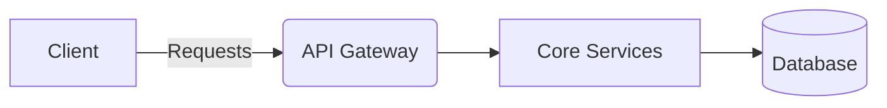
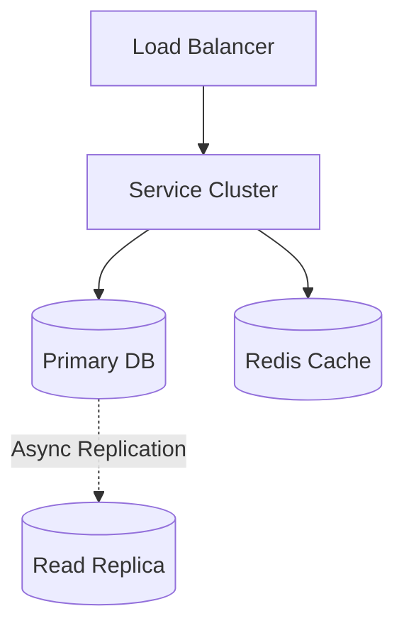

# Tinder System Design

> **System Overview Diagram**

| Step | Focus Area | Time Allocation | Key Activities |
|------|-----------|----------------|----------------|
| 1 | Requirements | 5-10 min | Clarify functional and non-functional requirements, identify core features |
| 2 | Core Entities | 3-5 min | Identify main entities and their relationships |
| 3 | API Design | ~5 min | Define key endpoints, methods, and data structures (keep brief) |
| 4 | Data Flow | 5-10 min | Map request/response flows, identify data movement patterns |
| 5 | High-Level Design | 15-20 min | Draw system architecture, components, and their interactions |
| 6 | Deep Dives | 15-20 min | Dive into critical components, address bottlenecks and optimizations |
| 7 | Address Key Issues | 5 min | Handle failures, security, monitoring, and edge cases |

---

## Table of Contents
- [1. Requirements](#1-requirements-5-10-min)
- [2. Core Entities](#2-core-entities-3-5-min)
- [3. API Design](#3-api-design-5-min)
- [4. Data Flow](#4-data-flow-5-10-min)
- [5. High-Level Design](#5-high-level-design-15-20-min)
- [6. Deep Dives](#6-deep-dives-15-20-min)
- [7. Address Key Issues](#7-address-key-issues-5-min)
- [References & Original Diagrams](#references--original-diagrams)

---
## 1. 📋 Requirements (5-10 min)

### Functional Requirements
- [ ] Users can create a profile with photos and bio.
- [ ] Users can view recommendations based on location, age, and gender preferences.
- [ ] Users can swipe right (like) or left (pass).
- [ ] If both users swipe right, a "Match" is created.
- [ ] Matched users can chat.

### Back-of-the-Envelope (BOE) Calculations
**Step 1: Assumptions**
- Users: 50M DAU
- Activity: 100 swipes/user/day
- Payload: Swipe event ~100 bytes. Profile load includes multiple images (few MBs).

**Step 2: Load (QPS)**
- Swipe Write QPS: (50M * 100) / 100,000 ≈ 50,000 QPS

**Step 3: Storage (5-year plan)**
- Heavy image storage (S3) for profiles.

**Step 4: Bandwidth**
- High ingress/egress due to image loading.

### Non-Functional Requirements
- [ ] **Low Latency**: Recommendations must load fast.
- [ ] **Scalability**: High read (viewing profiles) and write (swiping) throughput.
- [ ] **Geospatial**: Fast location-based querying is essential.

---

## 2. 🗄️ Core Entities (3-5 min)

- **User**: `userId`, `location`, `preferences`, `images`
- **Swipe**: `swiperId`, `swipeeId`, `action` (LIKE, PASS), `timestamp`
- **Match**: `matchId`, `user1Id`, `user2Id`, `timestamp`

---

## 3. 🌐 API Design (~5 min)

### `GET /api/v1/recommendations`
- **Response**: Array of User profiles.

### `POST /api/v1/swipes`
- **Request**: `{ "swipeeId": "456", "action": "LIKE" }`
- **Response**: `{ "matched": true, "matchId": "..." }` (if mutual).

---

## 4. 🔄 Data Flow (5-10 min)

1. Client requests recommendations -> Gateway -> Recommendation Engine queries Geo-index -> returns profiles.
2. User swipes -> Gateway -> Swipe Service logs the swipe.
3. If LIKE, checks if `swipee` already liked `swiper` in cache/DB. If yes, creates Match and notifies both via Push Notification.

---

## 5. 🏗️ High-Level Design (15-20 min)

### High-Level Architecture

- **Profile Service**: Manages user data. Images in S3.
- **Recommendation Engine**: Pre-computes and caches batches of profiles for users.
- **Geospatial DB**: Elasticsearch or Redis Geo to query users within a radius.
- **Swipe Service**: Handles the high-throughput swipe events. Uses message queues (Kafka) to process matches asynchronously.
- **Chat Service**: Similar to WhatsApp/Slack for matched users.

---

## 6. 🔬 Deep Dives (15-20 min)

### Geospatial Indexing & Recommendation Batching
- **Challenge**: Querying for users within 10 miles constantly is expensive.
- **Solution**: Use Geohashing or Quadtrees. The Recommendation Engine runs a background worker that pre-fetches a queue of 20-50 profiles for a user and stores them in Redis. When the user opens the app, they instantly get the pre-calculated queue.

### Swipe & Match Logic
- **Challenge**: Checking for mutual likes synchronously on every right swipe slows down the API.
- **Solution**:
  - When User A likes User B, store `(A, B) -> LIKE` in a fast NoSQL DB (e.g., Cassandra).
  - Also check if `(B, A) -> LIKE` exists. To make this fast, keep recent likes in a Redis Cache.
  - If a match occurs, publish a `MatchEvent` to Kafka, which updates the Match DB and sends push notifications out of the critical path.

---

## 7. 🚧 Address Key Issues (5 min)

### Fault Tolerance & Resiliency
- Caching layer failure: Fall back to DB, but expect degraded performance. Geohash DB (Elasticsearch) must be highly replicated.

## References & Original Diagrams
- [Tinder.excalidraw](./Tinder.excalidraw)
