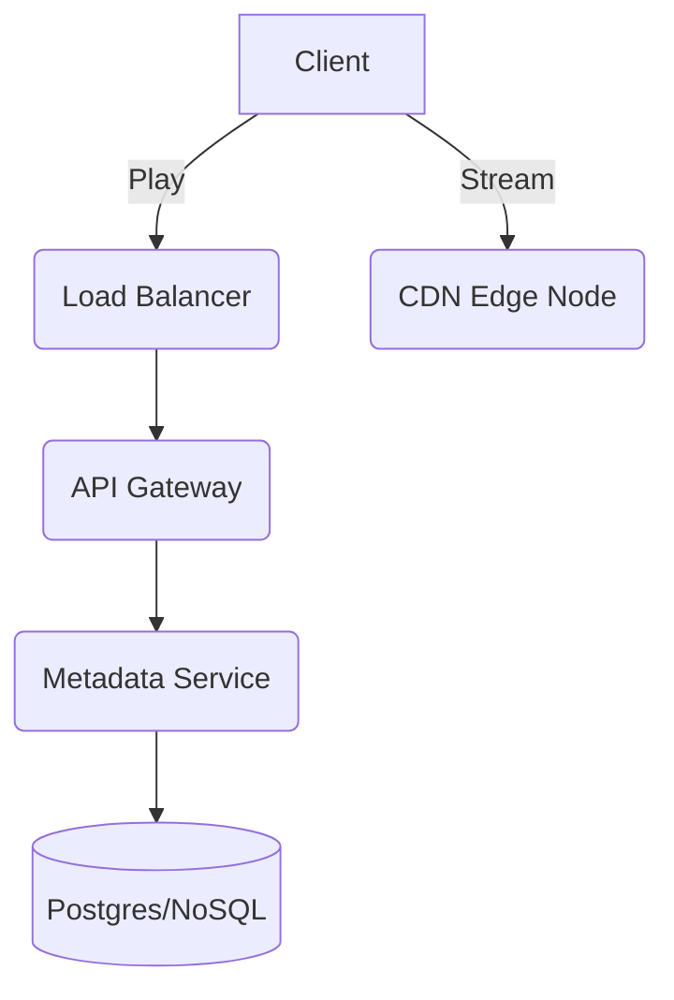
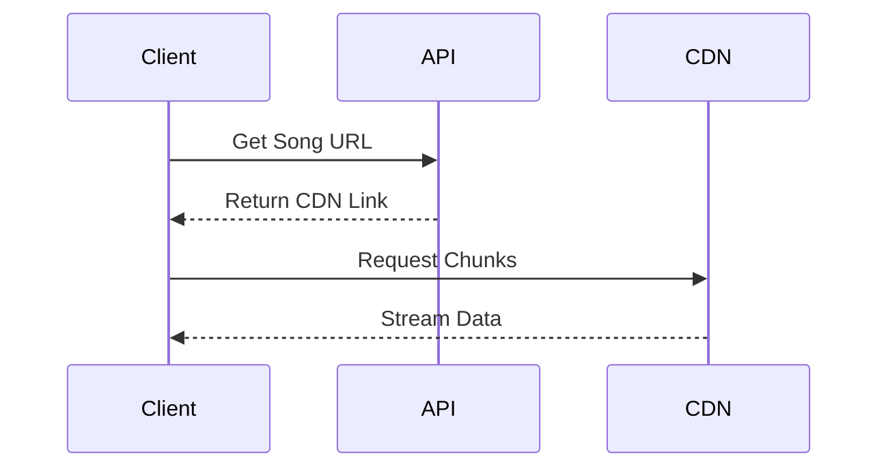
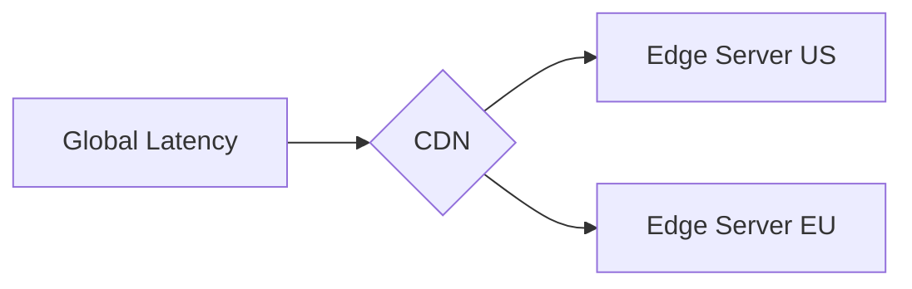

# Spotify System Design

| Step | Focus Area | Time Allocation | Key Activities |
|------|-----------|----------------|----------------|
| 1 | Requirements | 5-10 min | Clarify functional and non-functional requirements, identify core features |
| 2 | Core Entities | 3-5 min | Identify main entities and their relationships |
| 3 | API Design | ~5 min | Define key endpoints, methods, and data structures (keep brief) |
| 4 | Data Flow | 5-10 min | Map request/response flows, identify data movement patterns |
| 5 | High-Level Design | 15-20 min | Draw system architecture, components, and their interactions |
| 6 | Deep Dives | 15-20 min | Dive into critical components, address bottlenecks and optimizations |
| 7 | Address Key Issues | 5 min | Handle failures, security, monitoring, and edge cases |

---

## Table of Contents
- [1. Requirements](#1-requirements-5-10-min)
- [2. Core Entities](#2-core-entities-3-5-min)
- [3. API Design](#3-api-design-5-min)
- [4. Data Flow](#4-data-flow-5-10-min)
- [5. High-Level Design](#5-high-level-design-15-20-min)
- [6. Deep Dives](#6-deep-dives-15-20-min)
- [7. Address Key Issues](#7-address-key-issues-5-min)
- [References & Original Diagrams](#references--original-diagrams)

---
## 1. Requirements (5-10 min)

### Functional Requirements
- [ ] Artists should be able to upload songs.
- [ ] Users should be able to search and stream songs.
- [ ] Users should be able to create and manage playlists (add/remove songs).
- [ ] Users should be able to maintain profiles, like/unlike songs, and follow artists.
- [ ] *Out of scope:* Recommendation engine, copyright protection.

### Scale of the System
- **Total Active Users (MAU)**: ~750M
- **Daily Active Users (DAU)**: ~250M
- **Total Song Catalog**: ~100M songs
- **Daily Streams**: ~5B (assuming ~20 songs/user/day)
- **Daily Song Uploads**: ~60k tracks/day

### Back-of-the-Envelope (BOE) Calculations
**Step 1: Assumptions**
- Users: 500M MAU -> 200M DAU
- Activity: 20 songs/user/day
- Read/write ratio: 100:1 (read-heavy)
- Payload: Average song size ~3 MB

**Step 2: Load (QPS)**
- Read QPS: (200M * 20) / 100,000 ≈ 40,000 QPS
- Write QPS: 40,000 / 100 ≈ 400 QPS

**Step 3: Storage (5-year plan)**
- Daily Storage (New Songs): 400 QPS * 100,000s * 3 MB ≈ 120 TB/day
- 5-year storage: 120 TB * 365 * 5 ≈ 219 PB

**Step 4: Bandwidth**
- Egress (Streams): 40,000 QPS * 3 MB ≈ 120 GB/s
- Ingress: 400 QPS * 3 MB ≈ 1.2 GB/s

**Step 5: Cache**
- Cache capacity (20% of daily active songs): Assume 10% of catalog is hot. 10M songs * 3 MB = 30 TB cache (CDN).

### Non-Functional Requirements (SPARCS)
- [ ] **Scalability**: System must handle 5B streams/day and immense global concurrent traffic.
- [ ] **Performance**: Low latency streaming with fast playback start times; minimal rebuffering.
- [ ] **Availability**: Highly available architecture via CDNs to stream audio globally without disruption.
- [ ] **Reliability**: Adaptive quality switching (e.g., 64kbps, 128kbps, 320kbps Ogg/AAC formats).

### Back-of-the-Envelope (BOE) Calculations
- **Traffic (QPS)**:
  - Read QPS: 5B / 10^5 ≈ 50k QPS
  - Write QPS: 60k / 10^5 ≈ 0.6 QPS
  - Peak QPS: ~150k QPS
- **Storage**:
  - Daily storage = 60k writes × 3MB average request => 180 GB
  - Yearly storage ≈ 65 TB. Total storage ≈ 1.87 PB with replication.
- **Bandwidth**:
  - Ingress: 1.8 MB/s
  - Egress: 150 GB/s

---

## 2. Core Entities (3-5 min)

- **User**: `userId`, `name`, `email`, `profilePicUrl`
- **Artist**: `artistId`, `name`, `bio`
- **Song / Track**: `songId`, `artistId`, `title`, `duration`, `s3Url`, `uploadTimestamp`
- **Playlist**: `playlistId`, `userId`, `name`, `creationTimestamp`
- **Relationships**:
  - User can create many Playlists.
  - Playlist can contain many Songs.
  - Artist can upload many Songs.
  - User can like many Songs / follow Artists.

---

## 3. API Design (~5 min)

### `POST /api/v1/songs/upload`
- **Purpose**: Let artists upload raw audio files.
- **Request Body**: `multipart/form-data` with raw audio file.
- **Response**: `201 Created` with pre-signed URL or `songId`.

### `GET /api/v1/songs/:id/stream`
- **Purpose**: Get streaming chunks for a song.
- **Response**: `200 OK` (Chunks of audio payload).

### `POST /api/v1/playlists`
- **Purpose**: Create a new playlist.
- **Request Body**: `{ "name": "Chill Vibes" }`
- **Response**: `201 Created` with `playlistId`.

---

## 4. Data Flow (5-10 min)

### Upload Flow
1. Artist client hits the API Gateway.
2. Request routed to `Upload Service`.
3. Audio file is uploaded directly to `S3` (Object Storage) using pre-signed URLs.
4. Metadata is stored in the database.
5. Async Event (Kafka) triggers `Transcoding Service` to convert audio into adaptive bitrates (Ogg/AAC formats).

### Streaming Flow
1. User requests a song via `Client`.
2. `Read Service` returns CDN links for the requested song's audio chunks.
3. Client streams audio chunks directly from `CDN`, minimizing latency.

---

## 5. High-Level Design (15-20 min)

### High-Level Architecture

- **Client**: Mobile/Web App.
- **API Gateway**: Entry point for routing, authentication, and rate limiting.
- **Upload Service**: Handles raw uploads, integrates with S3 via pre-signed URLs.
- **Transcoding Service (Async)**: Listens to upload events and transcodes audio into various qualities (64k, 128k, 320k) and stores them back into S3.
- **Read / Stream Service**: Fetches metadata, interacts with cache, and provides CDN links to users.
- **Databases**:
  - SQL/NoSQL for Metadata (`Song Table`, `User Table`, `Playlist Table`).
  - S3 (Object Storage) for raw and transcoded audio files.
- **CDN**: Caches transcoded audio files globally to reduce latency and server load.
- **Cache**: Redis for frequent metadata lookups (e.g., popular songs, user profiles).

---

## 6. Deep Dives (15-20 min)

### Deep Dive / Data Flow

### Generic Problem Component

### CDN Integration & Streaming
- **Challenge**: 150 GB/s egress is massive. Centralized servers will choke.
- **Solution**: Use edge CDNs (Cloudflare, AWS CloudFront). The `Read Service` only returns URLs; the client pulls bytes from the CDN.
- **Trade-offs**: High CDN costs, but unparalleled latency reduction and server offloading.

### Adaptive Bitrate Streaming
- **Challenge**: Users have varying network conditions.
- **Solution**: The transcode service prepares multiple versions of the song. The client dynamically switches between 64kbps, 128kbps, and 320kbps based on real-time bandwidth metrics.

---

## 7. Address Key Issues (5 min)

### Fault Tolerance & Resiliency
- S3 replicates data across Availability Zones.
- Use an Event-Driven Architecture (EDA) with Kafka for transcoding. If a transcoder fails, the message remains in the queue for another worker.

### Security
- Use Pre-signed URLs for direct S3 uploads to keep heavy traffic away from the application servers.
- TLS/SSL for all data in transit.

### Monitoring & Observability
- Track stream buffer rates, startup latency, and CDN cache hit rates using Prometheus and Grafana.

## References & Original Diagrams
- [Spotify.excalidraw](./Spotify.excalidraw)
