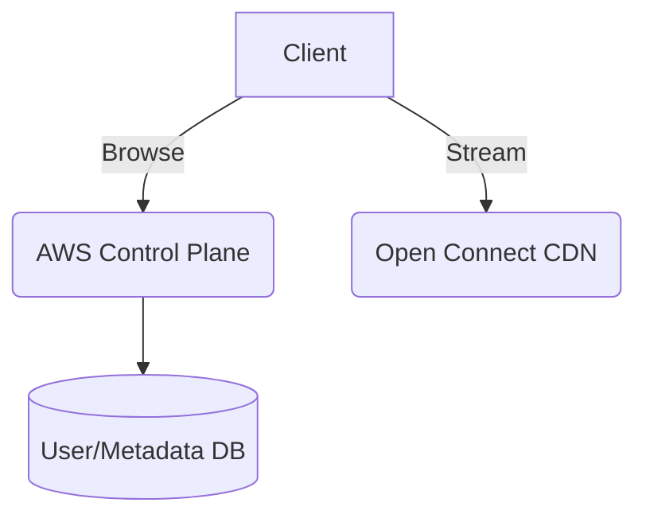
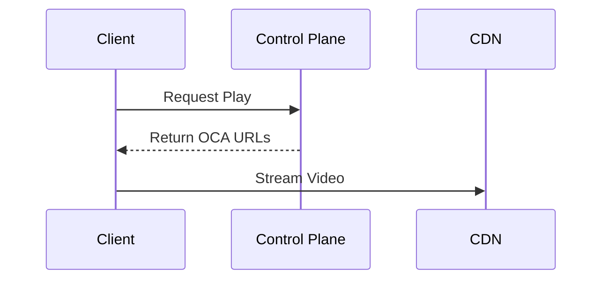
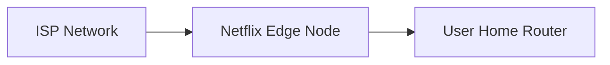

# Netflix System Design

| Step | Focus Area | Time Allocation | Key Activities |
|------|-----------|----------------|----------------|
| 1 | Requirements | 5-10 min | Clarify functional and non-functional requirements, identify core features |
| 2 | Core Entities | 3-5 min | Identify main entities and their relationships |
| 3 | API Design | ~5 min | Define key endpoints, methods, and data structures (keep brief) |
| 4 | Data Flow | 5-10 min | Map request/response flows, identify data movement patterns |
| 5 | High-Level Design | 15-20 min | Draw system architecture, components, and their interactions |
| 6 | Deep Dives | 15-20 min | Dive into critical components, address bottlenecks and optimizations |
| 7 | Address Key Issues | 5 min | Handle failures, security, monitoring, and edge cases |

---

## Table of Contents
- [1. Requirements](#1-requirements-5-10-min)
- [2. Core Entities](#2-core-entities-3-5-min)
- [3. API Design](#3-api-design-5-min)
- [4. Data Flow](#4-data-flow-5-10-min)
- [5. High-Level Design](#5-high-level-design-15-20-min)
- [6. Deep Dives](#6-deep-dives-15-20-min)
- [7. Address Key Issues](#7-address-key-issues-5-min)
- [References & Original Diagrams](#references--original-diagrams)

---
## 1. Requirements (5-10 min)

### Functional Requirements
- [ ] Users can browse and search for movies/TV shows.
- [ ] Users can stream video content seamlessly.
- [ ] System tracks user's watch history and viewing position.
- [ ] System provides personalized recommendations.

### Back-of-the-Envelope (BOE) Calculations
**Step 1: Assumptions**
- Users: 250M Subscribers
- Activity: 2 hours of watch time/day/user
- Payload: Avg 3 GB per hour of HD video

**Step 2: Load (QPS)**
- Concurrent Streams (Peak): ~50M users online
- Read QPS (Manifests): 50,000 QPS

**Step 3: Storage**
- Content library is finite (e.g. 100,000 titles).
- Storage per title (all formats): 100 GB. Total: 10 PB. Very small compared to User Generated Content.

**Step 4: Bandwidth**
- Egress (Peak): 50M * 3GB/hr = 150 PB/hr = ~40 TB/s (Handled by Open Connect CDNs).

**Step 5: Cache**
- Netflix Open Connect Appliance (OCA) caches 100% of the video catalog at ISPs.

### Non-Functional Requirements
- [ ] **High Scalability**: Must serve petabytes of video data daily globally.
- [ ] **High Availability**: Near 100% uptime for streaming.
- [ ] **Low Latency**: Minimal buffering and fast video startup.

---

## 2. Core Entities (3-5 min)

- **User**: `userId`, `subscriptionPlan`
- **Video**: `videoId`, `title`, `metadata`
- **WatchHistory**: `userId`, `videoId`, `timestamp`, `position`

---

## 3. API Design (~5 min)

### `GET /api/v1/browse`
- **Response**: Returns personalized rows of content metadata.

### `GET /api/v1/video/:id/play`
- **Response**: Returns CDN URLs (manifest files like DASH/HLS) for the video chunks.

---

## 4. Data Flow (5-10 min)

1. **Browse Flow**: Client requests homepage -> API Gateway -> Recommendation Service -> Metadata DB/Cache -> returns JSON.
2. **Streaming Flow**: Client clicks play -> Gateway -> Playback Service validates subscription -> Returns CDN links. Client pulls raw video chunks directly from Edge CDN (Open Connect), bypassing backend servers entirely.

---

## 5. High-Level Design (15-20 min)

### High-Level Architecture

- **Control Plane (AWS)**:
  - API Gateway (Zuul), User Service, Subscription Service, Recommendation Engine.
  - Databases: Cassandra (for massive watch history and user state), MySQL (for billing), ElasticSearch (for text search).
  - Transcoding Pipeline: Async jobs that convert raw video into various resolutions (1080p, 4k) and bitrates.
- **Data Plane (Open Connect / CDN)**:
  - Netflix's custom global CDN. Edge servers placed directly inside ISP networks (Comcast, AT&T) to serve huge video files with zero network latency.

---

## 6. Deep Dives (15-20 min)

### Deep Dive / Data Flow

### Generic Problem Component

### Adaptive Bitrate Streaming (ABR)
- **Challenge**: Users have wildly different internet speeds.
- **Solution**: The Transcoding pipeline slices the video into 3-10 second chunks and encodes each chunk at multiple quality levels (e.g., 360p, 720p, 4k). The client downloads a "Manifest" file. The client monitors its own bandwidth and dynamically requests the highest quality chunk its current connection can support.

### Global Content Distribution (Open Connect)
- **Challenge**: Serving Netflix traffic from AWS data centers would overwhelm the internet backbone.
- **Solution**: Push the heavy data (videos) to Edge servers located inside the user's local ISP. Netflix proactively replicates popular shows to these edge nodes during off-peak hours (e.g., 3 AM). When a user hits play, the data travels only a few miles from the ISP node to their house.

---

## 7. Address Key Issues (5 min)

### Fault Tolerance & Resiliency
- **Chaos Engineering**: Netflix uses Chaos Monkey to randomly kill servers in production to ensure the architecture automatically fails over without user impact.
- **Fallback**: If an Open Connect CDN node fails, the client automatically requests the chunk from a backup CDN node or an AWS region.

## References & Original Diagrams
- [Netflix.excalidraw](./Netflix.excalidraw)
