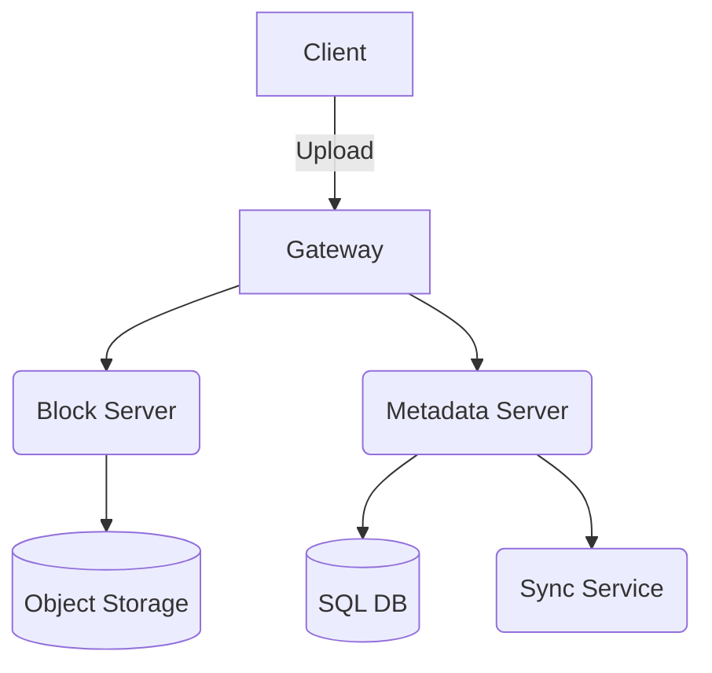
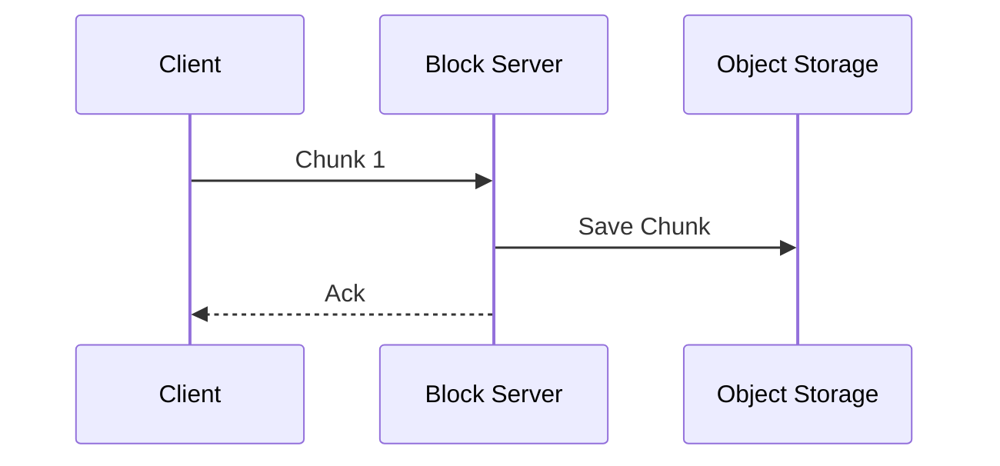
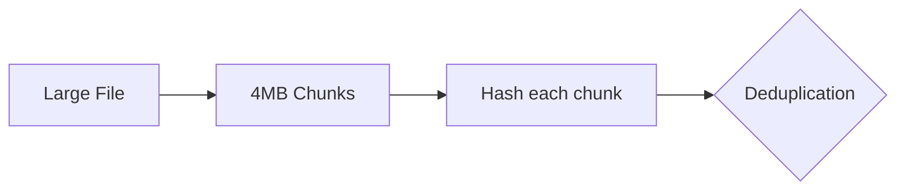

# DropBox/GoogleDrive System Design

| Step | Focus Area | Time Allocation | Key Activities |
|------|-----------|----------------|----------------|
| 1 | Requirements | 5-10 min | Clarify functional and non-functional requirements, identify core features |
| 2 | Core Entities | 3-5 min | Identify main entities and their relationships |
| 3 | API Design | ~5 min | Define key endpoints, methods, and data structures (keep brief) |
| 4 | Data Flow | 5-10 min | Map request/response flows, identify data movement patterns |
| 5 | High-Level Design | 15-20 min | Draw system architecture, components, and their interactions |
| 6 | Deep Dives | 15-20 min | Dive into critical components, address bottlenecks and optimizations |
| 7 | Address Key Issues | 5 min | Handle failures, security, monitoring, and edge cases |

---

## Table of Contents
- [1. Requirements](#1-requirements-5-10-min)
- [2. Core Entities](#2-core-entities-3-5-min)
- [3. API Design](#3-api-design-5-min)
- [4. Data Flow](#4-data-flow-5-10-min)
- [5. High-Level Design](#5-high-level-design-15-20-min)
- [6. Deep Dives](#6-deep-dives-15-20-min)
- [7. Address Key Issues](#7-address-key-issues-5-min)
- [References & Original Diagrams](#references--original-diagrams)

---
## 1. Requirements (5-10 min)

### Functional Requirements
- [ ] Users should be able to upload files from any device.
- [ ] Users should be able to download files from any device.
- [ ] Users should be able to share files with other users and view files shared with them.
- [ ] Users should be able to automatically sync files across devices.
- [ ] *Out of scope:* Editing files, viewing files without downloading, blob storage internal design.

### Back-of-the-Envelope (BOE) Calculations
**Step 1: Assumptions**
- Users: 500M MAU -> 100M DAU
- Activity: 5 files uploaded/user/day, 5 downloaded
- Payload: Average file size ~1 MB (Chunked into 4MB blocks)

**Step 2: Load (QPS)**
- Write QPS: (100M * 5) / 100,000 ≈ 5,000 QPS
- Read QPS: 5,000 QPS

**Step 3: Storage (5-year plan)**
- Daily Storage: 5,000 QPS * 100,000s * 1 MB = 500 TB/day
- 5-year storage: 500 TB * 365 * 5 ≈ 900 PB

**Step 4: Bandwidth**
- Egress: 5,000 QPS * 1 MB ≈ 5 GB/s
- Ingress: 5,000 QPS * 1 MB ≈ 5 GB/s

**Step 5: Cache**
- Metadata cache for fast sync checks: 20% of active files metadata.

### Non-Functional Requirements
- [ ] **Scalability**: Ability to handle large files efficiently.
- [ ] **Performance**: Low latency for uploading and downloading.
- [ ] **Availability**: High availability for downloading and uploading files.
- [ ] **Reliability**: Zero data loss for files uploaded.
- [ ] **Consistency**: Eventual consistency for file sync across devices.
- [ ] *Out of scope:* User storage limits, file versioning, virus scanning.

---

## 2. Core Entities (3-5 min)

- **User**: `userId`, `name`, `email`
- **File**: `fileId`, `s3Url`, `size`, `checksum`
- **FileMetadata**: `metadataId`, `fileId`, `filename`, `path`, `userId`, `lastModified`
- **Folder**: `folderId`, `name`, `parentId`, `userId`
- **Relationships**:
  - User owns many Files and Folders.
  - Folders can contain Files or other Folders.

---

## 3. API Design (~5 min)

### `POST /Files`
- **Purpose**: Upload a new file.
- **Headers**: `Authorization: Bearer <JWT>` (determines userId)
- **Request Body**: File binary and FileMetadata.
- **Response**: `200 OK` or `201 Created` with File ID.

### `GET /Files/{fileId}`
- **Purpose**: Download file and fetch metadata.
- **Response**: `200 OK` with File bytes and Metadata.

### `POST /Files/Share`
- **Purpose**: Share a file with other users.
- **Headers**: `Authorization: Bearer <JWT>`
- **Request Body**: `{ "fileId": "<id>", "users": ["userId1", "userId2"] }`
- **Response**: `200 OK`

---

## 4. Data Flow (5-10 min)

### Upload & Sync Flow
1. Client breaks large files into smaller chunks.
2. Client sends request to API Gateway.
3. Gateway routes to `Upload Service`.
4. File chunks are uploaded directly to Object Storage (S3).
5. Metadata is committed to Metadata DB.
6. A notification event is fired to the `Sync Service` via a Message Queue.
7. `Sync Service` pushes updates to the user's other connected devices via WebSockets.

---

## 5. High-Level Design (15-20 min)

### High-Level Architecture

- **Client Application**: Desktop/Mobile app running a sync agent.
- **API Gateway**: Load balancing, auth verification (JWT).
- **Block Servers**: Servers that handle splitting files into blocks, hashing, and uploading blocks to storage.
- **Metadata Servers**: Manage file paths, permissions, and folder structures. Store data in a relational DB (ACID properties for metadata).
- **Object Storage (S3)**: Stores raw file blocks.
- **Message Queue (Kafka)**: Handles async events for syncing and notifications.
- **Notification Service**: Maintains WebSocket connections with clients for real-time sync pushes.

---

## 6. Deep Dives (15-20 min)

### Deep Dive / Data Flow

### Generic Problem Component

### Handling Large Files efficiently (Block Storage)
- **Challenge**: Uploading a 10GB file natively takes too long and is prone to network interruptions.
- **Solution**: Break files into smaller blocks (e.g., 4MB chunks) on the client side. Upload blocks in parallel. Store block IDs and their sequence in the metadata.
- **Trade-offs**: Increases metadata complexity, but allows resumable uploads and delta syncs (uploading only changed blocks).

### Delta Sync & Deduplication
- **Challenge**: Minimizing bandwidth when syncing files.
- **Solution**:
  - **Delta Sync**: If a user modifies a file, only the modified blocks are hashed and uploaded.
  - **Deduplication**: Calculate hashes (e.g., SHA-256) of blocks. If multiple users upload the exact same file (or block), store only one copy in S3 and reference it multiple times in the metadata DB.

---

## 7. Address Key Issues (5 min)

### Fault Tolerance & Resiliency
- Metadata DB needs strict ACID guarantees (e.g., PostgreSQL or MySQL). Use Leader-Follower replication.
- Object storage natively replicates across multiple AZs.

### Security
- Files must be encrypted at rest in S3.
- Secure transit via TLS.
- Strict authorization checks in Metadata servers before granting S3 Pre-signed URLs for block download.

### Monitoring & Observability
- Track upload failure rates, sync latency, and storage consumption.

## References & Original Diagrams
- [DropBox_GoogleDrive.excalidraw](./DropBox_GoogleDrive.excalidraw)
