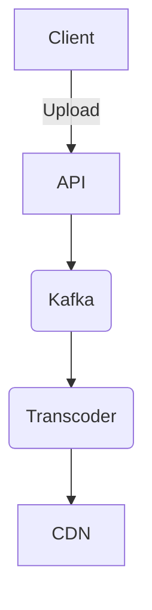
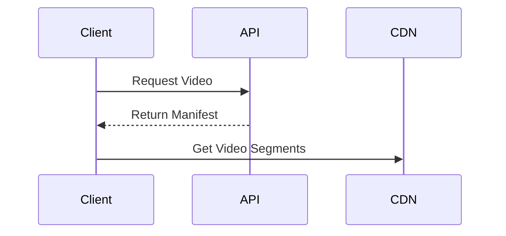
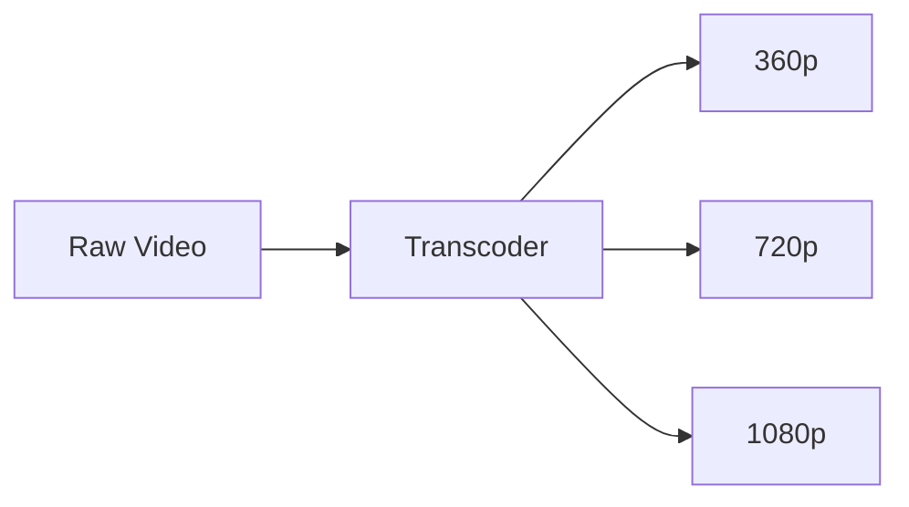

# YouTube System Design

| Step | Focus Area | Time Allocation | Key Activities |
|------|-----------|----------------|----------------|
| 1 | Requirements | 5-10 min | Clarify functional and non-functional requirements, identify core features |
| 2 | Core Entities | 3-5 min | Identify main entities and their relationships |
| 3 | API Design | ~5 min | Define key endpoints, methods, and data structures (keep brief) |
| 4 | Data Flow | 5-10 min | Map request/response flows, identify data movement patterns |
| 5 | High-Level Design | 15-20 min | Draw system architecture, components, and their interactions |
| 6 | Deep Dives | 15-20 min | Dive into critical components, address bottlenecks and optimizations |
| 7 | Address Key Issues | 5 min | Handle failures, security, monitoring, and edge cases |

---

## Table of Contents
- [1. Requirements](#1-requirements-5-10-min)
- [2. Core Entities](#2-core-entities-3-5-min)
- [3. API Design](#3-api-design-5-min)
- [4. Data Flow](#4-data-flow-5-10-min)
- [5. High-Level Design](#5-high-level-design-15-20-min)
- [6. Deep Dives](#6-deep-dives-15-20-min)
- [7. Address Key Issues](#7-address-key-issues-5-min)
- [References & Original Diagrams](#references--original-diagrams)

---
## 1. Requirements (5-10 min)

### Functional Requirements
- [ ] Users can upload videos.
- [ ] Users can view, search, like, and comment on videos.
- [ ] View counts must be updated.

### Back-of-the-Envelope (BOE) Calculations
**Step 1: Assumptions**
- Users: 2B MAU -> 1B DAU
- Activity: 5 videos watched/user/day, 1 uploaded per 1000 users
- Payload: Avg video 50MB

**Step 2: Load (QPS)**
- Read QPS: (1B * 5) / 100,000 ≈ 50,000 QPS
- Write QPS: 50,000 / 1000 ≈ 50 QPS

**Step 3: Storage (5-year plan)**
- Daily Storage: 50 QPS * 100,000s * 50 MB ≈ 250 TB/day
- 5-year storage: 250 TB * 365 * 5 ≈ 450 PB

**Step 4: Bandwidth**
- Egress: 50,000 QPS * 50 MB ≈ 2.5 TB/s
- Ingress: 50 QPS * 50 MB ≈ 2.5 GB/s

**Step 5: Cache**
- CDNs handle 99% of video egress.

### Non-Functional Requirements
- [ ] **Scalability**: Massive storage requirements (hundreds of hours uploaded per minute) and heavy read bandwidth.
- [ ] **High Availability**: System must remain up (Eventual consistency for view counts and comments is fine).
- [ ] **Low Latency**: Fast video streaming with no buffering.

---

## 2. Core Entities (3-5 min)

- **User**: `userId`, `channelName`
- **Video**: `videoId`, `title`, `description`, `uploaderId`, `views`, `likes`

---

## 3. API Design (~5 min)

### `POST /api/v1/videos`
- **Request**: `multipart/form-data` with raw video file.
- **Response**: `202 Accepted` (Processing started).

### `GET /api/v1/videos/:id/stream`
- **Response**: CDN URLs for video chunks.

---

## 4. Data Flow (5-10 min)

1. **Upload**: Client uploads to nearest CDN/Upload Server -> Video stored in S3 (Raw) -> Triggers async Transcoding jobs via Message Queue -> Transcoded videos saved to CDN/S3 -> Metadata updated in DB.
2. **Streaming**: Client requests video -> API returns CDN links -> Client streams via Adaptive Bitrate Streaming.

---

## 5. High-Level Design (15-20 min)

### High-Level Architecture

- **Upload Service**: Handles resumable, chunked uploads.
- **Transcoding/Processing Queue (Kafka)**: Distributes heavy video encoding tasks to a cluster of workers.
- **Video Storage**: S3 for original videos, HDFS/S3 for transcoded outputs.
- **CDN**: Akamai/Cloudflare or custom Google Edge nodes cache the transcoded chunks globally.
- **Metadata DB**: Sharded MySQL (Vitess) or Spanner for storing video details, comments, and user profiles.

---

## 6. Deep Dives (15-20 min)

### Deep Dive / Data Flow

### Generic Problem Component

### Resumable Uploads & Transcoding
- **Challenge**: Uploading a 10GB 4K video can fail midway. Encoding it takes massive CPU.
- **Solution**:
  - Clients upload in chunks with retry logic.
  - Once uploaded, Kafka tasks distribute the workload. A video is split into smaller segments (e.g., 5 seconds each). Hundreds of worker nodes encode different segments in parallel into different resolutions (144p to 4K).
  - A final reducer job stitches them together (or keeps them as DASH/HLS segments) and pushes to CDN.

### View Count Aggregation
- **Challenge**: Incrementing a DB row for every single view for a viral video (100M views/day) will lock and crash the database.
- **Solution**: Use Count-Min Sketch or local aggregators. Edge servers log views in batches. A background job (MapReduce/Spark) parses these logs asynchronously every few minutes and performs bulk updates (`views = views + 50000`) on the database.

---

## 7. Address Key Issues (5 min)

### Storage Optimization
- Cold storage for rarely watched videos. Only cache trending videos in expensive Edge CDNs.

### Fault Tolerance
- Replicate Metadata DB. Retry queues for failed transcoding jobs.

## References & Original Diagrams
- [Youtube.excalidraw](./Youtube.excalidraw)
