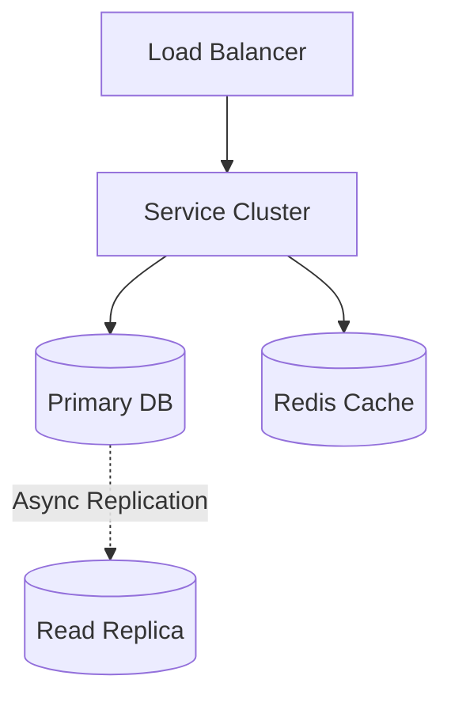
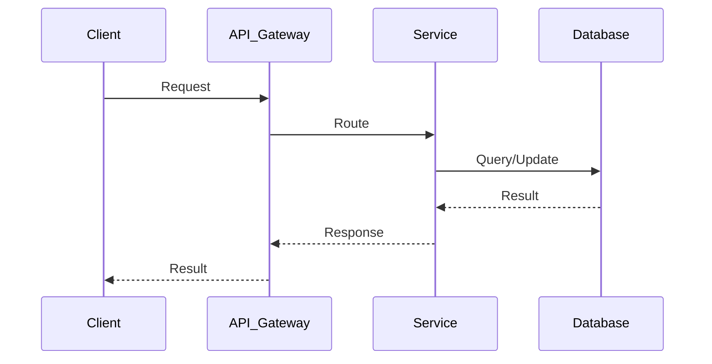

# Hotel Booking System Design

| Step | Focus Area | Time Allocation | Key Activities |
|------|-----------|----------------|----------------|
| 1 | Requirements | 5-10 min | Clarify functional and non-functional requirements, identify core features |
| 2 | Core Entities | 3-5 min | Identify main entities and their relationships |
| 3 | API Design | ~5 min | Define key endpoints, methods, and data structures (keep brief) |
| 4 | Data Flow | 5-10 min | Map request/response flows, identify data movement patterns |
| 5 | High-Level Design | 15-20 min | Draw system architecture, components, and their interactions |
| 6 | Deep Dives | 15-20 min | Dive into critical components, address bottlenecks and optimizations |
| 7 | Address Key Issues | 5 min | Handle failures, security, monitoring, and edge cases |

---

## Table of Contents

---
## 1. Requirements (5-10 min)

### Functional Requirements
- [ ] Users can search for hotels by location and dates.
- [ ] Users can view hotel details, room types, and prices.
- [ ] Users can book a room.
- [ ] Admin/Hotels can manage inventory and pricing.

### Back-of-the-Envelope (BOE) Calculations
**Step 1: Assumptions**
- Users: 10M DAU
- Activity: Heavy reads (searches), low writes (bookings). Read/Write ratio: 1000:1.

**Step 2: Load (QPS)**
- Search QPS: 10,000 QPS
- Booking QPS: 10 QPS

**Step 3: Storage (5-year plan)**
- Inventory records and bookings stored in relational DB. Small storage footprint.

**Step 4: Bandwidth**
- Low bandwidth requirements.

**Step 5: Cache**
- Hotel metadata highly cached. Inventory availability synchronized via CDC.

### Non-Functional Requirements
- [ ] **High Concurrency**: Prevent double-booking when multiple users try to book the last room.
- [ ] **Consistency**: Strong consistency is required for the actual booking transaction (ACID).
- [ ] **High Read Availability**: Search must be very fast and highly available.

---

## 2. Core Entities (3-5 min)

- **Hotel**: `hotelId`, `location`, `details`
- **RoomType**: `typeId`, `hotelId`, `name`, `totalInventory`
- **InventoryRecord**: `typeId`, `date`, `availableRooms`
- **Booking**: `bookingId`, `userId`, `typeId`, `startDate`, `endDate`, `status`

---

## 3. API Design (~5 min)

### `GET /api/v1/search`
- **Parameters**: `location`, `checkIn`, `checkOut`, `guests`
- **Response**: List of available hotels.

### `POST /api/v1/bookings`
- **Request**: `{ "hotelId": "123", "typeId": "abc", "dates": [...] }`
- **Response**: `200 OK` (Confirmed) or `409 Conflict` (Sold out).

---

## 4. Data Flow (5-10 min)

1. User searches -> hits Search Service (ElasticSearch) -> returns fast results.
2. User selects room -> hits Booking Service.
3. Booking Service opens DB Transaction -> Locks the Inventory rows for the dates -> Decrements availability -> Commits -> Returns success.

---

## 5. High-Level Design (15-20 min)

### High-Level Architecture

- **Search Service**: Backed by ElasticSearch (geo-queries, fast text search).
- **Inventory Service**: Manages room availability calendar. Backed by Relational DB.
- **Booking Service**: Handles the transaction logic and payment integration.
- **Cache**: Redis for hotel metadata and pricing (since prices don't change every second).
- **CDC (Change Data Capture)**: Debezium/Kafka tailing the Relational DB to update ElasticSearch and Cache when inventory changes.

---

## 6. Deep Dives (15-20 min)

### Deep Dive / Data Flow

### Handling Concurrency and Double Booking
- **Challenge**: Two users try to book the last room simultaneously.
- **Solution**:
  - **Pessimistic Locking**: Use `SELECT ... FOR UPDATE` in SQL. This locks the inventory row for those specific dates. If User A gets the lock, User B waits. User A decrements the room, commits. User B's query executes, sees 0 rooms, and fails.
  - **Optimistic Locking**: Use a `version` column. `UPDATE Inventory SET available = available - 1, version = version + 1 WHERE id = X AND version = 5 AND available > 0`. If User B's query returns 0 affected rows, they know someone else booked it.

### High Volume Search & Inventory Sync
- **Challenge**: Searching against the SQL database directly for "hotels in NY available next week" requires complex joins and will crash under load.
- **Solution**: Denormalize the data into ElasticSearch. When a booking succeeds in the SQL DB, a Kafka event is fired to update the availability in ElasticSearch. There might be a slight delay (Eventual Consistency in Search), which is fine. If a user clicks a hotel that just sold out, the Booking Service (SQL) will reject it at checkout.

---

## 7. Address Key Issues (5 min)

### Fault Tolerance & Payment States
- Use a 2-Phase Commit or Saga Pattern for distributed transactions (Booking + Payment). If payment fails, the booking must be rolled back (inventory incremented).

## References & Original Diagrams

