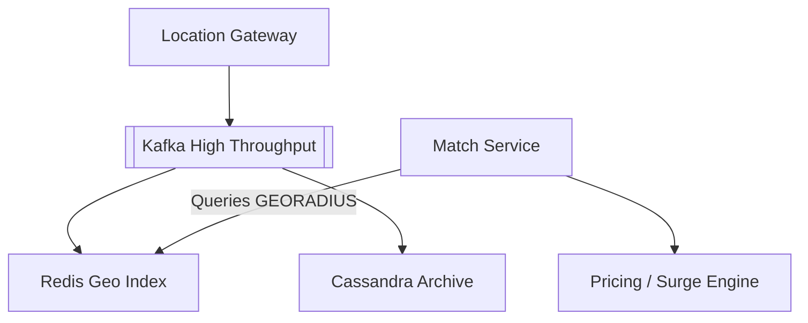
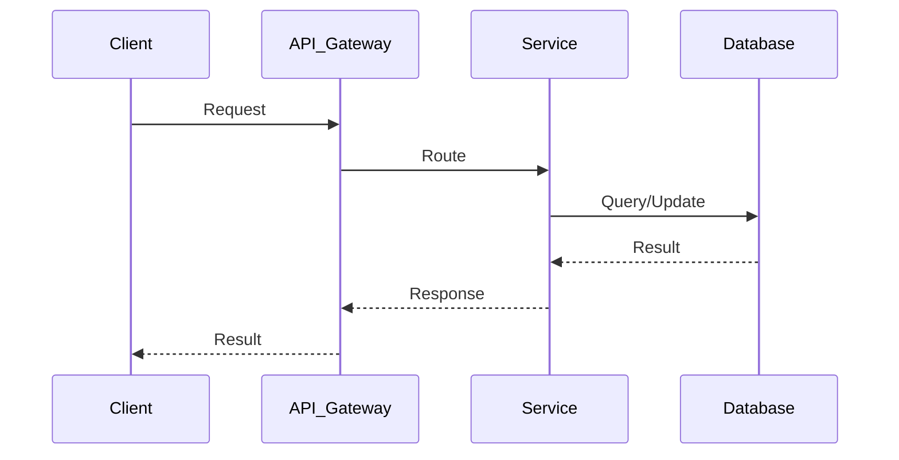
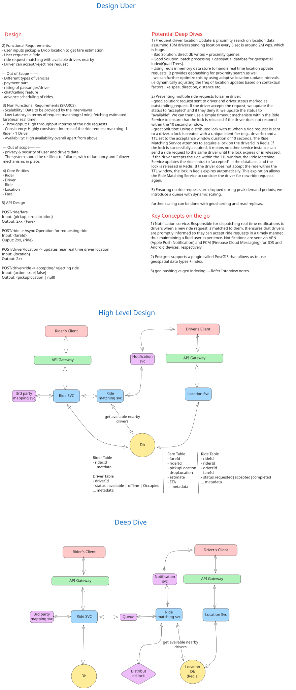

# Uber System Design

| Step | Focus Area | Time Allocation | Key Activities |
|------|-----------|----------------|----------------|
| 1 | Requirements | 5-10 min | Clarify functional and non-functional requirements, identify core features |
| 2 | Core Entities | 3-5 min | Identify main entities and their relationships |
| 3 | API Design | ~5 min | Define key endpoints, methods, and data structures (keep brief) |
| 4 | Data Flow | 5-10 min | Map request/response flows, identify data movement patterns |
| 5 | High-Level Design | 15-20 min | Draw system architecture, components, and their interactions |
| 6 | Deep Dives | 15-20 min | Dive into critical components, address bottlenecks and optimizations |
| 7 | Address Key Issues | 5 min | Handle failures, security, monitoring, and edge cases |

---

## Table of Contents

---
## 1. Requirements (5-10 min)

### Functional Requirements
- [ ] Users input pickup and drop-off locations to get fare estimations.
- [ ] Users can request a ride.
- [ ] System matches ride requests with available drivers nearby.
- [ ] Drivers can accept or reject ride requests.
- [ ] *Out of Scope*: Different vehicle types, payments, ratings, chat/calling, advance scheduling.

### Back-of-the-Envelope (BOE) Calculations
**Step 1: Assumptions**
- Users: 100M riders, 5M drivers
- Activity: 20M rides per day. Drivers send location every 4 seconds.
- Payload: GPS update ~100 bytes.

**Step 2: Load (QPS)**
- Location Update QPS: 5M active drivers / 4s = 1.25M QPS
- Ride Request QPS: 20M / 100,000 = 200 QPS

**Step 3: Storage (5-year plan)**
- Daily location data: 1.25M QPS * 100,000s * 100B = 12.5 TB/day. (Often aggregated).
- Rides DB: 20M * 1KB = 20 GB/day.

**Step 4: Bandwidth**
- Ingress: 1.25M * 100B = 125 MB/s

**Step 5: Cache**
- Real-time geospatial index (Redis Geo) holds current locations of 5M drivers.

### Non-Functional Requirements (SPARCS)
- [ ] **Scalability**: High throughput in terms of concurrent ride requests and driver location updates.
- [ ] **Low Latency**: Request matching (< 1 min), near real-time fare estimation and location tracking.
- [ ] **Consistency**: Highly consistent in ride matching (1 Rider matched to exactly 1 Driver). No double bookings.
- [ ] **Availability**: High availability for the system as a whole.
- [ ] *Out of Scope*: Privacy/security data, deep resiliency/failover mechanics (handled by standard cloud practices).

---

## 2. Core Entities (3-5 min)

- **Rider**: `riderId`, `name`, `contactInfo`
- **Driver**: `driverId`, `vehicleId`, `status` (Available, Busy, Offline), `currentLocation` (Lat/Long)
- **Ride / Trip**: `tripId`, `riderId`, `driverId`, `pickupLoc`, `dropLoc`, `status`, `fare`
- **Relationships**:
  - Rider requests many Trips.
  - Driver completes many Trips.

---

## 3. API Design (~5 min)

### `GET /api/v1/fare-estimate`
- **Purpose**: Get estimated fare before booking.
- **Request Parameters**: `pickup_lat`, `pickup_long`, `drop_lat`, `drop_long`
- **Response**: `200 OK` with estimated amount.

### `POST /api/v1/ride`
- **Purpose**: Request a new ride.
- **Request Body**: `{ "riderId": "123", "pickupLoc": {...}, "dropLoc": {...} }`
- **Response**: `202 Accepted` with `tripId` (Async matching starts).

### `PUT /api/v1/driver/location`
- **Purpose**: Update driver's real-time location.
- **Request Body**: `{ "driverId": "456", "lat": 37.77, "long": -122.41 }`
- **Response**: `200 OK`

---

## 4. Data Flow (5-10 min)

1. Driver app sends location updates to Gateway every few seconds.
2. `Location Service` updates the Spatial Database/Cache (e.g., Redis Geospatial).
3. Rider requests a ride. Hits the `Ride Service`.
4. `Ride Service` calls `Location Service` to query nearby available drivers.
5. `Match Service` ranks drivers (ETA, direction) and pushes notification to the best Driver via `Notification Service`.
6. Driver accepts. State updates to `Busy`. Notification sent back to Rider.

---

## 5. High-Level Design (15-20 min)

### High-Level Architecture

- **Clients**: Rider App, Driver App.
- **API Gateway**: Load balancing, routing, auth.
- **Location Service**: Ingests high-throughput driver location updates and powers geospatial queries.
- **Ride Service**: Manages the Trip lifecycle (Requested -> Matched -> In-Progress -> Completed).
- **Match Service / Dispatcher**: Complex logic to find the optimal driver based on distance, traffic, and direction.
- **Notification Service**: Real-time push notifications using APN (iOS) and FCM (Android) or WebSockets.
- **Databases**:
  - **Relational DB**: Postgres for Users, Trips, and Payments (ACID properties for trip state).
  - **Geospatial DB**: Redis Geo (for fast in-memory proximity searches) or Postgres with PostGIS plugin.

---

## 6. Deep Dives (15-20 min)

### Deep Dive / Data Flow

### Geospatial Indexing & Tracking
> **Challenge**: Storing and querying millions of latitude/longitude coordinates every 4 seconds to find "drivers within 3 miles" requires a specialized database, as standard B-Trees will fail.
>
> **Solution**:
> - Divide the map into a grid of alphanumeric characters using **Geohashing** or **Quadtrees**.
> - Use **Redis Geospatial** (which uses Geohashes internally under Sorted Sets) for ultra-fast, in-memory proximity searches (`GEORADIUS`).
> - **Trade-off**: Redis is in-memory. If it crashes, current locations are lost. Therefore, we asynchronously flush driver locations via Kafka to a persistent store (Cassandra) for historical paths and analytics.

### Concurrency and Ride Matching
> **Challenge**: Two riders in the same busy location requesting a ride at the same millisecond could be assigned the exact same driver.
>
> **Solution**: The Match Service must use distributed locks (e.g., Redis Redlock) or atomic database operations (e.g., `UPDATE Driver SET status = 'Busy' WHERE driverId = 123 AND status = 'Available'`) to ensure 1 Rider maps to exactly 1 Driver. If the update returns 0 affected rows, the driver was just taken, and the system tries the next best driver.

## 7. Address Key Issues (5 min)

### Fault Tolerance & Resiliency
- Microservices must handle retry logic gracefully for intermittent network failures when talking to drivers in poor connectivity zones.
- Use a **Circuit Breaker** pattern. If the third-party maps API (Google Maps) goes down, the system should fall back to a simple "haversine distance" (straight line) calculation to keep the app functioning.

### Security
- Mask actual phone numbers. Use a third-party telephony service (Twilio) to route calls between drivers and riders without exposing personal details.

### Key Concepts on the Go
- **Surge Pricing**: Calculated asynchronously by a Spark/Flink pipeline that analyzes the ratio of open requests to available drivers in a specific Geohash bucket over a tumbling window.
- **Write-Heavy Workload**: The system receives orders of magnitude more GPS updates than ride requests, dictating the need for high-throughput ingestion like Kafka.

## References & Original Diagrams

