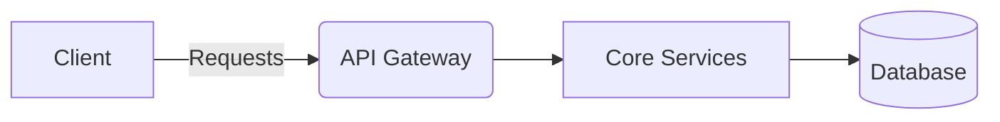
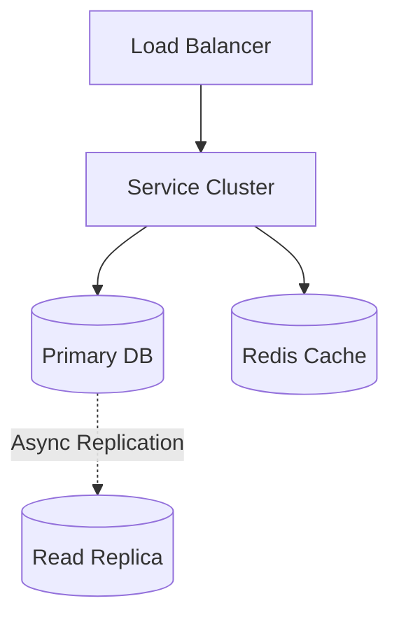

# Food Delivery System Design (e.g., DoorDash, UberEats)

> **System Overview Diagram**

| Step | Focus Area | Time Allocation | Key Activities |
|------|-----------|----------------|----------------|
| 1 | Requirements | 5-10 min | Clarify functional and non-functional requirements, identify core features |
| 2 | Core Entities | 3-5 min | Identify main entities and their relationships |
| 3 | API Design | ~5 min | Define key endpoints, methods, and data structures (keep brief) |
| 4 | Data Flow | 5-10 min | Map request/response flows, identify data movement patterns |
| 5 | High-Level Design | 15-20 min | Draw system architecture, components, and their interactions |
| 6 | Deep Dives | 15-20 min | Dive into critical components, address bottlenecks and optimizations |
| 7 | Address Key Issues | 5 min | Handle failures, security, monitoring, and edge cases |

---

## Table of Contents
- [1. Requirements](#1-requirements-5-10-min)
- [2. Core Entities](#2-core-entities-3-5-min)
- [3. API Design](#3-api-design-5-min)
- [4. Data Flow](#4-data-flow-5-10-min)
- [5. High-Level Design](#5-high-level-design-15-20-min)
- [6. Deep Dives](#6-deep-dives-15-20-min)
- [7. Address Key Issues](#7-address-key-issues-5-min)
- [References & Original Diagrams](#references--original-diagrams)

---
## 1. 📋 Requirements (5-10 min)

### Functional Requirements
- [ ] Users can view nearby restaurants and their menus.
- [ ] Users can place food orders and pay.
- [ ] Restaurants can accept or reject orders.
- [ ] System assigns delivery drivers to accepted orders.
- [ ] Users can track driver location in real-time.

### Back-of-the-Envelope (BOE) Calculations
**Step 1: Assumptions**
- Users: 10M DAU
- Drivers: 500,000 active drivers sending GPS every 5s.
- Orders: 2M / day.

**Step 2: Load (QPS)**
- Location Ingestion QPS: 500,000 / 5s = 100,000 QPS
- Order QPS: 2M / 100,000 = 20 QPS (Avg), 100 QPS (Peak meal times)

**Step 3: Storage (5-year plan)**
- Heavy storage for location traces if persisted. Orders DB is relational and manageable.

**Step 4: Bandwidth**
- High ingress for GPS pings.

**Step 5: Cache**
- Geospatial index (Redis) for driver locations.

### Non-Functional Requirements
- [ ] **High Scalability**: High throughput for location updates and concurrent orders during peak hours (lunch/dinner).
- [ ] **Low Latency**: Near real-time updates for location tracking and order status.
- [ ] **High Consistency**: Order processing and payments require strong transactional consistency (ACID).

---

## 2. 🗄️ Core Entities (3-5 min)

- **User**: `userId`, `location`, `paymentInfo`
- **Restaurant**: `restaurantId`, `location`, `menuId`, `status`
- **Driver**: `driverId`, `currentLocation`, `status` (Available, Busy)
- **Order**: `orderId`, `userId`, `restaurantId`, `driverId`, `status` (Placed, Accepted, PickedUp, Delivered)

---

## 3. 🌐 API Design (~5 min)

### `POST /api/v1/orders`
- **Purpose**: Place a new order.
- **Request Body**: `{ "restaurantId": "123", "items": [{"id": "item1", "qty": 2}] }`
- **Response**: `201 Created` with `orderId`.

### `PUT /api/v1/driver/location`
- **Purpose**: Driver updates their GPS location.
- **Request Body**: `{ "lat": 37.77, "long": -122.41 }`

---

## 4. 🔄 Data Flow (5-10 min)

1. User opens app -> hits API Gateway -> Search Service fetches nearby restaurants from Geo-index.
2. User places order -> Order Service validates cart -> Payment Service handles charge -> Order saved in Relational DB.
3. Order sent to Restaurant app via WebSockets or Push Notifications.
4. Restaurant accepts -> Dispatch Service finds nearby Driver.
5. Driver accepts -> Driver App constantly pings Location Service -> User app polls Location Service.

---

## 5. 🏗️ High-Level Design (15-20 min)

### High-Level Architecture

- **Search Service**: ElasticSearch for fast full-text menu search.
- **Location Service**: High-throughput ingestion of driver GPS coordinates, stored in Redis Geospatial or PostGIS.
- **Order & Payment Service**: Relational DB (PostgreSQL) ensuring ACID compliance for money and inventory.
- **Dispatch Service**: Uses complex algorithms to match the optimal driver (similar to Uber).
- **Notification Service**: WebSockets and Push Notifications for real-time order state changes.
- **Message Queue (Kafka)**: Decouples order creation, restaurant notification, and dispatch matching.

---

## 6. 🔬 Deep Dives (15-20 min)

### Dispatch Algorithm & Driver Matching
- **Challenge**: Finding the right driver quickly without starving others or making food cold.
- **Solution**: The Dispatch Service subscribes to accepted orders via Kafka. It queries the Location Service (`GEORADIUS` in Redis) for available drivers within a 3-mile radius. Drivers are ranked by ETA (using Google Maps API) and pushed a notification. If rejected, it tries the next driver.

### Order State Machine
- **Challenge**: An order transitions through many states across different microservices.
- **Solution**: Use the Saga Pattern for distributed transactions. For example, if payment succeeds but the restaurant rejects the order, the system must trigger a compensating transaction (refund). An Orchestrator service manages this state machine.

---

## 7. 🚧 Address Key Issues (5 min)

### Fault Tolerance & Resiliency
- WebSockets for driver location tracking drop frequently. The client must handle reconnects, and the backend must cache the last known location.

### Security
- Secure payments using PCI-DSS compliant providers (Stripe). Do not store raw credit card numbers.

## References & Original Diagrams
- [Food Delivery System.excalidraw](./Food Delivery System.excalidraw)
