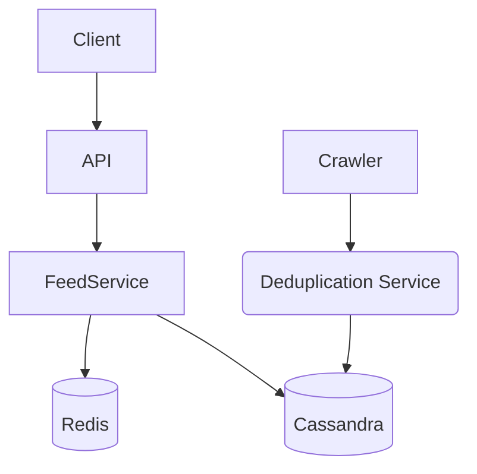
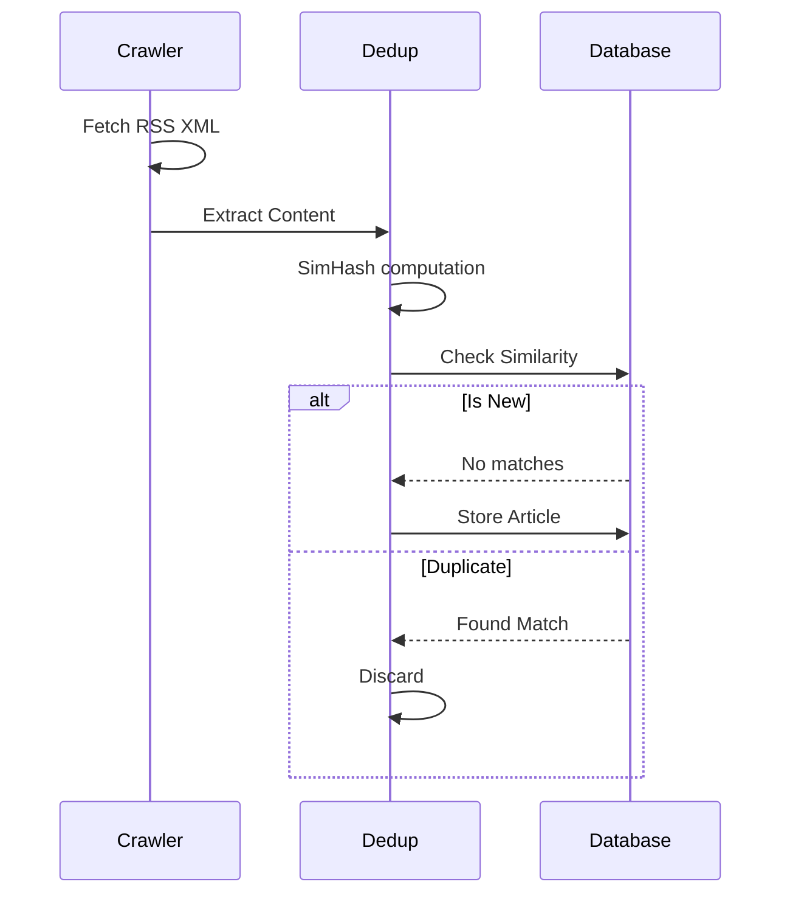
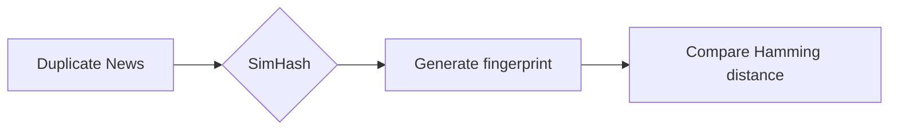

# News Aggregator System Design

| Step | Focus Area | Time Allocation | Key Activities |
|------|-----------|----------------|----------------|
| 1 | Requirements | 5-10 min | Clarify functional and non-functional requirements, identify core features |
| 2 | Core Entities | 3-5 min | Identify main entities and their relationships |
| 3 | API Design | ~5 min | Define key endpoints, methods, and data structures (keep brief) |
| 4 | Data Flow | 5-10 min | Map request/response flows, identify data movement patterns |
| 5 | High-Level Design | 15-20 min | Draw system architecture, components, and their interactions |
| 6 | Deep Dives | 15-20 min | Dive into critical components, address bottlenecks and optimizations |
| 7 | Address Key Issues | 5 min | Handle failures, security, monitoring, and edge cases |

---

## Table of Contents
- [1. Requirements](#1-requirements-5-10-min)
- [2. Core Entities](#2-core-entities-3-5-min)
- [3. API Design](#3-api-design-5-min)
- [4. Data Flow](#4-data-flow-5-10-min)
- [5. High-Level Design](#5-high-level-design-15-20-min)
- [6. Deep Dives](#6-deep-dives-15-20-min)
- [7. Address Key Issues](#7-address-key-issues-5-min)
- [References & Original Diagrams](#references--original-diagrams)

---
## 1. Requirements (5-10 min)

### Functional Requirements
- [ ] System automatically crawls and extracts news from various RSS feeds or websites.
- [ ] Users can view a chronological or personalized feed of aggregated news.
- [ ] Users can search for news articles by keywords.

### Back-of-the-Envelope (BOE) Calculations
**Step 1: Assumptions**
- Users: 50M MAU -> 10M DAU
- Activity: 5 feeds viewed/user/day
- Read/write ratio: 100:1 (read-heavy)
- Payload: Average feed item ~2 KB

**Step 2: Load (QPS)**
- Read QPS: (10M * 5) / 100,000 ≈ 500 QPS
- Write QPS: 500 / 100 ≈ 5 QPS

**Step 3: Storage (5-year plan)**
- Daily Storage: 5 QPS * 100,000s * 2 KB ≈ 1 GB/day
- 5-year storage: 1 GB * 365 * 5 ≈ 1.8 TB

**Step 4: Bandwidth**
- Egress: 500 QPS * 2 KB ≈ 1 MB/s
- Ingress: 5 QPS * 2 KB ≈ 10 KB/s

**Step 5: Cache**
- Top feeds cached: 20% of reads.

### Non-Functional Requirements
- [ ] **High Availability**: The news feed reading side must be highly available.
- [ ] **Scalability**: Must handle high read traffic and a continuously growing dataset of articles.
- [ ] **Low Latency**: Search and feed generation must be fast.

---

## 2. Core Entities (3-5 min)

- **Source**: `sourceId`, `url`, `type` (RSS, Web), `crawlFrequency`
- **Article**: `articleId`, `sourceId`, `title`, `content`, `url`, `publishedAt`
- **User**: `userId`, `preferences`

---

## 3. API Design (~5 min)

### `GET /api/v1/news/feed`
- **Purpose**: Get aggregated news feed for the user.
- **Parameters**: `cursor`, `limit`
- **Response**: List of `Article` objects.

### `GET /api/v1/news/search`
- **Purpose**: Search articles.
- **Parameters**: `q` (query string).

---

## 4. Data Flow (5-10 min)

1. **Ingestion**: Scheduler triggers crawler to fetch RSS feeds -> HTML/XML parsed -> Articles saved to DB and indexed in ElasticSearch.
2. **Serving**: User requests feed -> API queries Cache or DB -> Returns articles.
3. **Searching**: User searches -> API queries ElasticSearch -> Returns matching articles.

---

## 5. High-Level Design (15-20 min)

### High-Level Architecture

- **Feed Aggregator/Crawler**: Background workers (e.g., Celery/Kafka consumers) that fetch and parse external feeds.
- **Deduplication Service**: Checks if the article was already fetched (using URL hash or content hashing).
- **Relational DB / NoSQL**: Stores the raw article text and metadata (Cassandra for high volume, PostgreSQL if smaller).
- **Search Engine**: ElasticSearch cluster to index article content and enable fast full-text searches.
- **Cache**: Redis for caching the top news feed and recent queries.

---

## 6. Deep Dives (15-20 min)

### Deep Dive / Data Flow

### Generic Problem Component

### Content Deduplication
- **Challenge**: Multiple news sites might report the exact same AP/Reuters wire story. Showing the same story 5 times ruins the UX.
- **Solution**: Use Simhash or MinHash algorithms. Unlike MD5 (which changes entirely if a single comma is added), Simhash generates similar hashes for similar text. We can group articles with high similarity scores and only show the canonical version to the user.

---

## 7. Address Key Issues (5 min)

### Fault Tolerance & Resiliency
- Ensure crawlers respect `robots.txt` and employ exponential backoff if a target news site goes down, to avoid infinite failing loops.

## References & Original Diagrams
- [NewsAggregator.excalidraw](./NewsAggregator.excalidraw)
