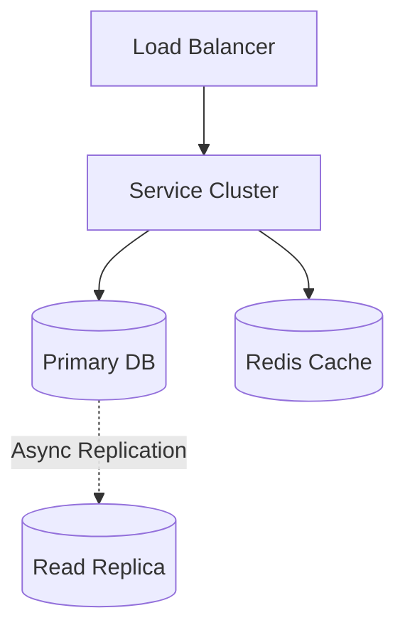
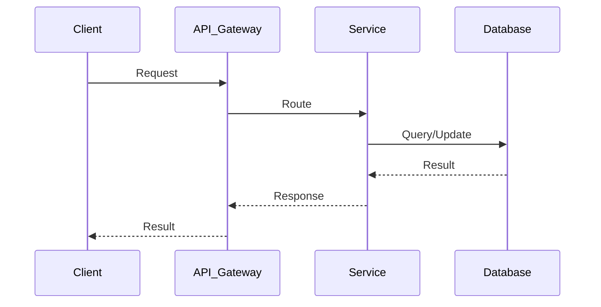

# Facebook Post Search System Design

## Table of Contents
- [1. Requirements (5-10 min)](#1-requirements-5-10-min)
- [2. Core Entities (3-5 min)](#2-core-entities-3-5-min)
- [3. API Design (~5 min)](#3-api-design-5-min)
- [4. Data Flow (5-10 min)](#4-data-flow-5-10-min)
- [5. High-Level Design (15-20 min)](#5-high-level-design-15-20-min)
- [6. Deep Dives (15-20 min)](#6-deep-dives-15-20-min)
- [7. Address Key Issues (5 min)](#7-address-key-issues-5-min)

---
## 1. Requirements (5-10 min)

### Functional Requirements
- [ ] Users can search for posts they have written or posts written by their friends.
- [ ] Search results should be sorted by relevance or time.
- [ ] Search results must respect privacy settings (only show posts the searcher is allowed to see).

### Back-of-the-Envelope (BOE) Calculations
**Step 1: Assumptions**
- Users: 2B MAU -> 1B DAU
- Activity: 2 searches/user/day
- Read/write ratio: 10:1
- Payload: Avg post size ~500 B

**Step 2: Load (QPS)**
- Read QPS: (1B * 2) / 100,000 ≈ 20,000 QPS
- Write QPS (Indexing): 2,000 QPS

**Step 3: Storage (5-year plan)**
- Search Index Daily Storage: 2,000 QPS * 100,000s * 500B ≈ 100 GB/day
- 5-year storage: 100 GB * 365 * 5 ≈ 180 TB

**Step 4: Bandwidth**
- Egress: 20,000 QPS * 10 KB ≈ 200 MB/s
- Ingress: 2,000 QPS * 500 B ≈ 1 MB/s

**Step 5: Cache**
- Search queries cache for hot keywords.

### Non-Functional Requirements
- [ ] **High Scalability**: Billions of posts and millions of searches per second.
- [ ] **Low Latency**: Search results should return in < 200ms.
- [ ] **Real-time Indexing**: New posts should be searchable almost immediately.

---

## 2. Core Entities (3-5 min)

- **Post**: `postId`, `authorId`, `content`, `timestamp`, `privacyScope`
- **User**: `userId`, `friendList`

---

## 3. API Design (~5 min)

### `GET /api/v1/search/posts`
- **Parameters**: `query` (e.g., "birthday party"), `cursor`, `limit`
- **Response**: List of matching `Post` objects.

---

## 4. Data Flow (5-10 min)

1. User creates a post -> Post is saved in DB -> A Kafka event is fired -> Indexer consumes event and updates the Search Index.
2. User searches -> API Gateway -> Search Service -> Queries Index for matching terms -> Filters results by user's social graph (friends) -> Ranks and returns.

---

## 5. High-Level Design (15-20 min)

### High-Level Architecture

- **Search Index (Inverted Index)**: Maps terms to `postIds`.
- **Social Graph DB**: Stores relationships (who is friends with whom).
- **Search Aggregator**: Scatters the search query across multiple index shards, gathers the results, filters them based on permissions, and sorts them.
- **Cache**: Caches the social graph and popular search queries.

---

## 6. Deep Dives (15-20 min)

### Deep Dive / Data Flow

### Graph Intersection (The Core Challenge)
- **Challenge**: A simple full-text search for "birthday" will return millions of posts. Filtering them *after* retrieval to check if the author is a friend is too slow.
- **Solution (Term-at-a-time vs. Document-at-a-time)**:
  - We must intersect the Inverted Index (posts containing "birthday") with the Social Graph (posts authored by friends).
  - To do this efficiently, the Search Index can be partitioned by `authorId` instead of `documentId`.
  - The Search Aggregator queries the Social Graph to get the list of the user's friends. It then queries the specific Index Shards holding the posts for those friends, asking for posts containing "birthday".

---

## 7. Address Key Issues (5 min)

### Index Partitioning
- Partitioning by `Term` vs `Document` vs `Author`. For social search, partitioning by `Author` (or a hash of `AuthorId`) ensures that all posts by a specific user are on the same machine, optimizing the social graph intersection.

## References & Original Diagrams

