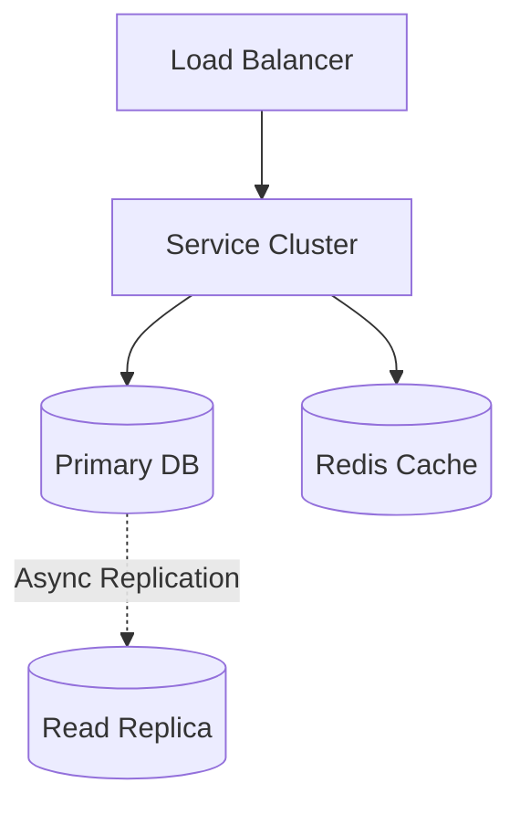
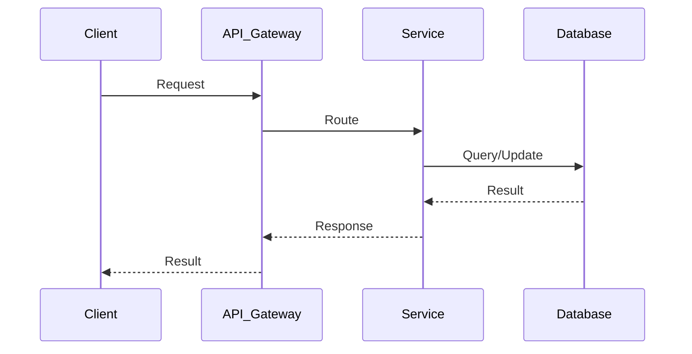

# Ad Click Aggregator System Design

## Table of Contents
- [1. Requirements (5-10 min)](#1-requirements-5-10-min)
- [2. Core Entities (3-5 min)](#2-core-entities-3-5-min)
- [3. API Design (~5 min)](#3-api-design-5-min)
- [4. Data Flow (5-10 min)](#4-data-flow-5-10-min)
- [5. High-Level Design (15-20 min)](#5-high-level-design-15-20-min)
- [6. Deep Dives (15-20 min)](#6-deep-dives-15-20-min)
- [7. Address Key Issues (5 min)](#7-address-key-issues-5-min)

---
## 1. Requirements (5-10 min)

### Functional Requirements
- [ ] Aggregate ad clicks over various time windows (last 1 minute, 1 hour, 1 day).
- [ ] Support queries to retrieve aggregated click counts for a specific Ad ID.
- [ ] Provide reporting dashboards for advertisers.

### Back-of-the-Envelope (BOE) Calculations
**Step 1: Assumptions**
- Events: 10B clicks/day
- Read/write ratio: 1:100 (Write heavy)
- Payload: Click event ~100 B

**Step 2: Load (QPS)**
- Write QPS: 10B / 100,000 ≈ 100,000 QPS
- Read QPS: 1,000 QPS (Dashboards)

**Step 3: Storage (5-year plan)**
- Daily Storage: 100,000 QPS * 100,000s * 100 B ≈ 1 TB/day
- 5-year storage: 1 TB * 365 * 5 ≈ 1.8 PB (Raw), much less after aggregation.

**Step 4: Bandwidth**
- Ingress: 100,000 QPS * 100 B ≈ 10 MB/s
- Egress: 1,000 QPS * 10 KB ≈ 10 MB/s

**Step 5: Cache**
- Fast reads from Time-Series DB cache (Druid).

### Non-Functional Requirements
- [ ] **High Throughput**: Must handle tens of thousands of click events per second.
- [ ] **Accuracy / Exactly-Once Processing**: Clicks are tied to revenue. We cannot overcount or undercount clicks.
- [ ] **Low Latency Reads**: Dashboards should load quickly.

---

## 2. Core Entities (3-5 min)

- **ClickEvent**: `adId`, `userId`, `timestamp`, `ipAddress`
- **AggregatedMetrics**: `adId`, `timeWindow` (e.g., `2024-05-12T10:00Z`), `clickCount`

---

## 3. API Design (~5 min)

### `POST /api/v1/clicks`
- **Purpose**: Record a click.
- **Request**: `{ "adId": "123", "userId": "abc", "timestamp": "..." }`

### `GET /api/v1/metrics/ads/:id`
- **Purpose**: Get click counts for an ad.
- **Parameters**: `startTime`, `endTime`, `resolution` (minute, hour, day).

---

## 4. Data Flow (5-10 min)

1. User clicks an Ad -> API Gateway -> Click gets appended to a Message Queue (Kafka).
2. Stream Processing Engine (Flink/Spark) consumes the stream, deduplicates clicks, and aggregates counts using Tumbling/Sliding windows.
3. Aggregated counts are written to an OLAP Database or Time-Series Database (e.g., Apache Druid or Cassandra).
4. Advertiser Dashboard queries the Database via the Analytics API.

---

## 5. High-Level Design (15-20 min)

### High-Level Architecture

- **Kafka**: Highly durable, partitioned message queue to absorb the massive write load of click events.
- **Apache Flink**: Real-time stream processing engine that supports exactly-once processing semantics and windowing functions.
- **Time-Series DB (Cassandra / Druid)**: Optimized for fast writes and time-range aggregation queries. Storing raw data in a traditional SQL DB would bottleneck quickly.
- **Batch Processing (Hadoop)**: A secondary offline pipeline (Lambda architecture) that re-processes raw logs nightly to ensure 100% accuracy in billing.

---

## 6. Deep Dives (15-20 min)

### Deep Dive / Data Flow

### Exactly-Once Processing & Deduplication
- **Challenge**: A user clicks twice by mistake, or network lag causes the client to retry sending the click event. We shouldn't charge the advertiser twice.
- **Solution**:
  - Generate a unique `clickId` on the client side when the ad is rendered.
  - The Stream Processor maintains a fast Bloom Filter or Redis cache of recently seen `clickId`s (for the last 10 minutes) to drop duplicates.
  - Flink provides built-in exactly-once state snapshots so if a worker crashes, it doesn't process the same Kafka message twice.

### Dealing with Late Events (Watermarks)
- **Challenge**: A user clicks on their mobile phone while in a tunnel. The event reaches the server 5 minutes late.
- **Solution**: Use event-time processing (not processing-time). Flink uses "Watermarks" to allow a grace period for late-arriving events before finalizing a time window and writing it to the database.

---

## 7. Address Key Issues (5 min)

### Storage Optimization
- Raw click logs are moved from Kafka to cheap S3 storage after a few days. The fast Time-Series DB only holds pre-aggregated data (e.g., `Ad 123 got 50 clicks between 10:00 and 10:01`), saving massive amounts of space.

## References & Original Diagrams

