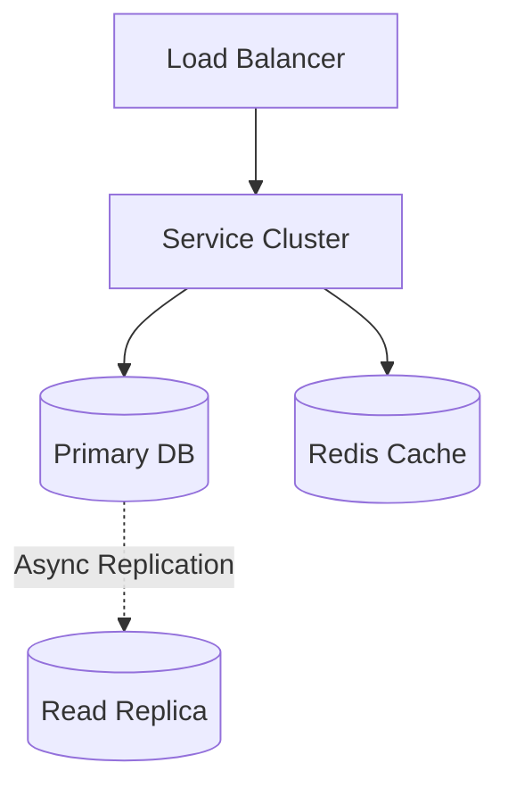
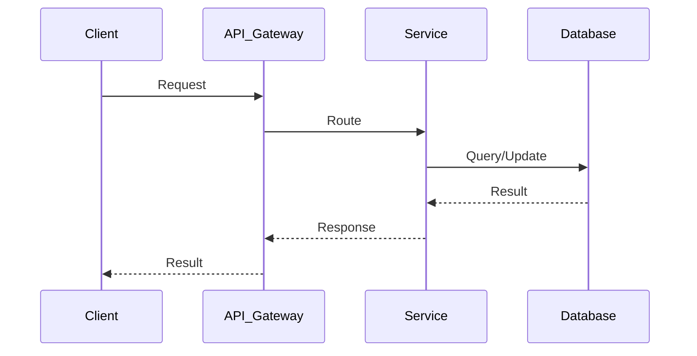
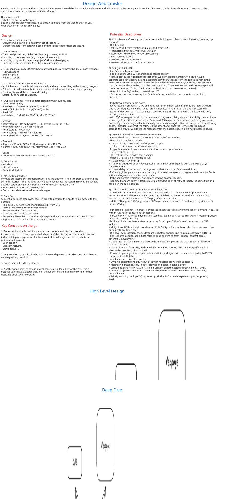

# Web Crawler System Design

## Table of Contents
- [1. Requirements (5-10 min)](#1-requirements-5-10-min)
- [2. Core Entities (3-5 min)](#2-core-entities-3-5-min)
- [3. API Design (~5 min)](#3-api-design-5-min)
- [4. Data Flow (5-10 min)](#4-data-flow-5-10-min)
- [5. High-Level Design (15-20 min)](#5-high-level-design-15-20-min)
- [6. Deep Dives (15-20 min)](#6-deep-dives-15-20-min)
- [7. Address Key Issues (5 min)](#7-address-key-issues-5-min)

---
## 1. Requirements (5-10 min)

### Functional Requirements
- [ ] System starts with a list of seed URLs.
- [ ] Downloads web pages and extracts hyperlinks.
- [ ] Adds new, unvisited URLs to a frontier queue.
- [ ] Stores HTML content for future indexing (Search Engine).

### Back-of-the-Envelope (BOE) Calculations
**Step 1: Assumptions**
- Scale: Crawling 1 Billion pages a month.
- Payload: Avg HTML size ~100 KB.

**Step 2: Load (QPS)**
- Write QPS (Ingestion): (1B / 30) / 100,000 = 333 QPS

**Step 3: Storage (5-year plan)**
- Monthly Storage: 1B * 100 KB = 100 TB / month.
- 5-year storage: 100 TB * 12 * 5 = 6 PB.

**Step 4: Bandwidth**
- Ingress: 333 QPS * 100 KB = 33 MB/s

**Step 5: Cache**
- Bloom filter caching requires ~1.5 GB memory for 1 Billion URLs to ensure 0.01% false positive rate.

### Non-Functional Requirements
- [ ] **Scalability**: Ability to crawl billions of pages efficiently.
- [ ] **Politeness**: Must not DDOS a website. Respect `robots.txt` and implement delay between requests to the same domain.
- [ ] **Robustness**: Handle malformed HTML, circular redirects, spider traps.

---

## 2. Core Entities (3-5 min)

- **URL Frontier**: Queue of `urls` waiting to be crawled.
- **Document**: `docId`, `url`, `contentHash`, `htmlData`
- **VisitedURLs**: Fast lookup table (or Bloom Filter) to track what's been crawled.

---

## 3. API Design (~5 min)

*(Web Crawlers don't usually expose public APIs; they are background distributed systems. However, an internal control API is useful)*
### `POST /api/v1/crawler/seed`
- **Purpose**: Inject new seed URLs into the frontier.
- **Request Body**: `{ "urls": ["https://news.ycombinator.com"] }`

---

## 4. Data Flow (5-10 min)

1. **URL Frontier** pops a URL and assigns it to a Worker.
2. Worker resolves DNS and fetches the HTML using HTTP GET.
3. HTML is sent to the **Content Parser**.
4. Parser checks if the document is a duplicate (using hashes).
5. If new, HTML is stored in Object Storage.
6. **Link Extractor** pulls all URLs from the HTML.
7. URLs are filtered (checking `robots.txt`, removing `visited` URLs).
8. Surviving URLs are pushed back to the **URL Frontier**.

---

## 5. High-Level Design (15-20 min)

### High-Level Architecture

- **URL Frontier**: A complex priority queue. Usually backed by Redis or custom disk-backed queues (e.g., RabbitMQ).
- **DNS Resolver Cache**: Resolving DNS for every page is slow. A custom, highly cached DNS resolver is required.
- **Worker Nodes**: Fleet of stateless servers that fetch web pages.
- **Content Deduplication (Cache)**: Checks if we've seen this page content before to avoid storing duplicates.
- **URL Deduplication (Bloom Filter)**: A memory-efficient data structure to check if a URL has already been visited or is already in the frontier.
- **Storage**: Blob/Object storage (S3) for storing massive raw HTML files.

---

## 6. Deep Dives (15-20 min)

### Deep Dive / Data Flow

### Politeness and URL Routing
- **Challenge**: If the crawler fetches 1,000 links from `example.com` simultaneously, it will crash `example.com`.
- **Solution**: The URL Frontier is partitioned by domain. Each domain gets its own specific FIFO queue. A worker thread is assigned to that queue and enforces a mandatory delay (e.g., 2 seconds) between each HTTP request.

### URL Deduplication at Billion Scale
- **Challenge**: Storing a trillion visited URLs in a Hash Set in memory would require petabytes of RAM.
- **Solution**: Use a **Bloom Filter**. It guarantees "definitely not in set" or "possibly in set". If it says "possibly", we can do a slower check against a disk-backed database (like Cassandra) to confirm. This saves enormous amounts of memory.

### Spider Traps
- **Challenge**: Infinite loops (e.g., `www.site.com/page1/page2/page3...` indefinitely).
- **Solution**: Limit the maximum URL path depth. Also, apply heuristic limits on URL length and frequency of repeating path segments.

---

## 7. Address Key Issues (5 min)

### Fault Tolerance & Resiliency
- Worker node crashes are common (OOM from bad HTML parsing). The URL is simply re-queued in the URL Frontier after a timeout.
- The URL Frontier must be periodically snapshotted to disk so if the queue cluster crashes, the crawl doesn't start over from scratch.

## References & Original Diagrams

