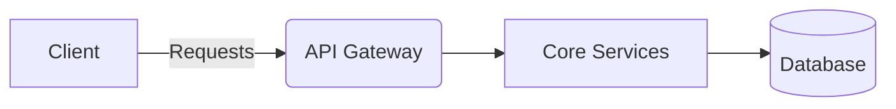
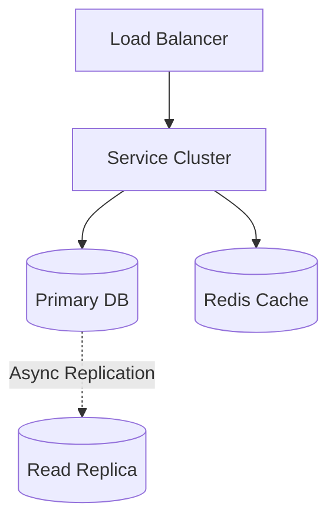

# TicketMaster System Design

> **System Overview Diagram**

| Step | Focus Area | Time Allocation | Key Activities |
|------|-----------|----------------|----------------|
| 1 | Requirements | 5-10 min | Clarify functional and non-functional requirements, identify core features |
| 2 | Core Entities | 3-5 min | Identify main entities and their relationships |
| 3 | API Design | ~5 min | Define key endpoints, methods, and data structures (keep brief) |
| 4 | Data Flow | 5-10 min | Map request/response flows, identify data movement patterns |
| 5 | High-Level Design | 15-20 min | Draw system architecture, components, and their interactions |
| 6 | Deep Dives | 15-20 min | Dive into critical components, address bottlenecks and optimizations |
| 7 | Address Key Issues | 5 min | Handle failures, security, monitoring, and edge cases |

---

## Table of Contents
- [1. Requirements](#1-requirements-5-10-min)
- [2. Core Entities](#2-core-entities-3-5-min)
- [3. API Design](#3-api-design-5-min)
- [4. Data Flow](#4-data-flow-5-10-min)
- [5. High-Level Design](#5-high-level-design-15-20-min)
- [6. Deep Dives](#6-deep-dives-15-20-min)
- [7. Address Key Issues](#7-address-key-issues-5-min)
- [References & Original Diagrams](#references--original-diagrams)

---
## 1. 📋 Requirements (5-10 min)

### Functional Requirements
- [ ] Users can search and view upcoming events/concerts.
- [ ] Users can view venue seating maps and available seats.
- [ ] Users can reserve and purchase tickets.
- [ ] System must hold tickets temporarily during checkout.

### Back-of-the-Envelope (BOE) Calculations
**Step 1: Assumptions**
- Users: 10M DAU, but massive spikes for events (e.g., 5M concurrent for Taylor Swift)
- Activity: Browsing events vs purchasing. Read/write ratio 1000:1 normally, but 10:1 during drops.

**Step 2: Load (QPS)**
- Peak Search QPS: 1,000,000 QPS
- Peak Booking QPS: 10,000 QPS

**Step 3: Storage (5-year plan)**
- Very low storage requirements. Mostly text metadata for events and user profiles. Relational database size < 10 TB.

**Step 4: Bandwidth**
- Minimal bandwidth. HTML/JSON payloads.

**Step 5: Cache**
- Heavy caching of event details and venue maps. Seat availability is hard to cache during high contention.

### Non-Functional Requirements
- [ ] **High Concurrency**: The system must handle massive traffic spikes (e.g., Taylor Swift tickets going on sale) without crashing.
- [ ] **Strong Consistency**: Absolute guarantee against double-booking a single seat.
- [ ] **Fairness**: Implement virtual waiting rooms for high-demand events.

---

## 2. 🗄️ Core Entities (3-5 min)

- **Event**: `eventId`, `name`, `date`, `venueId`
- **Seat**: `seatId`, `eventId`, `status` (Available, Reserved, Sold), `price`
- **Reservation**: `reservationId`, `seatId`, `userId`, `expiresAt`
- **Booking/Ticket**: `ticketId`, `userId`, `seatId`, `paymentId`

---

## 3. 🌐 API Design (~5 min)

### `POST /api/v1/reservations`
- **Purpose**: Temporarily lock a seat while the user enters payment info.
- **Request Body**: `{ "eventId": "123", "seatIds": ["A1", "A2"] }`
- **Response**: `200 OK` (Seat locked for 5 mins) or `409 Conflict` (Seat taken).

### `POST /api/v1/bookings`
- **Purpose**: Finalize purchase and issue ticket.

---

## 4. 🔄 Data Flow (5-10 min)

1. User views Event. Client polls for available seats.
2. User selects seats and clicks "Reserve".
3. Reservation Service executes a distributed lock on the seats in the DB for 5 minutes.
4. User enters payment info.
5. Payment Service clears payment, updates Seat status to `Sold`, generates Ticket.
6. If payment fails or 5 mins expire, background job releases the lock.

---

## 5. 🏗️ High-Level Design (15-20 min)

### High-Level Architecture

- **API Gateway**: Contains Rate Limiting and Virtual Waiting Room logic.
- **Search Service**: ElasticSearch for querying events quickly.
- **Booking/Reservation Service**: Handles the core transaction logic. Requires a highly consistent relational DB (PostgreSQL or Spanner).
- **Payment Service**: Integrates with Stripe/PayPal.
- **Cache**: Redis to cache event details and seating layouts (but *not* actual seat availability during a fast-selling event to avoid stale data).
- **Queue/Cron**: Cleans up expired reservations.

---

## 6. 🔬 Deep Dives (15-20 min)

### High Concurrency Seat Locking
- **Challenge**: 100,000 users click "Buy" on the same 100 seats the second the clock strikes 9:00 AM.
- **Solution (Database Level)**: Use Optimistic Concurrency Control (OCC) or Pessimistic Locking.
  - *Pessimistic*: `SELECT * FROM Seats WHERE seatId IN (A1, A2) AND status = 'Available' FOR UPDATE`. This locks the rows. Update them to 'Reserved', then commit.
  - *Redis Distributed Locks (Redlock)*: Before hitting the DB, try to acquire a lock in Redis for the seat ID. Extremely fast, but requires careful handling if Redis crashes.

### Virtual Waiting Rooms
- **Challenge**: Protecting the database from being DDOS'd by legitimate users.
- **Solution**: Implement a queue at the CDN or API Gateway layer. Users are put into an SQS/Kafka queue. A specific number of users are popped off the queue and allowed into the "purchase flow" based on the system's tested capacity (e.g., 5,000 users/minute).

---

## 7. 🚧 Address Key Issues (5 min)

### Fault Tolerance & Resiliency
- Ticket Generation should be idempotent. If the user clicks "Pay" twice due to lag, they should only be charged once.
- Databases must be highly available with Leader-Follower replication, but writes must go to the Leader to maintain consistency.

## References & Original Diagrams
- [BookMyShow.excalidraw](./BookMyShow.excalidraw)
