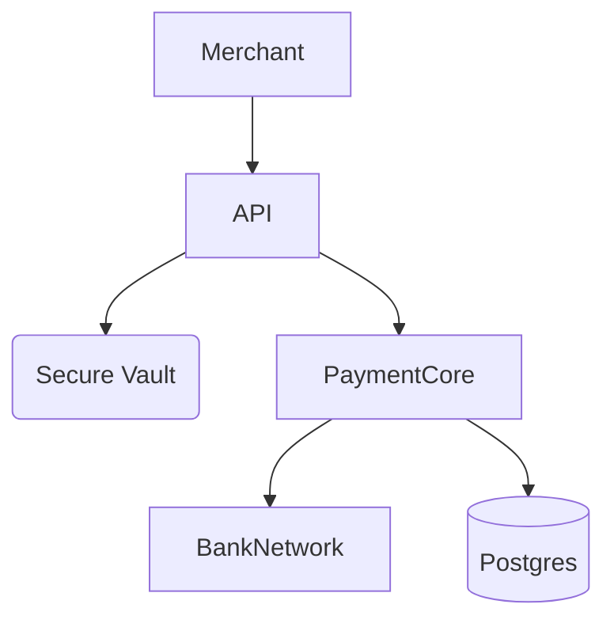
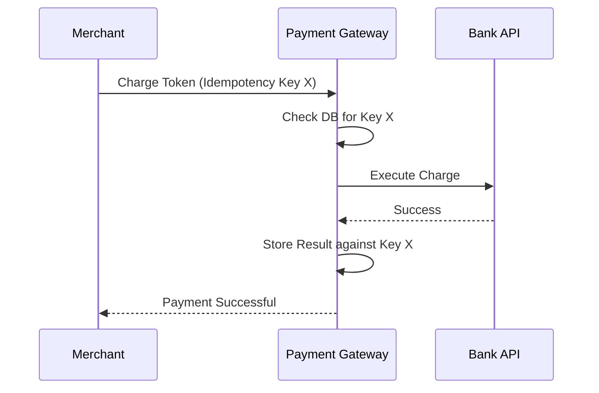
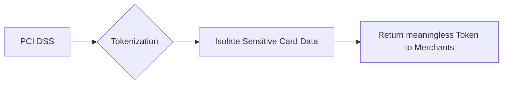

# Payment Gateway System Design

| Step | Focus Area | Time Allocation | Key Activities |
|------|-----------|----------------|----------------|
| 1 | Requirements | 5-10 min | Clarify functional and non-functional requirements, identify core features |
| 2 | Core Entities | 3-5 min | Identify main entities and their relationships |
| 3 | API Design | ~5 min | Define key endpoints, methods, and data structures (keep brief) |
| 4 | Data Flow | 5-10 min | Map request/response flows, identify data movement patterns |
| 5 | High-Level Design | 15-20 min | Draw system architecture, components, and their interactions |
| 6 | Deep Dives | 15-20 min | Dive into critical components, address bottlenecks and optimizations |
| 7 | Address Key Issues | 5 min | Handle failures, security, monitoring, and edge cases |

---

## Table of Contents
- [1. Requirements](#1-requirements-5-10-min)
- [2. Core Entities](#2-core-entities-3-5-min)
- [3. API Design](#3-api-design-5-min)
- [4. Data Flow](#4-data-flow-5-10-min)
- [5. High-Level Design](#5-high-level-design-15-20-min)
- [6. Deep Dives](#6-deep-dives-15-20-min)
- [7. Address Key Issues](#7-address-key-issues-5-min)
- [References & Original Diagrams](#references--original-diagrams)

---
## 1. Requirements (5-10 min)

### Functional Requirements
- [ ] Provide APIs for merchants to process credit card payments.
- [ ] Integrate with external Bank/Card Networks (Visa, Mastercard, acquiring banks).
- [ ] Provide Webhooks to notify merchants of payment success/failure.

### Back-of-the-Envelope (BOE) Calculations
**Step 1: Assumptions**
- Transactions: 1M / day
- Value: High Value
- Read/write ratio: 1:1
- Payload: Transaction ~2 KB

**Step 2: Load (QPS)**
- Write QPS: 1M / 100,000 ≈ 10 QPS
- Peak QPS: 50 QPS

**Step 3: Storage (5-year plan)**
- Daily Storage: 10 QPS * 100,000s * 2 KB ≈ 2 GB/day
- 5-year storage: 2 GB * 365 * 5 ≈ 3.6 TB

**Step 4: Bandwidth**
- Minimal bandwidth requirements.

**Step 5: Cache**
- Caching is avoided for transaction state due to strict consistency requirements.

### Non-Functional Requirements
- [ ] **High Reliability / Accuracy**: Missing a payment or double charging is catastrophic.
- [ ] **Security**: Must be PCI-DSS compliant. Sensitive data must be encrypted.
- [ ] **High Availability**: Must process payments 24/7.

---

## 2. Core Entities (3-5 min)

- **Merchant**: `merchantId`, `apiKeys`, `bankAccount`
- **Transaction**: `transactionId`, `merchantId`, `amount`, `currency`, `status` (Pending, Success, Failed), `cardToken`
- **EventLog**: `eventId`, `transactionId`, `stateChange`

---

## 3. API Design (~5 min)

### `POST /api/v1/payments`
- **Purpose**: Initiate a charge.
- **Request Body**: `{ "amount": 1000, "currency": "USD", "cardToken": "tok_123", "idempotencyKey": "uuid-xyz" }`
- **Response**: `200 OK` (Processed) or `202 Accepted` (Processing async).

---

## 4. Data Flow (5-10 min)

1. User checks out on merchant site. Merchant UI gets a secure Card Token from our Frontend.
2. Merchant Backend calls our API `/payments` with the Token.
3. Payment API saves Transaction as `Pending` in DB.
4. API calls the appropriate Bank/Acquirer Network.
5. Bank responds (Approved/Declined).
6. Payment API updates Transaction status.
7. Payment API pushes an event to a Queue to trigger a Webhook to the Merchant.

---

## 5. High-Level Design (15-20 min)

### High-Level Architecture

- **API Gateway**: Handles Auth (API Keys) and Rate Limiting.
- **Payment Processing Service**: Core logic orchestrating the transaction.
- **Card Tokenization Service**: Stores raw card numbers in an ultra-secure vault and returns tokens (PCI Vault).
- **Bank Adapters**: Microservices specifically tailored to communicate with different external bank APIs.
- **Relational DB**: PostgreSQL or MySQL for strict ACID guarantees on transactions.
- **Message Queue (Kafka)**: Used for async tasks like Webhooks, Fraud Detection, and Ledger syncing.

---

## 6. Deep Dives (15-20 min)

### Deep Dive / Data Flow

### Generic Problem Component

### Idempotency (Preventing Double Charges)
- **Challenge**: The merchant's server makes a request. Our server charges the card successfully. The network drops before we reply to the merchant. The merchant retries the request. The customer is charged twice.
- **Solution**: The merchant MUST include a unique `Idempotency-Key` in the HTTP header.
  - When the request hits the Payment API, we query the DB/Redis: `SELECT * FROM IdempotencyKeys WHERE key = 'uuid-xyz'`.
  - If it doesn't exist, we lock the key, process the payment, and save the result against the key.
  - If the merchant retries with the same key, we immediately return the cached result without hitting the Bank Network again.

### Distributed Transactions & Consistency
- **Challenge**: State must be perfectly maintained across microservices (Payment, Fraud, Ledger).
- **Solution**: Avoid distributed transactions (2PC) if possible due to performance issues. Instead, use an **Event Sourcing** or **Append-Only Ledger** pattern. Every state change is an immutable event inserted into the database. The current state is just the sum of the events. This makes auditing flawless.

---

## 7. Address Key Issues (5 min)

### Security (PCI-DSS)
- **Tokenization**: Merchants never touch the actual credit card number. Our UI directly sends the CC number to our secure Vault Service, bypassing our main application servers. The Vault returns a meaningless Token, which the merchant then uses in API calls.
