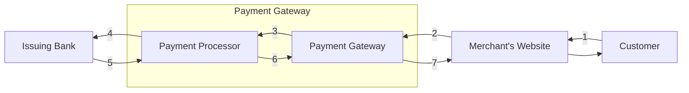
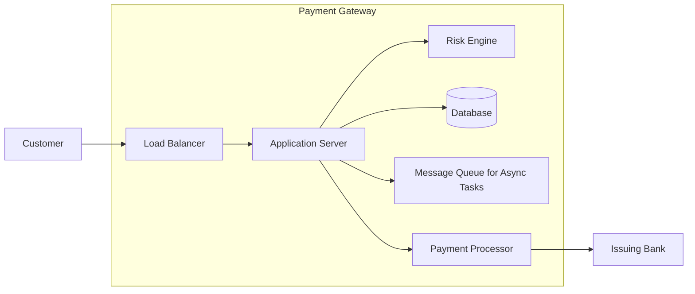
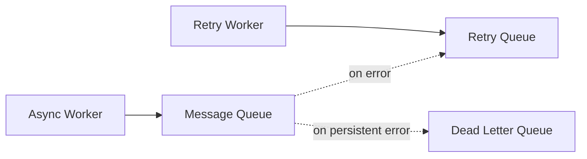

# Design a Payment Gateway

- [Key Terms](#key-terms)
- [Overview](#overview)
- [The Payment Lifecycle (Auth & Capture)](#the-payment-lifecycle-auth--capture)
- [Requirements](#requirements)
- [Back of the Envelope Estimation](#back-of-the-envelope-estimation)
- [Design](#design)
- [API Design](#api-design)
- [Schema Design](#schema-design)
- [The Reconciliation System](#the-reconciliation-system)
- [High Level Architecture](#high-level-architecture)
- [Fraud Detection and Risk Engine](#fraud-detection-and-risk-engine)
- [Failures](#failures)
- [Idempotency](#idempotency)
- [Additional Considerations](#additional-considerations)
- [References](#references)

---

## Key Terms

### Payment Gateway
A service that authorizes credit card payments for e-commerce websites. It is the equivalent of a physical point-of-sale terminal located in many brick-and-mortar stores.

### Payment Processor
A company that facilitates credit card payments. Payment processors are distinct from payment gateways, but often provide both services to merchants. Payment processors typically charge higher fees than payment gateways.

### Payment Service Provider (PSP)
The service that ensures the payment is processed and the funds are transferred from the customer's credit card to the merchant's bank account. PSPs include payment gateways and payment processors.

### Issuing Bank
The bank that issued the customer's credit card.

### Acquiring Bank
The bank that will receive the funds from the customer's credit card payment.

### Card Association
An organization that manages the rules and regulations for a payment network. Examples include Visa, Mastercard, American Express, and Discover.

### Chargeback
A reversal of a transaction initiated by the issuing bank, usually because the customer disputed the charge (e.g., fraud, damaged goods).

### Webhook
An HTTP callback that the payment gateway uses to notify the merchant's server of asynchronous events (like a payment succeeding after a delay, or a dispute being raised).

### PCI DSS
The Payment Card Industry Data Security Standard (PCI DSS) is a set of requirements designed to ensure that all companies that accept, process, store, or transmit credit card information maintain a secure environment.

### 3-D Secure
A protocol that allows customers to authenticate themselves when making a payment. Also known as "Verified by Visa" and "Mastercard SecureCode".

### ISO 8583
An international standard for financial transaction card originated interchange messaging. It is the primary messaging standard used by payment gateways.

---

## Overview

A payment gateway like Stripe or Razorpay allows merchants such as e-commerce websites to accept payments from customers without the hassle of integrating with multiple payment processors. Payment gateways are a critical component of any e-commerce website.

A sample flow of a payment gateway is as follows:

1. The customer enters their credit card details on the merchant's website.
2. The merchant's website sends the credit card details to the payment gateway.
3. The payment gateway transforms the details into a format that is compatible with the payment processor and sends it to the payment processor.
4. The payment processor sends the details to the issuing bank. This can be done using the card association's network or directly.
5. The issuing bank verifies the details and sends a response to the payment processor.
6. The payment processor sends a response to the payment gateway.
7. The payment gateway sends a response to the merchant's website.

> **Note:** The diagram below uses Mermaid. It will render only in tools that support Mermaid code blocks (e.g., GitHub, Obsidian, VS Code preview, Notion). Otherwise you will just see the code block.

---

## The Payment Lifecycle (Auth & Capture)

The standard flow of a credit card transaction is actually broken down into two distinct phases:

### Authorization (Auth)
The payment gateway asks the issuing bank if the customer has enough funds. If yes, the bank holds (locks) the funds. No money has actually moved yet. This step is synchronous.

### Capture (Settlement)
The payment gateway tells the bank to actually transfer the locked funds to the merchant's account. This is usually done in batches at the end of the day (EOD). This step is asynchronous.

> **Note:** A system can do "Auth and Capture" simultaneously (common for digital goods), or separately (common for physical goods where capture happens at the time of shipping).

---

## Requirements

### Functional Requirements

- **Pay-in flow:** The payment gateway should allow customers to pay for goods and services.
- **Pay-out flow:** The payment gateway should allow merchants to receive payments from customers.
- **Store card details:** The payment gateway should allow customers to store their credit card details for future payments securely.

### Non-functional Requirements

- **Reliability and fault tolerance:** Payment gateways are critical components. Failures should be handled gracefully and seamlessly for the customer.
- **Reconciliation:** The payment gateway should be able to reconcile the payments made by customers with the payments received by merchants.
- **Idempotency:** The payment gateway should be able to handle duplicate requests from the merchant's website. The payment should be processed exactly once.
- **Security:** Payment gateways handle sensitive customer data such as credit card details. They must be secure and foolproof against attacks.

### CAP Theorem

Given a distributed computer system, it is impossible to simultaneously provide availability and consistency.

This adds the last non-functional requirement of **Consistency** to the list. For financial transactions, we prioritize Consistency over Availability (CP system).

---

## Back of the Envelope Estimation

Let us assume the system needs to process **1 million** transactions per day. This makes the transactions per second (TPS) ~10. A CP system handling 10 TPS is relatively low traffic, and standard relational databases can handle this easily.

For data size, a single transaction record contains an `id` (UUID - 16 bytes), `user_id`, `merchant_id`, `amount` (Decimal), `currency` (String), `status`, `timestamps`, and metadata. A realistic estimate is **~500 bytes** per transaction.

- **Daily Data:** 1 million tx/day * 500 bytes = ~500 MB/day.
- **5-Year Data:** 500 MB/day * 365 * 5 = ~900 GB (roughly 1 TB).

This volume of data is highly manageable for a modern relational database like PostgreSQL.

---

## Design

At a high level, the payment gateway consists of the following core subsystems:

- **Public APIs & Auth:** REST APIs exposed to merchants, authenticated via API keys or OAuth, rate-limited, and monitored.
- **Card Vault / Tokenization Service:** PCI-scoped microservice that stores and tokenizes sensitive card data.
- **Core Payments Service:** Manages payment lifecycle (auth, capture, refund, void) and persists transaction state.
- **Risk Engine:** Performs fraud checks and decides whether to approve, challenge (e.g., 3-D Secure), or block a transaction.
- **Processor Integration Layer:** Talks to multiple payment processors/acquirers via ISO 8583 or other protocols.
- **Ledger & Reconciliation:** Maintains financial correctness through double-entry bookkeeping and daily reconciliation with banks/processors.
- **Async Workers:** Handle webhooks, emails, ledger writes, retries, and settlement processing via message queues.

---

## API Design

The interaction between the merchant's website and the payment gateway will be through REST APIs.

### Card Details

We need a set of CRUD APIs to manage the card details of the customers.

- `POST /customer/{customer_id}/card`  
  Create a new card. Used when the customer enters their credit card details for the first time. The request body contains card number, expiry date, and CVV.
- `GET /card/{card_id}`  
  Get the metadata of a card (e.g., last 4 digits, expiry).

### Payment APIs

- `POST /payment`  
  Create a new payment. The request body will contain the card token, amount, and currency. Crucially, the request header must include an `Idempotency-Key` provided by the merchant.
- `GET /payment/{payment_id}`  
  Get the details of a payment.

### Webhooks

Because network timeouts happen, the merchant cannot rely solely on the synchronous response of the `POST /payment` API. The gateway must implement a webhook system.

- `POST /merchant-webhook-url`  
  Once a payment reaches a terminal state (e.g., `succeeded`, `failed`), the gateway's asynchronous worker fires an event to the merchant's pre-registered URL to ensure their database is updated.

---

## Schema Design

### Security & PCI Compliance (The Card Vault)

To limit the scope of PCI-DSS compliance, modern payment gateways isolate sensitive card data from the core application database.

- **Card Data Environment (CDE):** A heavily restricted, separate microservice (often called a Tokenization Service or Card Vault).
- When a user submits a card, it goes straight to the Vault. The Vault encrypts the Primary Account Number (PAN), stores it securely, and returns a secure, random string token (e.g., `tok_12345`).
- The core payment gateway application database only ever stores `tok_12345`. When the gateway needs to talk to the processor, it passes the token to a specialized proxy that swaps the token back for the real card number right before it leaves the network.

### Transaction Table

The transaction table stores the details of all the transactions. The schema is as follows:

- `id`
- `user_id`
- `merchant_id`
- `card_token`
- `amount`
- `currency`
- `status`
- `type`
- `created_at`
- `updated_at`

### Ledger Table (Double-Entry Bookkeeping)

Identifying the total amount owed requires figuring out if the transaction is a credit or a debit. Querying the transaction table constantly is inefficient for reconciliation. Instead, we use double-entry bookkeeping.

The ledger table stores the user along with the columns for the debit and credit amounts:

- `id`
- `account_id`
- `debit`
- `credit`
- `transaction_id`
- `timestamp`

If a system is consistent, the sum of all debits and credits across the entire system should always equal zero.

---

## The Reconciliation System

At the end of the day, the payment gateway must ensure that its internal ledger matches the actual money moved by the bank.

- Every night, the Acquiring Bank and Payment Processors generate **Settlement Files** (usually bulk CSV files dropped into a secure SFTP server).
- **Reconciliation Workers:** Cron jobs download these files, parse them, and match the transaction IDs against the gateway's Ledger Table.
- If there are discrepancies (e.g., the gateway shows a payment succeeded, but the bank file doesn't have it), the system flags it in an exceptions queue for manual Financial Operations (FinOps) review.

---

## High Level Architecture

The high-level flow and architecture of the payment gateway, including security and failure handling, is as follows:

1. The customer clicks the `Pay` button on the merchant's website.
2. The request goes to the load balancer of the payment gateway.
3. The load balancer routes the request to the payment gateway Application Server.
4. The Application Server queries the `Risk Engine` to evaluate the transaction for fraud.
5. If marked safe, the application stores the initial transaction state in the database.
6. The Application Server makes a **synchronous** call to the Payment Processor (swapping the token for the real card via the Vault proxy).
7. The Payment Processor calls the Issuing Bank.
8. If successful, the Application Server updates the database, responds to the Merchant, and pushes an event to a Message Queue for asynchronous tasks (Webhooks, Ledger updates, emails).

> **Note:** This diagram also uses Mermaid and will render only in Mermaid-aware viewers.

---

## Fraud Detection and Risk Engine

Before forwarding details to the payment processor, transactions pass through a Risk Engine to prevent fraud via:

- **Velocity Checks:** Does this user/IP have unusually high transaction volumes in the last hour?
- **AVS (Address Verification Service) & CVV:** Do the postal code and the 3-digit security code match what the bank has on file?
- **3-D Secure (Step-Up Authentication):** For medium/high-risk transactions, trigger a 3DS flow where the user authenticates with their bank (OTP, app confirmation, etc.) before the gateway proceeds.
- **Machine Learning Models:** Scoring the transaction based on historical data, device fingerprinting, and behavioral patterns.

The Risk Engine can return decisions like `approve`, `challenge` (e.g., require 3DS), or `deny`, which directly influence whether the payment proceeds to authorization.

---

## Failures

If there are any failures, they should be handled gracefully.

- **Retry Queue:** On a transient error (e.g., network timeout), the asynchronous workers can push the task (like sending a webhook or processing settlement) to a retry queue. The worker uses an exponential backoff algorithm to retry.
- **Dead Letter Queue (DLQ):** If the task fails after a certain number of retries, it is pushed to a DLQ. The DLQ is used by engineers to manually inspect and process the failure.

> **Note:** The diagram below uses Mermaid for visualizing the async failure-handling flow.

---

## Idempotency

Idempotency is the property of an operation that can be applied multiple times without changing the result. This ensures a customer is not charged multiple times if a network drops and the merchant retries the request.

### How it works

1. The **Merchant** generates a unique `Idempotency-Key` (usually a UUID) before making the payment request.
2. The Merchant sends this key in the HTTP header of the `POST /payment` request.
3. The Payment Gateway checks its database for this key.
4. If the key exists, the gateway stops processing and simply returns the cached response of the original transaction.
5. If the key is new, the gateway processes the payment, saves the result alongside the `Idempotency-Key`, and returns the response.

Implementation details commonly include:

- A dedicated `idempotency_keys` table keyed by (`merchant_id`, `idempotency_key`) with:
    - `payment_id`
    - `request_hash` (optional, to detect conflicting replays)
    - `response_body`
    - `status`
    - `created_at`, `expires_at`
- A **unique index** on (`merchant_id`, `idempotency_key`) to prevent races.
- Storing the full canonicalized response body so identical responses can be replayed.

---

## Additional Considerations

These points often come up in senior-level interviews and production-ready designs:

- **Refunds & Chargebacks**
    - Support partial and full refunds with their own entries in the Transaction and Ledger tables, linked via `original_transaction_id`.
    - Model chargebacks as separate ledger movements that reverse or adjust previous credits/debits, with clear dispute states (`disputed`, `won`, `lost`).

- **Multi-Currency & FX**
    - Store amounts in both **minor units** (e.g., cents/paise) and a canonical currency (e.g., merchant’s settlement currency).
    - Keep FX rates in a separate table, referenced by settlement runs, so you can reconstruct historical settlements.

- **Rate Limiting & Abuse Protection**
    - Apply per-merchant and per-IP rate limits on `POST /payment`.
    - Use captchas or stepped-up verification for unusually high-velocity or high-value requests.

- **Observability**
    - Emit structured logs with correlation IDs (e.g., `request_id`, `payment_id`).
    - Expose metrics (P99 latency, error rates, decline reasons) and traces for critical flows (auth, capture, webhook delivery).

- **High Availability & Disaster Recovery**
    - Run stateless services (API, Risk Engine, workers) across multiple AZs/regions.
    - Use managed relational databases with read replicas and regular backups.
    - Design idempotent workers and replayable queues so you can safely reprocess messages after incidents.

- **Security Hygiene**
    - Encrypt data at rest and in transit (TLS everywhere, KMS/HSM-backed keys).
    - Rotate keys regularly for the Card Vault and use strict RBAC so only specific services can detokenize card data.
    - Implement strong audit logging for any access to sensitive data or administrative actions.

---

## References

- [Stripe API](https://stripe.com/docs/api/charges/create)
- [Designing a Payment Gateway](https://www.youtube.com/watch?v=NxjGFIgFCbg)
- [Payment Gateway - All you need to know](https://www.youtube.com/watch?v=yt3My3vUBXo)
- [Card tokenization](https://www.geeksforgeeks.org/what-is-card-tokenization-and-its-benefits/)