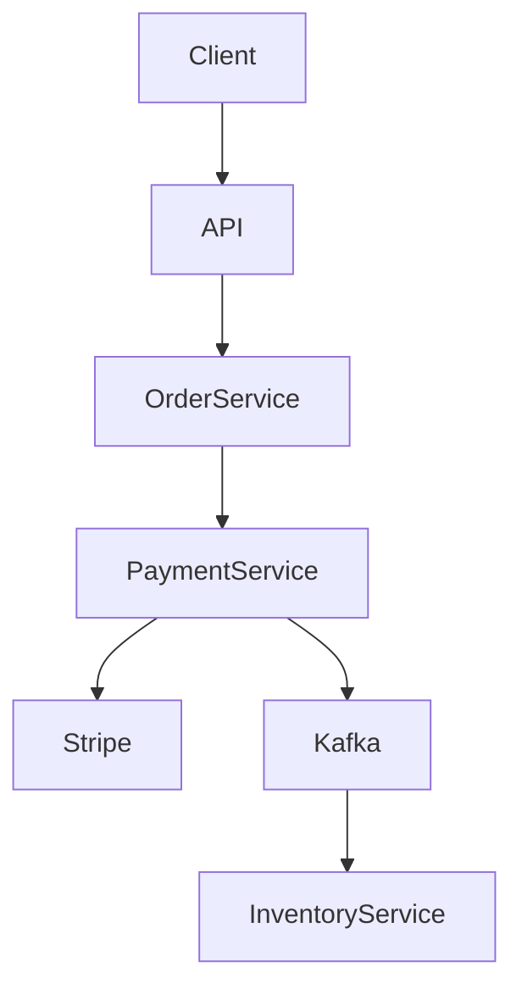
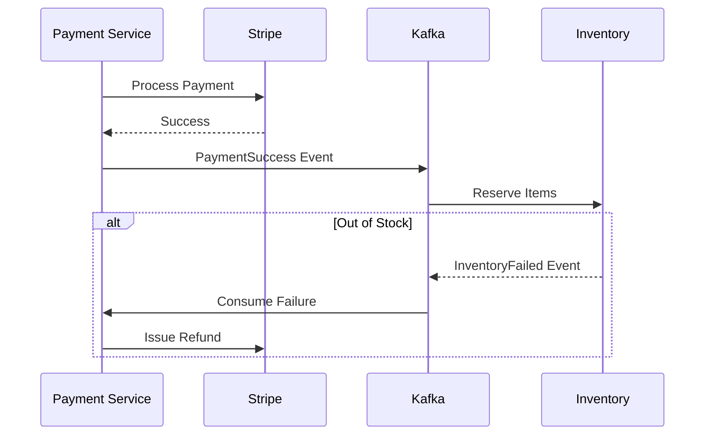
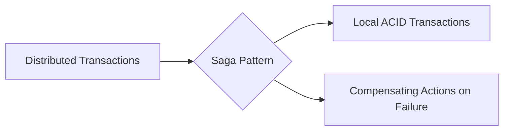

# Ecommerce Payment Service System Design

| Step | Focus Area | Time Allocation | Key Activities |
|------|-----------|----------------|----------------|
| 1 | Requirements | 5-10 min | Clarify functional and non-functional requirements, identify core features |
| 2 | Core Entities | 3-5 min | Identify main entities and their relationships |
| 3 | API Design | ~5 min | Define key endpoints, methods, and data structures (keep brief) |
| 4 | Data Flow | 5-10 min | Map request/response flows, identify data movement patterns |
| 5 | High-Level Design | 15-20 min | Draw system architecture, components, and their interactions |
| 6 | Deep Dives | 15-20 min | Dive into critical components, address bottlenecks and optimizations |
| 7 | Address Key Issues | 5 min | Handle failures, security, monitoring, and edge cases |

---

## Table of Contents
- [1. Requirements](#1-requirements-5-10-min)
- [2. Core Entities](#2-core-entities-3-5-min)
- [3. API Design](#3-api-design-5-min)
- [4. Data Flow](#4-data-flow-5-10-min)
- [5. High-Level Design](#5-high-level-design-15-20-min)
- [6. Deep Dives](#6-deep-dives-15-20-min)
- [7. Address Key Issues](#7-address-key-issues-5-min)
- [References & Original Diagrams](#references--original-diagrams)

---
## 1. Requirements (5-10 min)

### Functional Requirements
- [ ] Users can checkout a shopping cart and initiate a payment.
- [ ] System handles communication with third-party Payment Gateways (Stripe, PayPal).
- [ ] System handles refunds.
- [ ] System updates order status (Paid, Failed) based on payment outcome.

### Back-of-the-Envelope (BOE) Calculations
**Step 1: Assumptions**
- Orders: 5M / day
- Read/write ratio: 1:1
- Payload: Order ~1 KB

**Step 2: Load (QPS)**
- Write QPS: 5M / 100,000 ≈ 50 QPS
- Peak QPS: 200 QPS (Flash Sales)

**Step 3: Storage (5-year plan)**
- Daily Storage: 50 QPS * 100,000s * 1 KB ≈ 5 GB/day
- 5-year storage: 5 GB * 365 * 5 ≈ 9 TB

**Step 4: Bandwidth**
- Minimal bandwidth.

**Step 5: Cache**
- Minimal caching for orders.

### Non-Functional Requirements
- [ ] **Accuracy / Consistency**: Zero tolerance for dropping payment state or double-charging.
- [ ] **Resiliency**: Handle third-party Gateway downtimes gracefully.

---

## 2. Core Entities (3-5 min)

- **Order**: `orderId`, `userId`, `amount`, `status`
- **PaymentIntent**: `paymentId`, `orderId`, `gateway` (Stripe/PayPal), `amount`, `status` (Initiated, Success, Failed)

---

## 3. API Design (~5 min)

### `POST /api/v1/checkout/pay`
- **Request**: `{ "orderId": "123", "paymentMethod": "stripe", "token": "tok_xyz" }`
- **Response**: `200 OK` (Payment Success)

### `POST /api/v1/webhooks/stripe`
- **Purpose**: Endpoint for Stripe to asynchronously notify us of payment success/failure.

---

## 4. Data Flow (5-10 min)

1. Order Service creates Order in DB (Status: `Pending Payment`).
2. User submits Payment -> Hits Payment Service.
3. Payment Service creates `PaymentIntent` in DB (Status: `Initiated`).
4. Payment Service calls External Gateway API with an Idempotency Key.
5. Gateway returns Success -> Update `PaymentIntent` to `Success`.
6. Payment Service publishes `PaymentSucceeded` event to Kafka.
7. Order Service consumes event -> Updates Order Status to `Paid` -> Triggers Fulfillment.

---

## 5. High-Level Design (15-20 min)

### High-Level Architecture

- **Order Service**: Manages carts and orders.
- **Payment Service**: Abstracts away third-party APIs.
- **Database (Relational)**: PostgreSQL for strict ACID guarantees.
- **Message Queue (Kafka)**: Decouples the Payment Service from Order/Inventory/Shipping services.
- **Reconciliation Worker**: Background cron job that compares our DB records with the Payment Gateway's daily reports.

---

## 6. Deep Dives (15-20 min)

### Deep Dive / Data Flow

### Generic Problem Component

### Two-Phase Commit vs Saga Pattern
- **Challenge**: When a payment succeeds, we must update the Order DB and decrement the Inventory DB. If Inventory fails, we must refund the payment.
- **Solution (Saga Pattern)**:
  - Since microservices have their own databases, use a Choreography or Orchestration Saga.
  - *Payment Success* -> *Event Fired* -> *Inventory Service tries to reserve items*.
  - *If Inventory fails (out of stock)* -> *Event Fired* -> *Payment Service consumes failure and triggers a Refund API call to Stripe*.

### Handling Webhooks & Asynchronous Payments
- **Challenge**: Some payments (like Bank Transfers or 3D Secure) take hours to clear. The synchronous API call won't return `Success` immediately.
- **Solution**:
  - Rely heavily on Webhooks. When Stripe clears the payment 2 hours later, it hits our `/webhooks` endpoint.
  - The Webhook handler MUST be idempotent (Stripe might send the same webhook twice). It checks the DB, updates the `PaymentIntent`, and fires the Kafka event.

---

## 7. Address Key Issues (5 min)

### Reconciliation
- Bugs happen. Data gets out of sync. Every night, a batch job downloads the Settlement Report from Stripe and compares every transaction ID and amount against our internal Database. Any discrepancies (e.g., Stripe says paid, but our DB says pending) trigger alerts for manual accounting review.

## References & Original Diagrams
- [PaymentServiceEcommerce-2.excalidraw](./PaymentServiceEcommerce-2.excalidraw)
