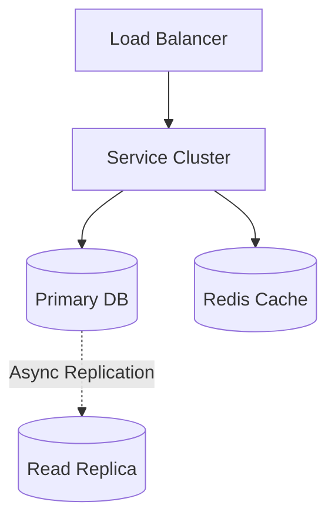
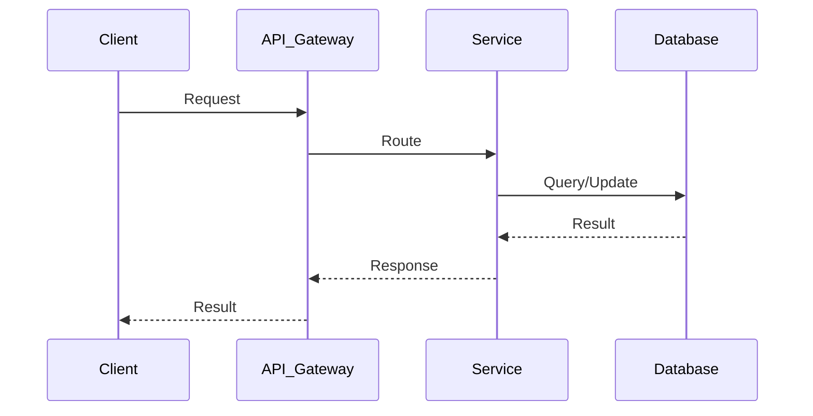

# Key Value Store System Design

## Table of Contents
- [1. Requirements (5-10 min)](#1-requirements-5-10-min)
- [2. Core Entities (3-5 min)](#2-core-entities-3-5-min)
- [3. API Design (~5 min)](#3-api-design-5-min)
- [4. Data Flow (5-10 min)](#4-data-flow-5-10-min)
- [5. High-Level Design (15-20 min)](#5-high-level-design-15-20-min)
- [6. Deep Dives (15-20 min)](#6-deep-dives-15-20-min)
- [7. Address Key Issues (5 min)](#7-address-key-issues-5-min)

---
## 1. Requirements (5-10 min)

### Functional Requirements
- [ ] Clients can execute `put(key, value)` to store data.
- [ ] Clients can execute `get(key)` to retrieve data.
- [ ] Values are opaque byte arrays.

### Back-of-the-Envelope (BOE) Calculations
**Step 1: Assumptions**
- Scale: Petabytes of data. 10M QPS.
- Read/write ratio: 1:1

**Step 2: Load (QPS)**
- Write QPS: 5,000,000 QPS
- Read QPS: 5,000,000 QPS

**Step 3: Storage (5-year plan)**
- Very high. Petabytes distributed across thousands of nodes.

**Step 4: Bandwidth**
- Massive internal cluster bandwidth for replication and anti-entropy.

**Step 5: Cache**
- Bloom filters and Memtables in memory to avoid disk reads.

### Non-Functional Requirements
- [ ] **High Scalability**: Must scale out horizontally to handle petabytes of data.
- [ ] **High Availability**: System must remain available for reads and writes even during node failures.
- [ ] **Low Latency**: Sub-millisecond latency for reads and writes.

---

## 2. Core Entities (3-5 min)

- **Record**: `key` (string/bytes), `value` (bytes), `timestamp`/`version`

---

## 3. API Design (~5 min)

### `put(key, value)`
- Stores the value against the key.

### `get(key)`
- Returns the value associated with the key.

---

## 4. Data Flow (5-10 min)

1. Client sends a request to any Node (Coordinator) in the cluster.
2. Coordinator hashes the key to determine which replica nodes hold the data.
3. Coordinator forwards the request to the replicas.
4. Once a quorum (W or R) responds, the Coordinator returns the result to the client.

---

## 5. High-Level Design (15-20 min)

### High-Level Architecture

- **Consistent Hashing Ring**: Distributes data evenly across the cluster.
- **Data Replication**: Data is replicated to `N` consecutive nodes on the hash ring.
- **Gossip Protocol**: Decentralized mechanism for nodes to discover each other and detect failures.
- **SSTable / LSM Trees**: The on-disk storage engine optimized for high write throughput.

---

## 6. Deep Dives (15-20 min)

### Deep Dive / Data Flow

### CAP Theorem & Quorum Consensus
- **Challenge**: Network partitions happen. We must choose between Consistency and Availability.
- **Solution (Dynamo-style)**: We choose Availability and Eventual Consistency (AP).
  - Define `N` (Replicas), `W` (Write Quorum), `R` (Read Quorum).
  - Rule: `W + R > N` guarantees strong consistency. If we relax this (e.g., `W=1, R=1`), we get high availability and low latency at the cost of eventual consistency.

### Resolving Data Conflicts (Vector Clocks)
- **Challenge**: Since we allow concurrent writes to different replicas during network partitions, data can diverge.
- **Solution**: Use Vector Clocks (a list of `[server, version]` pairs) attached to every value. If a client reads conflicting versions, the client must resolve the conflict and write back the merged result.

---

## 7. Address Key Issues (5 min)

### Fault Tolerance (Hinted Handoff & Merkle Trees)
- **Temporary Failure**: If Node A is down, Node B accepts the write on its behalf (Hinted Handoff). When A returns, B pushes the data to A.
- **Permanent Failure / Anti-entropy**: Nodes compare Merkle Trees (hash trees of their data ranges) periodically in the background to detect and repair missing data efficiently.

## References & Original Diagrams

