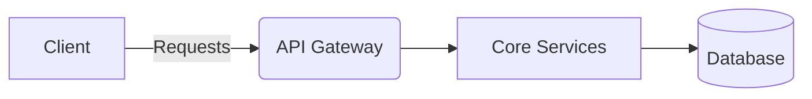
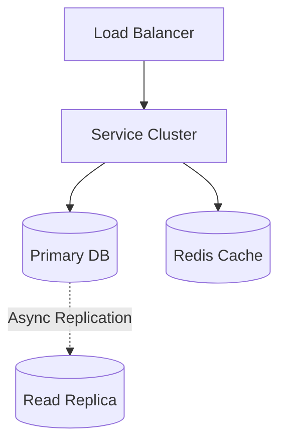

# Distributed Rate Limiter System Design

> **System Overview Diagram**

| Step | Focus Area | Time Allocation | Key Activities |
|------|-----------|----------------|----------------|
| 1 | Requirements | 5-10 min | Clarify functional and non-functional requirements, identify core features |
| 2 | Core Entities | 3-5 min | Identify main entities and their relationships |
| 3 | API Design | ~5 min | Define key endpoints, methods, and data structures (keep brief) |
| 4 | Data Flow | 5-10 min | Map request/response flows, identify data movement patterns |
| 5 | High-Level Design | 15-20 min | Draw system architecture, components, and their interactions |
| 6 | Deep Dives | 15-20 min | Dive into critical components, address bottlenecks and optimizations |
| 7 | Address Key Issues | 5 min | Handle failures, security, monitoring, and edge cases |

---

## Table of Contents
- [1. Requirements](#1-requirements-5-10-min)
- [2. Core Entities](#2-core-entities-3-5-min)
- [3. API Design](#3-api-design-5-min)
- [4. Data Flow](#4-data-flow-5-10-min)
- [5. High-Level Design](#5-high-level-design-15-20-min)
- [6. Deep Dives](#6-deep-dives-15-20-min)
- [7. Address Key Issues](#7-address-key-issues-5-min)
- [References & Original Diagrams](#references--original-diagrams)

---
## 1. 📋 Requirements (5-10 min)

### Functional Requirements
- [ ] Identify clients by User ID, IP address, or API key to apply appropriate limits.
- [ ] Limit HTTP requests based on configurable rules (e.g., 100 requests per minute).
- [ ] When limits are exceeded, reject requests with HTTP 429 (Too Many Requests) and include helpful headers (e.g., `X-RateLimit-Retry-After`).
- [ ] *Out of scope:* Complex querying/analytics on RL, long-term persistence of RL data.

### Back-of-the-Envelope (BOE) Calculations
**Step 1: Assumptions**
- API requests: 10 Billion / day
- Rule: 100 req/min per user

**Step 2: Load (QPS)**
- QPS: 10B / 100,000 ≈ 100,000 QPS globally.

**Step 3: Storage (5-year plan)**
- Local Cache rules + Distributed Redis counters.
- Redis Storage: 10M active users * (key + counter + timestamp = 20 bytes) = 200 MB memory.

**Step 4: Bandwidth**
- Minimal payload (Redis commands).

**Step 5: Cache**
- 100% in-memory cache architecture.

### Non-Functional Requirements
- [ ] **High Availability**: The rate limiter must not become a single point of failure.
- [ ] **Low Latency**: Latency overhead added to each request should be minimal (single-digit milliseconds).
- [ ] **Accuracy**: Must accurately enforce limits in a distributed environment (servers must share global request counts).

---

## 2. 🗄️ Core Entities (3-5 min)

- **Rule**: `ruleId`, `identifierType` (IP, UserId), `limit`, `timeWindow` (e.g., 1 minute).
- **Counter/State**: `key` (e.g., `user:123:api:/upload`), `count`, `window_timestamp`.

---

## 3. 🌐 API Design (~5 min)

*(Rate Limiting is typically enforced via interceptors/middleware, but rules can be managed via API)*

### `GET /api/v1/resource` (Example Protected Endpoint)
- **Response if allowed**: `200 OK`, along with headers `X-RateLimit-Limit`, `X-RateLimit-Remaining`.
- **Response if limited**: `429 Too Many Requests`, along with header `X-RateLimit-Retry-After`.

---

## 4. 🔄 Data Flow (5-10 min)

1. Client sends request to the API Gateway.
2. Gateway extracts identifier (User ID / IP).
3. Gateway queries the Rate Limiter Service / Cache (Redis) to get the current count.
4. If count < limit, Redis increments count, request goes to Backend Server.
5. If count >= limit, Gateway drops request, returns 429 to Client.

---

## 5. 🏗️ High-Level Design (15-20 min)

### High-Level Architecture

### Where to Place the Rate Limiter?
- **Bad**: Alongside the server. *Issue: Servers are not aware of the global request count, making limits inaccurate.*
- **Good**: Dedicated Service. *Issue: Latency overhead of service calls, point of failure. Need to decide on fail-open vs fail-closed.*
- **Great**: API Gateway. *Challenge: Limited context about the request.*

### Architecture Components
- **API Gateway**: Intercepts all traffic.
- **Rules Cache**: Local cache (in-memory) inside the Gateway fetching rules periodically from a Configuration DB.
- **Distributed Cache (Redis)**: Stores the actual counters and state of the rate limiter. Must be fast and support atomic operations.

---

## 6. 🔬 Deep Dives (15-20 min)

### Rate Limiting Algorithms
- **Token Bucket**: Bucket holds tokens. Tokens added at fixed rate. Request takes a token. (Good for burst traffic).
- **Leaking Bucket**: Requests enter a queue and are processed at a fixed rate. (Good for stable outbound rates).
- **Fixed Window Counter**: Count requests in a fixed time window (e.g., 12:00-12:01). *Flaw: Spike of traffic at the edge of the window can double the allowed limit.*
- **Sliding Window Log**: Store timestamps of all requests. Very accurate but consumes high memory.
- **Sliding Window Counter (Recommended)**: Hybrid of Fixed Window and Sliding Window Log. Uses weighted previous window count to smooth traffic spikes.

### Concurrency and Distributed Setup
- **Challenge**: Race conditions when multiple Gateway nodes query and update Redis simultaneously.
- **Solution**: Use Redis `INCR` or Lua Scripts to perform read-and-update operations atomically.

---

## 7. 🚧 Address Key Issues (5 min)

### Fault Tolerance & Resiliency
- **Fail-Open**: If Redis or the RL service goes down, the Gateway should "Fail-Open" (allow requests to pass through). It's better to overload the backend slightly than to take the entire API offline ("Fail-Closed").

### Performance (Latency Optimization)
- Accessing centralized Redis across regions adds latency.
- Deploy Redis instances in the same data centers as API Gateways.

### Security
- Protect against Distributed Denial of Service (DDoS) by rate-limiting heavily on IP addresses at the Edge (CDN level) before it even hits the API Gateway.

## References & Original Diagrams
- [DistributedRateLimiting.excalidraw](./DistributedRateLimiting.excalidraw)
