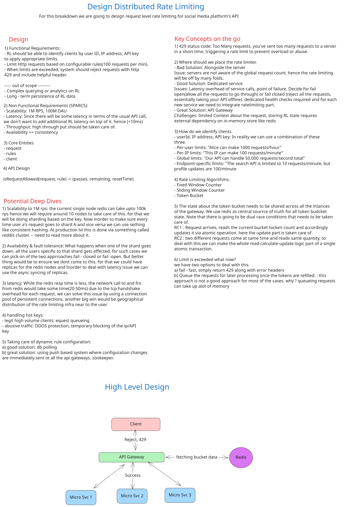

# Distributed Rate Limiter

## Problem Statement

Design a request-level rate limiter for a social media platform's API. The system must identify clients (by user ID, IP address, or API key), enforce configurable rate limit rules (e.g., 100 requests/minute per user), and reject excess requests with HTTP 429 status codes while maintaining high throughput (1M RPS) and minimal latency overhead (<10ms).

---

## High-Level Design

### Architecture Overview



### Component Breakdown

| Component | Role | Details |
|-----------|------|---------|
| **Clients** | Request Origin | Authenticated users (User ID), IP addresses, or API keys making HTTP requests |
| **API Gateway** | Entry Point & Load Balancer | Routes requests to microservices; implements rate limit checks before forwarding |
| **Rate Limiting Logic** | Decision Engine | Evaluates Token Bucket algorithm; fetches/updates counters from Redis |
| **Redis Cluster** | Distributed Storage | Maintains atomic bucket state; supports horizontal sharding by Client ID for scalability |
| **Microservices** | Business Logic | Process requests that pass rate limit checks; return 200 OK or 429 Too Many Requests |

---

## 1. Requirements

### 1.1 Functional Requirements

| Requirement | Description |
|-------------|-------------|
| **Client Identification** | System identifies clients by User ID, IP address, or API key to apply appropriate limits |
| **Configurable Rate Limits** | Support rules like "100 requests/minute per user" or "10 requests/minute per IP" |
| **HTTP 429 Response** | Reject excess requests with HTTP 429 ("Too Many Requests") status code |
| **Rate Limit Headers** | Include X-RateLimit-Limit, X-RateLimit-Remaining, X-RateLimit-Reset headers |
| **Multiple Limit Types** | Support per-user, per-IP, per-endpoint, and global rate limits simultaneously |
| **Dynamic Rule Configuration** | Allow rate limit rules to be updated without system restart |

### 1.2 Non-Functional Requirements (SPARCS Framework)

| Dimension | Target | Rationale |
|-----------|--------|-----------|
| **Scalability (Throughput)** | 1M RPS across 100M DAU | Horizontal sharding across Redis instances; stateless gateways |
| **Performance (Latency)** | <10ms per rate limit check | In-memory Redis operations; atomic transactions prevent race conditions |
| **Availability** | 99.9% uptime (3 nines) | Redis replication; fail-open policies; no single point of failure |
| **Reliability** | Fault tolerance on shard failure | Replica promotion; request queuing on cache miss (eventual consistency OK) |
| **Consistency** | Eventual consistency | Slight delays in limit enforcement across shards acceptable; no strong ACID required |
| **Security** | DDoS protection; client isolation | Rate limit blocking for abusive IPs; client data never leaked; encryption in transit (TLS) |

---

## 2. Capacity Estimation & Constraints

### 2.1 Back-of-the-Envelope Calculation

| Metric | Calculation | Value |
|--------|-------------|-------|
| **Daily Active Users (DAU)** | Given | 100M |
| **Avg Requests per User per Day** | Assume 50 API calls/day/user | 50 |
| **Total Daily Requests** | 100M × 50 | 5B RPS-days |
| **Requests per Second (RPS)** | 5B / 86,400 sec | ~57,870 RPS |
| **Peak RPS (10x average)** | 57,870 × 10 | ~578,700 RPS |
| **Required System Capacity** | Given requirement (design for) | 1,000,000 RPS |
| | | |
| **Read Operations (Rate Limit Checks)** | 1M RPS (100% read-heavy for checks) | 1M ops/sec |
| **Write Operations (Token Updates)** | 1M RPS (every request updates state) | 1M ops/sec |
| **Combined Throughput Needed** | Atomic read-modify-write | 1M HMGET + HSET per sec |

### 2.2 Storage Estimation

| Category | Calculation | Value |
|----------|-------------|-------|
| **Bucket State per Client** | User ID (8 bytes) + tokens (4 bytes) + last_refill (8 bytes) | ~20 bytes |
| **Active Clients (peak)** | DAU × Concurrent Session % (assume 10%) | 10M concurrent |
| **Total Storage (Buckets)** | 10M clients × 20 bytes | ~200 MB |
| **Overhead (Metadata, Replicas)** | Redis 2x replication + hash table overhead | ~1 GB total |
| **Long-term Storage (Audit Logs)** | Not required (short-lived state); TTL = 1 hour | ~0 GB persistent |

### 2.3 Bandwidth Estimation

| Direction | Calculation | Value |
|-----------|-------------|-------|
| **Inbound (Client → Gateway)** | 1M RPS × 1 KB/request | ~1 Gbps |
| **Outbound (Gateway → Client)** | 1M RPS × 100 bytes (429 error) | ~100 Mbps |
| **Gateway ↔ Redis** | 1M RPS × 100 bytes per check | ~100 Mbps |
| **Redis Internal (Replication)** | Write-heavy; 2x replication | ~200 Mbps |
| **Total Bandwidth Budget** | Inbound + Redis + buffer | ~2 Gbps |

---

## 3. Core Entities & Data Model

### 3.1 Core Entities

| Entity | Definition |
|--------|-----------|
| **Client** | Entity being rate limited; identified by User ID, IP Address, or API Key |
| **Rule** | Rate limiting policy (e.g., "1000 requests/hour per authenticated user") |
| **Request** | Incoming API request; carries client context (ID, endpoint, timestamp) |
| **Token Bucket** | In-memory state tracking current tokens, refill rate, and last update timestamp |

### 3.2 Database Schema

#### Redis Hash: Client Token Bucket

```
Key: "{clientId}:bucket"
Type: Hash

Fields:
  tokens (integer)         → Current available tokens in the bucket
  last_refill (timestamp)  → Unix timestamp of last token refill
  max_tokens (integer)     → Maximum capacity of the bucket
  refill_rate (float)      → Tokens per second to refill
```

**Example:**
```
SET alice:bucket {
  "tokens": 47,
  "last_refill": 1704067200,
  "max_tokens": 100,
  "refill_rate": 1.67  // 100 tokens per 60 seconds
}
EXPIRE alice:bucket 3600  // Auto-cleanup after 1 hour inactivity
```

#### Rules Configuration Table (Optional: SQL for Historical Reference)

```
Table: rate_limit_rules

Columns:
  rule_id (UUID)          → Unique rule identifier
  client_type (string)    → "user_id", "ip_address", "api_key"
  limit (integer)         → Max requests allowed
  window_seconds (int)    → Time window in seconds
  endpoint_pattern (str)  → API endpoint (e.g., "/api/search")
  enabled (boolean)       → Whether rule is active
  created_at (timestamp)  → Rule creation timestamp
  updated_at (timestamp)  → Last modification timestamp
```

### 3.3 Entity Relationships

- **1:N (Client : Token Bucket)**: Each client has exactly one active token bucket in Redis at any time.
- **1:N (Rule : Client)**: Each rule applies to many clients matching its criteria (e.g., all authenticated users).
- **M:N (Request : Rule)**: A request may match multiple rules (per-user AND per-IP limits); most restrictive applies.

**Primary Key Strategy:**
- **Redis Bucket Key**: Composite key format `{clientId}:bucket` ensures uniqueness and enables sharding by `clientId`.
- **Rules Table**: UUID4 for globally unique identifiers across regions; timestamp-based ordering for efficient queries.

---

## 4. API Design

### 4.1 Core Endpoints

| Method | Endpoint | Request | Response | Description |
|--------|----------|---------|----------|-------------|
| **ANY** | `/*` | `Authorization: Bearer {JWT}` or `X-API-Key: {key}` | HTTP 200 + payload or HTTP 429 + headers | All requests pass through rate limiter before routing to microservices |
| **POST** | `/admin/rate-limit-rules` | `{ client_type, limit, window_seconds, endpoint_pattern }` | HTTP 201 + rule_id | Create new rate limit rule (admin only) |
| **PATCH** | `/admin/rate-limit-rules/{rule_id}` | `{ limit, enabled }` | HTTP 200 + updated rule | Update existing rate limit rule |
| **GET** | `/admin/rate-limit-rules` | Query: `client_type=user_id&enabled=true` | HTTP 200 + array of rules | List all rate limit rules with filters |
| **GET** | `/admin/clients/{clientId}/status` | N/A | HTTP 200 + `{ tokens, remaining, reset_time }` | Query current token bucket state for debugging |

### 4.2 Request/Response Examples

**Successful Request (Within Limits):**
```http
GET /api/posts HTTP/1.1
Host: api.example.com
Authorization: Bearer eyJhbGc...
User-Agent: curl/7.64.1

HTTP/1.1 200 OK
Content-Type: application/json
X-RateLimit-Limit: 100
X-RateLimit-Remaining: 47
X-RateLimit-Reset: 1704067260

{ "posts": [...] }
```

**Rate Limited Request (Exceeded):**
```http
GET /api/posts HTTP/1.1
Host: api.example.com
Authorization: Bearer eyJhbGc...

HTTP/1.1 429 Too Many Requests
Content-Type: application/json
X-RateLimit-Limit: 100
X-RateLimit-Remaining: 0
X-RateLimit-Reset: 1704067260
Retry-After: 60

{
  "error": "rate_limit_exceeded",
  "message": "You have exceeded the rate limit of 100 requests per minute.",
  "retry_after_seconds": 60
}
```

---

## 5. Data Flow & Request Lifecycle

### 5.1 Write Path (Rate Limit Enforcement)

```
1. Client sends HTTP request → API Gateway
   └─ Extract client ID from JWT/API Key/IP address

2. Gateway queries Redis for current bucket state
   └─ HMGET {clientId}:bucket tokens last_refill max_tokens refill_rate

3. Calculate refillable tokens
   └─ elapsed_seconds = now - last_refill
   └─ tokens_to_add = min(elapsed_seconds * refill_rate, max_tokens - current_tokens)
   └─ new_tokens = current_tokens + tokens_to_add

4. Atomic decision & update (Redis Transaction)
   ├─ IF new_tokens >= 1:
   │  ├─ DECREMENT tokens by 1
   │  ├─ UPDATE last_refill = now
   │  └─ ALLOW request (pass to microservice)
   └─ ELSE:
      ├─ DENY request
      └─ Return HTTP 429 with Retry-After header

5. Redis atomicity (prevents race conditions)
   └─ MULTI
      ├─ HSET {clientId}:bucket tokens {new_tokens}
      ├─ HSET {clientId}:bucket last_refill {now}
      └─ EXPIRE {clientId}:bucket 3600
      └─ EXEC (all-or-nothing)

6. Gateway returns response to Client
   └─ Include X-RateLimit-* headers in all responses
```

**Synchronous vs. Asynchronous:**
- **Synchronous**: Rate limit check (steps 2-5) blocks request processing (required for correctness).
- **Asynchronous**: Optional metrics/logging pushed to message queue (Kafka) for later analytics (decoupled).

### 5.2 Read Path (Query Bucket Status - Admin)

```
1. Admin requests GET /admin/clients/{clientId}/status
2. Gateway queries Redis HGETALL {clientId}:bucket
3. Calculate time until reset
   └─ reset_time = last_refill + window_seconds
   └─ reset_in_seconds = reset_time - now
4. Return current state to admin
   └─ { tokens: 47, reset_in: 13, limit: 100 }
```

---

## 6. High-Level Design Deep Dives

### 6.1 Rate Limiting Algorithms

#### Token Bucket Algorithm (Chosen)

**How it works:**
- Each client has a "bucket" with a maximum capacity (e.g., 100 tokens).
- Tokens refill at a constant rate (e.g., 1 token per second = 60 tokens/minute).
- Each request costs 1 token. If tokens available, request passes; otherwise, it's rejected.

**Pseudocode:**
```
FUNCTION isRequestAllowed(clientId, limit, window_seconds):
  bucket = REDIS.HGETALL("{clientId}:bucket")
  
  IF bucket IS NULL:
    // First request from this client
    CREATE bucket WITH:
      tokens = limit
      last_refill = now()
      max_tokens = limit
      refill_rate = limit / window_seconds
    SAVE bucket TO REDIS WITH TTL 3600s
  
  elapsed = now() - bucket.last_refill
  tokens_to_add = MIN(elapsed * bucket.refill_rate, bucket.max_tokens - bucket.tokens)
  bucket.tokens += tokens_to_add
  bucket.last_refill = now()
  
  IF bucket.tokens >= 1:
    bucket.tokens -= 1
    UPDATE bucket IN REDIS
    RETURN {passed: TRUE, remaining: bucket.tokens, reset: bucket.last_refill + window_seconds}
  ELSE:
    RETURN {passed: FALSE, remaining: 0, reset: bucket.last_refill + window_seconds}
```

**Advantages:**
- Smooth burst allowance (up to bucket capacity).
- Natural fit for uniform rate limits.
- Sub-millisecond Redis performance.

**Disadvantages:**
- No defense against sudden traffic spikes (burst up to max capacity).
- Requires synchronized clocks across distributed nodes.

#### Alternative Algorithms (Trade-offs)

| Algorithm | Mechanism | Best For | Drawback |
|-----------|-----------|----------|----------|
| **Fixed Window Counter** | Count resets every minute | Simple implementation | Boundary spike issue (requests at window edges) |
| **Sliding Window Log** | Maintain timestamp list of all requests | Accurate per-request tracking | Memory intensive (O(n) storage per client) |
| **Sliding Window Counter** | Hybrid of fixed + sliding | Reduced memory vs. pure log | Slightly less accurate than log |
| **Token Bucket** | ✓ Chosen | Bursty traffic; smooth allowance | Initial bucket design required |

---

### 6.2 Scaling Optimizations

#### 6.2.1 Horizontal Sharding of Token Buckets

**Problem:** Single Redis instance becomes bottleneck at 1M RPS.

**Solution:** Shard Redis cluster by Client ID.

```
Sharding Strategy: Consistent Hashing

Client ID → Hash Function → Redis Shard Assignment

hash(clientId) % number_of_shards = shard_index

Example (12 shards):
- hash("alice") % 12 = 3 → Shard 3
- hash("bob") % 12 = 7 → Shard 7
- hash("charlie") % 12 = 3 → Shard 3 (same as Alice)

Benefits:
- Load balanced: Each shard handles ~1M/12 = ~83k RPS
- Hot clients isolated: "charlie" contention doesn't affect "bob"
- Linear scalability: Add shards, rebalance with consistent hashing
```

**Capacity per Shard:**
- Each Redis instance can handle ~100k-500k ops/second (depending on machine specs).
- For 1M RPS: `1M / 100k = 10 shards minimum` (with 5x safety margin).

#### 6.2.2 Caching at Gateway (Local Cache)

**Problem:** Network round-trip to Redis adds ~1-5ms latency.

**Solution:** Local in-memory cache at API Gateway with synchronization.

```
Gateway Architecture:

Request arrives
    ↓
Check Local LRU Cache (in-process) ← <1ms
    ├─ Cache hit (token state recent): Use cached bucket, decrement tokens
    └─ Cache miss or stale: Query Redis, update local cache

Local Cache Policy:
- LRU eviction: Keep hottest ~10k clients in-process
- TTL: 100ms (refresh every 100ms from Redis for accuracy)
- Race condition handling: Use version numbers (if Redis version > local version, refetch)

Expected improvement:
- Cache hit ratio: ~90% (most traffic from repeat clients)
- Latency: 1ms (local cache) + 1ms (occasional Redis refresh) ≈ 2ms avg
```

#### 6.2.3 Request Queuing on Redis Failure

**Problem:** If Redis shard becomes temporarily unavailable, requests hang.

**Solution:** Fail-open with local fallback queue.

```
On Redis Timeout (e.g., 5ms no response):

1. Check local circuit breaker status
   ├─ If OPEN (Redis unhealthy): Fail open
   └─ If CLOSED (Redis healthy): Wait for response

2. Fail-open strategy:
   ├─ Option A (Lenient): Allow request to pass (risk: overload if persistent failure)
   └─ Option B (Strict): Queue request locally; retry after delay (risk: request accumulation)

3. Automatic recovery:
   - Health check Redis every 1 second
   - When Redis recovers, drain local queue
   - Gradually shift back to Redis as capacity restores

Trade-off: Slight overdraft of rate limit vs. system reliability.
```

---

### 6.3 Failure Modes & Resilience

#### 6.3.1 Redis Shard Failure

**Scenario:** Shard 5 goes down; 83k clients lose rate limit state.

**Mitigation:**
1. **Replica Promotion** (30 seconds):
   - Standby Redis replica promoted to primary.
   - State is lost but clients reconnect to new primary.
   
2. **Fail-Open Policy** (during failover):
   - During 30-second window, gateway allows requests without checking (temporary overdraft).
   - Once replica promoted, state resets; bucket refills begin from zero.

3. **Client-Side Backoff**:
   - Client SDKs implement exponential backoff on 429 responses.
   - Natural traffic reduction during shard recovery.

**Impact:** ~30 second window of relaxed rate limits; full recovery with no data loss.

---

#### 6.3.2 Hot Key / Thundering Herd

**Scenario:** Viral tweet causes 100k requests/sec from same user ID.

**Root Cause:** Token bucket for "alice" becomes hot shard; serializes updates.

**Mitigation:**

1. **Client-Side Throttling** (Preventive):
   - Recommend well-behaved SDKs with local rate limit.
   - Batch operations (e.g., "post 10 tweets in one request").

2. **Server-Side Shard Replication** (Reactive):
   - Replicate hot bucket to secondary shards using bloom filter + probabilistic distribution.
   - Route reads across multiple replicas; writes serialized to primary.
   - Complexity: Worth it only if customer pays premium.

3. **Automatic IP Blocking** (Punitive):
   - Detect: Client hits 429 > 10 times in 1 minute.
   - Action: Add IP to temporary blocklist (5 min); respond with 403 Forbidden.
   - Effect: Legitimate users see 403 (can contact support); bots get DoS'd.

**Expected result:** Peak load reduced from 100k to <10k RPS on affected shard.

---

#### 6.3.3 Distributed Consensus & Race Conditions

**Scenario:** Multiple gateways simultaneously update the same bucket; lost updates possible.

**Root Cause:** Without atomicity, HMGET + HSET can race.

**Mitigation:** Redis MULTI/EXEC (Lua script alternative)

```lua
-- Atomic Token Decrement (Redis Lua Script)
-- Prevents race conditions between multiple gateway processes

SCRIPT LOAD "
local key = KEYS[1]
local now = ARGV[1]
local window_seconds = ARGV[2]
local refill_rate = ARGV[3]

-- Fetch current state
local state = redis.call('HGETALL', key)
if #state == 0 then
  -- First request: initialize bucket
  redis.call('HSET', key, 'tokens', refill_rate, 'last_refill', now, 'max_tokens', refill_rate * window_seconds)
  redis.call('EXPIRE', key, 3600)
  return {1, refill_rate * window_seconds - 1, now + window_seconds}
end

-- Parse state
local tokens = tonumber(state[2])
local last_refill = tonumber(state[4])
local max_tokens = tonumber(state[6])

-- Recalculate tokens
local elapsed = tonumber(now) - last_refill
local tokens_to_add = math.min(elapsed * refill_rate, max_tokens - tokens)
tokens = tokens + tokens_to_add

-- Attempt decrement
if tokens >= 1 then
  redis.call('HSET', key, 'tokens', tokens - 1, 'last_refill', now)
  redis.call('EXPIRE', key, 3600)
  return {1, tokens - 1, now + window_seconds}
else
  return {0, 0, now + window_seconds}
end
"
```

**Advantage:** Entire read-modify-write in single Redis round trip; zero race conditions.

---

### 6.4 Security Considerations

#### 6.4.1 Client Identification & Spoofing Prevention

**Risk:** Client spoofs User ID or API Key.

**Mitigation:**
1. **JWT Verification**: Gateway verifies JWT signature before extracting User ID.
   - Signature includes issuer, expiry, user claims.
   - Prevents tampering.

2. **API Key Rotation**: Revoke compromised keys; issue short-lived tokens.

3. **IP Whitelisting**: For machine-to-machine APIs, restrict to known IPs.

#### 6.4.2 DDoS Resilience

**Risk:** Attacker floods API with requests to cause system collapse.

**Mitigation:**
1. **Rate Limit Response**: HTTP 429 consumes minimal server resources (vs. processing request).
   - Cost per check: ~1ms CPU + 100 bytes RAM.
   - Attacker can't cause resource exhaustion through rate limiter.

2. **IP-Level Rate Limits**: Aggressive per-IP limits (e.g., 1000 RPS/IP) prevent single attacker from overwhelming system.

3. **External DDoS Mitigation**: Use Cloudflare / AWS Shield to filter traffic before reaching origin.

#### 6.4.3 Data Privacy & Encryption

**Risk:** Rate limit data (client IDs, token counts) exposed in transit.

**Mitigation:**
1. **TLS in Transit**: All client → gateway → Redis connections encrypted (TLS 1.3).
2. **Redis Encryption at Rest**: Optional (depends on compliance requirements).
3. **Audit Logging**: Log all administrative rule changes; immutable audit trail.

---

### 6.5 Monitoring & Observability

#### 6.5.1 Key Metrics

| Metric | Purpose | Target | Alert Threshold |
|--------|---------|--------|------------------|
| **Rate Limit Check Latency (p50/p99)** | Gateway latency | <5ms / <10ms | >15ms |
| **Redis Hit Latency** | Redis response time | <1ms | >5ms |
| **429 Response Rate** | % of requests rate-limited | <5% (normal) | >20% = suspicious traffic |
| **Cache Hit Ratio (Local)** | Gateway cache effectiveness | >90% | <70% = tune LRU size |
| **Redis Memory Usage** | Total bucket storage | <2 GB | >3 GB = memory leak |
| **Shard Imbalance Ratio** | Max shard load / avg load | <1.5x | >2x = rebalance shards |

#### 6.5.2 Logging & Debugging

**Debug Log Entry (On 429 Response):**
```json
{
  "timestamp": "2024-01-02T10:30:45.123Z",
  "event": "rate_limit_exceeded",
  "client_id": "user_123",
  "rule_id": "rule_456",
  "endpoint": "/api/posts",
  "tokens_available": 0,
  "reset_time": "2024-01-02T10:31:45Z",
  "request_count_this_minute": 100
}
```

**Alerting Rules (PagerDuty Integration):**
```
IF p99_latency > 15ms FOR 5 minutes THEN page on-call
IF shard_replication_lag > 100ms FOR 2 minutes THEN page on-call
IF 429_rate > 30% FOR 10 minutes THEN investigate potential DDoS
```

---

## 7. Dynamic Rule Configuration

### 7.1 Rule Update Propagation

**Problem:** Changing rules requires updating all 100+ API gateways; how to ensure consistency?

**Solution:** ZooKeeper-based configuration distribution.

```
Architecture:

Admin Portal
    ↓ (Update rule)
    ├─ Writes new rule to SQL database
    ├─ Publishes update to ZooKeeper watch
    ▼
ZooKeeper Cluster
    ↓ (Broadcasts change)
    ├─ Notifies all subscribed gateways
    ├─ Each gateway has watch listener
    ▼
API Gateway 1         API Gateway 2         API Gateway 3
    ↓                      ↓                      ↓
  Watch fires        Watch fires            Watch fires
    ├─ Reload rules    ├─ Reload rules        ├─ Reload rules
    ├─ Flush local     ├─ Flush local         ├─ Flush local
    └─ Cache TTL       └─ Cache TTL           └─ Cache TTL
    
Result: All gateways synchronized within 100ms
```

**Atomic Update Guarantee:**
- Old rule still enforced until ZooKeeper update arrives.
- No race between old/new rules on same client.
- Eventual consistency: All gateways converge within 1 second.

### 7.2 Rollback Strategy

**Scenario:** New rule introduced; causes 50% rate limit spike (unintended).

**Rollback:**
1. Admin detects issue via dashboard (429 rate > 30%).
2. Clicks "Rollback Rule" button in admin portal.
3. ZooKeeper immediately reverts to previous rule version.
4. All gateways receive watch notification; reload old rule.
5. 429 rate drops back to baseline within 30 seconds.

**Audit Trail:**
```
Rule Version History:
- v1: 100 requests/min (created 2024-01-02 10:00)
- v2: 50 requests/min (created 2024-01-02 10:15) ← REVERTED
- v1: 100 requests/min (restored 2024-01-02 10:17)
```

---

## 8. References

### 8.1 Architecture Diagram

Visual architecture diagram showing Client → API Gateway → Redis Cluster → Microservices flow with rate limit enforcement at gateway layer and distributed token bucket storage in Redis.

---

### 8.2 Video Walkthrough

[System Design Interview: Distributed Rate Limiter](https://www.youtube.com/watch?v=MIJFyUPG4Z4)

Topics Covered:
- Token bucket algorithm walkthrough
- Redis sharding strategy
- Failure recovery mechanisms
- Hot key mitigation
- Trade-offs between fixed-window vs. sliding-window approaches

---

### 8.3 Deep Dive Reference

[Hello Interview: Design a Rate Limiter](https://www.hellointerview.com/learn/system-design/problem-breakdowns/distributed-rate-limiter)

Key Sections:
- Functional & non-functional requirements breakdown
- Core entity modeling (Client, Rule, Request)
- API contract design & response headers
- Rate limiting algorithm comparison
- Scaling patterns (sharding, caching, fail-open)
- Handling hot keys and DDoS scenarios

---

## 9. Appendix: Glossary

| Term | Definition |
|------|-----------|
| **QPS** | Queries Per Second; synonymous with RPS (requests/second) |
| **HTTP 429** | "Too Many Requests" status code; indicates rate limit exceeded |
| **Token Bucket** | Rate limiting algorithm using refillable token pool; steady allowance with burst capacity |
| **Redis MULTI/EXEC** | Atomic transaction ensuring all commands succeed or all fail (no partial updates) |
| **Consistent Hashing** | Sharding strategy minimizing data rebalancing when cluster size changes |
| **Fail-Open** | Allowing requests during system failure (risk: overdraft of limits) vs. fail-closed (risk: false negatives) |
| **Circuit Breaker** | Pattern preventing cascading failures; tracks error rate and stops requests to failing service |
| **TTL (Time-To-Live)** | Automatic key expiration in Redis; prevents stale bucket states from accumulating |
| **Hot Key** | High-traffic key causing single shard to become bottleneck (e.g., viral content) |
| **Thundering Herd** | Simultaneous spike from many clients after system recovery; mitigated via backoff strategies |

---

## 10. Interview Talking Points

### For Mid-Level Engineers:
- Explain token bucket algorithm and why it's superior to fixed window counters.
- Describe Redis sharding strategy by client ID.
- Discuss failure recovery (replica promotion, fail-open policy).

### For Senior Engineers:
- Trade-offs: eventual consistency vs. strong consistency; latency vs. accuracy.
- Design for 1M RPS; explain bottlenecks (single shard, network latency).
- Address hot keys: local caching, shard replication, or premium tier.
- Monitoring & observability: key metrics, alerting rules, debugging strategy.

### For Staff+ Engineers:
- System-wide optimization: client-side rate limiting (SDK), request batching.
- Multi-region deployment: geo-distributed Redis with conflict resolution.
- Compliance: audit trails, encryption, regulatory requirements (SOC 2, GDPR).
- Future roadmap: machine learning-based anomaly detection, predictive rate limiting.

---

**Document Version:** 1.0  
**Last Updated:** January 2, 2024  
**Author:** Principal Software Architect  
**Status:** Complete
