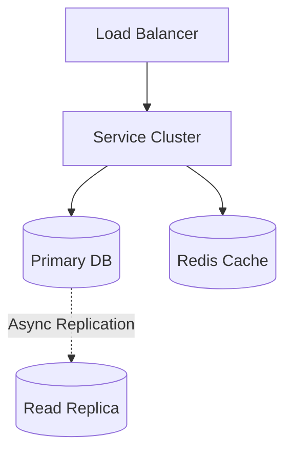
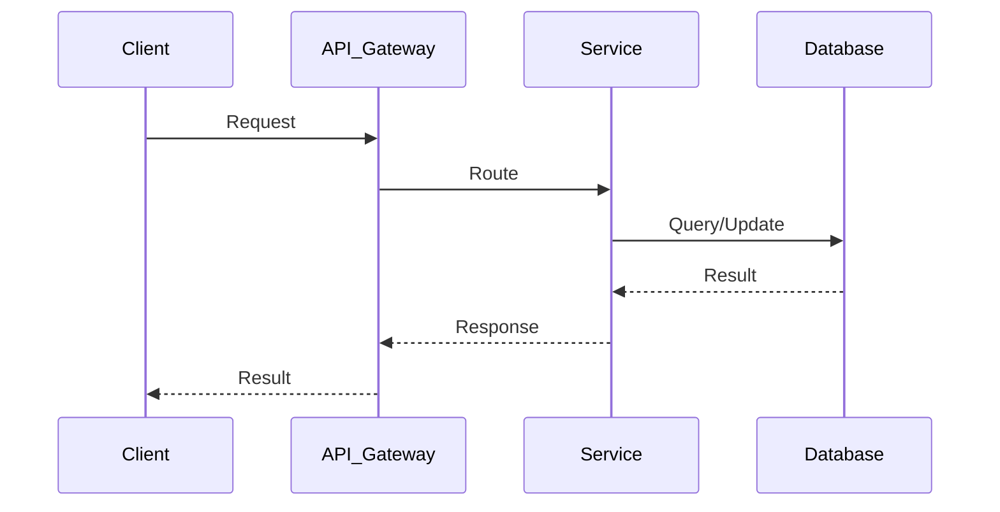

# YouTube Top K Videos System Design


| Step | Focus Area | Time Allocation | Key Activities |
|------|-----------|----------------|----------------|
| 1 | Requirements | 5-10 min | Clarify functional and non-functional requirements, identify core features |
| 2 | Core Entities | 3-5 min | Identify main entities and their relationships |
| 3 | API Design | ~5 min | Define key endpoints, methods, and data structures (keep brief) |
| 4 | Data Flow | 5-10 min | Map request/response flows, identify data movement patterns |
| 5 | High-Level Design | 15-20 min | Draw system architecture, components, and their interactions |
| 6 | Deep Dives | 15-20 min | Dive into critical components, address bottlenecks and optimizations |
| 7 | Address Key Issues | 5 min | Handle failures, security, monitoring, and edge cases |

---

## Table of Contents


---
## 1. Requirements (5-10 min)

### Functional Requirements
- [ ] Users can retrieve the top K most viewed videos of all time.
- [ ] Users can retrieve the top K videos for tumbling windows (e.g., past 1 hour, 1 day, 1 month).
- [ ] *Constraint:* K has a practical limit (e.g., max 1000).
- [ ] *Out of scope:* Arbitrary time windows, custom time periods.


### Back-of-the-Envelope (BOE) Calculations
**Step 1: Assumptions**
- Users: 1B DAU
- Views: 5B views/day
- Top K queries: 50,000 QPS

**Step 2: Load (QPS)**
- Ingestion QPS: 5B / 100,000 = 50,000 QPS (views)

**Step 3: Storage (5-year plan)**
- Very high. Kafka absorbs raw logs. Pre-aggregated data stored in Redis.

**Step 4: Bandwidth**
- High internal bandwidth for stream processing.

**Step 5: Cache**
- Redis Sorted Sets cache the final Top K results for blazing fast reads.

### Non-Functional Requirements (SPARCS)
- [ ] **Scalability**: Must handle massive scale (billions of views per day) and heavy read traffic.
- [ ] **Performance**: Fast retrieval of the Top K list.
- [ ] **Accuracy**: It is acceptable if the count is slightly approximated in real-time (Eventual Consistency), but it shouldn't drift too far from the truth.

---

## 2. Core Entities (3-5 min)

- **Video**: `videoId`, `metadata`
- **ViewEvent**: `eventId`, `videoId`, `timestamp`
- **TopK_List**: `windowType` (hour, day, all_time), `List<videoId, count>`

---

## 3. API Design (~5 min)

### `GET /api/v1/videos/top`
- **Purpose**: Get Top K videos for a specific window.
- **Request Parameters**: `k` (limit), `window` (e.g., "1h", "1d", "all").
- **Response**: `200 OK`
```json
{
  "videos": [
    { "videoId": "v1", "views": 1000000 },
    { "videoId": "v2", "views": 950000 }
  ]
}
```

---

## 4. Data Flow (5-10 min)

1. Client watches a video. A `ViewEvent` is sent to the API Gateway.
2. Gateway pushes the event to a Message Queue (Kafka) for async processing.
3. Stream Processing Engine (e.g., Apache Flink/Spark Streaming) consumes the events.
4. Flink aggregates counts using a Count-Min Sketch and a Min-Heap.
5. Flink flushes the top K lists to a fast Cache (Redis) periodically.
6. When a user requests the top K list, the API reads directly from Redis.

---

## 5. High-Level Design (15-20 min)

### High-Level Architecture



- **API Gateway**: Entry point.
- **Kafka**: High throughput distributed queue to buffer incoming view events.
- **Stream Processors (Flink/Spark)**: Real-time workers that group views by tumbling windows and compute the Top K.
- **Cache (Redis Sorted Sets)**: Stores the final Top K lists for lightning-fast reads.
- **Batch Processing (Hadoop/Spark)**: A secondary offline pipeline that parses raw logs to calculate exact counts daily to correct any inaccuracies from the real-time stream (Lambda Architecture).

---

## 6. Deep Dives (15-20 min)

### Deep Dive / Data Flow



### Tumbling Windows vs Sliding Windows
- **Tumbling Window**: Fixed, non-overlapping chunks of time (e.g., 9:00 - 10:00). Easier to compute.
- **Sliding Window**: Moving time frame (e.g., last 60 minutes relative to *now*). Much harder because you have to subtract views that fall out of the window. We focus on Tumbling Windows based on requirements.

### Calculating Top K efficiently (The Core Problem)
- **Challenge**: Sorting millions of videos constantly to find the top 1000 is O(N log N) and completely unscalable.
- **Solution: Count-Min Sketch (CMS) + Min-Heap**
  - **Count-Min Sketch**: A probabilistic data structure used to estimate frequencies. When a `videoId` comes in, we hash it `n` times and increment those buckets. To estimate views, we hash and take the minimum value from the buckets. This saves massive amounts of memory compared to a Hash Map.
  - **Min-Heap (size K)**: We maintain a heap of size K. When a video's estimated count (from CMS) exceeds the root of the Min-Heap (the Kth largest element), we pop the root and insert the new video.

### Data Partitioning
- **Challenge**: A single stream processor cannot hold the CMS and Heap for the entire world.
- **Solution**: Route Kafka messages by `hash(videoId)`. Node A handles a subset of videos, Node B handles another. Each Node computes a local Top K. A central reducer node then merges these K-sized lists to find the Global Top K.

---

## 7. Address Key Issues (5 min)

### Fault Tolerance & Resiliency
- Kafka provides durability. If a Flink worker dies, it can replay the stream from the last checkpoint.
- The system must ensure exactly-once processing (or at-least-once, since CMS overcounting slightly is better than undercounting).

### Scalability
- Because the read traffic for Top K is immense, the final result in Redis should be aggressively cached at the API Gateway or CDN level to avoid hitting the database entirely.

## References & Original Diagrams

