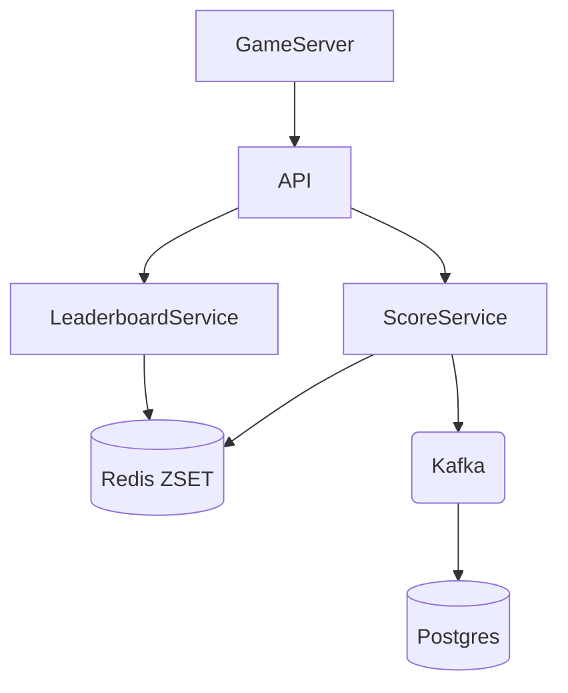
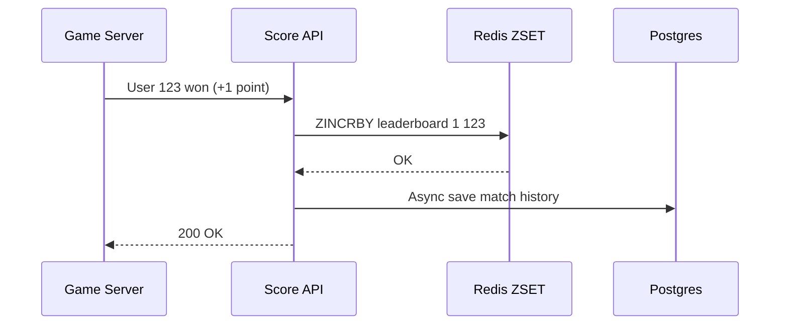
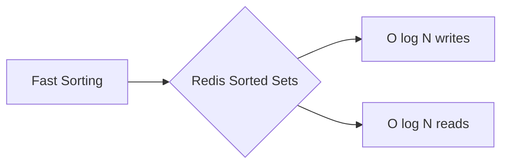

# Real-Time Gaming Leaderboard System Design

| Step | Focus Area | Time Allocation | Key Activities |
|------|-----------|----------------|----------------|
| 1 | Requirements | 5-10 min | Clarify functional and non-functional requirements, identify core features |
| 2 | Core Entities | 3-5 min | Identify main entities and their relationships |
| 3 | API Design | ~5 min | Define key endpoints, methods, and data structures (keep brief) |
| 4 | Data Flow | 5-10 min | Map request/response flows, identify data movement patterns |
| 5 | High-Level Design | 15-20 min | Draw system architecture, components, and their interactions |
| 6 | Deep Dives | 15-20 min | Dive into critical components, address bottlenecks and optimizations |
| 7 | Address Key Issues | 5 min | Handle failures, security, monitoring, and edge cases |

---

## Table of Contents
- [1. Requirements](#1-requirements-5-10-min)
- [2. Core Entities](#2-core-entities-3-5-min)
- [3. API Design](#3-api-design-5-min)
- [4. Data Flow](#4-data-flow-5-10-min)
- [5. High-Level Design](#5-high-level-design-15-20-min)
- [6. Deep Dives](#6-deep-dives-15-20-min)
- [7. Address Key Issues](#7-address-key-issues-5-min)
- [References & Original Diagrams](#references--original-diagrams)

---
## 1. Requirements (5-10 min)

### Functional Requirements
- [ ] System must update user scores (e.g., +1 point per win).
- [ ] Display the top 10 players on the global leaderboard.
- [ ] Show a specific user's absolute rank on the leaderboard.
- [ ] Show relative leaderboard (4 players above and 4 below a specific user).
- [ ] Leaderboard resets periodically (e.g., monthly tournaments).

### Scale & Non-Functional Requirements
- [ ] **DAU / MAU**: 5 Million DAU / 25 Million MAU.
- [ ] **Matches**: ~10 matches per user per day -> 50M score updates/day (approx. ~578 writes/sec average, higher at peak).
- [ ] **Real-time Performance**: The leaderboard must update and display results in real-time or near real-time. Batched/offline calculation is not acceptable.
- [ ] **Scalability**: Can handle high concurrent reads for leaderboard viewing.

---

## 2. Core Entities (3-5 min)

- **User**: `userId`, `username`, `profilePic`
- **Leaderboard**: `tournamentId` (e.g., `2024-03`), `userId`, `score`
- **MatchResult**: `matchId`, `userId`, `pointsEarned`, `timestamp`

---

## 3. API Design (~5 min)

### `POST /api/v1/scores`
- **Purpose**: Update a user's score after a match. (Typically called securely from a trusted game server, NOT the client, to prevent cheating).
- **Request Body**: `{ "userId": "123", "points": 1 }`
- **Response**: `200 OK`

### `GET /api/v1/leaderboard/top`
- **Purpose**: Retrieve the top 10 players.
- **Response**: `[{"rank": 1, "userId": "890", "score": 976}, ...]`

### `GET /api/v1/leaderboard/users/:id`
- **Purpose**: Get a user's rank, score, and the players surrounding them (relative rank).
- **Response**: `{"userRank": 500, "score": 150, "surrounding": [...]}`

---

## 4. Data Flow (5-10 min)

1. Game Server finishes a match and sends a score update request to the API Gateway.
2. Gateway routes to the `Score Service`.
3. `Score Service` updates the user's score in the fast in-memory data store (Redis).
4. `Score Service` fires an async event to a Message Queue to persist the match history in a relational database.
5. When a client requests the leaderboard, the `Leaderboard Service` queries Redis to get the Top 10 or the User's relative rank instantly.

---

## 5. High-Level Design (15-20 min)

### High-Level Architecture

- **Game Servers**: Authoritative servers that validate wins and push scores to the backend.
- **API Gateway**: Load balancing and routing.
- **Score Service**: Handles incoming score updates.
- **Leaderboard Service**: Handles heavy read traffic fetching ranks.
- **Redis (In-Memory Cache)**: The core component. Uses Redis Sorted Sets (`ZSET`) to maintain the leaderboard in real-time.
- **Relational DB (Postgres/MySQL)**: Permanent storage for users, match history, and historical tournament data. Allows reconstructing the leaderboard if Redis crashes.

---

## 6. Deep Dives (15-20 min)

### Deep Dive / Data Flow

### Generic Problem Component

### Redis Sorted Sets (`ZSET`)
- **Challenge**: Sorting 25 million records in real-time using a traditional SQL Database (`ORDER BY score DESC`) is too slow and CPU intensive.
- **Solution**: Use Redis `ZSET`. It implements a combination of a hash table and a skip list.
  - Adding/updating score: `ZINCRBY leaderboard_2024_03 1 user_123` -> Time Complexity **O(log(N))**.
  - Getting Top 10: `ZREVRANGE leaderboard_2024_03 0 9 WITHSCORES` -> Time Complexity **O(log(N) + M)** where M is 10.
  - Getting User Rank: `ZREVRANK leaderboard_2024_03 user_123` -> Time Complexity **O(log(N))**.
  - Getting relative players: If rank is X, run `ZREVRANGE` from X-4 to X+4.

### Tie-Breaking
- **Challenge**: Two users have the same score, but they need deterministic ranks.
- **Solution**: Redis `ZSET` orders by score first, and then lexicographically by the member string (userId). To order by "who reached the score first", we can append a timestamp to the score. However, since Redis scores are floating-point numbers, a common trick is: `score + (1.0 - (timestamp / max_time))`.

---

## 7. Address Key Issues (5 min)

### Fault Tolerance & Resiliency
- **Redis Crash**: If Redis goes down, the leaderboard is wiped from memory.
  - *Fix*: Enable Redis AOF (Append Only File) persistence, or reconstruct the `ZSET` by querying the `MatchResult` table from the Relational DB using a batch script.
- **Scaling Redis**: 25 Million users in a `ZSET` can take a few hundred MBs. One Redis instance can handle this in memory easily, but it might hit CPU limits due to QPS. Use Redis Read Replicas to scale out the read operations (Top 10 queries).

### Security
- Score updates must never come directly from the mobile app to prevent spoofing. The update API must only accept requests from trusted backend Game Servers with mutual TLS or strict API keys.

## References & Original Diagrams
- [Real-time Gaming Leaderboard.pdf](./Real-time Gaming Leaderboard.pdf)
