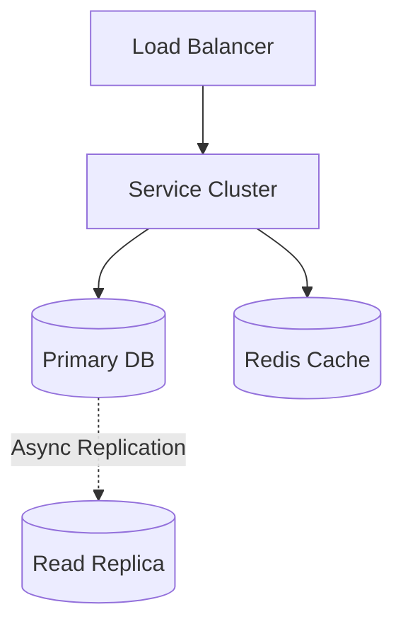
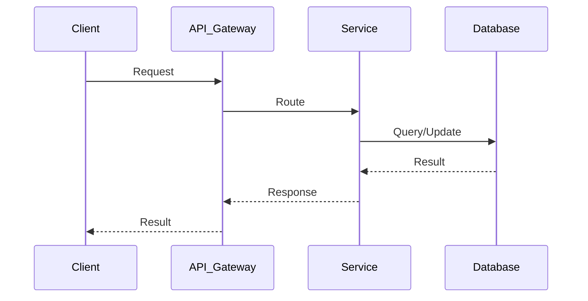

# Notification Service System Design

## Table of Contents
- [1. Requirements (5-10 min)](#1-requirements-5-10-min)
- [2. Core Entities (3-5 min)](#2-core-entities-3-5-min)
- [3. API Design (~5 min)](#3-api-design-5-min)
- [4. Data Flow (5-10 min)](#4-data-flow-5-10-min)
- [5. High-Level Design (15-20 min)](#5-high-level-design-15-20-min)
- [6. Deep Dives (15-20 min)](#6-deep-dives-15-20-min)
- [7. Address Key Issues (5 min)](#7-address-key-issues-5-min)

---
## 1. Requirements (5-10 min)

### Functional Requirements
- [ ] Send notifications via multiple channels: SMS, Email, and Push Notifications.
- [ ] Other internal microservices will call this service to send notifications.
- [ ] Users can opt-out or set preferences for notification channels.

### Back-of-the-Envelope (BOE) Calculations
**Step 1: Assumptions**
- Notifications: 100M / day
- Types: Push, SMS, Email
- Payload: ~1 KB per notification

**Step 2: Load (QPS)**
- Average QPS: 100M / 100,000 ≈ 1,000 QPS
- Peak QPS: 10,000 QPS

**Step 3: Storage (5-year plan)**
- Daily Storage (Logs): 1,000 QPS * 100,000s * 1 KB = 100 GB/day
- 5-year storage: 180 TB

**Step 4: Bandwidth**
- Egress to third parties: 1,000 QPS * 1 KB = 1 MB/s

**Step 5: Cache**
- Cache User preferences to avoid DB hits.

### Non-Functional Requirements
- [ ] **High Throughput**: Must process millions of notifications per day.
- [ ] **Reliability**: No notifications should be lost (at-least-once delivery).
- [ ] **Pluggability**: Easy to add new third-party providers (e.g., switching from Twilio to Nexmo).

---

## 2. Core Entities (3-5 min)

- **NotificationEvent**: `eventId`, `userId`, `type`, `payload`, `status`
- **UserPreference**: `userId`, `optInEmail`, `optInSms`, `optInPush`

---

## 3. API Design (~5 min)

### `POST /api/v1/notifications`
- **Request Body**: `{ "userId": "123", "type": "ORDER_SHIPPED", "templateArgs": {"orderId": "abc"} }`
- **Response**: `202 Accepted`

---

## 4. Data Flow (5-10 min)

1. Client microservice calls Notification API.
2. API validates request and pushes to an initial Kafka topic.
3. Notification Processor consumes it, checks User Preferences, renders templates, and routes to channel-specific Kafka topics (e.g., `sms_topic`, `email_topic`).
4. Channel Senders consume from these topics and call 3rd-party APIs (Twilio, SendGrid, APNs).
5. Delivery status is written to a DB.

---

## 5. High-Level Design (15-20 min)

### High-Level Architecture

- **API Gateway / Ingestion**: Receives internal requests, does basic validation.
- **Message Queues (Kafka/RabbitMQ)**: Critical for decoupling and buffering spikes in traffic.
- **Notification Processor**: Handles business logic, checks preferences, limits rate.
- **Workers (Senders)**: Dedicated worker pools for SMS, Email, and Push that talk to external APIs.
- **Databases**: Redis for User Preferences cache. Cassandra/PostgreSQL for Notification Logs.

---

## 6. Deep Dives (15-20 min)

### Deep Dive / Data Flow

### Handling Third-Party Rate Limits and Failures
- **Challenge**: Twilio might rate limit us or go down.
- **Solution**: The Workers implement Exponential Backoff and Retry. If an external API fails repeatedly, the message is placed in a **Dead Letter Queue (DLQ)** for manual inspection or delayed retry. Furthermore, we can implement **Provider Failover** (if Twilio fails, try Amazon SNS).

### Deduplication
- **Challenge**: A user shouldn't receive the same "Order Shipped" SMS twice if our internal network blips and retries.
- **Solution**: Add an `idempotency_key` (e.g., `order_shipped_123`) to the request. The Ingestion layer checks Redis for this key before processing.

---

## 7. Address Key Issues (5 min)

### Security
- Internal IPs only. PII (emails/phone numbers) should be encrypted in the logs.

## References & Original Diagrams

