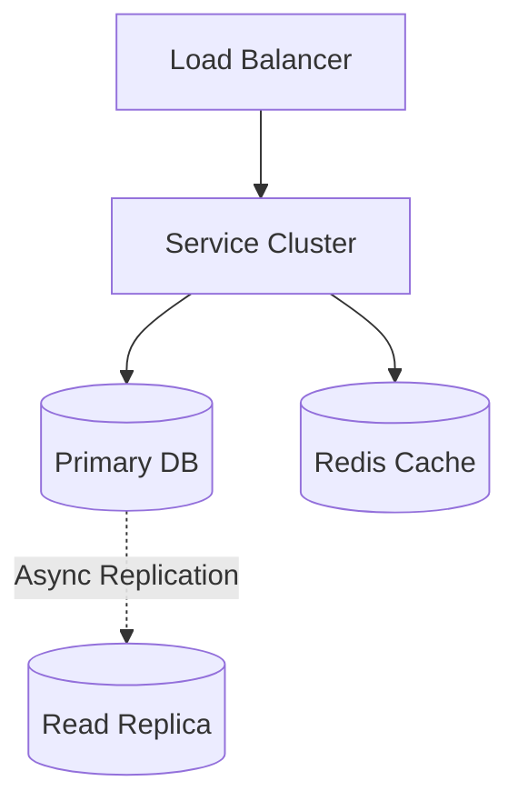
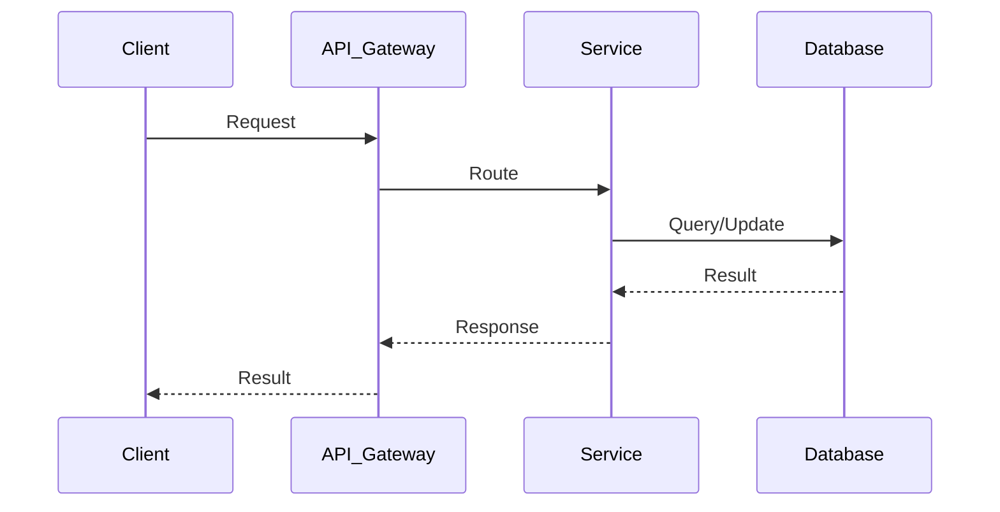
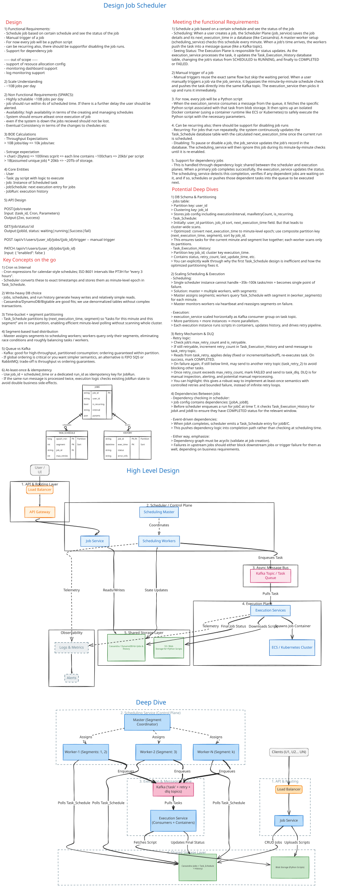

# JobScheduler System Design

| Step | Focus Area | Time Allocation | Key Activities |
|------|-----------|----------------|----------------|
| 1 | Requirements | 5-10 min | Clarify functional and non-functional requirements, identify core features |
| 2 | Core Entities | 3-5 min | Identify main entities and their relationships |
| 3 | API Design | ~5 min | Define key endpoints, methods, and data structures (keep brief) |
| 4 | Data Flow | 5-10 min | Map request/response flows, identify data movement patterns |
| 5 | High-Level Design | 15-20 min | Draw system architecture, components, and their interactions |
| 6 | Deep Dives | 15-20 min | Dive into critical components, address bottlenecks and optimizations |
| 7 | Address Key Issues | 5 min | Handle failures, security, monitoring, and edge cases |

---

## Table of Contents

---
## 1. Requirements (5-10 min)

### Functional Requirements
- [ ] Users can trigger workflows or schedule jobs (e.g. Cron).
- [ ] The system accurately executes tasks at the scheduled time.

### Back-of-the-Envelope (BOE) Calculations
**Step 1: Assumptions**
- Jobs: 100M scheduled jobs daily
- Payload: 1 KB job spec

**Step 2: Load (QPS)**
- Execution QPS: 1,157 QPS average

**Step 3: Storage (5-year plan)**
- Database for job states. 100M rows/day is easily handled.

**Step 4: Bandwidth**
- Negligible.

**Step 5: Cache**
- Redis Timing Wheels/ZSET for immediate executions.

### Non-Functional Requirements
- [ ] **Scalability**: High throughput for job execution.
- [ ] **Reliability**: No job should be dropped. At-least-once execution.
- [ ] **Precision**: Jobs must run close to their exact scheduled time.

---

## 2. Core Entities (3-5 min)

- **Job**: `jobId`, `payload`, `schedule_time`, `status`
- **ExecutionLog**: `jobId`, `startTime`, `endTime`, `status`

---

## 3. API Design (~5 min)

### `POST /api/v1/jobs`
- **Purpose**: Schedule a job.
- **Request**: `{"time": "2024-05-12T10:00:00Z", "task": "..."}`

---

## 4. Data Flow (5-10 min)

1. Client schedules job via API.
2. Job is stored in Database.
3. A timer/scheduler polls the Database for jobs due in the current minute.
4. Jobs are pushed to a Message Queue.
5. Worker nodes consume and execute the jobs.

---

## 5. High-Level Design (15-20 min)

### High-Level Architecture

- **API Gateway**: Entry point.
- **Scheduler Service**: The core component that checks the time and triggers executions.
- **Database (Relational or NoSQL)**: Stores job definitions and schedules.
- **Message Queue (Kafka/RabbitMQ)**: Buffers jobs ready for execution.
- **Worker Pool**: Scales horizontally to perform the actual heavy lifting.

---

## 6. Deep Dives (15-20 min)

### Deep Dive / Data Flow

### The Polling Bottleneck
- **Challenge**: Polling a massive SQL database every second for `WHERE status = 'PENDING' AND schedule_time <= NOW()` will kill the DB.
- **Solution**: Time-Bucketing and In-Memory Timers (e.g., Hierarchical Timing Wheels). The Scheduler pulls jobs in chunks (e.g., all jobs for the next 10 minutes) into Redis Sorted Sets or a Timing Wheel in memory, reducing DB hits drastically.

---

## 7. Address Key Issues (5 min)

### Fault Tolerance & Distributed Locking
- If two Schedulers pull the same job, it executes twice. Use Distributed Locks (Redis Redlock) or DB row-locking (`SELECT FOR UPDATE`) to ensure only one scheduler picks up a specific time bucket.

## References & Original Diagrams

