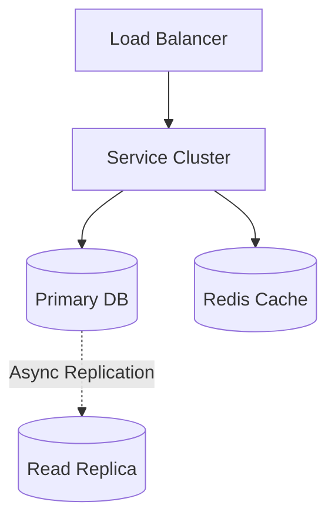
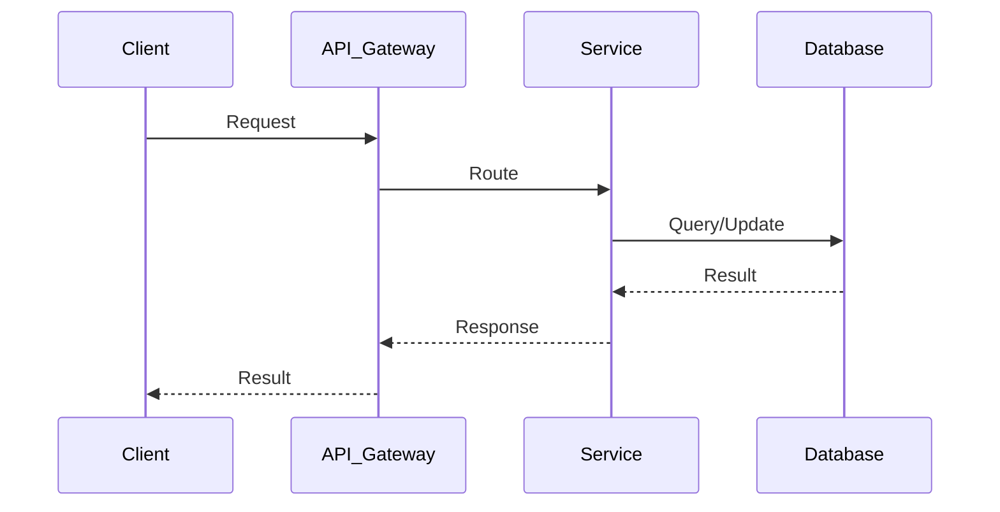

# Leetcode System Design

## Table of Contents
- [1. Requirements (5-10 min)](#1-requirements-5-10-min)
- [2. Core Entities (3-5 min)](#2-core-entities-3-5-min)
- [3. API Design (~5 min)](#3-api-design-5-min)
- [4. Data Flow (5-10 min)](#4-data-flow-5-10-min)
- [5. High-Level Design (15-20 min)](#5-high-level-design-15-20-min)
- [6. Deep Dives (15-20 min)](#6-deep-dives-15-20-min)
- [7. Address Key Issues (5 min)](#7-address-key-issues-5-min)

---
## 1. Requirements (5-10 min)

### Functional Requirements
- [ ] Users can view coding problems.
- [ ] Users can submit code in various languages (Python, Java, C++).
- [ ] The system runs the code against hidden test cases.
- [ ] The system returns the result (Accepted, Wrong Answer, Time Limit Exceeded) and runtime stats.

### Back-of-the-Envelope (BOE) Calculations
**Step 1: Assumptions**
- Users: 2M DAU
- Activity: 2 submissions/user/day
- Contests: 50,000 simultaneous submissions in 5 minutes
- Payload: Code ~5 KB

**Step 2: Load (QPS)**
- Write QPS (Avg): (2M * 2) / 100,000 = 40 QPS
- Peak QPS (Contest): 50,000 / 300s = 166 QPS

**Step 3: Storage (5-year plan)**
- Test cases stored in S3. Code stored in DB/S3. Low storage requirement.

**Step 4: Bandwidth**
- Low bandwidth.

**Step 5: Cache**
- Workers cache test cases locally.

### Non-Functional Requirements
- [ ] **Security (Sandboxing)**: Executing untrusted user code on our servers safely.
- [ ] **Scalability**: Handle spikes during contests (e.g., thousands of simultaneous submissions).
- [ ] **Fairness**: Code execution must be isolated so one heavy program doesn't slow down another user's program.

---

## 2. Core Entities (3-5 min)

- **Problem**: `problemId`, `description`, `difficulty`, `testCasesUrl`
- **Submission**: `submissionId`, `userId`, `problemId`, `language`, `code`, `status`, `runtime`

---

## 3. API Design (~5 min)

### `POST /api/v1/submissions`
- **Purpose**: Submit code for evaluation.
- **Request Body**: `{ "problemId": 1, "lang": "python3", "code": "def solve()..." }`
- **Response**: `202 Accepted` with `submissionId` (Since evaluation is async).

### `GET /api/v1/submissions/:id/status`
- **Purpose**: Client polls this to see if execution is done.
- **Response**: `200 OK` with `{ "status": "Accepted", "runtime": "45ms" }` (or Pending).

---

## 4. Data Flow (5-10 min)

1. User submits code -> API Gateway -> Submission Service saves it to DB as `Pending`.
2. Submission Service pushes a message to a Message Queue (e.g., RabbitMQ).
3. A Code Execution Worker picks up the message.
4. Worker downloads test cases from S3.
5. Worker spins up a secure Docker Container, runs the code against the tests, measures time/memory.
6. Worker destroys the container, updates the DB with the result.
7. Client polling the API gets the updated status.

---

## 5. High-Level Design (15-20 min)

### High-Level Architecture

- **Submission Service**: Handles the CRUD operations for submissions.
- **Message Queue**: Crucial for buffering submissions during contests.
- **Worker Pool**: A fleet of EC2 instances running Docker daemon. They consume from the Queue.
- **Databases**: Relational DB for user stats and problems. S3/Object Storage for storing raw user code and massive test case files.
- **Cache**: Redis to cache problem descriptions and test cases (since workers need them constantly).

---

## 6. Deep Dives (15-20 min)

### Deep Dive / Data Flow

### Secure Code Execution (Sandboxing)
- **Challenge**: A user writes `os.system("rm -rf /")` or a fork bomb (`while True: os.fork()`). We must protect the host server.
- **Solution**: Execute all user code inside isolated Docker containers (or even stricter microVMs like Firecracker).
  - Use `cgroups` (Control Groups) to hard-limit CPU and Memory usage (e.g., max 512MB RAM, 2 seconds CPU time). If exceeded, the OS kills it -> "Time/Memory Limit Exceeded".
  - Disable network access for the container entirely so they cannot make external API calls or scrape data.
  - Drop all root privileges.

### Handling Contests (High Spikes)
- **Challenge**: 100,000 users click "Submit" within the final 5 minutes of a contest.
- **Solution**: The API Gateway and Submission Service must be highly scalable and stateless. The Message Queue absorbs the shock. We can configure Auto-Scaling Groups to spin up hundreds of new Worker EC2 instances when the Queue depth exceeds a certain threshold. Clients use WebSockets or Polling to wait gracefully.

---

## 7. Address Key Issues (5 min)

### Test Case Optimization
- **Challenge**: Test case files can be large (e.g., 50MB of arrays). Downloading them from S3 for every execution is slow.
- **Solution**: Workers should maintain a local disk cache (LRU) of recently used test case files so they can mount them instantly into the Docker containers.

## References & Original Diagrams

