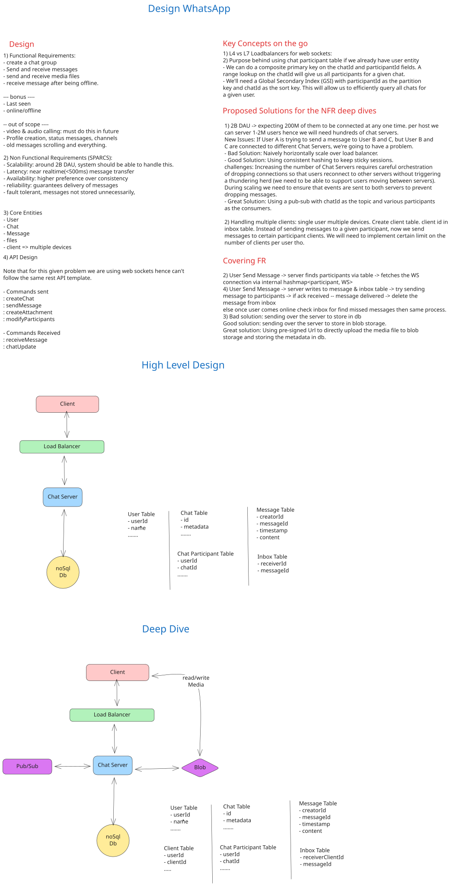

# Design WhatsApp: High-Level Design Document

## 1. High-Level Design

### 1.1 Requirements

#### Functional Requirements

| Requirement | Description |
|---|---|
| **Group Chats** | Users can create group chats with 2-100 participants |
| **Send/Receive Messages** | Users can send and receive messages in real-time |
| **Offline Message Delivery** | Messages sent to offline users are stored for up to 30 days |
| **Media Support** | Users can send/receive media (images, files, etc.) in messages |
| **Multiple Clients** | Single user can be online on multiple devices simultaneously |

#### Non-Functional Requirements (SPARCS Framework)

| Category | Requirement | Target |
|---|---|---|
| **Scalability** | Handle billions of users with consistent performance | 5B+ users |
| **Performance (Latency)** | Message delivery latency | <500ms |
| **Performance (Throughput)** | System throughput for message delivery | TBD (calculated below) |
| **Availability** | System uptime and resilience | 99.99% (4 nines) |
| **Reliability** | Message deliverability guarantee | 100% delivery (retry mechanism) |
| **Consistency** | Message ordering within a chat | Strong ordering per chat |
| **Security** | Encrypted storage, auth, rate limiting | End-to-end encryption (E2E) |

---

## 2. Capacity Estimation & Constraints

### 2.1 Back-of-the-Envelope Calculations

#### Assumptions
- **Daily Active Users (DAU):** 2 Billion
- **Monthly Active Users (MAU):** 3 Billion
- **Average messages per user per day:** 40
- **Average message size:** 500 bytes (text + metadata)
- **Average media file size:** 2 MB (1 in 10 messages contains media)
- **Message retention period:** 30 days (for offline delivery)
- **Time horizon:** 5 years

#### QPS Calculation (Queries Per Second)

| Metric | Calculation | Result |
|---|---|---|
| **Read QPS (Messages)** | (2B DAU × 40 msg/day) / 86,400 sec | ~926,000 QPS |
| **Write QPS (Messages)** | Same as Read | ~926,000 QPS |
| **Media Upload QPS** | (2B × 40 × 0.1) / 86,400 | ~92,600 QPS |
| **Media Download QPS** | (2B × 40 × 0.1 × 2 devices avg) / 86,400 | ~185,200 QPS |

#### Storage Estimation

| Component | Calculation | Result |
|---|---|---|
| **Message Storage (5 years)** | 2B DAU × 40 msg/day × 365 days × 5 years × 500 bytes | ~3.65 PB |
| **Media Storage (5 years)** | 2B × 40 × 0.1 × 365 × 5 × 2 MB | ~73 PB |
| **Metadata Storage** | Chat, User, Client tables, Inbox (30 days buffer) | ~50 TB |
| **Index Storage** | ~20% of total data | ~14.7 PB |
| **Total Required (with replication 3x)** | (3.65 + 73 + 0.05 + 14.7) × 3 | ~261.6 PB |

#### Bandwidth Estimation

| Direction | Calculation | Result |
|---|---|---|
| **Inbound Bandwidth (Writes)** | 926,000 QPS × 500 bytes | ~463 Gbps |
| **Outbound Bandwidth (Reads)** | 926,000 QPS × 500 bytes × avg. 2 clients | ~926 Gbps |
| **Media Inbound** | 92,600 QPS × 2 MB | ~185 Tbps (peak) |
| **Media Outbound** | 185,200 QPS × 2 MB | ~370 Tbps (peak) |

---

## 3. Core Entities

### 3.1 Entity Relationship Diagram

```
User (1) ---> (N) Client
              ↓
User (1) ---> (N) ChatParticipant (N) <--- (1) Chat
              ↓
              Message (N)
              ↓
              Inbox (N)
              ↓
              Attachment (N)
```

### 3.2 Database Schema

| Entity/Table | Field Name | Type | Description/Constraint |
|---|---|---|---|
| **Users** | userId | UUID (PK) | Unique user identifier |
| | name | String | User's display name |
| | createdAt | Timestamp | Account creation time |
| **Clients** | clientId | UUID (PK) | Unique device/client identifier |
| | userId | UUID (FK) | Reference to Users table |
| | deviceInfo | String | Device type, OS version |
| | connectionStatus | ENUM | ONLINE, OFFLINE, IDLE |
| | lastSeenAt | Timestamp | Last activity timestamp |
| **Chat** | chatId | UUID (PK) | Unique chat identifier |
| | chatName | String | Group chat name (null for 1-to-1) |
| | createdAt | Timestamp | Chat creation time |
| | metadata | JSON | Additional chat settings |
| **ChatParticipant** | chatId + userId (CPK) | UUID + UUID | Composite primary key |
| | joinedAt | Timestamp | When user joined chat |
| | role | ENUM | ADMIN, MEMBER |
| **Message** | messageId | UUID (PK) | Unique message identifier |
| | chatId | UUID (FK) | Reference to Chat table |
| | senderId | UUID (FK) | Reference to Users table |
| | content | String | Message text |
| | createdAt | Timestamp | Message sent time |
| | updatedAt | Timestamp | Message edited time |
| **Attachment** | attachmentId | UUID (PK) | Unique attachment identifier |
| | messageId | UUID (FK) | Reference to Message table |
| | fileUrl | String | S3/Blob storage URL |
| | fileHash | String | SHA-256 hash for deduplication |
| | fileSize | Long | Size in bytes |
| | mimeType | String | File content type |
| **Inbox** | inboxId | UUID (PK) | Unique inbox entry identifier |
| | clientId | UUID (FK) | Reference to Clients table |
| | messageId | UUID (FK) | Reference to Message table |
| | deliveryStatus | ENUM | PENDING, DELIVERED, READ |
| | createdAt | Timestamp | Entry creation time |

#### Relationships & Key Design Decisions

- **Users → Clients (1:N):** One user can have multiple active clients (phone, tablet, web). Enables multi-device support.
- **ChatParticipant (Composite Key):** Using (chatId, userId) as CPK allows efficient range lookups of all participants for a chat. A GSI on (userId, chatId) enables reverse lookup of all chats for a user.
- **Message → Attachment (1:N):** Messages can contain 0 or more attachments. File hashing prevents duplicate storage.
- **Inbox (Temporary Table):** Stores undelivered messages per client for up to 30 days. Entries deleted on client acknowledgment (ack). Enables offline message buffering.
- **Primary Key Choice:** UUID (not Snowflake/auto-increment) chosen to allow distributed writes without coordination, critical for multi-region setup.

---

## 4. API Design

### 4.1 Core Endpoints

| HTTP Method | Endpoint | Request Params | Response | Description |
|---|---|---|---|---|
| **POST** | `/chat/create` | `{ "participants": [userId], "name": string }` | `{ "chatId": UUID }` | Create a new group chat or 1-to-1 conversation |
| **POST** | `/message/send` | `{ "chatId": UUID, "content": string, "attachments": [attachmentId] }` | `{ "messageId": UUID, "status": "SUCCESS" \| "FAILURE" }` | Send a message to a chat; returns ack with messageId |
| **POST** | `/attachment/upload` | `{ "body": binary, "hash": string }` | `{ "attachmentId": UUID }` | Upload media; hash enables deduplication |
| **POST** | `/chat/participant/modify` | `{ "chatId": UUID, "userId": UUID, "operation": "ADD" \| "REMOVE" }` | `{ "status": "SUCCESS" \| "FAILURE" }` | Add or remove participant from chat |
| **POST** | `/message/ack` | `{ "inboxId": UUID }` | `{ "status": "SUCCESS" }` | Client acknowledges receipt; deletes from Inbox |
| **WS** | `/ws/connect?clientId=UUID` | WebSocket upgrade | Bidirectional stream | Establish persistent WebSocket connection for real-time delivery |

### 4.2 WebSocket Events (Server → Client)

| Event | Payload | Description |
|---|---|---|
| **newMessage** | `{ "chatId": UUID, "messageId": UUID, "senderId": UUID, "content": string, "attachments": [attachmentId], "timestamp": Timestamp }` | New message delivered in real-time |
| **chatUpdate** | `{ "chatId": UUID, "participants": [userId], "operation": "ADD" \| "REMOVE" }` | Chat membership updated |
| **messageDeleted** | `{ "chatId": UUID, "messageId": UUID }` | Message deleted (soft/hard delete) |

---

## 5. Data Flow

### 5.1 Write Path (Send Message)

```
Client
  ↓
Load Balancer (Round-Robin / Least Connections)
  ↓
Chat Server (WebSocket handler)
  ├─ Step 1: Look up all ChatParticipants for the chat (from ChatParticipant table)
  ├─ Step 2: Insert message into Message table (transactional)
  ├─ Step 3: For each participant, check all their Clients (Clients table)
  ├─ Step 4: Insert Inbox entries for each client (if offline) - transactional batch
  ├─ Step 5: Return messageId + status to sender (synchronous)
  ├─ Step 6: Publish messageId to Pub/Sub topic for each participant userId (async)
  └─ Step 7: Respond with "SUCCESS" to client
  
Pub/Sub (Fan-out)
  ├─ For each ChatServer subscribed to userId topics
  │  └─ Deliver message via WebSocket to active clients
  └─ For offline clients
     └─ Message remains in Inbox until client reconnects
```

**Sync vs. Async:**
- **Synchronous (Write to DB):** Message insertion is synchronous → ensures durability before ack
- **Asynchronous (Pub/Sub):** Message publishing is async → doesn't block sender, eventual delivery
- **Trade-off:** Guarantees write durability but allows slight delay in delivery (acceptable <500ms)

---

### 5.2 Read Path (Receive Message - Online)

```
Receiver (Online)
  ↓
Pub/Sub (receives message on userId topic)
  ↓
Chat Server (connected to Pub/Sub for this userId)
  ├─ Step 1: Receive message from Pub/Sub
  ├─ Step 2: Look up active WebSocket connections for this userId (hash table)
  ├─ Step 3: Deliver via newMessage event to all active clients
  ├─ Step 4: Await client acknowledgment (ack message)
  └─ Step 5: On ack, delete Inbox entry for that client
```

**Optimizations:**
- In-memory hash table maps `userId → [clientId1, clientId2, ...]` for O(1) client lookup
- Direct WebSocket delivery = ultra-low latency (<100ms)
- Inbox entry deleted immediately on ack (no polling needed)

---

### 5.3 Read Path (Receive Message - Offline)

```
User Comes Online (Client reconnects)
  ↓
Chat Server
  ├─ Step 1: Client sends "connect" event with clientId
  ├─ Step 2: Chat Server looks up Inbox entries for this clientId
  ├─ Step 3: For each Inbox entry, fetch full Message + Attachment data
  ├─ Step 4: Send all undelivered messages via newMessage events (batched)
  ├─ Step 5: Client sends ack for each message
  └─ Step 6: Delete Inbox entries on ack
```

**Key Point:** Inbox acts as a durable queue for offline delivery (up to 30 days).

---

## 6. High-Level Architecture

### 6.1 Architecture Diagram





### 6.2 Component Breakdown

#### **Clients (Mobile/Web)**
- Multiple device instances per user (phone, tablet, web)
- Maintains persistent WebSocket connection to a Chat Server
- Responsible for UI rendering and user interactions
- Initiates message sends and receives acks for offline delivery

#### **Load Balancer**
- **Algorithm:** Round-Robin or Least Connections
- **Sticky Sessions:** Maintains client affinity to Chat Server instance (via session ID or client token) to avoid connection reestablishment
- **Health Checks:** Removes unhealthy Chat Servers from rotation
- **Scaling:** Auto-scales based on connection count and message throughput

#### **Chat Server (Service Layer)**
- **Architecture:** Stateful; maintains in-memory WebSocket connections and client-to-server mappings
- **Languages:** Erlang (original), Node.js, or Go (all support concurrent connections well)
- **Responsibilities:**
  - Accept WebSocket connections from clients
  - Route messages between clients and Pub/Sub
  - Enforce business logic (chat creation, participant validation)
  - Handle offline delivery via Inbox querying
  - Publish user typing indicators, read receipts, etc.
- **Scaling:** Horizontal scaling via multiple instances; Pub/Sub decouples instances

#### **Pub/Sub System**
- **Technology:** Kafka, RabbitMQ, Redis Streams, or AWS SNS/SQS
- **Purpose:** Fan-out messages from one Chat Server to all Chat Servers subscribed to a userId topic
- **Topology:** Each userId has a topic; Chat Servers subscribe to topics for their connected users
- **Benefits:** Decouples Chat Servers, enables multi-region replication
- **Partition Strategy:** Partition by userId to enable sharding (e.g., userId hash mod N partitions)

#### **NoSQL Database**
- **Technology:** DynamoDB, HBase, or Cassandra (chosen for write-heavy, eventually-consistent workloads)
- **Rationale:**
  - **Write-heavy:** 926K QPS writes for messages; NoSQL is optimized for this
  - **Partitioning:** Easily sharded by chatId, userId
  - **Availability:** Multi-region replication; eventual consistency acceptable for chat
  - **Cost:** Cheaper than RDBMS at massive scale
- **Tables:**
  - Users, Clients, Chat, ChatParticipant (composite key GSI)
  - Message (sharded by chatId)
  - Inbox (sharded by clientId, TTL-based deletion at 30 days)
  - Attachment (sharded by messageId)

#### **Blob Storage**
- **Technology:** AWS S3, Google Cloud Storage, or Azure Blob Storage
- **Purpose:** Store media files (images, videos, documents)
- **Optimization:**
  - **CDN Integration:** CloudFront, Akamai for fast downloads
  - **Multipart Upload:** For large files
  - **Deduplication:** Store hash with file; detect duplicates before re-uploading
  - **Lifecycle Policies:** Archive old media to cold storage after 1 year
- **Cost Optimization:** ~73 PB of media storage; use tiered storage (hot → warm → cold)

#### **Read Replicas & Backup**
- **Read Replicas:** Secondary DB instances for read-heavy queries (e.g., Inbox lookups)
- **Backup Strategy:** Daily snapshots, cross-region replication, point-in-time recovery

#### **Monitoring & Observability**
- **Metrics:** Latency (p50, p99), message delivery rate, active connections, error rate
- **Logging:** Structured logs (JSON) with trace IDs for debugging
- **Alerting:** PagerDuty on SLA violations (e.g., >500ms latency, <99.99% availability)

---

## 7. Deep Dives

### 7.1 Handling Billions of Simultaneous Users

#### **Challenge:** 5 billion users × 2 devices avg = 10 billion WebSocket connections. Single machine cannot handle 10B connections.

#### **Solution: Horizontal Sharding via Pub/Sub**

1. **Multiple Chat Server Instances:**
   - Deploy 10,000+ Chat Server instances globally
   - Each instance handles ~1M concurrent connections
   - Load Balancer distributes new connections across instances

2. **Pub/Sub Subscription Model:**
   - When user connects, Chat Server subscribes to Pub/Sub topic: `user:{userId}`
   - When message arrives for that user, publish to topic
   - All Chat Servers with that user connected receive the message
   - Each server delivers to its local WebSocket connection

3. **Benefits:**
   - **Decoupling:** No server-to-server direct communication
   - **Fault Isolation:** One server crash doesn't affect message flow (Pub/Sub persists for a short time)
   - **Geographic Distribution:** Deploy in multiple regions; Pub/Sub replicates cross-region

#### **Trade-offs:**
- **Complexity:** Requires distributed Pub/Sub infrastructure
- **Latency:** Slight added latency (topic subscription + publish) vs. direct server-to-server
- **Cost:** Pub/Sub infrastructure scales linearly with message volume

---

### 7.2 Multiple Clients per User

#### **Challenge:** Single user can be online on phone, tablet, and web simultaneously. Message should go to all devices.

#### **Solution: Client Registry & Multi-Device Delivery**

1. **Client Registry:**
   ```
   Clients Table:
   - clientId (UUID, PK)
   - userId (UUID, FK)
   - deviceInfo (e.g., "iPhone 13 iOS 15")
   - connectionStatus (ONLINE, OFFLINE, IDLE)
   - lastSeenAt (Timestamp)
   
   In-Memory Index (per Chat Server):
   userId → [clientId1, clientId2, clientId3]
   clientId → WebSocket connection object
   ```

2. **On Message Send:**
   - Look up all Clients for each chat participant
   - Insert Inbox entries for each client (not just each user)
   - On Pub/Sub delivery, Chat Server sends to all user's active clients

3. **Client Lifecycle:**
   - **Connect:** Client registers clientId with Chat Server
   - **Heartbeat:** Client sends periodic ping; Chat Server updates lastSeenAt
   - **Disconnect:** WebSocket close; Chat Server removes from index within 30s
   - **Reappear Offline:** If no heartbeat for 5 min, mark as IDLE (but keep Inbox entries)

#### **Edge Cases:**
- **Same message on multiple devices:** Client dedups using messageId
- **Read receipts:** Read on one device marks message as READ on all devices
- **Typing indicators:** Should appear on all devices of receiver

---

### 7.3 Partitioning & Sharding Strategy

#### **Challenge:** Message table will have 3.65 PB data in 5 years; no single DB instance can hold this.

#### **Solution: Sharding by Chat ID**

```
Shard = hash(chatId) mod N
E.g., N = 256 shards

Chat 1 → hash(1) % 256 = 5 → Shard 5
Chat 2 → hash(2) % 256 = 42 → Shard 42

Shard 5 machines:
- DB Node 5-1 (Primary)
- DB Node 5-2 (Replica)
- DB Node 5-3 (Replica)

Message, ChatParticipant, Inbox sharded the same way.
```

#### **Rationale:**
- **Co-locate data:** All messages for a chat live on same shard → local range scans fast
- **Hot shards:** Some chats are very active (e.g., group of 100 people); distribute hot shards across machines
- **Consistent Hashing:** Allows dynamic shard rebalancing without reshuffling entire dataset

#### **Scaling Beyond N Shards:**
- **Split shards:** When shard becomes too large, split it into 2 shards
- **Rebalancing:** Move data from shard A to new shard B+1; requires backfill

---

### 7.4 Caching Strategy

#### **Challenge:** Repeated queries for same data (e.g., "fetch latest 50 messages from chat") can be expensive at 926K QPS.

#### **Solution: Multi-Layer Caching**

1. **Client-Side Cache:**
   - Cache last 100 messages in-memory
   - New messages append; old messages deleted after 30 days
   - Reduces server bandwidth significantly

2. **Chat Server Cache (In-Memory):**
   - Cache hot chat metadata: ChatParticipants, recent Clients status
   - TTL: 5 minutes (invalidate on chat modifications)
   - Reduces DB queries for repeated reads

3. **Distributed Cache (Redis/Memcached):**
   ```
   Key: "chat:{chatId}:latest_50_messages"
   Value: [messageId, messageId, ...] (25 KB per cache entry)
   TTL: 5 minutes
   
   Hit Rate: ~80% (most users fetch recent messages)
   Capacity: N × 25 KB where N = active chats
   ```
   - Write-through: On new message, invalidate the key
   - Warm: Pre-populate for hot chats

4. **Database Replication (Read Replicas):**
   - Use replicas for non-critical reads (e.g., message history fetch)
   - Primary used for critical writes (message insert, ack)

#### **Failure Modes:**
- **Cache miss (stampede):** Thousands of cache misses at once can overload DB. Solution: Use probabilistic early expiration (XFetch) or request coalescing.
- **Cache invalidation:** On message update/delete, invalidate affected caches. Use event-driven invalidation via Pub/Sub.

---

### 7.5 Media Handling (Upload/Download)

#### **Challenge:** 73 PB media storage; direct database storage is impractical.

#### **Solution: Blob Storage + Deduplication**

1. **Upload Flow:**
   ```
   Client
     ↓ (Multipart upload)
   S3 Pre-signed URL (Chat Server issues)
     ↓ (Direct upload, bypasses Chat Server)
   S3 Bucket
     ↓ (Async processing)
   Lambda (resize, transcode, thumbnail)
     ↓
   S3 (store variants)
     ↓
   DynamoDB Attachment record (fileHash, S3 URL, size, mime)
   ```

2. **Deduplication:**
   ```
   Client sends file
     ↓
   Chat Server computes SHA-256 hash
     ↓
   Query Attachment table by hash
     ↓
   If found: Link existing attachment (don't re-upload)
   If not found: Proceed with upload, insert new Attachment record
   ```

3. **Download Flow:**
   ```
   Client requests attachment
     ↓
   Chat Server returns S3 pre-signed URL (time-limited)
     ↓
   Client downloads directly from S3 (or CloudFront CDN)
   ```

4. **Cost Optimization:**
   - **Tiered Storage:** Hot (S3 Standard) → Warm (S3 IA) → Cold (Glacier) based on access patterns
   - **Compression:** Compress text media (PDFs, documents) before storage
   - **CDN:** CloudFront/Akamai caches popular media at edge

#### **Challenges:**
- **Bandwidth:** ~370 Tbps peak media download; requires multi-region CDN
- **Durability:** S3 provides 99.999999999% durability (11 9's); cross-region replication for DR

---

### 7.6 Failure Modes & Resilience

#### **Scenario 1: Chat Server Crash**
- **Impact:** 1M connected clients lose connection
- **Recovery:**
  - Load Balancer detects health check failure, removes server
  - Clients reconnect to another Chat Server (automatic via LB)
  - Clients re-fetch undelivered messages from Inbox (no data loss)
  - **RTO:** 30 seconds | **RPO:** 0 (no message loss)

#### **Scenario 2: Database Shard Failure (Replicas Still Up)**
- **Impact:** Write requests to shard fail
- **Recovery:**
  - Automatic failover: Replica promoted to Primary
  - Writes resume on new Primary
  - **RTO:** <10 seconds | **RPO:** ~1 second (if semi-sync replication)

#### **Scenario 3: All Database Shards for a Chat Unavailable**
- **Impact:** Cannot send/receive messages for that chat
- **Recovery:**
  - Messages queued in Pub/Sub (persisted for 72 hours)
  - When DB comes back, Chat Server processes queued messages
  - **RTO:** <5 minutes | **RPO:** 0 (if Pub/Sub persists)

#### **Scenario 4: Pub/Sub Broker Down**
- **Impact:** Real-time delivery suspended; Inbox acts as fallback
- **Recovery:**
  - Pub/Sub broker restarts; Chat Servers reconnect
  - Any messages published during outage are replayed from broker log
  - Offline users still receive messages when they come online (via Inbox)
  - **RTO:** <2 minutes | **RPO:** ~10 seconds (if persistent log)

#### **Scenario 5: Inbox Table Overloaded (30-day backlog for 100M offline users)**
- **Impact:** Slow Inbox queries when users come online
- **Mitigation:**
  - Shard Inbox by clientId (like Message)
  - Use TTL-based auto-deletion (delete entries after 30 days)
  - Query optimization: Use GSI on (clientId, createdAt) for range scans
  - Pre-fetch in batches when client comes online

---

### 7.7 Security & Rate Limiting

#### **Authentication:**
- Use JWT tokens issued on login
- Token includes userId, issued time, expiration (1 day)
- Chat Server validates token on WebSocket connect

#### **Rate Limiting:**
```
Per User:
- Max 100 messages per minute (prevent spam)
- Max 5 MB media per hour
- Max 10 group chats per day (creation throttle)

Per IP:
- Max 1000 connection attempts per minute
- Max 10 failed auth attempts before 15-min lockout

Implementation: Token Bucket algorithm in Redis
```

#### **Data Security:**
- **Encryption in Transit:** TLS 1.3 for all connections
- **Encryption at Rest:** AES-256 for messages in database (optional, depending on compliance)
- **End-to-End Encryption (E2E):** Messages encrypted on client before sending; server stores ciphertext (Signal Protocol)

#### **Data Sanitization:**
```
// On message insert, sanitize content
content = sanitize(content)  // Remove XSS payloads
content = truncate(content, 4096)  // Max message length
attachmentId = validate(attachmentId)  // Verify belongs to user
```

---

### 7.8 Monitoring & Observability

#### **Key Metrics:**

| Metric | Threshold | Alert |
|---|---|---|
| **Message Latency (p99)** | <500ms | Page if >1s |
| **Message Loss Rate** | 0% | Page if >0.01% |
| **Chat Server Error Rate** | <0.1% | Page if >0.5% |
| **Database Write Latency (p99)** | <50ms | Page if >200ms |
| **Inbox Backlog** | <100M entries | Page if >500M (storage issue) |
| **Active Connections** | Target 1M per server | Scale if approaching 1.2M |
| **Pub/Sub Lag** | <100ms | Alert if >1s |
| **Availability (4h rolling)** | >99.99% | Page if <99.9% |

#### **Logging Strategy:**
```
Structured Logs (JSON):
{
  "timestamp": "2025-12-12T10:00:00Z",
  "level": "INFO|WARN|ERROR",
  "component": "ChatServer|Database|PubSub",
  "traceId": "xyz-123",
  "userId": "user-456",
  "chatId": "chat-789",
  "message": "Message delivered",
  "latency_ms": 125,
  "status": "SUCCESS"
}

Log Aggregation: ELK Stack (Elasticsearch, Logstash, Kibana)
- Retention: 30 days for hot, 1 year for archived
- Sampling: Log 100% of errors, 1% of success (volume control)
```

#### **Distributed Tracing:**
```
Tool: Jaeger or Datadog
Trace: Message send request end-to-end
  1. Client → Load Balancer (2ms)
  2. LB → Chat Server (1ms)
  3. Chat Server → Database (15ms)
  4. Chat Server → Pub/Sub (3ms)
  Total: 21ms (good)

Identify bottlenecks: If database slow, drill into slow queries.
```

---

## 8. Summary Table: Design Decisions

| Component | Choice | Rationale | Trade-off |
|---|---|---|---|
| **Architecture** | Distributed, Stateful Chat Servers | Handles 5B users; Pub/Sub decouples | Operational complexity |
| **Database** | NoSQL (DynamoDB/Cassandra) | Write-heavy, partitionable | Less ACID, eventual consistency |
| **Partitioning** | By chatId | Colocation of chat data; fast range scans | Requires rebalancing on growth |
| **Caching** | Multi-layer (client, server, Redis) | Reduces DB load; low latency | Cache invalidation complexity |
| **Media Storage** | S3 + CDN + Deduplication | Cost-effective, durable, scalable | Bandwidth cost, multi-step upload |
| **Real-time Delivery** | WebSocket + Pub/Sub | <100ms latency for online users | Complex message routing |
| **Offline Delivery** | Inbox table (30-day TTL) | Durable, simple querying | Storage cost for backlog |
| **Consistency Model** | Eventual consistency | Enables high availability and partition tolerance | Possible duplicate delivery (mitigated by idempotency) |

---

## 9. References

- **Website:** HelloInterview WhatsApp Design Breakdown
- **YouTube:** System Design Interview - WhatsApp
- **Architecture Diagram:** Excalidraw visualization

---

## 10. Further Exploration (Out of Scope)

- Cell-based architecture for geo-distribution and fault isolation
- Consensus protocols (Raft/Paxos) for critical state machine replication
- Advanced load balancing (consistent hashing vs. round-robin)
- Message deduplication using idempotency keys
- Read replicas with geo-proximity routing
- Chaos engineering and resilience testing

---

**Document Status:** Complete | **Date:** December 12, 2025 | **Author:** Principal Architect