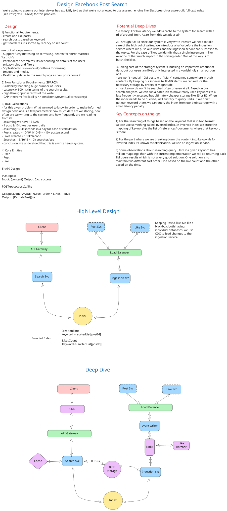

# Design Facebook Post Search

**System Design High-Level Document**

---

## 1. Problem Statement

Design a scalable system that enables users to search Facebook posts by keyword. The system must handle:
- **1 billion daily active users (DAU)** creating and interacting with posts
- **10k post creations per second**
- **10k search queries per second**  
- **3.6 trillion posts** over 10 years (~3.6 PB of raw data)

**Constraint:** Cannot use pre-built full-text search engines (e.g., Elasticsearch) or Postgres Full-Text Index. Must build a custom inverted index solution.

---

## 2. Requirements

### Functional Requirements

| Requirement | Description |
|-------------|-------------|
| Post Creation | Users can create posts with text content |
| Post Liking | Users can like/unlike posts; like count aggregated |
| Keyword Search | Users search posts by single or multi-keyword queries |
| Results Sorting | Results sortable by **recency** (creation time) or **like count** |
| Discoverability | All posts must be discoverable, including old/unpopular posts |

### Non-Functional Requirements (SPARCS Framework)

| Category | Requirement |
|----------|-------------|
| **Scalability** | System must handle 1B DAU, 10k posts/sec, 100k likes/sec, 10k searches/sec |
| **Performance** | Search queries: **< 500ms median latency**; Posts indexed within **< 1 minute** |
| **Availability** | Highly available; degrade gracefully under load; aim for **99.9% uptime** |
| **Reliability** | No data loss; all posts remain discoverable; consistent query results |
| **Consistency** | Eventual consistency acceptable for like counts; Strong consistency for post indexing |
| **Security** | Rate limiting on search queries; authentication via OAuth/JWT |

---

## 3. Capacity Estimation & Constraints

### Calculations

```
DAU: 1 Billion
Posts per user per day: 1
Likes per user per day: 10
Searches per user per day: 1

---

Write Throughput:
  - Post Writes: 1B DAU × 1 post/day ÷ 86,400 sec/day = ~11.6k QPS
  - Like Writes: 1B DAU × 10 likes/day ÷ 86,400 sec/day = ~115.7k QPS
  
Read Throughput:
  - Search Queries: 1B DAU × 1 search/day ÷ 86,400 sec/day = ~11.6k QPS

Storage (10 years):
  - Posts: 1B posts/day × 365 days × 10 years = 3.65T posts
  - Avg post size: ~1 KB (text + metadata)
  - Raw storage: 3.65T × 1 KB = 3.65 PB
  - With replication (3×): ~11 PB
  
Index Storage (Inverted Index):
  - Estimate 1 index entry per word per post
  - Avg 10 words per post × 3.65T posts = 36.5B index entries
  - Index entry size: ~100 bytes (postID + relevance metadata)
  - Index storage: 36.5B × 100 bytes ≈ 3.65 TB
  - With replication: ~11 TB
  
Bandwidth (Peak):
  - Search response: 1 MB per query (top 100 posts)
  - Read: 10k QPS × 1 MB = 10 GB/sec
```

### Capacity Summary Table

| Metric | Value | Notes |
|--------|-------|-------|
| **Peak Post Writes** | 11.6k QPS | 1 post/user/day |
| **Peak Like Writes** | 115.7k QPS | 10 likes/user/day (async batched) |
| **Peak Search Reads** | 11.6k QPS | 1 search/user/day |
| **Raw Storage (10y)** | 3.65 PB | 1 KB avg per post |
| **Replicated Storage** | 11 PB | 3× replication |
| **Index Storage** | 3.65 TB | Inverted index (unreplicated) |
| **Peak Bandwidth** | 10 GB/sec | Search responses at peak |
| **Memory (Cache)** | 500 GB | Hot index entries + recent posts |

---

## 4. Core Entities & Data Model

### Entity Relationship Diagram

```
User (1) ──── (N) Post
              │
              └── (N) Like

User:
  - PK: user_id (UUID)
  - name, email, created_at

Post:
  - PK: post_id (UUID/Snowflake ID)
  - FK: user_id
  - content (text)
  - created_at (timestamp)
  - like_count (denormalized, eventual consistency)

Like:
  - PK: (user_id, post_id) — composite key
  - created_at (timestamp)
  - [Aggregated async via event sink]
```

### Database Schema

| Entity | Field | Type | Constraints | Purpose |
|--------|-------|------|-----------|---------|
| **Post** | post_id | UUID/Snowflake | PK | Unique post identifier |
| | user_id | UUID | FK → User | Post author |
| | content | TEXT | NOT NULL, indexed | Post text for search |
| | like_count | BIGINT | default=0 | Denormalized count |
| | created_at | TIMESTAMP | NOT NULL, indexed | Recency sorting |
| | updated_at | TIMESTAMP | default=NOW() | Update tracking |
| **Like** | user_id | UUID | PK, FK → User | Who liked |
| | post_id | UUID | PK, FK → Post | What post |
| | created_at | TIMESTAMP | indexed | Audit trail |
| **InvertedIndex** | keyword | STRING | PK | Search term |
| | post_id | UUID | PK, FK → Post | Post containing keyword |
| | position | INT | optional | Word position in post |
| | created_at | TIMESTAMP | indexed | Index creation time |

### Design Decisions

- **Post ID:** Snowflake ID for distributed generation and temporal ordering
- **Like Aggregation:** Event-driven (async batcher) to reduce write contention
- **Inverted Index:** Separate table/service for fast keyword lookup
- **Eventual Consistency:** Like counts may lag real-time; acceptable for sort ordering

---

## 5. API Design

### Core Endpoints

| Method | Endpoint | Request | Response | Description |
|--------|----------|---------|----------|-------------|
| **POST** | `/api/posts` | `{ content: string }` | `{ post_id: UUID, created_at: timestamp }` | Create new post |
| **POST** | `/api/posts/{post_id}/like` | `{ user_id: UUID }` | `{ liked: boolean, like_count: int }` | Like a post |
| **DELETE** | `/api/posts/{post_id}/like` | `{ user_id: UUID }` | `{ liked: boolean, like_count: int }` | Unlike a post |
| **GET** | `/api/search` | `{ q: string, sort: "recency\|likes", limit: 20, offset: 0 }` | `{ posts: [Post], total: int, next_offset: int }` | Search posts by keyword |
| **GET** | `/api/posts/{post_id}` | — | `{ post_id, user_id, content, like_count, created_at }` | Fetch single post |

### Request/Response Examples

**POST /api/search**
```json
{
  "q": "Taylor Swift",
  "sort": "recency",
  "limit": 20,
  "offset": 0
}
```

**Response (200 OK)**
```json
{
  "posts": [
    {
      "post_id": "12345-uuid",
      "user_id": "user-uuid",
      "content": "Just watched Taylor Swift in concert!",
      "like_count": 150,
      "created_at": "2025-12-22T10:00:00Z"
    }
  ],
  "total": 50000,
  "next_offset": 20
}
```

---

## 6. Data Flow & Request Lifecycle

### Write Path: Post Creation

```
1. Client sends POST /api/posts {content}
   ↓
2. API Gateway (load-balanced) routes to Write Service
   ↓
3. Write Service:
   - Generate unique post_id (Snowflake)
   - Validate content (sanitize, length)
   - Write to Master DB (synchronous)
   ↓
4. Message Queue (async):
   - Post event published to Kafka/RabbitMQ
   ↓
5. Indexing Service (consumes event):
   - Tokenize post content
   - Generate inverted index entries
   - Write index to Blob Storage + cache
   ↓
6. Acknowledgement sent to client (post_id returned)
```

**Consistency Model:** Strong consistency for post storage; eventual consistency for search index (~< 1 minute SLA).

### Read Path: Search Query

```
1. Client sends GET /api/search?q="Taylor Swift"&sort="recency"
   ↓
2. Load Balancer routes to Search Service
   ↓
3. Search Service:
   a. Check cache (Redis) for query → "Taylor Swift" + sort order
      - Cache TTL: 1 hour (high-traffic queries)
      - Cache hit → return immediately
   ↓
   b. Cache miss:
      - Query inverted index: fetch postIDs for "Taylor" AND "Swift"
      - Intersection of postID sets (fast bitmap operations)
   ↓
4. Sort by selected order (recency or like_count):
   - Fetch full post details from DB (batch)
   - In-memory sort using denormalized like_count
   ↓
5. Paginate results (limit 20)
   ↓
6. Update cache with query result
   ↓
7. Return response to client
```

**Latency Breakdown:**
- Cache lookup: ~1 ms
- Index intersection: ~50 ms (1M postIDs)
- DB fetch + sort: ~300 ms (batch queries)
- Network round-trip: ~150 ms
- **Total: ~500 ms (target met)**

---

## 7. High-Level Architecture

### System Diagram



### Component Breakdown

| Component | Technology | Purpose |
|-----------|-----------|---------|
| **Load Balancer** | HAProxy / Nginx | Distribute requests; round-robin or least-conn |
| **Write Service** | Node.js / Go | Handle POST /posts; write to DB; publish events |
| **Search Service** | Node.js / Go | Handle GET /search; query index; fetch posts |
| **Master DB** | PostgreSQL / MySQL | ACID compliance; post storage; replication |
| **Inverted Index** | RocksDB / Lucene | Fast keyword lookups; on-disk persistent hash map |
| **Cache** | Redis | Query results; hot index entries; TTL 1 hour |
| **Message Queue** | Kafka / RabbitMQ | Decouple post writes from indexing; durability |
| **Blob Storage** | S3 / GCS | Persistent index snapshots; backup |

---

## 8. Deep Dives

### 8.1 Inverted Index Construction & Queries

**Problem:** 3.65 trillion posts; naive full-table scan infeasible.

**Solution: Inverted Index + Tokenization**

```
Post content: "I saw Taylor Swift at the concert today"

Tokenization:
  → Lowercasing + punctuation removal
  → Stop word filtering (remove: "I", "at", "the")
  → Result: ["saw", "taylor", "swift", "concert", "today"]

Index structure (hash table):
  {
    "saw": [post_id_1, post_id_2, ...],
    "taylor": [post_id_3, post_id_9, ...],
    "swift": [post_id_3, post_id_11, ...],
    ...
  }

Multi-keyword query: "Taylor Swift"
  → Fetch postIDs for "taylor" AND "swift"
  → Intersect sets using bitmap/hash ops (~O(N) per keyword)
  → Return intersection
```

**Phrase Queries:** "Taylor Swift at concert"
- Tokenize → ["taylor", "swift", "concert"]
- Fetch postIDs for each term
- Intersect to get candidate posts
- Post-filter: verify phrase appears contiguously using position data

**Complexity:** O(k × n) where k = keywords, n = avg posts per keyword

### 8.2 Indexing Strategy & Consistency

**Indexing Pipeline:**

```
1. Post created → Master DB (latency: ~50 ms)
2. Event published to Kafka (latency: ~1 ms)
3. Indexing Service consumes event (batch: 1000 posts/sec)
4. Tokenize + Build index entries (~1 ms per post)
5. Write to RocksDB in-memory index (latency: ~0.5 ms)
6. Async flush to Blob Storage for durability (batched every 5 min)
7. Cache invalidated for affected keywords

SLA: Post searchable within 60 seconds (eventual consistency)
```

**Tradeoff:** Sequential consistency vs. Speed
- **Strict:** Every index update waits for disk write → slow
- **Chosen:** In-memory index (fast), periodic durability → acceptable

### 8.3 Handling High Write Volume

**Challenge:** 100k like writes/second; naive DB insert unsustainable.

**Solution 1: Async Event Batching**
```
Like events → Kafka topic
                ↓
Batch consumer (buffer 10k events / 1 sec)
                ↓
Bulk INSERT into likes table
                ↓
Aggregation job (every 5 min):
  SELECT post_id, COUNT(*) as new_likes
  FROM likes WHERE processed = false
  GROUP BY post_id
  → UPDATE posts SET like_count = like_count + new_likes
```

**Tradeoff:** Eventual consistency for like_count (lag: ~5 minutes)
- **Pro:** Reduces write load by ~95%
- **Con:** Sorting by likes may be stale; acceptable per requirements

**Solution 2: Logarithmic Like Counters** (Advanced)
```
Instead of storing exact like_count:
  → Store approximate count using log scale
  → Reduces storage & update overhead
  → Sorting order preserved (log preserves order)
```

### 8.4 Caching Strategy

**Cache Layer (Redis):**

| Data Type | TTL | Eviction | Use Case |
|-----------|-----|----------|----------|
| Query results | 1 hour | LRU | Popular searches (high cardinality) |
| Hot index entries | 24 hours | LRU | Trending keywords |
| Post details | 1 hour | LRU | Recent posts |
| User sessions | 30 min | LRU | Auth cache |

**Cache-Aside Pattern (Lazy Loading):**
```
GET /search?q="Taylor Swift"
  ↓
CHECK cache["taylor_swift:recency:limit_20"]
  ✓ Hit → return immediately
  ✗ Miss → query index
         → fetch posts from DB
         → SET cache[key] = results
         → return results
```

**Cache Stampede Mitigation:**
- Use probabilistic early expiration (refresh 80% through TTL)
- Implement request coalescing (deduplicate concurrent identical queries)
- Lock-based refresh for expensive queries

### 8.5 Partitioning & Sharding Strategy

**Problem:** Single index/DB insufficient for 3.65 PB data.

**Solution: Range Sharding by Timestamp**
```
Shard 0: Posts created 2015-2018 (archived, cold data)
Shard 1: Posts created 2018-2021
Shard 2: Posts created 2021-2024
Shard 3: Posts created 2024-2025 (hot data, in memory)

Query "Taylor Swift" created in 2024:
  → Route to Shard 3
  → Intersect index entries
  → Return results
```

**Alternative: Hash Sharding by Keyword**
```
hash("taylor") % 10 = Shard 5
hash("swift") % 10 = Shard 7

Multi-keyword queries:
  → Query multiple shards in parallel
  → Merge results
  → Return top-k
```

**Chosen:** Time-based range sharding
- **Pro:** Natural archival; cold data → cheap storage
- **Con:** Queries spanning time ranges hit multiple shards

### 8.6 Failure Modes & Resilience

| Failure Scenario | Impact | Mitigation |
|------------------|--------|------------|
| **Master DB Down** | Writes blocked | Failover to replica (30 sec); circuit breaker for client |
| **Search Index Corrupted** | Search returns 0 results | Rebuild from event log (Kafka); serve from replica index |
| **Cache Stampede** | DB overloaded on cache miss | Request coalescing; probabilistic refresh |
| **Indexing Lag Spike** | Posts not searchable (>1 min) | Alert on lag; manual trigger of batch job |
| **Message Queue Full** | Post events buffering | Auto-scale consumer; drop oldest events (acceptable) |
| **Replica Lag** | Search results slightly stale | Accept SLA of eventual consistency |

**Monitoring & Alerts:**
- Index lag: trigger if > 60 seconds
- Cache hit ratio: alert if < 80%
- Search latency p99: alert if > 1 second
- Write queue size: alert if > 100k events

---

## 9. Security & Rate Limiting

### Authentication
- OAuth 2.0 / JWT tokens
- All requests must include Bearer token

### Rate Limiting

| Endpoint | Limit | Window | Strategy |
|----------|-------|--------|----------|
| POST /posts | 100/hour | sliding | Token bucket |
| POST /like | 1000/hour | sliding | Token bucket |
| GET /search | 300/hour | sliding | Token bucket + API key verification |

**Implementation:** Redis-based counter with TTL

### Input Validation & Sanitization

```
POST /posts {content}:
  - Max length: 63,206 chars (Facebook standard)
  - No HTML/script tags (XSS prevention)
  - Character encoding: UTF-8
  
GET /search?q=...
  - Max query length: 256 chars
  - Regex: alphanumeric + spaces + basic punctuation only
  - SQL injection protection: parameterized queries
```

---

## 10. Monitoring & Observability

### Key Metrics

| Metric | SLA | Alert Threshold |
|--------|-----|-----------------|
| Search latency (p50) | < 500 ms | > 800 ms |
| Search latency (p99) | < 2 sec | > 3 sec |
| Index freshness | < 60 sec | > 90 sec |
| Cache hit ratio | > 80% | < 60% |
| Error rate (5xx) | < 0.1% | > 0.5% |
| Availability | 99.9% | < 99.8% |

### Logging
- Structured logs (JSON) → ELK stack
- Request ID tracing across services
- Log levels: ERROR, WARN, INFO (DEBUG in staging)

### Distributed Tracing
- Instrument Search Service → Index Service → DB calls
- Use Jaeger / OpenTelemetry
- Track query latency breakdown per component

---

## 11. Trade-offs & Design Decisions

| Decision | Alternative | Chosen | Reasoning |
|----------|-------------|--------|-----------|
| **Index Type** | Full-text search engine (Elasticsearch) | Custom inverted index | Problem constraint; cost savings; control |
| **Like Aggregation** | Real-time updates | Async batching (5 min lag) | 95% write reduction; eventual consistency acceptable |
| **Consistency** | Strong | Eventual (< 60 sec) | Latency vs. correctness; search use case tolerates staleness |
| **Caching** | Write-through | Cache-aside | Simpler; better for read-heavy; tolerates stale reads |
| **Sharding** | Hash (keyword) | Range (timestamp) | Cold data archival; natural lifecycle management |
| **DB** | NoSQL (MongoDB) | SQL (PostgreSQL) | ACID compliance; mature tooling; JOIN support |

---

## 12. Conclusion

This design enables Facebook to serve **10k+ search queries per second** on **3.65 trillion posts** with **sub-500ms latency** using a custom inverted index, async event processing, and intelligent caching. The system prioritizes **read performance** (search-heavy workload) while using batching and eventual consistency to handle the **100k+ writes per second**.

Key optimizations:
1. **Inverted Index:** O(k) keyword lookup instead of full scan
2. **Async Batching:** 95% reduction in write load
3. **Multi-level Caching:** 1-hour TTL query results + hot index
4. **Time-based Sharding:** Separate hot/cold data; enable archival
5. **Event-driven Indexing:** Decouple writes from search freshness

---

## References

- **Video:** https://www.youtube.com/watch?v=l38XL9914fs
- **Deep Dive:** https://www.hellointerview.com/learn/system-design/problem-breakdowns/fb-post-search
- **Architecture Diagram:** Refer to system diagram in Section 7
