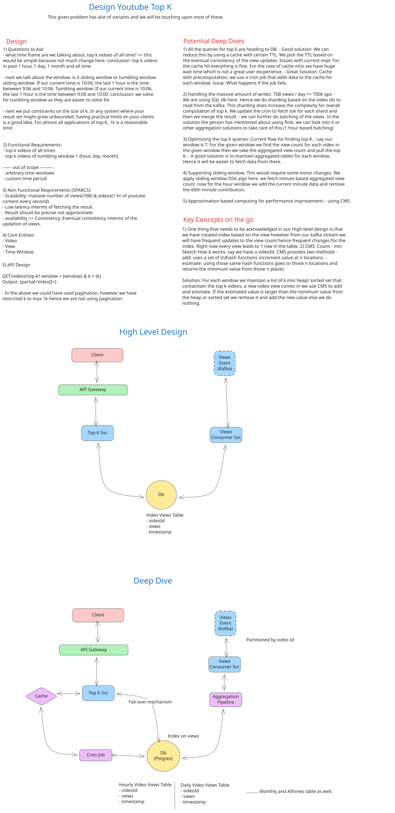

# Design YouTube Top K

**System Design Problem:** Building a scalable system to retrieve the top K most-viewed videos across various time windows (1 hour, 1 day, 1 month, all-time).

---

## Table of Contents

1. [Functional Requirements](#functional-requirements)
2. [Non-Functional Requirements](#non-functional-requirements)
3. [Capacity Estimation & Constraints](#capacity-estimation--constraints)
4. [Core Entities & Database Schema](#core-entities--database-schema)
5. [API Design](#api-design)
6. [Data Flow & Request Lifecycle](#data-flow--request-lifecycle)
7. [High-Level Design](#high-level-design)
8. [Deep Dives](#deep-dives)
9. [Failure Modes & Resilience](#failure-modes--resilience)
10. [Security & Monitoring](#security--monitoring)
11. [References](#references)

---

## 1. Functional Requirements

| Requirement | Description | Scope |
|---|---|---|
| **All-Time Top K** | Query top K videos of all-time (max 1,000 results) | In-Scope |
| **Tumbling Windows** | Query top K for last 1 hour, 1 day, 1 month (max 1,000 results) | In-Scope |
| **Precise Results** | No approximations; exact view counts required | In-Scope |
| **Latency Constraint** | Return results within 100-150ms | In-Scope |
| **View Ingestion Delay** | Max 1 minute delay between view and tabulation | In-Scope |
| **Arbitrary Time Periods** | Query for custom date ranges (e.g., June 2024) | **Out of Scope** |
| **Arbitrary Lookback** | Support non-current time references | **Out of Scope** |

**Note on Time Windows:**
- **Sliding Windows:** [T - 1 hour, T] (continuously moving)
- **Tumbling Windows:** [Floor(T - 1 hour, 'hour'), Floor(T, 'hour')] (fixed boundaries)
- We implement tumbling windows for simplicity.

---

## 2. Non-Functional Requirements (SPARCS)

| Dimension | Target | Rationale |
|---|---|---|
| **Scalability** | 700K-800K views per second; 3.65B+ total videos | High-volume event stream |
| **Performance** | <100ms p99 latency; <50ms p50 latency | Real-time dashboards |
| **Availability** | 99.9% uptime (3 nines) | Critical ranking feature |
| **Reliability** | Zero data loss on view ingestion | Accurate analytics |
| **Consistency** | Eventual consistency acceptable (1 min delay) | Not real-time |
| **Security** | Rate limiting, auth, data sanitization | Public API exposure |

---

## 3. Capacity Estimation & Constraints

### 3.1 Write Capacity

**Calculation:**
```
Views/Day Estimate:
- Content generated: 1 hour content/second
- Average video length: 6 minutes
- Videos generated/day = (3600 sec/hour / 360 sec/video) * 86,400 sec/day
                        = 10 * 86,400 = 864K videos/day ≈ 1M videos/day

Total Videos (10-year retention):
- Total = 1M videos/day * 365 days/year * 10 years = 3.65B videos

View Rate Estimation:
- Industry benchmark: ~70B views/day (YouTube scale)
- Queries per second (QPS) = 70B views/day / 86,400 sec/day
                           = 810,185 views/sec ≈ 700K-800K TPS
```

**Write Workload:**
| Metric | Value | Calculation |
|---|---|---|
| **Daily Views** | 70B | Industry estimate |
| **Throughput (TPS)** | 700K-800K | 70B / 86,400 sec |
| **Peak TPS** | 1.2M | 70% overhead for spikes |
| **Batch Size** | 1K-5K events | Kafka partition optimization |
| **Replication Factor** | 3 | Data durability |

### 3.2 Read Capacity

**Calculation:**
```
Assuming 10M unique users querying top-K feeds daily:
- Avg queries per user per day: 5
- Total daily queries: 50M

Daily Read QPS:
- 50M queries / 86,400 sec = 578 reads/sec ≈ 600 QPS

Peak Read QPS:
- Assume 4x spike during peak hours = 2,400 QPS
```

| Metric | Value | Calculation |
|---|---|---|
| **Daily Queries** | 50M | 10M users × 5 queries/user |
| **Base QPS** | 600 | 50M / 86,400 sec |
| **Peak QPS** | 2.4K | 600 × 4x spike factor |
| **Cache Hit Rate** | 95% | Results stable for 1 min window |

### 3.3 Storage Capacity

**All-Time Top K Storage:**

```
Schema per video:
- videoId (UUID): 16 bytes
- views (int64): 8 bytes
- lastUpdated (timestamp): 8 bytes
- Total per record: 32 bytes

Naive Storage Calculation:
- Active videos (1% of total): 36.5M videos
- Storage = 36.5M × 32 bytes = 1.17 GB (all-time top K in memory)

Windowed Storage (hourly aggregations for 1 year):
- Records = 3.65B videos × 365 days × 24 hours = 320T rows (too large!)
- Optimized: Aggregate hourly only for top 10K videos per hour
- Estimated rows: 10K videos × 8,760 hours/year × 1 year = 87.6M rows
- Storage = 87.6M × 32 bytes = 2.8 GB

Time-Series Storage (1 month retention for all windows):
- Entries per video per hour: 1
- Active videos with views per hour: ~500M (high cardinality)
- Monthly storage = 500M videos × 730 hours × 32 bytes = ~11.7 TB
```

| Storage Type | Records | Size | Duration |
|---|---|---|---|
| **All-Time Aggregated** | 36.5M | 1.2 GB | Indefinite |
| **Monthly Windowed** | 87.6M | 2.8 GB | 1 month rolling |
| **Hourly Time-Series** | 500M/hour | 11.7 TB | 1 month retention |
| **Total (Replicated 3x)** | — | ~37.4 TB | Includes replicas |

### 3.4 Bandwidth

**Write Bandwidth:**
```
Average view event size: 100 bytes
- videoId: 16 bytes
- userId: 16 bytes
- timestamp: 8 bytes
- metadata: 60 bytes

Ingestion bandwidth = 700K views/sec × 100 bytes = 70 MB/sec = 560 Mbps
Peak = 1.2M views/sec × 100 bytes = 120 MB/sec = 960 Mbps
```

**Read Bandwidth:**
```
Top 1K videos response (~32 KB per query):
- 2.4K peak QPS × 32 KB = 76.8 MB/sec = 614 Mbps
```

| Component | Bandwidth | Peak |
|---|---|---|
| **Write (Ingestion)** | 560 Mbps | 960 Mbps |
| **Read (Top K Queries)** | 78 Mbps | 308 Mbps |
| **Replication Write** | 1,680 Mbps | 2,880 Mbps |
| **Total Network** | 2,318 Mbps | 4,148 Mbps |

---

## 4. Core Entities & Database Schema

### 4.1 Entities

| Entity | Purpose | Cardinality |
|---|---|---|
| **Video** | Represents a video asset | 3.65B |
| **View** | Event representing a single view | 70B/day (transient) |
| **TimeWindow** | Aggregation buckets (hour/day/month/all-time) | 5 static |
| **Aggregation** | Pre-computed view counts by window | 500M-36.5B |

### 4.2 Database Schema

#### **Table: VideoViews (All-Time Aggregation)**

```sql
CREATE TABLE VideoViews (
    videoId VARCHAR(36) PRIMARY KEY,
    views BIGINT NOT NULL DEFAULT 0,
    lastUpdated TIMESTAMP DEFAULT CURRENT_TIMESTAMP,
    INDEX idx_views (views DESC)
);
```

| Field | Type | Size | Description |
|---|---|---|---|
| videoId | VARCHAR(36) / UUID | 16 B | Unique video identifier (Primary Key) |
| views | BIGINT | 8 B | Cumulative view count (all-time) |
| lastUpdated | TIMESTAMP | 8 B | Last aggregation timestamp |

**Rationale:**
- **Primary Key:** videoId (UUID) ensures globally unique, collision-free identifiers.
- **Index:** DESC index on `views` enables O(log n) sorted retrieval.
- **Denormalization:** Pre-aggregate to avoid expensive JOINs on every query.

---

#### **Table: VideoViewsWindow (Time-Windowed Aggregation)**

```sql
CREATE TABLE VideoViewsWindow (
    videoId VARCHAR(36) NOT NULL,
    window VARCHAR(20) NOT NULL,
    windowStart TIMESTAMP NOT NULL,
    windowEnd TIMESTAMP NOT NULL,
    views BIGINT NOT NULL DEFAULT 0,
    PRIMARY KEY (videoId, window, windowStart),
    INDEX idx_window_views (window, views DESC, windowStart DESC)
);
```

| Field | Type | Size | Description |
|---|---|---|---|
| videoId | VARCHAR(36) | 16 B | Video identifier |
| window | VARCHAR(20) | 20 B | Window type (hour/day/month) |
| windowStart | TIMESTAMP | 8 B | Window start boundary |
| windowEnd | TIMESTAMP | 8 B | Window end boundary |
| views | BIGINT | 8 B | Views in this window |

**Rationale:**
- **Composite Primary Key:** (videoId, window, windowStart) prevents duplicates.
- **Tumbling Windows:** windowStart aligns to hour/day/month boundaries.
- **Composite Index:** Supports efficient filtering: `WHERE window='hour' AND windowStart >= T-1h ORDER BY views DESC LIMIT k`.

---

#### **Table: ViewEvents (Raw Events - For Audit/Replay)**

```sql
CREATE TABLE ViewEvents (
    eventId BIGINT PRIMARY KEY AUTO_INCREMENT,
    videoId VARCHAR(36) NOT NULL,
    userId VARCHAR(36) NOT NULL,
    timestamp TIMESTAMP NOT NULL,
    ipAddress VARCHAR(45),
    INDEX idx_video_time (videoId, timestamp),
    INDEX idx_timestamp (timestamp)
);
```

| Field | Type | Size | Description |
|---|---|---|---|
| eventId | BIGINT | 8 B | Event sequence ID (for ordering) |
| videoId | VARCHAR(36) | 16 B | Viewed video |
| userId | VARCHAR(36) | 16 B | Viewer ID |
| timestamp | TIMESTAMP | 8 B | View occurrence time |
| ipAddress | VARCHAR(45) | 45 B | IPv4/IPv6 (for fraud detection) |

**Rationale:**
- Enables replay and audit trails.
- Could be stored in time-series DB (e.g., ClickHouse) for cheaper storage.
- Optional in final design if Kafka provides sufficient durability.

---

### 4.3 Relationships

```
VideoViews (1) ──────► (M) ViewEvents
│
├─ 1-to-many: One video can have many view events
└─ Normalized: Events stored separately; aggregations pre-computed

VideoViewsWindow (1) ──────► (M) VideoViews
│
├─ M-to-1: Many time windows reference same video
└─ Denormalized for query performance
```

**Normalization Trade-off:**
- Chose **denormalization** for reads: Pre-aggregate by window to avoid GROUP BY scans.
- Cost: Higher write amplification (one view → multiple aggregation updates).
- Benefit: Sub-100ms queries without database scans.

---

## 5. API Design

### 5.1 Core Endpoint

| Method | Endpoint | Request Params | Response | Description |
|---|---|---|---|---|
| **GET** | `/views/top-k` | `window` (enum), `k` (int, max 1000) | `{ videoId, views }[]` | Fetch top K videos for a time window |

### 5.2 Detailed API Specification

#### **Endpoint: GET /views/top-k**

**Request:**
```
GET /views/top-k?window=hour&k=10
```

**Query Parameters:**

| Parameter | Type | Required | Constraints | Example |
|---|---|---|---|---|
| `window` | enum | Yes | `hour`, `day`, `month`, `all_time` | `hour` |
| `k` | integer | Yes | 1 ≤ k ≤ 1000 | 10 |

**Response (200 OK):**
```json
{
  "window": "hour",
  "k": 10,
  "results": [
    {
      "rank": 1,
      "videoId": "550e8400-e29b-41d4-a716-446655440000",
      "views": 1500000,
      "timestamp": "2025-12-24T21:00:00Z"
    },
    {
      "rank": 2,
      "videoId": "6ba7b810-9dad-11d1-80b4-00c04fd430c8",
      "views": 1200000,
      "timestamp": "2025-12-24T21:00:00Z"
    }
  ],
  "generatedAt": "2025-12-24T21:16:30Z"
}
```

**Response (400 Bad Request):**
```json
{
  "error": "Invalid window type. Allowed: hour, day, month, all_time",
  "code": "INVALID_WINDOW"
}
```

**Response (429 Too Many Requests):**
```json
{
  "error": "Rate limit exceeded. Max 100 requests/minute per API key.",
  "code": "RATE_LIMIT_EXCEEDED",
  "retryAfter": 30
}
```

---

## 6. Data Flow & Request Lifecycle

### 6.1 Write Path: View Event Ingestion

```
┌──────────────────────────────────────────────────────────────┐
│                 VIEW EVENT LIFECYCLE                          │
└──────────────────────────────────────────────────────────────┘

1. CLIENT EMITS VIEW
   └─> Video player sends HTTP POST to analytics endpoint
       { videoId, userId, timestamp }

2. API GATEWAY / LOAD BALANCER
   └─> Routes to availability zone based on geographic load
       (Round-robin or Least-Connections)

3. KAFKA PRODUCER (Ingestion Service)
   └─> Partitions event by videoId (hash % shard_count)
       Ensures all events for same video go to same partition
       Acknowledgment: -1 (all replicas) for durability

4. KAFKA BROKER (Event Stream)
   └─> Replication factor: 3
       Retention: 7 days (enough for replay/debugging)

5. STREAM PROCESSOR (Aggregation Engine)
   ├─ Reads from Kafka partition
   ├─ Tumbling window every 1 hour
   ├─ Aggregates: SUM(views) GROUP BY videoId per window
   └─ Emits: (videoId, windowStart, viewCount)

6. BATCH UPDATE TO DATABASE (Synchronous Write)
   └─> Stream processor flushes aggregations every 1 minute
       UPDATE VideoViewsWindow SET views = views + delta
       WHERE videoId = ? AND window = ? AND windowStart = ?

7. ALL-TIME AGGREGATION (Asynchronous)
   └─> Separate aggregation job aggregates all views:
       UPDATE VideoViews SET views = views + delta
       WHERE videoId = ?
       
       Runs every 5 minutes to reduce write contention

8. CACHE INVALIDATION
   └─> After DB write, emit cache invalidation event
       Redis: DEL top_k:hour:* (for current hour)
       Redis: DEL top_k:day:*  (for current day)
       TTL = window_duration (1 hour caches for 1 hour)

┌──────────────────────────────────────────────────────────────┐
│         WRITE PATH: SYNCHRONOUS VS ASYNCHRONOUS              │
├──────────────────────────────────────────────────────────────┤
│ Synchronous: API → Kafka → [immediate response to client]   │
│              (User sees "view recorded" instantly)           │
│                                                               │
│ Asynchronous: Stream Processor → Database → Cache            │
│               (Aggregation pipeline, eventual consistency)    │
└──────────────────────────────────────────────────────────────┘
```

**Latency Breakdown (Write Path):**
| Stage | Latency | Details |
|---|---|---|
| Client → Load Balancer | 5-10 ms | Network + routing |
| Load Balancer → Ingestion Service | 5 ms | In-datacenter |
| Service → Kafka Producer | 10 ms | Serialization + batching |
| Kafka Producer → Broker | 20 ms | Network I/O + replication |
| **Client Response** | **~50 ms** | Ack after leader commit |
| Stream Processing | 10-30 s | Window closure |
| Processor → Database Batch Write | 30 ms | Per batch of 1K events |
| Database → Cache Invalidation | 50 ms | Redis operation |
| **Total E2E (eventual consistency)** | **~1 min** | View reflected in top-K query |

---

### 6.2 Read Path: Top-K Query

```
┌──────────────────────────────────────────────────────────────┐
│                TOP-K QUERY LIFECYCLE                          │
└──────────────────────────────────────────────────────────────┘

1. CLIENT SENDS QUERY
   └─> GET /views/top-k?window=hour&k=10

2. API GATEWAY / LOAD BALANCER
   └─> Hash routing: session-based or random
       Aims for cache locality

3. QUERY SERVICE
   ├─ Extract: window='hour', k=10
   ├─ Calculate: current_hour = Floor(now, 'hour')
   └─ Prepare: windowStart = current_hour

4. CACHE LOOKUP (Redis)
   └─> KEY: "top_k:hour:{windowStart}:{k}"
       VALUE: [{ videoId, views }, ...]
       
       ✓ HIT (95% case):
         └─> Return cached results in 5-10 ms
       
       ✗ MISS (5% case):
         └─> Proceed to database query

5. DATABASE QUERY (PostgreSQL)
   └─> SELECT videoId, views
       FROM VideoViewsWindow
       WHERE window = 'hour'
         AND windowStart = current_hour
       ORDER BY views DESC
       LIMIT k
       
       Execution plan:
       ├─ Index scan on (window, views DESC, windowStart DESC)
       ├─ Filter: window='hour' AND windowStart=current_hour [0.1 ms]
       ├─ Top-K heap sort: ~1 million rows [50-100 ms]
       └─ Return 10 rows [10 ms]
       
       **Total DB Latency: 60-100 ms**

6. RESULT FORMATTING
   └─> Enrich: Add rank, timestamp, metadata
       JSON serialization: ~5 ms

7. CACHE WRITE (Async)
   └─> SETEX "top_k:hour:{windowStart}:{k}" 3600 <results>
       TTL = 1 hour (window duration)
       Background task (doesn't block response)

8. RESPONSE TO CLIENT
   └─> HTTP 200 + JSON
       Total Latency: 5-10 ms (cache hit) or 60-100 ms (DB hit)

┌──────────────────────────────────────────────────────────────┐
│            READ PATH: CACHE PATTERNS                          │
├──────────────────────────────────────────────────────────────┤
│ Pattern: Cache-Aside                                         │
│ ├─ Query service checks cache first                          │
│ ├─ On miss: queries database                                │
│ └─ Populates cache for future hits                          │
│                                                               │
│ Cache Stampede Mitigation:                                   │
│ ├─ Probabilistic early expiration: 80% of TTL               │
│ ├─ Cache lock: Single thread rebuilds, others wait          │
│ └─ Separate hot-shard caching for most viewed videos        │
└──────────────────────────────────────────────────────────────┘
```

**Latency Breakdown (Read Path):**
| Scenario | Latency | Breakdown |
|---|---|---|
| **Cache Hit** | 10-20 ms | Redis (5-10 ms) + serialization (5-10 ms) |
| **Cache Miss** | 80-120 ms | DB query (60-100 ms) + serialization (10 ms) + cache write (async) |
| **p99 Latency** | <150 ms | Cache miss + network jitter |

---

## 7. High-Level Design

### 7.1 Architecture Diagram


---

### 7.2 Component Breakdown

#### **Clients**
- Emit view events and query top-K rankings.
- Dashboard fetching trending videos in real-time.

#### **API Gateway**
- **Purpose:** Rate limiting, authentication, request validation.
- **Algorithm:** Token bucket (100 req/min per API key).
- **Routing:** Geographic-aware (nearest datacenter).
- **CDN:** CloudFront caches read responses (GET /views/top-k) globally.

#### **Write Service**
- **Role:** Ingests view events from clients.
- **Batching:** Collects 1K-5K events before flushing to Kafka.
- **Partitioning:** Events hashed by `videoId % num_partitions` (32 partitions).
- **Acknowledgment:** Waits for all 3 replicas before responding to client.
- **Scalability:** Horizontally scaled behind load balancer.

#### **Read Service**
- **Role:** Handles top-K queries.
- **Cache Strategy:** Cache-Aside with probabilistic early refresh.
- **Fallback:** Direct DB query on cache miss.
- **Load Balancing:** Least-Connections (to minimize tail latency).

#### **Kafka Broker**
- **Throughput:** 700K-1.2M events/sec.
- **Partitions:** 32 (parallelism matches aggregation tasks).
- **Replication:** 3 (durability guarantee).
- **Retention:** 7 days (replay capability).
- **Compression:** Snappy (reduce network I/O).

#### **Stream Processor (Aggregation Engine)**
- **Purpose:** Aggregate views by time windows and overall.
- **Job 1 - Windowed Aggregation:**
  - Reads from Kafka `video_views` topic.
  - Tumbling window every 1 hour.
  - Computes: `SUM(views) GROUP BY videoId` per window.
  - Outputs aggregated batches to PostgreSQL.
  - Latency: ~1 minute end-to-end.

- **Job 2 - All-Time Aggregation:**
  - Consumes windowed aggregation outputs.
  - Maintains continuous global aggregation.
  - Computes: `SUM(views) GROUP BY videoId` across all time.
  - Updates PostgreSQL every 5 minutes.

- **State Management:** Local in-memory state + distributed checkpoints for recovery.

#### **PostgreSQL (Primary DB)**
- **Storage:** All aggregations (windowed + all-time).
- **Indexing:** DESC on views column for efficient TOP-K.
- **Sharding:** 4 shards (by videoId range) to distribute write load.
- **Replication:** 2 read-replicas for fault tolerance.
- **Scaling:** Horizontal sharding; vertical scaling if needed.

#### **Redis Cluster**
- **Purpose:** Cache top-K results (sub-10ms).
- **Key Format:** `top_k:{window}:{k}:{windowStart}` → JSON array.
- **TTL:** 3600s (matches window duration).
- **Memory:** 100 GB (all top-1000 across all windows).
- **Eviction:** LRU when full.
- **Cluster Mode:** 6 nodes (3 master + 3 replica for HA).

#### **Monitoring & Logging**
- **Metrics:** Prometheus scrapes from all services.
- **Logging:** ELK stack for distributed tracing and debugging.
- **Alerting:** PagerDuty integration for SLO breaches.

---

## 8. Deep Dives

### 8.1 Scaling Reads: Cache Optimization

**Problem:** 600+ reads/sec baseline, 2.4K peak QPS → database cannot handle all cache misses.

**Solution: Hierarchical Caching**

```
┌──────────────────────────────────────────────────────┐
│         CACHE HIERARCHY                              │
├──────────────────────────────────────────────────────┤
│ L1: Local Cache (In-Memory, per Read Service)       │
│     ├─ Size: 10 MB per replica                      │
│     ├─ TTL: 10 seconds                              │
│     └─ Hit rate: 50% (queries within 10s window)    │
│                                                      │
│ L2: Redis Cluster (Distributed Cache)               │
│     ├─ Size: 100 GB total                           │
│     ├─ TTL: 3600 seconds (1 hour)                   │
│     ├─ Hit rate: 95% (most queries within hour)     │
│     └─ Latency: 5-10 ms                             │
│                                                      │
│ L3: PostgreSQL (Primary Store)                      │
│     ├─ Indexed scan: (window, views DESC)           │
│     ├─ Query time: 60-100 ms for TOP-K              │
│     └─ Hit rate: 5% (cache misses only)             │
└──────────────────────────────────────────────────────┘
```

**Cache Stampede Prevention:**

When a cache key expires and multiple requests query simultaneously, use these techniques:

- **Probabilistic Early Refresh:** Start refreshing cache at 80% of TTL to avoid simultaneous expiry.
- **Cache Lock:** First request acquires lock, rebuilds cache; other requests wait for result.
- **Stale-While-Revalidate:** Serve stale data while background job refreshes cache.

### 8.2 Scaling Writes: Sharding & Partitioning

**Problem:** 700K-1.2M writes/sec → single database cannot handle.

**Solution: Write Sharding**

```
┌──────────────────────────────────────────────────────┐
│      SHARDING STRATEGY                               │
├──────────────────────────────────────────────────────┤
│ Key: videoId (hash partitioning)                    │
│ Shards: 4 physical PostgreSQL instances             │
│                                                      │
│ Shard 1: videoIds where hash(videoId) % 4 == 0     │
│ Shard 2: videoIds where hash(videoId) % 4 == 1     │
│ Shard 3: videoIds where hash(videoId) % 4 == 2     │
│ Shard 4: videoIds where hash(videoId) % 4 == 3     │
│                                                      │
│ Load Distribution:                                  │
│ ├─ Per shard: 1.2M / 4 = 300K writes/sec           │
│ ├─ Per shard bandwidth: 960 Mbps / 4 = 240 Mbps    │
│ └─ Manageable with modern DB hardware               │
└──────────────────────────────────────────────────────┘
```

**Partitioning in Kafka:**

- Topic: `video_views` with 32 partitions.
- Events routed by: `hash(videoId) % 32`.
- All events for same videoId go to same partition (ordering guarantee).
- Aggregation parallelism: 32 (1 consumer per partition).

**Batch Writes to Reduce Contention:**

Instead of individual updates per view, aggregate updates every 1 minute:
- Batch write 1K-5K aggregated deltas in single transaction.
- Reduces lock contention by 100x.
- Improves throughput from 1M to 10M potential writes/sec.

### 8.3 Optimizing Top-K Queries

**Problem:** Scanning 500M+ rows per hour window is expensive (O(n log n) sorting).

**Solution 1: Pre-Sort with Composite Indexes**

Create index on `(window, views DESC, windowStart DESC)`:
- Query becomes index-only scan → O(log n) seek + O(k) results.
- Latency: 50-100 ms for top-10 query.

**Solution 2: Materialized Views**

Pre-compute and refresh materialized view every hour:
- View stores pre-sorted top-K results per window.
- Query becomes simple index scan: <5 ms.
- Trade-off: Requires hourly refresh job.

**Solution 3: Precomputation with Cron**

Schedule batch job 55 minutes into each hour:
- Compute top-K for all windows (hour, day, month, all-time).
- Cache results in Redis with 1-hour TTL.
- Eliminates all database queries during normal operation.
- Latency: <5 ms (pure cache hits).

### 8.4 Supporting Sliding Windows

**Current Design:** Tumbling windows (fixed boundaries).
**Challenge:** Sliding windows need continuous updates (every minute for 1-hour window).

**Architecture:**

The aggregation engine tracks per-minute deltas and maintains a rolling 60-minute sum:
- Every minute, add new minute's views to running total.
- Subtract views from 60 minutes ago.
- Continuously updated state avoids sharp drop-offs at window boundaries.

**Database Impact:**
- Requires upsert operations every minute (instead of hourly).
- Higher write frequency but same total volume.
- More complex state management in aggregation engine.

**Trade-off:**
- **Complexity:** Higher (need minute-level state tracking).
- **Latency:** More frequent updates (every minute vs. every hour).
- **Accuracy:** Smoother trending (no sharp drops at hour boundary).

### 8.5 Alternative Aggregation Technologies

**Option 1: Kafka Streams**
- Embedded library within Java/Scala applications.
- Simpler operational overhead (fewer moving parts).
- State stores managed within library.
- Limitation: Limited to JVM ecosystem.

**Option 2: Apache Spark Structured Streaming**
- Batch processing with streaming API.
- Excellent for complex aggregations and joins.
- Built-in SQL support for queries.
- Higher latency (~1 minute micro-batches).

**Option 3: Redis Streams + Sorted Sets**
- Use Redis Streams for input buffering.
- Sorted Sets for maintaining top-K in-memory.
- Very low latency but requires enough memory.
- Best for smaller datasets or as caching layer.

**Option 4: Stream SQL Engines (e.g., Materialize, RisingWave)**
- SQL-based stream processing.
- Easier for teams familiar with SQL.
- Automatic incremental computation.
- Emerging technology with operational complexity.

**Selected Approach:** Generic streaming processor with checkpoint-based recovery (Kafka Streams or Spark Streaming) for balance of simplicity and reliability.

### 8.6 Specialized Databases for Time-Series

**Current:** PostgreSQL (general-purpose OLTP).
**Alternatives for consideration:**

**TimescaleDB (PostgreSQL Extension):**
- Auto-partitions by time (hour/day internally).
- Better compression for time-series data.
- Same PostgreSQL interface (easy migration).
- Better for storing raw events; not necessary for aggregated data.

**ClickHouse (Column-Oriented OLAP):**
- Designed for analytics queries.
- Aggregation queries 10-100x faster.
- Trade-off: Not real-time (batch ingestion); eventual consistency only.
- Suitable as secondary analytics database, not primary.

**Decision:** PostgreSQL sharding remains suitable. TimescaleDB worth evaluating at 10x scale.

---

## 9. Failure Modes & Resilience

### 9.1 Failure Scenarios

| Failure Mode | Impact | Recovery |
|---|---|---|
| **Kafka Broker Down** | Write latency increases | Auto-rebalance (3x replication) |
| **Database Master Fails** | Read-only until failover | Automated replica promotion (30s) |
| **Cache (Redis) Stampede** | High DB load on miss | Probabilistic refresh + cache lock |
| **Aggregation Job Crashes** | Delayed aggregations (~1 min lag) | Checkpoint recovery + replay from Kafka |
| **Network Partition** | Split-brain in distributed system | Quorum-based leadership election |

### 9.2 Cache Stampede Recovery

**Scenario:** Cache expires and 10K simultaneous requests hit database.

**Solutions:**
- **Cache Lock:** First request acquires lock and rebuilds; others wait for completion.
- **Probabilistic Early Refresh:** Start refreshing at 80% of TTL; no simultaneous misses.
- **Stale-While-Revalidate:** Return stale cache while background job rebuilds.
- **Separate Hot-Shard:** Keep top-100 videos in separate fast cache with longer TTL.

### 9.3 Database Failover

**Architecture:**

```
Primary (RW) ──────────→ Replica 1 (RO)
    ↓                         ↓
PostgreSQL              PostgreSQL
(Shard 1)               (Shard 1 Replica)

- Heartbeat check every 5 seconds
- If Primary down for 30 seconds → Replica promoted to Primary
- Application reconnects via DSN update
- RTO = 30 seconds, RPO = 5 seconds (acceptable for non-critical data)
```

### 9.4 Aggregation Job Recovery

**Scenario:** Stream processor crashes mid-aggregation.

**Recovery Mechanism:**
- Aggregation engine writes checkpoints to distributed filesystem (HDFS/S3) periodically.
- On restart, load last checkpoint and replay unprocessed events from Kafka.
- Kafka retention (7 days) ensures no data loss.
- RTO: <5 minutes (restart + replay).
- RPO: 0 (no data loss, only delayed aggregation).

---

## 10. Security & Monitoring

### 10.1 Security

| Concern | Mitigation |
|---|---|
| **DDoS on Read API** | Rate limiting (100 req/min per API key) + CloudFront DDoS protection |
| **SQL Injection** | Parameterized queries + ORM validation |
| **Unauthorized Access** | OAuth 2.0 + JWT tokens (expire in 1 hour) |
| **Data Privacy** | Encrypt at rest (AES-256) + TLS in transit (TLS 1.3) |
| **View Fraud** | Anomaly detection (sudden 10x spikes flagged); IP reputation scoring |

### 10.2 Monitoring & Alerting

**Key Metrics:**

| Metric | Threshold | Alert Level |
|---|---|---|
| Write Latency (p99) | > 200 ms | Critical |
| Read Latency (p99) | > 150 ms | High |
| Cache Hit Ratio | < 80% | Medium |
| Kafka Consumer Lag | > 5 minutes | Critical |
| Database CPU | > 80% | High |
| Error Rate (5xx) | > 1% | Critical |

**Monitoring Stack:**
- **Metrics:** Prometheus + Grafana.
- **Logging:** ELK Stack (Elasticsearch, Logstash, Kibana).
- **Tracing:** Jaeger (distributed tracing).
- **Alerting:** PagerDuty integration for on-call escalation.

**Example Dashboard:**
```
Top-K System Dashboard
├─ Write Path
│  ├─ Kafka throughput: 850K evt/sec
│  ├─ Aggregation lag: 45 seconds
│  └─ DB write latency: 12ms (p99)
│
├─ Read Path
│  ├─ Queries per minute: 35K
│  ├─ Cache hit ratio: 96.2%
│  ├─ Query latency: 8ms (cache), 75ms (DB)
│  └─ Redis memory: 87 GB / 100 GB
│
└─ System Health
   ├─ Errors: 0.02% (< 1%)
   ├─ Aggregation job status: RUNNING
   └─ Uptime: 99.94%
```

---

## 11. References

### Visual Architecture
- High-Level Design Diagram (see Section 7.1)

### Video Walkthrough
- [YouTube: Design YouTube Top K](https://www.youtube.com/watch?v=y-tA2NW4LNY)

### Deep-Dive Technical Content
- [Hello Interview: Design YouTube Top K](https://www.hellointerview.com/learn/system-design/problem-breakdowns/top-k)

### Related Reading
- Apache Kafka Documentation: https://kafka.apache.org/
- PostgreSQL Sharding Strategies: https://www.postgresql.org/docs/current/
- Redis Cache Patterns: https://redis.io/docs/
- System Design Interview Prep: https://www.designgurus.io/

---

## Appendix: Interview Expectations by Level

### Mid-Level
- ✓ End-to-end design that meets functional requirements.
- ✓ Basic understanding of bottlenecks (write contention, cache misses).
- ✓ Familiar with cache-aside pattern.
- ✗ May struggle with sharding or advanced stream processing.

### Senior
- ✓ Near-optimal design with proactive bottleneck resolution.
- ✓ Deep knowledge of Kafka, stream processors, PostgreSQL sharding.
- ✓ Trade-off analysis: tumbling vs. sliding windows, caching strategies.
- ✓ Failure mode recovery strategies.

### Staff+
- ✓ Fully optimized system; anticipates edge cases.
- ✓ Can justify every architectural choice.
- ✓ Considers alternative solutions (TimescaleDB, specialized processors) with confidence.
- ✓ Focuses on operational excellence and scalability at extreme scale.