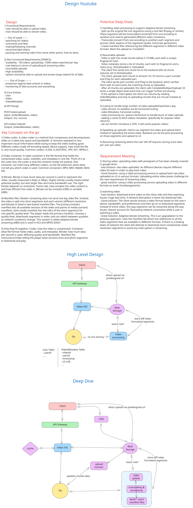

# Design YouTube: High-Level System Design

## 1. Requirements

### 1.1 Functional Requirements

| Requirement | Description | Scope |
|-------------|-------------|-------|
| Video Upload | Users can upload video files to the platform | Core |
| Video Streaming | Users can watch (stream) videos with low latency | Core |
| View Information | Users can view metadata (view counts, title, description) | Out of Scope |
| Search Videos | Full-text search across video catalog | Out of Scope |
| Comments | Users can add comments to videos | Out of Scope |
| Recommendations | Personalized video recommendations engine | Out of Scope |
| Channel Management | Users create and manage channels | Out of Scope |
| Subscriptions | Users subscribe to channels | Out of Scope |

### 1.2 Non-Functional Requirements (SPARCS Framework)

| Pillar | Requirement | Target |
|--------|-------------|--------|
| **S**calability | Support 1M videos uploaded/day, 100M videos watched/day | Global distribution |
| **P**erformance (Latency) | Low-latency streaming in low-bandwidth environments | <2s initial buffering, <100ms seek |
| **P**erformance (Throughput) | Handle concurrent streams and uploads at scale | 1M+ concurrent viewers |
| **A**vailability | Highly available system (prioritize over consistency) | 99.99% uptime (SLA) |
| **R**eliability | Support resumable uploads for large files (10s of GB) | Multi-part upload with checkpoint recovery |
| **C**onsistency | Eventual consistency acceptable; NO strong consistency required | AP > CP (CAP Theorem) |
| **S**ecurity | Authentication, authorization, rate limiting | OAuth/JWT tokens, IP-based rate limiting |

---

## 2. Capacity Estimation & Constraints

### 2.1 Traffic Estimates

| Metric | Calculation | Value |
|--------|-------------|-------|
| **DAU (Daily Active Users)** | Baseline estimate | 100M |
| **Daily Video Uploads** | Given | 1M |
| **Daily Video Views** | Given | 100M |
| **Avg Video Length** | Industry baseline | 10 minutes |
| **Avg Bitrate (Streaming)** | Multi-bitrate (500kbps - 5Mbps) | 2Mbps (average) |
| **Upload QPS** | (1M uploads / 86,400s) | **~12 QPS** |
| **View QPS** | (100M views / 86,400s) | **~1,157 QPS** |
| **Peak QPS (4x average)** | 1,157 × 4 | **~4,628 QPS** |

### 2.2 Storage Estimates (5-Year Horizon)

| Component | Calculation | Capacity |
|-----------|-------------|----------|
| **Video Data Storage (5yr)** | 1M videos/day × 365 × 5 × 2GB (avg) | **3,650 PB** |
| **Video Metadata** | 1.825B videos × 2KB per record | **3.65 PB** |
| **Chunks Metadata** | 1.825B videos × 50 chunks × 100B | **9.125 PB** |
| **Cached Segments** | Top 10% videos × 100 segments × 5MB | **500 TB** (hot cache) |
| **Total Primary Storage** | Sum (5-year) | **3,662.65 PB** |
| **Replication Factor** | 3x (Cassandra default) | **10,987.95 PB** |

**Note**: Storage scales horizontally via S3 (unlimited), Cassandra sharding for metadata.

### 2.3 Bandwidth Estimates (Peak Hour)

| Direction | Calculation | Bandwidth |
|-----------|-------------|-----------|
| **Egress (Streaming)** | 4,628 QPS × 2Mbps × (1 Mbps = 125 KB/s) | **577.5 GB/s** |
| **Ingress (Upload)** | 12 QPS × 2GB avg size | **24 GB/s** |
| **Metadata Requests** | 100k QPS × 10KB | **1 GB/s** |
| **Total Peak Bandwidth** | Sum | **602.5 GB/s** |

---

## 3. Core Entities & Data Model

### 3.1 Entity Definitions

| Entity | Purpose | Primary Key |
|--------|---------|-------------|
| **User** | Platform user (uploader/viewer) | `user_id` (UUID) |
| **Video** | Video file and metadata container | `video_id` (Snowflake ID) |
| **VideoMetadata** | Title, description, chunks, upload status | `video_id` |
| **Chunk** | Resumable upload unit (~5-10MB) | `video_id` + `chunk_index` |
| **Segment** | Post-processed video segment (~5s, multiple codecs) | `video_id` + `segment_index` + `codec` |
| **ManifestFile** | HLS/DASH manifest for adaptive streaming | `video_id` + `manifest_type` |

### 3.2 Database Schema

#### **users Table**

| Field | Type | Constraint | Description |
|-------|------|-----------|-------------|
| `user_id` | UUID | PRIMARY KEY | Unique user identifier |
| `username` | VARCHAR(255) | UNIQUE, NOT NULL | Display name |
| `email` | VARCHAR(255) | UNIQUE, NOT NULL | Contact email |
| `created_at` | TIMESTAMP | NOT NULL | Account creation time |
| `is_active` | BOOLEAN | DEFAULT true | Account status |

#### **videos Table** (Cassandra - Partitioned by `video_id`)

| Field | Type | Constraint | Description |
|-------|------|-----------|-------------|
| `video_id` | BIGINT | PRIMARY KEY | Snowflake ID (shard-friendly) |
| `user_id` | UUID | NOT NULL | Uploader ID |
| `title` | VARCHAR(255) | NOT NULL | Video title |
| `description` | TEXT | | Video description |
| `upload_status` | ENUM | DEFAULT 'PENDING' | PENDING, PROCESSING, COMPLETED, FAILED |
| `total_size_bytes` | BIGINT | | Original file size |
| `duration_seconds` | INT | | Video length |
| `created_at` | TIMESTAMP | NOT NULL | Upload start time |
| `completed_at` | TIMESTAMP | | Upload completion time |

#### **video_metadata Table** (Cassandra)

| Field | Type | Constraint | Description |
|-------|------|-----------|-------------|
| `video_id` | BIGINT | PRIMARY KEY | Foreign key to videos |
| `chunks` | LIST<FROZEN<Chunk>> | | List of upload chunks {index, fingerprint, status, etag} |
| `segments` | MAP<TEXT, LIST<FROZEN<Segment>>> | | Key: codec, Value: list of segments |
| `manifest_primary` | TEXT | | S3 path to primary manifest (HLS) |
| `manifest_media` | MAP<TEXT, TEXT> | | Key: bitrate, Value: S3 path to media manifest |
| `transcript_url` | TEXT | | S3 path to video transcript |
| `updated_at` | TIMESTAMP | | Last metadata update |

#### **video_chunks Table** (Cassandra - For Resumable Uploads)

| Field | Type | Constraint | Description |
|-------|------|-----------|-------------|
| `video_id` | BIGINT | PRIMARY KEY (part 1) | Video ID |
| `chunk_index` | INT | PRIMARY KEY (part 2) | Chunk sequence number |
| `fingerprint` | VARCHAR(64) | | SHA-256 hash of chunk content |
| `s3_etag` | VARCHAR(64) | | S3 multipart upload ETag |
| `upload_status` | ENUM | DEFAULT 'NOT_UPLOADED' | NOT_UPLOADED, UPLOADED, VERIFIED |
| `byte_size` | INT | | Chunk size in bytes |

#### **video_segments Table** (Cassandra - For Streaming)

| Field | Type | Constraint | Description |
|-------|------|-----------|-------------|
| `video_id` | BIGINT | PRIMARY KEY (part 1) | Video ID |
| `segment_index` | INT | PRIMARY KEY (part 2) | Segment sequence (0-indexed) |
| `codec` | VARCHAR(20) | PRIMARY KEY (part 3) | H.264, H.265, VP9, AV1 |
| `container` | VARCHAR(20) | | mp4, mkv, webm |
| `bitrate_kbps` | INT | | Encoding bitrate |
| `resolution` | VARCHAR(20) | | 360p, 720p, 1080p, 2160p |
| `s3_path` | TEXT | NOT NULL | S3 URI to segment file |
| `duration_seconds` | FLOAT | | Segment duration |
| `created_at` | TIMESTAMP | | Processing completion time |

### 3.3 Relationships

```
User (1) ──> (N) Video
   └─> uploads

Video (1) ──> (1) VideoMetadata
   └─> has metadata

Video (1) ──> (N) VideoChunk
   └─> contains chunks for upload

Video (1) ──> (N) VideoSegment
   └─> contains processed segments

VideoSegment (N) ──> (1) ManifestMedia
   └─> referenced by
```

**Key Design Decisions:**
- **Snowflake IDs** for `video_id`: Sortable by timestamp, shard-friendly, distributed generation
- **Cassandra for metadata**: Partition by `video_id` → horizontal scaling, leaderless replication
- **Chunk tracking in VideoMetadata**: Enables resumable uploads with fingerprint verification
- **Segment storage in S3**: Immutable, replicated across AZs, CDN-compatible

---

## 4. API Design

### 4.1 Core Endpoints

| Method | Endpoint | Request Params | Response | Description |
|--------|----------|-----------------|----------|-------------|
| **POST** | `/upload/initiate` | `{title, description, total_size_bytes}` | `{video_id, chunks: [{index, size}]}` | Initiate upload, get chunk schedule |
| **POST** | `/upload/{video_id}/presigned-url` | `{chunk_index}` | `{s3_url, expires_in}` | Get presigned S3 URL for chunk upload |
| **PATCH** | `/upload/{video_id}/chunks` | `{chunk_index, fingerprint, etag}` | `{chunk_status, verified}` | Verify chunk upload via ETag |
| **POST** | `/upload/{video_id}/complete` | `{}` | `{status: PROCESSING}` | Finalize upload, trigger processing |
| **GET** | `/videos/{video_id}` | Query: `accept_codec=h264,vp9` | `{video_id, title, duration, manifest_url, segments}` | Fetch video metadata & manifest |
| **GET** | `/videos/{video_id}/manifest.m3u8` | Query: `bitrate=2000` | `application/vnd.apple.mpegurl` | HLS primary manifest |
| **GET** | `/videos/{video_id}/media-{bitrate}.m3u8` | Query: `bitrate=2000` | `application/vnd.apple.mpegurl` | HLS media manifest (segments list) |
| **GET** | `/videos/{video_id}/segments/{segment_index}.{codec}.ts` | Path params | `video/mp2t` (TS segment) | Serve video segment (via CDN) |
| **GET** | `/health` | - | `{status: UP, version}` | Service health check |

### 4.2 Request/Response Examples

#### **Upload Initiation**
```json
POST /upload/initiate
{
  "title": "System Design Tutorial",
  "description": "Deep dive into distributed systems",
  "total_size_bytes": 2147483648
}

Response (200):
{
  "video_id": "1701234567890123456",
  "upload_id": "upload_abc123xyz",
  "chunks": [
    {"index": 0, "size_bytes": 10485760, "offset": 0},
    {"index": 1, "size_bytes": 10485760, "offset": 10485760},
    ...
  ],
  "expires_in_seconds": 86400
}
```

#### **Video Streaming**
```json
GET /videos/1701234567890123456
Accept: application/json

Response (200):
{
  "video_id": "1701234567890123456",
  "title": "System Design Tutorial",
  "duration_seconds": 3600,
  "manifest_url": "https://cdn.example.com/videos/1701234567890123456/manifest.m3u8",
  "segments": {
    "h264": [
      {"bitrate": 500, "resolution": "360p", "url": "https://cdn.../segment-0.ts"},
      {"bitrate": 1500, "resolution": "720p", "url": "https://cdn.../segment-1.ts"}
    ],
    "vp9": [...]
  }
}
```

---

## 5. High-Level Design

### 5.1 Architecture Overview



### 5.2 Component Breakdown

| Component | Technology | Responsibility | Justification |
|-----------|-----------|-----------------|---------------|
| **Client** | Web/Mobile (iOS/Android) | Video upload (chunked), playback (HLS/DASH) | Direct S3 integration via presigned URLs |
| **API Gateway** | AWS API Gateway / Kong | Request routing, rate limiting (10k req/s/user), auth validation | Single entry point, DDoS protection |
| **Load Balancer** | AWS ALB / Nginx | Round-robin across service instances | Health checks, sticky sessions for uploads |
| **Video Service** | Stateless (Node.js/Go/Java) | Upload orchestration, metadata queries, presigned URLs | Horizontal scaling (10-100 instances) |
| **Video Processing Service** | Batch (Kubernetes job queues) | Segmentation, transcoding (ffmpeg), manifest generation | Autoscales on queue depth (0-50 workers) |
| **Cache Layer** | Redis / Memcached | Metadata cache (video title, duration, manifest paths) | TTL: 24hrs for videos, 1hr for chunks |
| **Database** | Cassandra (Metadata) | Persistent storage for video metadata, chunks, segments | Multi-region replication, no SPOF, horizontal scaling |
| **Object Storage** | AWS S3 (Multi-region) | Raw video, segments, manifests, transcripts | Unlimited scale, cross-AZ replication, lifecycle policies |
| **CDN** | CloudFront / Akamai | Edge caching of segments, manifests, thumbnails | Geographic proximity, low latency delivery |
| **Message Queue** | Kafka / RabbitMQ | Async job dispatch (video → processing), events logging | Decoupling, backpressure handling, durable |
| **Monitoring** | Prometheus + Grafana | Latency, QPS, error rates, bandwidth, storage usage | Alerting on SLA breaches |

### 5.3 Component Details

#### **API Gateway**
- **Rate Limiting Strategy**: Token bucket (10k tokens/s per user, 100k burst)
- **Authentication**: OAuth 2.0 / JWT with RS256 signing
- **DDoS Protection**: CloudFlare / AWS Shield Standard

#### **Video Service** (Stateless)
- **Endpoints**: Upload initiation, presigned URL generation, metadata queries
- **Scaling**: Auto-scale 10-100 instances based on ALB target group metrics
- **Session Management**: None (REST stateless design)
- **Caching Layer**: Write-through cache for metadata (Redis)

#### **Database** (Cassandra)
- **Partition Key**: `video_id` (Snowflake ID) → uniform distribution
- **Replication Factor**: 3 (single region), 2x replication across 2 regions
- **Consistency Level**: `LOCAL_QUORUM` for reads/writes (strong local consistency)
- **Compaction Strategy**: Leveled (optimal for read-heavy workloads)
- **Indexing**: Secondary index on `user_id` for "user's videos" queries

#### **S3 Storage Strategy**
- **Bucket Structure**:
  ```
  s3://videos-prod/
    ├─ raw/{video_id}/
    │   └─ original.mp4          (original upload)
    ├─ segments/{video_id}/
    │   ├─ h264/                  (codec subdirs)
    │   │  └─ segment-{idx}.ts
    │   └─ vp9/
    │      └─ segment-{idx}.webm
    ├─ manifests/{video_id}/
    │   ├─ primary.m3u8          (master playlist)
    │   └─ media-{bitrate}.m3u8  (media playlists)
    └─ transcripts/{video_id}/   (auto-generated via AWS ML)
  ```
- **Lifecycle Policy**: Move raw/ to Glacier after 30 days (cost optimization)
- **Replication**: Cross-region replication to secondary region for DR

#### **CDN (CloudFront)**
- **Origin**: S3 bucket (segments, manifests, transcripts)
- **TTL**: Segments 30 days (immutable), manifests 5 mins (mutable)
- **Geo-Restriction**: Block non-licensed countries (geo-fencing)
- **Compression**: Gzip for manifests, brotli for metadata

#### **Message Queue** (Kafka)
- **Topics**:
  - `video.uploads.initiated` → processing service subscribes
  - `video.segments.completed` → CDN invalidation, analytics
  - `video.errors` → dead-letter queue for failed jobs
- **Partitioning**: By `video_id` for ordering guarantees
- **Retention**: 7 days (compliance logs), 1 day (operational)

---

## 6. Data Flow

### 6.1 Upload Path (Write Path)

The upload flow prioritizes resumability and fault tolerance through chunked uploads and fingerprint verification.

1. **Initiation**: Client calls `/upload/initiate` with video metadata. Video Service generates a Snowflake ID and creates a VideoMetadata record in Cassandra with chunk schedule.

2. **Chunk Upload**: Client splits file into 10MB chunks locally, computes SHA-256 fingerprint for each chunk, and requests presigned S3 URLs from Video Service via `/upload/{video_id}/presigned-url`.

3. **Verification**: After each chunk upload to S3 completes, client sends ETag fingerprint to Video Service via `/upload/{video_id}/chunks`. Video Service verifies the ETag against S3 multipart upload state and marks chunk as UPLOADED in Cassandra.

4. **Completion**: When all chunks verified, client posts `/upload/{video_id}/complete`. Video Service emits `video.uploads.initiated` event to Kafka.

5. **Processing**: Video Processing Service (Kafka subscriber) fetches original video from S3, segments into 5-second chunks, transcodes to multiple codecs/bitrates (H.264, VP9, AV1), generates HLS/DASH manifests, and uploads segments & manifests back to S3.

6. **Finalization**: Processing Service updates VideoMetadata in Cassandra with segment paths and manifest URLs, emits `video.segments.completed` event, and marks video status as COMPLETED.

**Synchronization Points:**
- Chunk upload: Async (client-driven) with resumable checkpoints
- Transcoding: Async via Kafka → Processing Service queue
- Manifest generation: Sync within processing job (single source of truth)

**Error Handling:**
- **Chunk verification fails**: Client retries with exponential backoff (2s → 4s → 8s)
- **Processing fails**: Kafka dead-letter queue → manual intervention
- **S3 timeout**: Presigned URL includes retry-after header

### 6.2 Streaming Path (Read Path)

The streaming flow optimizes for low latency through caching and CDN edge distribution.

1. **Metadata Request**: Client calls `/videos/{video_id}` to fetch video metadata (title, duration, manifest URL). Video Service checks Redis cache first (hit → 5ms), otherwise queries Cassandra (miss → 100ms) and caches result with 24-hour TTL.

2. **Manifest Fetch**: Client fetches primary manifest from CDN (CloudFront edge → 1-5ms cache hit, 50ms cache miss to S3 origin). HLS player parses manifest to identify available bitrates.

3. **Adaptive Selection**: Player monitors bandwidth and selects appropriate bitrate (360p for mobile 2Mbps, 1080p for desktop 10Mbps).

4. **Segment Delivery**: Client requests segments `/videos/{video_id}/segments/segment-0.h264.ts` from CDN. CloudFront serves from edge cache (P50: 10ms, P99: 50ms). Player prefetches 3-5 segments and maintains adaptive buffer.

5. **Seek Optimization**: Range requests to CDN allow seeking without re-downloading entire video (HTTP 206 Partial Content).

**Optimization:**
- DNS prefetch for CDN hostname
- HTTP/2 Server push to prefetch next segment manifest
- Keep-alive connections to CDN edge
- No database queries during streaming (all data in S3/CDN)

---

## 7. Deep Dives

### 7.1 Adaptive Bitrate Streaming (Video Encoding)

#### Problem Statement
Raw video files are massive (2GB for 10min 1080p video). Transmission must optimize for diverse device capabilities (mobile 360p, desktop 1080p, TV 4K) and variable bandwidth (5Mbps fiber vs. 2Mbps LTE).

#### Solution: HLS (HTTP Live Streaming)

**Step 1: Segmentation**
Original video is split into 5-second segments using ffmpeg:
```bash
ffmpeg -i original.mp4 \
  -c:v copy -c:a copy \
  -f segment -segment_time 5 \
  segment-%03d.mp4
```
Result: 10-minute video → 120 segments of ~17MB each.

**Step 2: Transcoding (Parallel)**
For each segment, generate multiple codec/bitrate combinations:
```
Codec: H.264 (broad compatibility)
├─ 360p  @ 500kbps  → segment-0.h264.500k.ts
├─ 720p  @ 2000kbps → segment-0.h264.2000k.ts
└─ 1080p @ 5000kbps → segment-0.h264.5000k.ts

Codec: VP9 (better compression, newer devices)
├─ 360p  @ 300kbps  → segment-0.vp9.300k.webm
├─ 720p  @ 1200kbps → segment-0.vp9.1200k.webm
└─ 1080p @ 3000kbps → segment-0.vp9.3000k.webm
```

**Step 3: Manifest Generation**
Primary manifest defines available streams:
```
#EXTM3U
#EXT-X-VERSION:3
#EXT-X-STREAM-INF:BANDWIDTH=500000,RESOLUTION=640x360,CODECS="avc1.42e01e,mp4a.40.2"
media-500.m3u8
#EXT-X-STREAM-INF:BANDWIDTH=2000000,RESOLUTION=1280x720,CODECS="avc1.42e01e,mp4a.40.2"
media-2000.m3u8
#EXT-X-STREAM-INF:BANDWIDTH=5000000,RESOLUTION=1920x1080,CODECS="avc1.42e01e,mp4a.40.2"
media-5000.m3u8
```

Media manifest lists segments:
```
#EXTM3U
#EXT-X-VERSION:3
#EXT-X-TARGETDURATION:5
#EXTINF:5.0,
segment-0.h264.ts
#EXTINF:5.0,
segment-1.h264.ts
...
#EXT-X-ENDLIST
```

**Step 4: Adaptive Bitrate Selection (Client)**
Player monitors bandwidth and dynamically selects bitrate:
```javascript
function selectBitrate(currentBandwidth, bufferHealth) {
  const availableBitrates = [500, 2000, 5000]; // kbps
  const maxBitrate = Math.floor(currentBandwidth * 0.8); // 80% for headroom
  
  const selectedBitrate = availableBitrates
    .filter(b => b <= maxBitrate)
    .pop();
  
  // Switch manifest if bandwidth drops >20%
  if (selectedBitrate < currentSelectedBitrate) {
    player.switchTo(selectedBitrate);
  }
}
```

**Storage Cost Analysis:**
```
Original video: 2GB
After H.264 encoding:
  360p: 500MB
  720p: 1.5GB
  1080p: 3GB
  Total: 5GB (2.5x increase due to multiple resolutions)

Cost @$0.023/GB/month in S3:
  5GB × $0.023 × 12 months = $1.38/video/year
  
For 1M videos/year: $1.38M/year (acceptable at scale)
```

---

### 7.2 Resumable Uploads (Multi-Part Upload with Fingerprinting)

#### Problem Statement
Users on unreliable networks (LTE, WiFi) need to resume uploads without re-uploading entire files. Large videos (10+ GB) require fault tolerance.

#### Solution: Chunked Upload with Fingerprinting

**Step 1: Client-side Chunking**
Client splits file into 10MB chunks and computes SHA-256 fingerprint:
```javascript
const CHUNK_SIZE = 10 * 1024 * 1024; // 10MB
const file = document.getElementById("file").files[0];
const chunks = [];

for (let i = 0; i < file.size; i += CHUNK_SIZE) {
  const chunk = file.slice(i, i + CHUNK_SIZE);
  const fingerprint = await sha256(chunk);
  chunks.push({
    index: Math.floor(i / CHUNK_SIZE),
    size: chunk.size,
    fingerprint: fingerprint,
    data: chunk
  });
}
```

**Step 2: Server Metadata Creation**
POST `/upload/initiate` creates VideoMetadata in Cassandra:
```json
VideoMetadata {
  video_id: "1701234567890123456",
  chunks: [
    {index: 0, fingerprint: "abc123...", status: "NOT_UPLOADED", size: 10MB},
    {index: 1, fingerprint: "def456...", status: "NOT_UPLOADED", size: 10MB},
    ...
  ]
}
```

**Step 3: Presigned URL Generation**
Client requests presigned URL for each chunk:
```
POST /upload/{video_id}/presigned-url?chunk_index=0
Response: {s3_url: "...", expires_in: 3600}

Client: PUT {s3_url} with chunk data
S3: Acknowledge with ETag (e.g., "a1b2c3d4-1")
```

**Step 4: Verification & Resumption**
After chunk upload:
```javascript
const verifyResponse = await fetch(
  `/upload/${video_id}/chunks/${chunk_index}`,
  {
    method: "PATCH",
    body: JSON.stringify({
      fingerprint: chunk.fingerprint,
      etag: s3Response.etag
    })
  }
);
```

Server verifies ETag against S3 multipart upload state:
```javascript
function verifyChunk(video_id, chunk_index, clientEtag) {
  const metadata = cassandra.getVideoMetadata(video_id);
  const chunk = metadata.chunks[chunk_index];
  
  const s3Etag = s3.getMultipartUploadETag(video_id, chunk_index);
  
  if (s3Etag === clientEtag) {
    cassandra.updateChunkStatus(video_id, chunk_index, "UPLOADED");
    cache.invalidate(`chunks:${video_id}`);
    return {status: "VERIFIED"};
  } else {
    return 409; // Conflict, retry upload
  }
}
```

**Resume Logic:**
If client crashes, on resume:
1. Fetch video metadata from GET /videos/{video_id}
2. Check chunks status (UPLOADED vs. NOT_UPLOADED)
3. Skip UPLOADED chunks, retry NOT_UPLOADED chunks

**Step 5: Completion & Processing**
```
POST /upload/{video_id}/complete
├─ Verify all chunks uploaded
├─ Mark video status=PROCESSING
├─ Emit Kafka event `video.uploads.initiated`
└─ Return 200 OK

Processing Service:
├─ Fetch chunks from S3 (in-order)
├─ Reconstruct original file
├─ Segment, transcode, generate manifests
└─ Update video status=COMPLETED
```

**Edge Cases & Recovery:**

| Scenario | Client Behavior | Server Behavior |
|----------|-----------------|-----------------|
| Chunk upload fails (500) | Retry with exponential backoff | Idempotent: ETag mismatch → 409 Conflict |
| Network timeout mid-chunk | Seek file to resume, retry | Accept partial upload, verify on retry |
| All chunks uploaded, crash before /complete | On resume, fetch metadata | Timeout after 24hrs, mark FAILED |
| Presigned URL expires | Fetch new URL | Extends validity for 1 hour per request |
| Corrupted chunk | Client detects via SHA256 mismatch | Return 409, client retries |

---

### 7.3 Scaling to 1M Uploads + 100M Views Per Day

#### Problem Statement
- **1M uploads/day**: Video service must handle 12 QPS sustained, 50+ QPS peak
- **100M views/day**: Streaming service must handle 1,157 QPS sustained, 4,628 QPS peak (read-heavy)

#### Solution: Multi-layer Scaling Strategy

**Layer 1: API Service Scaling (Upload + Metadata Queries)**

Horizontal scaling via Auto-scaling Group:
```
Baseline: 20 instances (t3.medium, 2 vCPU, 4GB RAM)
├─ Capacity: 20 instances × 500 req/s = 10k req/s
├─ Headroom: 2x safety margin
└─ Target CPU: 70% (triggers scale-up at 7k req/s)

Scaling Policy:
├─ Scale UP: CPU > 70% for 2 minutes → Add 10 instances
├─ Scale DOWN: CPU < 30% for 10 minutes → Remove 5 instances
└─ Cooldown: 5 minutes between scaling events
```

**Layer 2: Cassandra Scaling (Metadata Storage)**

Horizontal scaling via node addition:
```
Initial Cluster: 9 nodes (us-east-1 region)
├─ Replication factor: 3
├─ Per-node capacity: 2TB
├─ Effective capacity: 6TB (2TB × 3 nodes / replication)

Partitioning Strategy:
├─ Primary key: video_id (Snowflake ID)
├─ Uniform distribution across nodes
└─ Hot spots: Popular videos → addressed via caching

Scaling Trigger:
├─ Disk usage > 80% per node
└─ Add 3 new nodes per scaling event
```

**Layer 3: Cache Layer (Redis) Scaling**

Caching strategy for hot metadata:
```
Without Cache: 1,157 QPS × 100ms (Cassandra) = 115.7s latency/second
With Cache: 1,157 QPS × 5ms (Redis) = 5.785s latency/second
Savings: 95% latency reduction

Redis Cluster (Sharded):
├─ 5 master nodes + 5 replicas (10 total instances)
├─ Partition: By video_id (consistent hashing)
├─ Per-shard capacity: 100GB (hot videos)
├─ TTL: 24 hours for metadata

Cache Invalidation:
├─ On upload complete: cache.invalidate(video_id)
├─ On metadata update: cache.invalidate(video_id)
├─ Segments: Immutable, never invalidated
└─ Manifests: TTL 5 minutes
```

**Layer 4: Video Processing Scaling (Async Transcoding)**

Job queue-based autoscaling:
```
Processing Service (Kubernetes):
├─ Initial replicas: 10 worker pods
├─ Per-worker throughput: 1 video / 30 mins (transcoding)
└─ Capacity: 10 workers × 48 videos/day = 480 videos/day

Queue Depth Autoscaling:
├─ Queue depth > 100 jobs: Scale to 25 workers
├─ Queue depth > 500 jobs: Scale to 50 workers
└─ Queue depth < 10 jobs: Scale to 5 workers
```

**Layer 5: CDN Scaling (Distributed Edge Caching)**

Geographic distribution via CloudFront:
```
CloudFront Distribution:
├─ Origins: Primary S3, secondary S3 (failover)
├─ Edge locations: 200+ worldwide
├─ Caching policy:
│  ├─ Segments: 30 days (immutable)
│  ├─ Manifests: 5 minutes (mutable)
│  └─ Metadata: 1 hour

Cache Hit Ratio:
├─ Segments: 95%+ (immutable)
├─ Manifests: 80%+ (5 min TTL)
└─ Metadata: 60%+ (user-specific)

Bandwidth Savings:
├─ Without CDN: 602.5 GB/s from origin ($4.8M/month)
├─ With CDN @ 90% hit ratio: 60.25 GB/s from origin ($480k/month)
└─ Savings: $4.3M/month
```

#### Bottleneck Analysis

| Bottleneck | Root Cause | Solution | Impact |
|-----------|-----------|----------|--------|
| **Upload latency** | Network RTT to S3 | Use regional S3 endpoint | 10-50ms per chunk |
| **Metadata query latency** | Cassandra quorum reads | Redis cache + read replicas | 5-100ms (with cache) |
| **Transcoding bottleneck** | ffmpeg CPU-bound | GPU acceleration (NVENC) | 10x faster (30m → 3m) |
| **Segment delivery** | Geographic distance | Multi-region S3 + CDN | <50ms P99 from edge |
| **Hot video (viral)** | Single video, 1M views/hr | Cache + CDN + replicas | <5ms latency |

---

### 7.4 Failure Modes & Recovery

#### Database Master Failure (Cassandra Node Down)

| Failure | Impact | Recovery |
|---------|--------|----------|
| **1 node down in 9-node cluster** | Replication factor = 3, so 2 replicas remain | Quorum = 2 (majority), requests succeed |
| **2 nodes down** | Quorum = 2, still achievable | No data loss, consistency maintained |
| **Quorum lost (>50% down)** | Requests fail (cannot write) | Activate secondary DC, switch to eventual consistency |

**Automation:**
- Cassandra detects node failure within 30s (gossip protocol)
- Hinted handoff: Other nodes buffer writes, replay when failed node recovers
- Anti-entropy repair: Background process reconciles diverged data

#### Cache Stampede (Redis Cache Miss for Hot Video)

| Scenario | Impact | Mitigation |
|----------|--------|-----------|
| **Hot video cache expires, 1k concurrent viewers** | 1k queries → Cassandra simultaneously | Probabilistic early expiration (refresh at 80% TTL) |
| **Redis node down, 10k videos evicted** | All requests to Cassandra | Redis cluster replication, write-through cache |
| **Cascading failure: API → Cassandra timeout** | Timeout propagates to users | Circuit breaker, fallback to stale cache |

**Mitigation Code (Probabilistic Early Refresh):**
```javascript
function getVideoMetadata(video_id) {
  const cached = redis.get(video_id);
  const ttl = redis.ttl(video_id);
  
  if (cached) {
    // Refresh 20% before expiration to avoid stampede
    if (ttl < 4800) { // 80% of 6000s TTL
      // Async refresh in background
      fetchFromCassandraAsync(video_id).then(data => {
        redis.set(video_id, data, EX=6000);
      });
    }
    return cached; // Return stale data immediately
  } else {
    // Cache miss, fetch from DB
    const data = cassandra.get(video_id);
    redis.set(video_id, data, EX=6000);
    return data;
  }
}
```

#### Upload Failure (S3 Upload Interrupted)

| Failure | Impact | Recovery |
|---------|--------|----------|
| **Chunk upload fails mid-transfer** | Partial chunk in S3 | S3 multipart state preserved, client retries |
| **Network timeout, success unknown** | Duplicate chunk possible | S3 idempotency: ETag mismatch detected, 409 Conflict |
| **S3 replication lag** | User sees old video | S3 default: <1s replication across AZs |

#### Processing Failure (Transcoding Crashes)

| Failure | Impact | Recovery |
|---------|--------|----------|
| **ffmpeg crashes on corrupted segment** | Video stuck PROCESSING | DLQ retry 3x, escalate to manual review |
| **Disk space exhausted during transcoding** | Temporary files accumulate | Periodic cleanup: Remove files after 24hrs |
| **GPU OOM during H.265 encoding** | Processing stalls | Fallback: Use CPU H.264, accept longer processing time |

---

### 7.5 Security & Rate Limiting

#### Authentication & Authorization
```
OAuth 2.0 Flow:
1. User: Clicks "Sign in with Google"
2. Client: Redirects to Google OAuth endpoint
3. Google: Returns authorization code
4. Server: Exchange code → Google, receive access_token + refresh_token
5. Server: Create session, return JWT (RS256 signed)
6. Client: Store JWT in secure httpOnly cookie
7. Subsequent requests: Include JWT in Authorization header

Permissions Model:
├─ User can upload: Always allowed (after email verification)
├─ User can delete own videos: Check JWT claims.user_id == video.user_id
└─ User can stream any video: Check video.upload_status == COMPLETED
```

#### Rate Limiting (Token Bucket)

Algorithm: Token Bucket
```
Capacity: 10,000 tokens per user per second
Refill rate: 10,000 tokens/second
Per-request cost:
├─ GET /videos/{id}: 1 token
├─ Upload chunk: 10 tokens (expensive I/O)
└─ Presigned URL: 1 token

Implementation (Redis):
├─ Key: rate_limit:{user_id}
├─ On request:
│  1. Calculate elapsed time since last_refill
│  2. Add (elapsed_time * 10000) tokens (cap at capacity)
│  3. If tokens >= cost, deduct and allow
│  4. Else, return 429 Too Many Requests
```

#### DDoS Protection

```
Layer 1: CloudFlare / AWS Shield
├─ IP reputation filtering
├─ Rate limiting per IP (1k req/s)
└─ WAF rules (block SQL injection, XSS)

Layer 2: API Gateway
├─ Per-user rate limiting
├─ Request validation (content-type, content-length)
└─ Timeout limits (30s uploads, 60s others)

Layer 3: Application
├─ Circuit breaker: Reject if backend latency > 5s
├─ Graceful degradation: Return cached data if DB down
└─ Monitoring: Alert on QPS spike (> 2x baseline)
```

#### Data Sanitization

```
Input Validation:
├─ Video title: Max 255 chars, no script tags
├─ Description: Max 5000 chars, sanitize HTML
├─ Chunk fingerprint: Must be valid SHA-256 hex (64 chars)
└─ Video ID: Must match Snowflake ID format

Output Encoding:
├─ All text fields: HTML-encode before rendering (XSS prevention)
├─ JSON responses: Safe serialization (no unescaped <, >, &)
└─ Content-Type: application/json; charset=utf-8
```

---

### 7.6 Monitoring & Telemetry

#### Key Metrics (SLOs)

| SLO | Target | Measurement |
|-----|--------|-------------|
| **Availability** | 99.99% uptime | Continuous synthetic health checks every 10s |
| **Upload latency (p50)** | <500ms per chunk | Presigned URL generation + S3 put |
| **Upload latency (p99)** | <2s per chunk | With retries, network variance |
| **Streaming latency (p50)** | <1s manifest, <50ms segment | CDN edge to client |
| **Streaming latency (p99)** | <5s manifest, <200ms segment | Includes origin failover |
| **Error rate** | <0.1% | Count 4xx, 5xx responses |
| **Processing latency** | <30min per video (avg) | Upload complete to segments available |

#### Monitoring Stack

```
Metrics Collection (Prometheus):
├─ API service: Scrape /metrics endpoint every 15s
├─ Cassandra: JMX exporter for node metrics
├─ Redis: redis_exporter for cache metrics
└─ S3: CloudWatch metrics

Key metrics:
├─ http_request_duration_seconds (histogram: p50, p95, p99)
├─ http_requests_total (counter: method, endpoint, status)
├─ cassandra_read_latency_ms (histogram)
├─ redis_cache_hit_ratio (gauge: 0-1)
├─ s3_upload_duration_seconds (histogram)
├─ video_processing_queue_depth (gauge)
└─ bandwidth_bytes_egress (counter)

Alerting (Prometheus AlertManager):
├─ ERROR_RATE_HIGH: error_rate > 0.1% → Page on-call
├─ LATENCY_HIGH: p99_latency > 5s → Page on-call
├─ QUEUE_BACKLOG: processing_queue > 1000 → Trigger autoscale
├─ CACHE_HIT_RATIO_LOW: hit_ratio < 70% → Investigate
└─ DISK_USAGE_HIGH: cassandra_disk_usage > 85% → Plan scaling
```

#### Logging Strategy

```
Log Aggregation (ELK Stack):
├─ Elasticsearch: Centralized log storage
├─ Logstash: Parse and enrich logs
└─ Kibana: Visualization and dashboards

Log Levels:
├─ INFO: Request arrived, response sent
├─ WARN: Retry attempt, slow query (>100ms)
└─ ERROR: Request failed, exception, DB down

Retention Policy:
├─ HOT: Last 7 days in Elasticsearch
├─ WARM: 7-30 days, compressed in S3
└─ COLD: >30 days, Glacier (compliance)

Sample Query:
  # Find all failed uploads in last 1 hour
  elasticsearch.search({
    index: "logs-api-*",
    query: {
      bool: {
        must: [
          {match: {message: "upload failed"}},
          {range: {timestamp: {gte: "now-1h"}}}
        ]
      }
    }
  });
```

---

## References

### References & Standards

- **Video Streaming**: HLS (RFC 8216), DASH (ISO/IEC 23009-1)
- **Video Codecs**: H.264, H.265 (HEVC), VP9, AV1
- **Database**: Apache Cassandra 4.0 Documentation
- **ID Generation**: Twitter Snowflake ID Algorithm
- **Monitoring**: Prometheus Documentation, Grafana
- **CDN**: AWS CloudFront, Akamai EdgeWorks

---

**Document Version:** 1.0
**Last Updated:** December 25, 2025
**Status:** Ready for Review